R\_scripts\_final
================

## Set working directory

``` r
setwd("~/Desktop/Git/AMRIWA/RFiles")
```

## Load required libraries

``` r
library(tidyverse)
library(phyloseq)
library(viridis)
library(stringr)
library(vegan)
library(RColorBrewer)
library(BiocManager)
#BiocManager::install("microbiome")
library(microbiome)
#library(microbiomeutilities)
library(ggplot2)
library(knitr)
library(ggpubr)
library(pheatmap)
library(MASS)
library(gplots)
library(grid)
library(cowplot)
library(ggpubr)
library(DESeq2)
library(plyr)
library(multcomp)
library(randomForest)
library(corrplot)
library(ggrepel)
library(Hmisc)
source("HighstatLibV13.R")
library(ggcorrplot)
library(plyr)
library(lattice)
library(VennDiagram)
library(ggsn)
library(sf)
library(psych)
library(usefun)
```

## Load metadata

``` r
metadata <-read.table("metadata.txt", sep="\t", header = T, row.names = 1, fill = 1, dec = ".", na.strings = "NA")

metadata$long <- as.numeric(as.character(metadata$long))
metadata$lat <- as.numeric(as.character(metadata$lat))
metadata$DNA_ng_µl <- as.numeric(gsub(",", ".", gsub("\\.", "", metadata$DNA_ng_µl)))
metadata$A260_280 <- as.numeric(gsub(",", ".", gsub("\\.", "", metadata$A260_280)))
metadata$M_Seqs_trimmed <- as.numeric(gsub(",", ".", gsub("\\.", "", metadata$M_Seqs_trimmed)))
#str(metadata)
```

## Load Metaxa2 results and create a phyloseq object

``` r
metaxa_genus <- read.delim("~/Documents/Metagenomes_AMRIWA/R/AMRIWA/RFiles/metaxa_genus.txt")

# Create OTU table
OTU_metaxa <- metaxa_genus[,-1]
# Match sample ID order with metadata file
match <- match(rownames(metadata), colnames(OTU_metaxa))
OTU_metaxa <- OTU_metaxa[,match]
all(colnames(OTU_metaxa) == rownames(metadata))
```

    ## [1] TRUE

``` r
# Create tax table
tax_table_metaxa <- data.frame(str_split_fixed(data.frame(metaxa_genus) [,1], ";", 6))
colnames(tax_table_metaxa) <- c("Domain", "Phylum", "Class", "Order", "Family", "Genus")
# Check if samples are in order
identical(rownames(metadata), colnames(OTU_metaxa))
```

    ## [1] TRUE

``` r
# Combine into phyloseq object
metaxa_PHY <- phyloseq(otu_table(OTU_metaxa, taxa_are_rows=TRUE), 
                       tax_table(as.matrix(tax_table_metaxa)), sample_data(metadata))

# Exclude taxa "Unknown", "Unclassified", "Eukaryota", "Mitochondria", "Archaea", "Chloroplast"
metaxa_PHY <- subset_taxa(metaxa_PHY, !Domain %in% c("Unknown"))
metaxa_PHY <- subset_taxa(metaxa_PHY, !Domain %in% c("Unclassified"))
metaxa_PHY <- subset_taxa(metaxa_PHY, !Domain %in% c("Eukaryota"))
metaxa_PHY <- subset_taxa(metaxa_PHY, !Domain %in% c("Mitochondria"))
metaxa_PHY <- subset_taxa(metaxa_PHY, !Domain %in% c("Archaea"))
metaxa_PHY <- subset_taxa(metaxa_PHY, !Domain %in% c("Chloroplast"))

# Add SSU counts to metadata
metadata$SSU_counts <- sample_sums(metaxa_PHY)

# Create phyloseq object with all samples
# Exclude samples with low sequencing quality (BFH24_S142, BH63_S118, FH10_S171)
metaxa_PHY = subset_samples(metaxa_PHY, alias != "BFH24" & alias != "BH63" & alias != "FH10")
# Exclude samples from UK hospital whose sample collection does not match with other samples
metaxa_PHY <- subset_samples(metaxa_PHY, country != "UK")

## Exclude biological / technical replicates
metaxa_PHY <- subset_samples(metaxa_PHY, alias != "BH31" & alias != "BH33" & alias != "BH34B" & alias != "BH10"
                                     & alias != "BFH38B" & alias != "FH8" & alias != "BH45" & alias != "BH59" & alias != "BH62")

# Create phyloseq object with only hospital WW samples sequenced here
metaxa_PHY_stat <- subset_samples(metaxa_PHY, category == "WA hospital effluent" | category == "North Eu hospital effluent")


# Create phyloseq object with equal group for the statistical analysis
## Include 8 samples per country
#BH <- data.frame(c("BH01", "BH02", "BH03", "BH05", "BH06", "BH07", "BH09", "BH27", "BH29", "BH30", "BH34A",    "BH35", "BH36", #"BH37",    "BH38", "BH39", "BH44", "BH46", "BH47", "BH48", "BH49", "BH50", "BH58", "BH60", "BH61"))
#colnames(BH) <- c("sample")
#random_BH <- sample_n(BH, 8)

#BFH <- data.frame(c("BFH1",    "BFH10",    "BFH11",    "BFH12",    "BFH13",    "BFH14",    "BFH15",    "BFH16",    "BFH17",    "BFH18",    "BFH19",    #"BFH20",   "BFH21",    "BFH22",    "BFH23",    "BFH25",    "BFH28",    "BFH29",    "BFH30",    "BFH31",    "BFH32",    "BFH33",    "BFH34",    "BFH35",    #"BFH36",   "BFH37",    "BFH38A",   "BFH39",    "BFH4", "BFH40",    "BFH41",    "BFH6", "BFH8", "BFH9"))
#colnames(BFH) <- c("sample")
#random_BFH <- sample_n(BFH, 8)

# Sample set 1
metaxa_PHY_stat_equal <- subset_samples(metaxa_PHY, alias == "BFH1" |   alias == "BFH19" |  alias == "BFH25" |  alias == "BFH31" | alias == "BFH6" |    alias == "BFH15" |  alias == "BFH39" |      alias == "BFH10" | alias == "BH02" |    alias == "BH09" |   alias == "BH27" |   alias == "BH34A" | alias == "BH44" |    alias == "BH58" |   alias == "BH61" |   alias == "BH47" | alias == "FH1" |  alias == "FH2" |    alias == "FH3" |    alias == "FH4" | alias == "FH5" |   alias == "FH6" |    alias == "FH7" |    alias == "FH9")

# Sample set 2
#metaxa_PHY_stat_equal <- subset_samples(metaxa_PHY, alias == "BFH34" |     alias == "BFH35" |  alias == "BFH18" |  alias == "BFH32" | alias == "BFH14" |   alias == "BFH41" |  alias == "BFH22" |      alias == "BFH23" |  alias == "BH48" |   alias == "BH61" |   alias == "BH30" |   alias == "BH47" | alias == "BH46" |     alias == "BH60" |   alias == "BH39" |   alias == "BH44" | alias == "FH1" |  alias == "FH2" |    alias == "FH3" |    alias == "FH4" |  alias == "FH5" |  alias == "FH6" |    alias == "FH7" |    alias == "FH9")

# Sample set 3
#metaxa_PHY_stat_equal <- subset_samples(metaxa_PHY, alias == "BFH20" |     alias == "BFH8" |   alias == "BFH30" |  alias == "BFH16" | alias == "BFH33" |   alias == "BFH25" |  alias == "BFH10" |      alias == "BFH37" |  alias == "BH49" |   alias == "BH60" |   alias == "BH36" |   alias == "BH46" |  alias == "BH02" |    alias == "BH30" |   alias == "BH61" |   alias == "BH37" | alias == "FH1" |  alias == "FH2" |    alias == "FH3" |    alias == "FH4" | alias == "FH5" |   alias == "FH6" |    alias == "FH7" |    alias == "FH9")

# Create phyloseq object with only West African samples
metaxa_PHY_WA_stat <- subset_samples(metaxa_PHY, continent == "West Africa")

# Create phyloseq object with only West African samples
metaxa_PHY_WA_WW_stat <- subset_samples(metaxa_PHY_WA_stat, category == "WA hospital effluent")
```

## Load data for rpoB

``` r
HMM_RESULT_TABLE <- read.delim("~/Documents/Metagenomes_AMRIWA/R/AMRIWA/RFiles/HMM_RESULT_TABLE.txt", row.names=1)
HMM_RESULT_TABLE$SUM = rowSums(HMM_RESULT_TABLE[,c(2,3)])

# Reorder samples to match metadata and add to metadata
# SUM
match <- match(rownames(metadata), rownames(HMM_RESULT_TABLE))
rpoB_counts <- HMM_RESULT_TABLE[match,]
metadata$rpoB_counts <- rpoB_counts$SUM

# R1
# Reorder samples to match metadata
match <- match(rownames(metadata), rownames(HMM_RESULT_TABLE))
R1_rpoB_counts <- HMM_RESULT_TABLE[match,]
metadata$R1_rpoB_counts <- rpoB_counts$R1
```

## Load Metaphlan3 results and create a phyloseq object

``` r
OTU_metaphlan <- read.delim("~/Documents/Metagenomes_AMRIWA/R/AMRIWA/RFiles/mod_merged_abundance_table_species.txt", header=T)

# Make sure tax tabe is in order
#tax_table_metaphlan <- read.table("~/Documents/Metagenomes_AMRIWA/R/AMRIWA/RFiles/tax_table_metaphlan", quote="\"", comment.char="")
#identical(tax_table_metaphlan$V1, OTU_metaphlan$clade_name)

tax_table_metaphlan <- read.csv("~/Documents/Metagenomes_AMRIWA/R/AMRIWA/RFiles/tax_table_metaphlan", header=FALSE, sep=";")
colnames(tax_table_metaphlan) <- c("Kingdom", "Phylum", "Class", "Order", "Family", "Genus", "Species")
# Remove "__"
tax_table_metaphlan <- apply(tax_table_metaphlan, 2, function(y) (gsub(".__", "", y)))

match <- match(rownames(metadata), colnames(OTU_metaphlan))
OTU_metaphlan  <- OTU_metaphlan[,match]
all(rownames(metadata) == colnames(OTU_metaphlan))
```

    ## [1] TRUE

``` r
# Combine into phyloseq object
metaphlan_PHY <- phyloseq(otu_table(OTU_metaphlan, taxa_are_rows=TRUE), 
                       tax_table(as.matrix(tax_table_metaphlan)), sample_data(metadata))
# Check that sums are ~100
#sample_sums(metaphlan_PHY)

# Exclude Viruses, Eukaryota & Archaea
metaphlan_PHY <- subset_taxa(metaphlan_PHY, Kingdom != "Viruses" & Kingdom != "Eukaryota" & Kingdom != "Archaea")

# Create phyloseq object with all samples
# Exclude samples with low sequencing quality (BFH24_S142, BH63_S118, FH10_S171)
metaphlan_PHY = subset_samples(metaphlan_PHY, alias != "BFH24" & alias != "BH63" & alias != "FH10")
# Exclude samples from UK hospital whose sample collection does not match with other samples
metaphlan_PHY <- subset_samples(metaphlan_PHY, country != "UK")
## Exclude biological / technical replicates
metaphlan_PHY <- subset_samples(metaphlan_PHY, alias != "BH31" & alias != "BH33" & alias != "BH34B" & alias != "BH10"
                                     & alias != "BFH38B" & alias != "FH8" & alias != "BH45" & alias != "BH59" & alias != "BH62")

# Create phyloseq object with only hospital WW samples sequenced here
metaphlan_PHY_stat <- subset_samples(metaphlan_PHY, category == "WA hospital effluent" | category == "North Eu hospital effluent")

# Create phyloseq object with equal group for the statistical analysis
## Include 8 samples per country
# Sample set 1
metaphlan_PHY_stat_equal <- subset_samples(metaphlan_PHY, alias == "BFH1" |     alias == "BFH19" |  alias == "BFH25" |  alias == "BFH31" | alias == "BFH6" |    alias == "BFH15" |  alias == "BFH39" |      alias == "BFH10" | alias == "BH02" |    alias == "BH09" |   alias == "BH27" |   alias == "BH34A" | alias == "BH44" |    alias == "BH58" |   alias == "BH61" |   alias == "BH47" | alias == "FH1" |  alias == "FH2" |    alias == "FH3" |    alias == "FH4" | alias == "FH5" |   alias == "FH6" |    alias == "FH7" |    alias == "FH9")

# Sample set 2
#metaphlan_PHY_stat_equal <- subset_samples(metaphlan_PHY, alias == "BFH34" |   alias == "BFH35" |  alias == "BFH18" |  alias == "BFH32" | alias == "BFH14" |   alias == "BFH41" |  alias == "BFH22" |      alias == "BFH23" |  alias == "BH48" |   alias == "BH61" |   alias == "BH30" |   alias == "BH47" | alias == "BH46" |     alias == "BH60" |   alias == "BH39" |   alias == "BH44" | alias == "FH1" |  alias == "FH2" |    alias == "FH3" |    alias == "FH4" |  alias == "FH5" |  alias == "FH6" |    alias == "FH7" |    alias == "FH9")

# Sample set 3
#metaphlan_PHY_stat_equal <- subset_samples(metaphlan_PHY, alias == "BFH20" |   alias == "BFH8" |   alias == "BFH30" |  alias == "BFH16" | alias == "BFH33" |   alias == "BFH25" |  alias == "BFH10" |      alias == "BFH37" |  alias == "BH49" |   alias == "BH60" |   alias == "BH36" |   alias == "BH46" |  alias == "BH02" |    alias == "BH30" |   alias == "BH61" |   alias == "BH37" | alias == "FH1" |  alias == "FH2" |    alias == "FH3" |    alias == "FH4" | alias == "FH5" |   alias == "FH6" |    alias == "FH7" |    alias == "FH9")

# Create phyloseq object with only West African samples
metaphlan_PHY_WA_stat <- subset_samples(metaphlan_PHY, continent == "West Africa")

# Create phyloseq object with only West African wastewaters
metaphlan_PHY_WA_WW_stat <- subset_samples(metaphlan_PHY_WA_stat, category == "WA hospital effluent")
```

## Load ResFinder results and create a phyloseq object

``` r
OTU_resfinder <-as.matrix(read.table("ARG_genemat.txt", header= T, check.names = F, row.names = 1))

# Reorder to match metadata
match <- match(rownames(metadata), colnames(OTU_resfinder))
OTU_resfinder <- OTU_resfinder[,match]
all(colnames(OTU_resfinder) == rownames(metadata))
```

    ## [1] TRUE

``` r
# Tax_table (Cluster names created using cd-hit and 90 % identity and added manually to the tax table in excel)
clusters_tax_table_resfinder <- read.csv("~/Documents/Metagenomes_AMRIWA/R/AMRIWA/RFiles/clusters_tax_table.txt", header=FALSE, sep=";")
colnames(clusters_tax_table_resfinder) <- c("Gene",  "Cluster_name", "Class")
# Reorder columns
col_order <- c("Class", "Cluster_name", "Gene")
clusters_tax_table_resfinder <- clusters_tax_table_resfinder[, col_order]

# Reorder tax_table to match
match <- match(rownames(OTU_resfinder), clusters_tax_table_resfinder$Gene)
clusters_tax_table_resfinder <- clusters_tax_table_resfinder[match,]
all(rownames(OTU_resfinder) == clusters_tax_table_resfinder$Gene)
```

    ## [1] TRUE

``` r
# Divide by ARG gene lengths
## Get the lengths in terminal
# seqkit fx2tab --length --name --header-line resfinder.fasta > resfinder_lengths.txt
resfinder_lengths <- read.delim("~/Documents/Metagenomes_AMRIWA/R/AMRIWA/RFiles/resfinder_lengths.txt", header=FALSE, comment.char="#")
all(rownames(clusters_tax_table_resfinder$Gene) == resfinder_lengths$V1)
```

    ## [1] TRUE

``` r
OTU_resfinder_length_norm <- OTU_resfinder/resfinder_lengths[, 2]

# Normalization with Metaxa2 SSU counts
OTU_resfinder_length_SSU_norm <- t(t(OTU_resfinder_length_norm)/metadata$SSU_counts) * 1540
all(rownames(metadata) == colnames(OTU_resfinder_length_SSU_norm))
```

    ## [1] TRUE

``` r
identical(OTU_resfinder_length_norm[2025, 5]/metadata$SSU_counts[5], OTU_resfinder_length_SSU_norm[2025, 5])
```

    ## [1] TRUE

``` r
all(rownames(OTU_resfinder_length_norm) == clusters_tax_table_resfinder$Gene)
```

    ## [1] TRUE

``` r
# Reload to get new row numbers
write.table(OTU_resfinder_length_SSU_norm, "~/Documents/Metagenomes_AMRIWA/R/AMRIWA/RFiles/OTU_resfinder_length_SSU_norm.txt", 
            row.names=T, sep = "\t", col.names = T)
OTU_resfinder_length_SSU_norm <- read.delim("~/Documents/Metagenomes_AMRIWA/R/AMRIWA/RFiles/OTU_resfinder_length_SSU_norm.txt", row.names=NULL)
OTU_resfinder_length_SSU_norm$row.names<-NULL

# Reload to get new row numbers
write.table(clusters_tax_table_resfinder, "~/Documents/Metagenomes_AMRIWA/R/AMRIWA/RFiles/clusters_tax_table_resfinder.txt", row.names=F, sep = "\t", col.names = T)
clusters_tax_table_resfinder <- read.delim("~/Documents/Metagenomes_AMRIWA/R/AMRIWA/RFiles/clusters_tax_table_resfinder.txt", row.names=NULL)

# Combine to phyloseq object
resfinder_PHY <- phyloseq(otu_table(OTU_resfinder_length_SSU_norm, taxa_are_rows = TRUE), sample_data(metadata), 
    tax_table(as.matrix(clusters_tax_table_resfinder)))

# Exclude samples with low sequencing quality (BFH24_S142, BH63_S118, FH10_S171)
resfinder_PHY = subset_samples(resfinder_PHY, alias != "BFH24" & alias != "BH63" & alias != "FH10")
# Exclude samples from UK hospital whose sample collection does not match with other samples
resfinder_PHY <- subset_samples(resfinder_PHY, country != "UK")
## Exclude biological / technical replicates
resfinder_PHY <- subset_samples(resfinder_PHY, alias != "BH31" & alias != "BH33" & alias != "BH34B" & alias != "BH10"
                                     & alias != "BFH38B" & alias != "FH8" & alias != "BH45" & alias != "BH59" & alias != "BH62")
# Create phyloseq object with only hospital WW samples sequenced here
resfinder_PHY_stat <- subset_samples(resfinder_PHY, category == "WA hospital effluent" | category == "North Eu hospital effluent")

# Create phyloseq object with equal group for the statistical analysis
## Include 8 samples per country
# Sample set 1
resfinder_PHY_stat_equal <- subset_samples(resfinder_PHY, alias == "BFH1" |     alias == "BFH19" |  alias == "BFH25" |  alias == "BFH31" | alias == "BFH6" |    alias == "BFH15" |  alias == "BFH39" |      alias == "BFH10" | alias == "BH02" |    alias == "BH09" |   alias == "BH27" |   alias == "BH34A" | alias == "BH44" |    alias == "BH58" |   alias == "BH61" |   alias == "BH47" | alias == "FH1" |  alias == "FH2" |    alias == "FH3" |    alias == "FH4" | alias == "FH5" |   alias == "FH6" |    alias == "FH7" |    alias == "FH9")

# Sample set 2
#resfinder_PHY_stat_equal <- subset_samples(resfinder_PHY, alias == "BFH34" |   alias == "BFH35" |  alias == "BFH18" |  alias == "BFH32" | alias == "BFH14" |   alias == "BFH41" |  alias == "BFH22" |      alias == "BFH23" |  alias == "BH48" |   alias == "BH61" |   alias == "BH30" |   alias == "BH47" | alias == "BH46" |     alias == "BH60" |   alias == "BH39" |   alias == "BH44" | alias == "FH1" |  alias == "FH2" |    alias == "FH3" |    alias == "FH4" |  alias == "FH5" |  alias == "FH6" |    alias == "FH7" |    alias == "FH9")

# Sample set 3
#resfinder_PHY_stat_equal <- subset_samples(resfinder_PHY, alias == "BFH20" |   alias == "BFH8" |   alias == "BFH30" |  alias == "BFH16" | alias == "BFH33" |   alias == "BFH25" |  alias == "BFH10" |      alias == "BFH37" |  alias == "BH49" |   alias == "BH60" |   alias == "BH36" |   alias == "BH46" |  alias == "BH02" |    alias == "BH30" |   alias == "BH61" |   alias == "BH37" | alias == "FH1" |  alias == "FH2" |    alias == "FH3" |    alias == "FH4" | alias == "FH5" |   alias == "FH6" |    alias == "FH7" |    alias == "FH9")

# Create phyloseq object with only West African samples
resfinder_PHY_WA_stat <- subset_samples(resfinder_PHY, continent == "West Africa")

# Create phyloseq object with only West African wastewaters
resfinder_PHY_WA_WW_stat <- subset_samples(resfinder_PHY_WA_stat, category == "WA hospital effluent")
```

## Normalization with rpoB

``` r
OTU_resfinder <-as.matrix(read.table("ARG_genemat.txt", header= T, check.names = F, row.names = 1))

# Reorder to match metadata
match <- match(rownames(metadata), colnames(OTU_resfinder))
OTU_resfinder <- OTU_resfinder[,match]
all(colnames(OTU_resfinder) == rownames(metadata))
```

    ## [1] TRUE

``` r
# Tax_table (Cluster names created using cd-hit and 90 % identity and added manually to the tax table in excel)
clusters_tax_table_resfinder <- read.csv("~/Documents/Metagenomes_AMRIWA/R/AMRIWA/RFiles/clusters_tax_table.txt", header=FALSE, sep=";")
colnames(clusters_tax_table_resfinder) <- c("Gene",  "Cluster_name", "Class")
# Reorder columns
col_order <- c("Class", "Cluster_name", "Gene")
clusters_tax_table_resfinder <- clusters_tax_table_resfinder[, col_order]

# Reorder tax_table to match OTU_resfinder
match <- match(rownames(OTU_resfinder), clusters_tax_table_resfinder$Gene)
clusters_tax_table_resfinder <- clusters_tax_table_resfinder[match,]
all(rownames(OTU_resfinder) == clusters_tax_table_resfinder$Gene)
```

    ## [1] TRUE

``` r
# Normalization with rpoB counts
OTU_resfinder_rpoB_norm <- t(t(OTU_resfinder)/metadata$rpoB_counts)
all(rownames(metadata) == colnames(OTU_resfinder_rpoB_norm))
```

    ## [1] TRUE

``` r
all(rownames(OTU_resfinder_rpoB_norm) == clusters_tax_table_resfinder$Gene)
```

    ## [1] TRUE

``` r
# Reload to get new row numbers
write.table(OTU_resfinder_rpoB_norm, "~/Documents/Metagenomes_AMRIWA/R/AMRIWA/RFiles/OTU_resfinder_rpoB_norm.txt", 
            row.names=T, sep = "\t", col.names = T)
OTU_resfinder_rpoB_norm <- read.delim("~/Documents/Metagenomes_AMRIWA/R/AMRIWA/RFiles/OTU_resfinder_rpoB_norm.txt", row.names=NULL)
OTU_resfinder_rpoB_norm$row.names<-NULL

# Reload to get new row numbers
write.table(clusters_tax_table_resfinder, "~/Documents/Metagenomes_AMRIWA/R/AMRIWA/RFiles/clusters_tax_table_resfinder.txt", row.names=F, sep = "\t", col.names = T)
clusters_tax_table_resfinder <- read.delim("~/Documents/Metagenomes_AMRIWA/R/AMRIWA/RFiles/clusters_tax_table_resfinder.txt", row.names=NULL)

# Combine to phyloseq object
resfinder_rpob_PHY <- phyloseq(otu_table(OTU_resfinder_rpoB_norm, taxa_are_rows = TRUE), sample_data(metadata), 
    tax_table(as.matrix(clusters_tax_table_resfinder)))

# Create phyloseq object with all samples
# Exclude samples with low sequencing quality (BFH24_S142, BH63_S118, FH10_S171)
resfinder_rpob_PHY = subset_samples(resfinder_rpob_PHY, alias != "BFH24" & alias != "BH63" & alias != "FH10")
# Exclude samples from UK hospital whose sample collection does not match with other samples
resfinder_rpob_PHY <- subset_samples(resfinder_rpob_PHY, country != "UK")
## Exclude biological / technical replicates
resfinder_rpob_PHY <- subset_samples(resfinder_rpob_PHY, alias != "BH31" & alias != "BH33" & alias != "BH34B" & alias != "BH10"
                                     & alias != "BFH38B" & alias != "FH8" & alias != "BH45" & alias != "BH59" & alias != "BH62")

# Create phyloseq object with only hospital WW samples sequenced here
resfinder_rpob_PHY_stat <- subset_samples(resfinder_rpob_PHY, category == "WA hospital effluent" | category == "North Eu hospital effluent")

# Create phyloseq object with equal group for the statistical analysis
## Include 8 samples per country
# Sample set 3
resfinder_rpob_PHY_stat_equal <- subset_samples(resfinder_rpob_PHY, alias == "BFH1" |   alias == "BFH19" |  alias == "BFH25" |  alias == "BFH31" | alias == "BFH6" |    alias == "BFH15" |  alias == "BFH39" |      alias == "BFH10" | alias == "BH02" |    alias == "BH09" |   alias == "BH27" |   alias == "BH34A" | alias == "BH44" |    alias == "BH58" |   alias == "BH61" |   alias == "BH47" | alias == "FH1" |  alias == "FH2" |    alias == "FH3" |    alias == "FH4" | alias == "FH5" |   alias == "FH6" |    alias == "FH7" |    alias == "FH9")

# Sample set 2
#resfinder_rpob_PHY_stat_equal <- subset_samples(resfinder_rpob_PHY, alias == "BFH34" |     alias == "BFH35" |  alias == "BFH18" |  alias == "BFH32" | alias == "BFH14" |   alias == "BFH41" |  alias == "BFH22" |      alias == "BFH23" |  alias == "BH48" |   alias == "BH61" |   alias == "BH30" |   alias == "BH47" | alias == "BH46" |     alias == "BH60" |   alias == "BH39" |   alias == "BH44" | alias == "FH1" |  alias == "FH2" |    alias == "FH3" |    alias == "FH4" |  alias == "FH5" |  alias == "FH6" |    alias == "FH7" |    alias == "FH9")

# Sample set 3
#resfinder_rpob_PHY_stat_equal <- subset_samples(resfinder_rpob_PHY, alias == "BFH20" |     alias == "BFH8" |   alias == "BFH30" |  alias == "BFH16" | alias == "BFH33" |   alias == "BFH25" |  alias == "BFH10" |      alias == "BFH37" |  alias == "BH49" |   alias == "BH60" |   alias == "BH36" |   alias == "BH46" |  alias == "BH02" |    alias == "BH30" |   alias == "BH61" |   alias == "BH37" | alias == "FH1" |  alias == "FH2" |    alias == "FH3" |    alias == "FH4" | alias == "FH5" |   alias == "FH6" |    alias == "FH7" |    alias == "FH9")

# Create phyloseq object with only West African samples
resfinder_rpob_PHY_WA_stat <- subset_samples(resfinder_rpob_PHY, continent == "West Africa")

# Create phyloseq object with only West African wastewaters
resfinder_rpob_PHY_WA_WW_stat <- subset_samples(resfinder_rpob_PHY_WA_stat, category == "WA hospital effluent")
```

## Load CARD results for the samples sequenced here

``` r
CARD_metadata <- data.frame(resfinder_PHY_stat@sam_data)

# Headers simplified & ";" changed into tab in excel
OTU_CARD <-as.matrix(read.table("mod_COUNT_TABLE.txt", header= T, check.names = F, row.names = 1))
match <- match(rownames(CARD_metadata), colnames(OTU_CARD))
OTU_CARD <- OTU_CARD[,match]

# Normalization with Metaxa2 SSU counts
all(colnames(OTU_CARD) == rownames(CARD_metadata))
```

    ## [1] TRUE

``` r
OTU_CARD_norm <- t(t(OTU_CARD)/CARD_metadata$SSU_counts)
all(rownames(CARD_metadata) == colnames(OTU_CARD_norm))
```

    ## [1] TRUE

``` r
identical(OTU_CARD[106, 4]/CARD_metadata$SSU_counts[4], OTU_CARD_norm[106, 4])
```

    ## [1] TRUE

``` r
# Normalization with HMM rpoB counts
#OTU_CARD_norm_rpoB <- t(t(OTU_CARD)/CARD_metadata$rpoB_counts)
#all(rownames(CARD_metadata) == colnames(OTU_CARD_norm_rpoB))

# Tax table (Modified in excel)
tax_table_CARD <- read.csv("~/Documents/Metagenomes_AMRIWA/R/AMRIWA/RFiles/tax_table_CARD.txt", header=FALSE, sep="\t")
colnames(tax_table_CARD) <- c("Gene", "Class")
all(tax_table_CARD$Gene == rownames(OTU_CARD_norm))
```

    ## [1] TRUE

``` r
# Modify 
tax_table_CARD_renamed = tax_table_CARD
tax_table_CARD_renamed$Gene <- as.matrix(gsub(pattern = "_[A-Z].*", replacement = "", tax_table_CARD$Gene))
# Have a look at the hits with duplicate names
dups <-tax_table_CARD_renamed[duplicated(tax_table_CARD_renamed$Gene)|duplicated(tax_table_CARD_renamed$Gene),]
# They are not those ones of interest here so we will not spend time on renaming them

# Reload to get new row numbers
write.table(OTU_CARD_norm, "~/Documents/Metagenomes_AMRIWA/R/AMRIWA/RFiles/OTU_CARD_norm.txt", 
            row.names=T, sep = "\t", col.names = T)
OTU_CARD_norm <- read.delim("~/Documents/Metagenomes_AMRIWA/R/AMRIWA/RFiles/OTU_CARD_norm.txt", row.names=NULL)
OTU_CARD_norm$row.names<-NULL

CARD_PHY_stat <- phyloseq(otu_table(OTU_CARD_norm, taxa_are_rows = TRUE), sample_data(CARD_metadata), 
    tax_table(as.matrix(tax_table_CARD_renamed)))
```

## Load MGE results

``` r
OTU_MGE <-as.matrix(read.table("cp_MGE_genemat.txt", header= T, check.names = F, row.names = 1))

# Reorder to match metadata
match <- match(rownames(metadata), colnames(OTU_MGE))
OTU_MGE <- OTU_MGE[,match]
all(colnames(OTU_MGE) == rownames(metadata))
```

    ## [1] TRUE

``` r
# Tax table
MGE_tax_table_trim <- read.delim("~/Documents/Metagenomes_AMRIWA/R/AMRIWA/RFiles/MGE_tax_table_trim.txt", header=FALSE)
colnames(MGE_tax_table_trim) <- c("Gene", "Element", "Class")

# Reorder tax_table to match
match <- match(rownames(OTU_MGE), MGE_tax_table_trim$Gene)
MGE_tax_table_trim <- MGE_tax_table_trim[match,]
all(rownames(OTU_MGE) == MGE_tax_table_trim$Gene)
```

    ## [1] TRUE

``` r
MGE_lengths <- read.delim("~/Documents/Metagenomes_AMRIWA/R/AMRIWA/RFiles/MGE_lengths.txt", header=FALSE, comment.char="#", check.names = F)
match <- match(rownames(OTU_MGE), MGE_lengths$V1)
MGE_lengths <- MGE_lengths[match,]
all(rownames(MGE_tax_table_trim$Gene) == MGE_lengths$V1)
```

    ## [1] TRUE

``` r
OTU_MGE_length_norm <- OTU_MGE/MGE_lengths[, 2]

# Normalization with Metaxa2 SSU counts
OTU_MGE_length_SSU_norm <- t(t(OTU_MGE_length_norm)/metadata$SSU_counts) * 1540
all(rownames(metadata) == colnames(OTU_MGE_length_SSU_norm))
```

    ## [1] TRUE

``` r
all(rownames(OTU_MGE_length_SSU_norm) == MGE_tax_table_trim$Gene)
```

    ## [1] TRUE

``` r
# Reload to get new row numbers
write.table(OTU_MGE_length_SSU_norm, "~/Documents/Metagenomes_AMRIWA/R/AMRIWA/RFiles/OTU_MGE_length_SSU_norm", 
            row.names=T, sep = "\t", col.names = T)
OTU_MGE_length_SSU_norm <- read.delim("~/Documents/Metagenomes_AMRIWA/R/AMRIWA/RFiles/OTU_MGE_length_SSU_norm", row.names=NULL)
OTU_MGE_length_SSU_norm$row.names<-NULL

# Reload to get new row numbers
write.table(MGE_tax_table_trim, "~/Documents/Metagenomes_AMRIWA/R/AMRIWA/RFiles/MGE_tax_table_trim.txt", row.names=F, sep = "\t", col.names = T)
MGE_tax_table_trim <- read.delim("~/Documents/Metagenomes_AMRIWA/R/AMRIWA/RFiles/MGE_tax_table_trim.txt", row.names=NULL)

# Combine to phyloseq object
MGE_PHY <- phyloseq(otu_table(OTU_MGE_length_SSU_norm, taxa_are_rows = TRUE), sample_data(metadata), 
    tax_table(as.matrix(MGE_tax_table_trim)))

# Create phyloseq object with all samples
# Exclude samples with low sequencing quality (BFH24_S142, BH63_S118, FH10_S171)
MGE_PHY = subset_samples(MGE_PHY, alias != "BFH24" & alias != "BH63" & alias != "FH10")
# Exclude samples from UK hospital whose sample collection does not match with other samples
MGE_PHY <- subset_samples(MGE_PHY, country != "UK")
## Exclude biological / technical replicates
MGE_PHY <- subset_samples(MGE_PHY, alias != "BH31" & alias != "BH33" & alias != "BH34B" & alias != "BH10"
                                     & alias != "BFH38B" & alias != "FH8" & alias != "BH45" & alias != "BH59" & alias != "BH62")
# Create phyloseq object with only hospital WW samples sequenced here
MGE_PHY_stat <- subset_samples(MGE_PHY, category == "WA hospital effluent" | category == "North Eu hospital effluent")

# Create phyloseq object with equal group for the statistical analysis
## Include 8 samples per country
# Sample set 1
MGE_PHY_stat_equal <- subset_samples(MGE_PHY, alias == "BFH1" |     alias == "BFH19" |  alias == "BFH25" |  alias == "BFH31" | alias == "BFH6" |    alias == "BFH15" |  alias == "BFH39" |      alias == "BFH10" | alias == "BH02" |    alias == "BH09" |   alias == "BH27" |   alias == "BH34A" | alias == "BH44" |    alias == "BH58" |   alias == "BH61" |   alias == "BH47" | alias == "FH1" |  alias == "FH2" |    alias == "FH3" |    alias == "FH4" | alias == "FH5" |   alias == "FH6" |    alias == "FH7" |    alias == "FH9")

# Sample set 2
#MGE_PHY_stat_equal <- subset_samples(MGE_PHY, alias == "BFH34" |   alias == "BFH35" |  alias == "BFH18" |  alias == "BFH32" | alias == "BFH14" |   alias == "BFH41" |  alias == "BFH22" |      alias == "BFH23" |  alias == "BH48" |   alias == "BH61" |   alias == "BH30" |   alias == "BH47" | alias == "BH46" |     alias == "BH60" |   alias == "BH39" |   alias == "BH44" | alias == "FH1" |  alias == "FH2" |    alias == "FH3" |    alias == "FH4" |  alias == "FH5" |  alias == "FH6" |    alias == "FH7" |    alias == "FH9")

# Sample set 3
#MGE_PHY_stat_equal <- subset_samples(MGE_PHY, alias == "BFH20" |   alias == "BFH8" |   alias == "BFH30" |  alias == "BFH16" | alias == "BFH33" |   alias == "BFH25" |  alias == "BFH10" |      alias == "BFH37" |  alias == "BH49" |   alias == "BH60" |   alias == "BH36" |   alias == "BH46" |  alias == "BH02" |    alias == "BH30" |   alias == "BH61" |   alias == "BH37" | alias == "FH1" |  alias == "FH2" |    alias == "FH3" |    alias == "FH4" | alias == "FH5" |   alias == "FH6" |    alias == "FH7" |    alias == "FH9")

# Create phyloseq object with only West African samples
MGE_PHY_WA_stat <- subset_samples(MGE_PHY, continent == "West Africa")

# Create phyloseq object with only West African wastewaters
MGE_PHY_WA_WW_stat <- subset_samples(MGE_PHY_WA_stat, category == "WA hospital effluent")

# Get class 1 integrons
MGE_PHY_int <- tax_glom(MGE_PHY, taxrank = "Class")
MGE_PHY_int <- subset_taxa(MGE_PHY_int, Class == "intI1")

MGE_PHY_int_stat <- tax_glom(MGE_PHY_stat, taxrank = "Class")
MGE_PHY_int_stat <- subset_taxa(MGE_PHY_int_stat, Class == "intI1")

MGE_PHY_int_stat_equal <- tax_glom(MGE_PHY_stat_equal, taxrank = "Class")
MGE_PHY_int_stat_equal <- subset_taxa(MGE_PHY_int_stat_equal, Class == "intI1")

MGE_PHY_qac <- tax_glom(MGE_PHY_stat, taxrank = "Class")
MGE_PHY_qac <- subset_taxa(MGE_PHY_qac, Class == "qacEdelta")
```

## Load Virulence genes

``` r
OTU_VFDB <- read.csv("~/Documents/Metagenomes_AMRIWA/R/AMRIWA/RFiles/VF_COUNT_TABLE", sep=";")

## Modify headers in terminal
#sed -n 's/\(;\).*/\1/p' VF_COUNT_TABLE > output_headers.txt
#sed -i 's/;//g' output_headers.txt
#sed -i '/^$/d' output_headers.txt

output_headers <- read.table("~/Documents/Metagenomes_AMRIWA/R/AMRIWA/RFiles/output_headers.txt", quote="\"", comment.char="")
colnames(output_headers) <- c("Accession")
# Check
all(output_headers$V1 == OTU_VFDB$X)
```

    ## [1] TRUE

``` r
# Reorder according to metadata
match <- match(rownames(metadata), colnames(OTU_VFDB))
OTU_VFDB <- OTU_VFDB[,match]
all(colnames(OTU_VFDB) == rownames(metadata))
```

    ## [1] TRUE

``` r
# Normalization with Metaxa2 SSU counts
OTU_VFDB_SSU_norm <- t(t(OTU_VFDB)/metadata$SSU_counts)
all(rownames(metadata) == colnames(OTU_VFDB_SSU_norm))
```

    ## [1] TRUE

``` r
#all(rownames(OTU_VFDB_SSU_norm) == tax_table_VFDB$V1)

# Reload to get new row numbers
write.table(OTU_VFDB_SSU_norm, "~/Documents/Metagenomes_AMRIWA/R/AMRIWA/RFiles/OTU_VFDB_SSU_norm.txt", 
            row.names=T, sep = "\t", col.names = T)
OTU_VFDB_SSU_norm <- read.delim("~/Documents/Metagenomes_AMRIWA/R/AMRIWA/RFiles/OTU_VFDB_SSU_norm.txt", row.names=NULL)
OTU_VFDB_SSU_norm$row.names<-NULL

## Split columns so that there are more columns
tax_table_VFDB <- read.delim("~/Documents/Metagenomes_AMRIWA/R/AMRIWA/RFiles/VF.txt", header=FALSE, sep = " ")
new_columns <- str_split_fixed(tax_table_VFDB$V2, ";", 4)
colnames(new_columns) <- c("Gene", "Description", "Class", "Reference")

tax_table_VFDB <- tax_table_VFDB[-2]
colnames(tax_table_VFDB) <- c("Accession")
tax_table_VFDB <- cbind(tax_table_VFDB, new_columns)

# order as in the genemat
match <- match(output_headers$Accession, tax_table_VFDB$Accession)
tax_table_VFDB <- tax_table_VFDB[match,]
identical(tax_table_VFDB$Accession, output_headers$Accession)
```

    ## [1] TRUE

``` r
# Reload to get new row numbers
write.table(tax_table_VFDB, "~/Documents/Metagenomes_AMRIWA/R/AMRIWA/RFiles/tax_table_VFDB.txt", row.names=F, sep = "\t", col.names = T)
tax_table_VFDB <- read.delim("~/Documents/Metagenomes_AMRIWA/R/AMRIWA/RFiles/tax_table_VFDB.txt", row.names=NULL)
identical(tax_table_VFDB$Accession, output_headers$Accession)
```

    ## [1] TRUE

``` r
VFDB_PHY <- phyloseq(otu_table(OTU_VFDB_SSU_norm, taxa_are_rows = TRUE), sample_data(metadata), 
    tax_table(as.matrix(tax_table_VFDB)))

# Create phyloseq object with all samples
# Exclude samples with low sequencing quality (BFH24_S142, BH63_S118, FH10_S171)
VFDB_PHY = subset_samples(VFDB_PHY, alias != "BFH24" & alias != "BH63" & alias != "FH10")
# Exclude samples from UK hospital whose sample collection does not match with other samples
VFDB_PHY <- subset_samples(VFDB_PHY, country != "UK")
## Exclude biological / technical replicates
VFDB_PHY <- subset_samples(VFDB_PHY, alias != "BH31" & alias != "BH33" & alias != "BH34B" & alias != "BH10"
                                     & alias != "BFH38B" & alias != "FH8" & alias != "BH45" & alias != "BH59" & alias != "BH62")
# Create phyloseq object with only hospital WW samples sequenced here
VFDB_PHY_stat <- subset_samples(VFDB_PHY, category == "WA hospital effluent" | category == "North Eu hospital effluent")

# Create phyloseq object with equal group for the statistical analysis
## Include 8 samples per country
# Sample set 1
VFDB_PHY_stat_equal <- subset_samples(VFDB_PHY, alias == "BFH1" |   alias == "BFH19" |  alias == "BFH25" |  alias == "BFH31" | alias == "BFH6" |    alias == "BFH15" |  alias == "BFH39" |      alias == "BFH10" | alias == "BH02" |    alias == "BH09" |   alias == "BH27" |   alias == "BH34A" | alias == "BH44" |    alias == "BH58" |   alias == "BH61" |   alias == "BH47" | alias == "FH1" |  alias == "FH2" |    alias == "FH3" |    alias == "FH4" | alias == "FH5" |   alias == "FH6" |    alias == "FH7" |    alias == "FH9")

# Sample set 2
#VFDB_PHY_stat_equal <- subset_samples(VFDB_PHY, alias == "BFH34" |     alias == "BFH35" |  alias == "BFH18" |  alias == "BFH32" | alias == "BFH14" |   alias == "BFH41" |  alias == "BFH22" |      alias == "BFH23" |  alias == "BH48" |   alias == "BH61" |   alias == "BH30" |   alias == "BH47" | alias == "BH46" |     alias == "BH60" |   alias == "BH39" |   alias == "BH44" | alias == "FH1" |  alias == "FH2" |    alias == "FH3" |    alias == "FH4" |  alias == "FH5" |  alias == "FH6" |    alias == "FH7" |    alias == "FH9")

# Sample set 3
#VFDB_PHY_stat_equal <- subset_samples(VFDB_PHY, alias == "BFH20" |     alias == "BFH8" |   alias == "BFH30" |  alias == "BFH16" | alias == "BFH33" |   alias == "BFH25" |  alias == "BFH10" |      alias == "BFH37" |  alias == "BH49" |   alias == "BH60" |   alias == "BH36" |   alias == "BH46" |  alias == "BH02" |    alias == "BH30" |   alias == "BH61" |   alias == "BH37" | alias == "FH1" |  alias == "FH2" |    alias == "FH3" |    alias == "FH4" | alias == "FH5" |   alias == "FH6" |    alias == "FH7" |    alias == "FH9")

# Create phyloseq object with only West African samples
VFDB_PHY_WA_stat <- subset_samples(VFDB_PHY, continent == "West Africa")

# Create phyloseq object with only West African wastewaters
VFDB_PHY_WA_WW_stat <- subset_samples(VFDB_PHY_WA_stat, category == "WA hospital effluent")
```

## Load crAssphage results

``` r
crassphage_table <- read.delim("~/Documents/Metagenomes_AMRIWA/R/AMRIWA/RFiles/crassphage_table.txt", header = T, row.names = 1)

# Match the order according to metadata
match <- match(rownames(metadata), rownames(crassphage_table))
crassphage_table <- crassphage_table[match,]
identical(rownames(metadata), rownames(crassphage_table))
```

    ## [1] TRUE

``` r
# Drop columns
crassphage_table = subset(crassphage_table, select = -c(coverage, alias) )
identical(rownames(metadata), rownames(crassphage_table))
```

    ## [1] TRUE

``` r
crassphage_table <- t(crassphage_table)

crassphage_table_norm <- t(t(crassphage_table)/metadata$SSU_counts)
identical(crassphage_table[1, 12]/metadata$SSU_counts[12], crassphage_table_norm[1, 12])
```

    ## [1] TRUE

``` r
write.table(crassphage_table_norm, "~/Documents/Metagenomes_AMRIWA/R/AMRIWA/RFiles/crassphage_table_norm.txt", row.names=T, sep = "\t", col.names = T)
crassphage_table_norm <- read.delim("~/Documents/Metagenomes_AMRIWA/R/AMRIWA/RFiles/crassphage_table_norm.txt")

# Reload to get new row numbers
all(rownames(metadata) == colnames(crassphage_table_norm))
```

    ## [1] TRUE

``` r
write.table(crassphage_table_norm, "~/Documents/Metagenomes_AMRIWA/R/AMRIWA/RFiles/crassphage_table_norm.txt", 
            row.names=T, sep = "\t", col.names = T)
crassphage_table_norm <- read.delim("~/Documents/Metagenomes_AMRIWA/R/AMRIWA/RFiles/crassphage_table_norm.txt", row.names=NULL)
crassphage_table_norm$row.names<-NULL

# Create phyloseq object
crass_PHY <- phyloseq(otu_table(crassphage_table_norm, taxa_are_rows = T), sample_data(metadata))

# Create phyloseq object with all samples
# Exclude samples with low sequencing quality (BFH24_S142, BH63_S118, FH10_S171)
crass_PHY = subset_samples(crass_PHY, alias != "BFH24" & alias != "BH63" & alias != "FH10")
# Exclude samples from UK hospital whose sample collection does not match with other samples
crass_PHY <- subset_samples(crass_PHY, country != "UK")
## Exclude biological / technical replicates
crass_PHY <- subset_samples(crass_PHY, alias != "BH31" & alias != "BH33" & alias != "BH34B" & alias != "BH10"
                                     & alias != "BFH38B" & alias != "FH8" & alias != "BH45" & alias != "BH59" & alias != "BH62")
# Create phyloseq object with only hospital WW samples sequenced here
crass_PHY_stat <- subset_samples(crass_PHY, category == "WA hospital effluent" | category == "North Eu hospital effluent")


# Create phyloseq object with equal group for the statistical analysis
## Include 8 samples per country
# Sample set 1
#crass_PHY_stat_equal <- subset_samples(crass_PHY, alias == "BFH1" |    alias == "BFH19" |  alias == "BFH25" |  alias == "BFH31" | alias == "BFH6" |    alias == "BFH15" |  alias == "BFH39" |      alias == "BFH10" | alias == "BH02" |    alias == "BH09" |   alias == "BH27" |   alias == "BH34A" | alias == "BH44" |    alias == "BH58" |   alias == "BH61" |   alias == "BH47" | alias == "FH1" |  alias == "FH2" |    alias == "FH3" |    alias == "FH4" | alias == "FH5" |   alias == "FH6" |    alias == "FH7" |    alias == "FH9")

# Sample set 2
#crass_PHY_stat_equal <- subset_samples(crass_PHY, alias == "BFH34" |   alias == "BFH35" |  alias == "BFH18" |  alias == "BFH32" | alias == "BFH14" |   alias == "BFH41" |  alias == "BFH22" |      alias == "BFH23" |  alias == "BH48" |   alias == "BH61" |   alias == "BH30" |   alias == "BH47" | alias == "BH46" |     alias == "BH60" |   alias == "BH39" |   alias == "BH44" | alias == "FH1" |  alias == "FH2" |    alias == "FH3" |    alias == "FH4" |  alias == "FH5" |  alias == "FH6" |    alias == "FH7" |    alias == "FH9")

# Sample set 3
#crass_PHY_stat_equal <- subset_samples(crass_PHY, alias == "BFH20" |   alias == "BFH8" |   alias == "BFH30" |  alias == "BFH16" | alias == "BFH33" |   alias == "BFH25" |  alias == "BFH10" |      alias == "BFH37" |  alias == "BH49" |   alias == "BH60" |   alias == "BH36" |   alias == "BH46" |  alias == "BH02" |    alias == "BH30" |   alias == "BH61" |   alias == "BH37" | alias == "FH1" |  alias == "FH2" |    alias == "FH3" |    alias == "FH4" | alias == "FH5" |   alias == "FH6" |    alias == "FH7" |    alias == "FH9")

# Create phyloseq object with only West African samples
crass_PHY_WA_stat <- subset_samples(crass_PHY, continent == "West Africa")

# Create phyloseq object with only West African wastewaters
crass_PHY_WA_WW_stat <- subset_samples(crass_PHY_WA_stat, category == "WA hospital effluent")
```

##### Modelling ARG abundance

## Data exploration

``` r
df<-data.frame(ARG_SUM=sample_sums(resfinder_PHY_stat),
               intI1_SUM=sample_sums(MGE_PHY_int_stat),
               MGE_SUM=sample_sums(MGE_PHY_stat),
               hospital_section=as.factor(sample_data(resfinder_PHY_stat)$hospital_section),
               SSU_counts=as.factor(sample_data(resfinder_PHY_stat)$SSU_counts),
               hospital=as.factor(sample_data(resfinder_PHY_stat)$hospital),
               category=as.factor(sample_data(resfinder_PHY_stat)$category),
               country=as.factor(sample_data(resfinder_PHY_stat)$country),
               continent=as.factor(sample_data(resfinder_PHY_stat)$continent),
               R1_rpoB_counts=as.factor(sample_data(resfinder_PHY_stat)$R1_rpoB_counts),
               no_of_beds=as.factor(sample_data(resfinder_PHY_stat)$no_of_beds),
               daily_patient_visits=as.factor(sample_data(resfinder_PHY_stat)$daily_patient_visits),
               long=as.factor(sample_data(resfinder_PHY_stat)$long),
               lat=as.factor(sample_data(resfinder_PHY_stat)$lat),
               A260_280=as.numeric(sample_data(resfinder_PHY_stat)$A260_280),
               DNA_ng_µl=as.numeric(sample_data(resfinder_PHY_stat)$DNA_ng_µl),
               M_Seqs_trimmed=as.numeric(sample_data(resfinder_PHY_stat)$M_Seqs_trimmed))
              
df$SSU_counts <- as.character(df$SSU_counts)
df$SSU_counts <- as.numeric(df$SSU_counts)
df$R1_rpoB_counts <- as.character(df$R1_rpoB_counts)
df$R1_rpoB_counts <- as.numeric(df$R1_rpoB_counts)
df$daily_patient_visits <- as.character(df$daily_patient_visits)
df$daily_patient_visits <- as.numeric(df$daily_patient_visits)
df$no_of_beds <- as.character(df$no_of_beds)
df$no_of_beds <- as.numeric(df$no_of_beds)

df$long <- as.numeric(gsub(",", ".", gsub("\\.", "", df$long)))
df$lat <- as.numeric(gsub(",", ".", gsub("\\.", "", df$lat)))                   
#str(df)

# Spatial positions
xyplot(long ~ lat, col = 1, pch = 16, data = df, scales = list(y = list(log = 10), x = list(log = 10)), aspect = "fill")
```

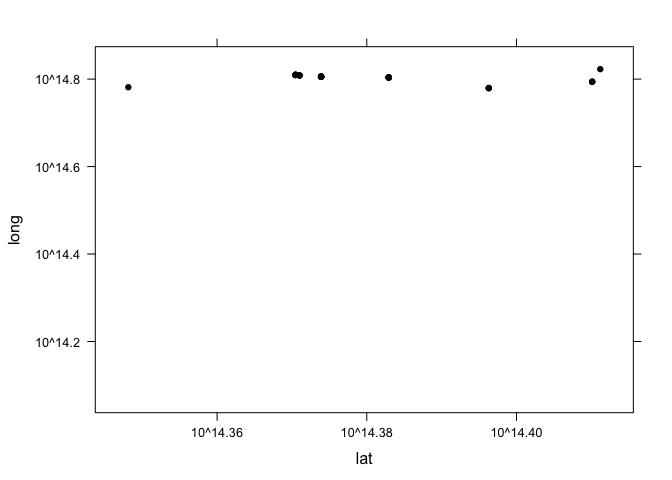<!-- -->

``` r
xyplot(long ~ lat, aspect = "fill", col = 1, pch = 16, data = df, 
    panel = function(x, y, ...) {
    panel.grid(h = -1, v = -1, col.line = grey(0.9))
    panel.xyplot(x, y, ...)
    panel.text(x, y, labels = df$hospital, 
      col = grey(0.5), cex = 0.7, pos = 3, offset = 1)
  })
```

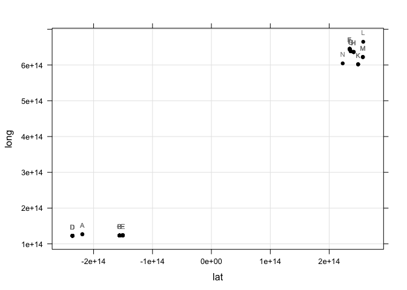<!-- -->

``` r
df_Benin <- df[ which(df$country=="Benin"), ]
df_Finland <- df[ which(df$country=="Finland"), ]
df_BF <- df[ which(df$country=="Burkina Faso"), ]
df_Ben_BF <- df[ which(df$country == "Burkina Faso" | df$country == "Benin"), ]

gps <- data.frame(df$hospital, df$long, df$lat)

mytheme<-list()
mytheme$par.xlab.text$fontfamily="Times"
mytheme$par.ylab.text$fontfamily="Times"
mytheme$par.xlab.text$cex=1.25
mytheme$par.ylab.text$cex=1.25
mytheme$axis.text$cex=1.3
mytheme$axis.text$fontfamily="Times"
mytheme$par.main.text$fontfamily="Times"
mytheme$par.main.text$cex=2.25

p1 <- xyplot(long ~ lat, aspect = "fill", col = "#B2182B", pch = 19, data = df_Benin, cex = 3.5, par.settings=mytheme,
        ylab = "Longitude", xlab = "Latitude", main = "Benin",
    panel = function(x, y, ...) {
    panel.grid(h = -1, v = -1, col.line = grey(0.9))
    panel.xyplot(x, y, ...)
    panel.text(x, y, labels = df_Benin$hospital, 
      col = "white", cex = 1.5, position = "top", offset = 1, fontfamily = "Times")
  })

p2 <- xyplot(long ~ lat, aspect = "fill", col = "#44AA99", pch = 19, data = df_BF, cex = 3.5, par.settings=mytheme,
               ylab = "Longitude", xlab = "Latitude", main = "Burkina Faso",
    panel = function(x, y, ...) {
    panel.grid(h = -3, v = -1, col.line = grey(0.9))
    panel.xyplot(x, y, ...)
    panel.text(x, y, labels = df_BF$hospital, 
      col = "white", cex = 1.5, position = "top", offset = 1, fontfamily = "Times")
  })

p3 <- xyplot(long ~ lat, aspect = "fill", col = "#2166AC", pch = 19, data = df_Finland, cex = 3.5, par.settings=mytheme,
               ylab = "Longitude", xlab = "Latitude", main = "Finland",
    panel = function(x, y, ...) {
    panel.grid(h = -1, v = -1, col.line = grey(0.9))
    panel.xyplot(x, y, ...)
    panel.text(x, y, labels = df_Finland$hospital, 
      col = "white", cex = 1.5, position = "top", offset = 1, fontfamily = "Times")
  })

compass <- north2(p1, symbol = 1)
```

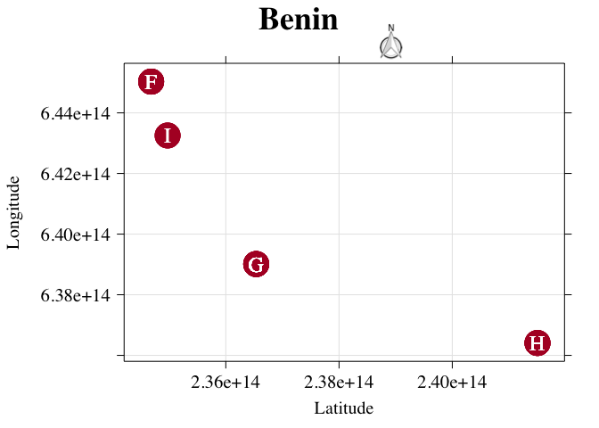<!-- -->

``` r
A <- plot_grid(p1, p2, nrow = 2, rel_widths = c(1, 1))
B <- plot_grid(p3, NULL, compass, NULL, ncol = 1, rel_widths = c(1, 1, 0.333, 1), rel_heights = c(1, 0.333, 0.333, 0.333))
plot_grid(A,B)
```

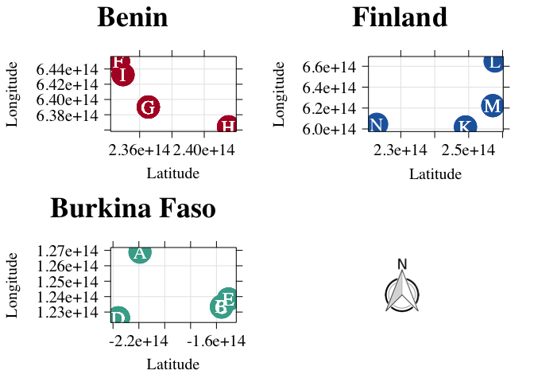<!-- -->

``` r
#ggsave(filename = "map.png",
#       width = 16, height = 13, dpi = 300, units = "in", device='png', scale = 1)

# Outliers
MyVar <- c("country", "hospital", "hospital_section", "SSU_counts", "R1_rpoB_counts", "continent", "no_of_beds", "daily_patient_visits", "ARG_SUM", "intI1_SUM", "A260_280", "DNA_ng_µl", "M_Seqs_trimmed")
Mydotplot(df[,MyVar])
```

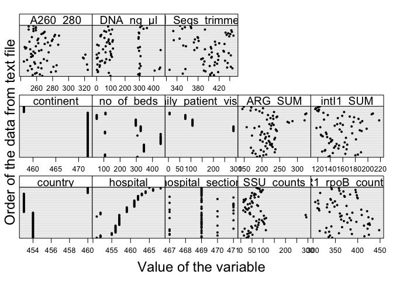<!-- -->

``` r
# Identify the outlier
#par(mfrow = c(1, 1))
#plot(x = df$country, 
#      y = df$SSU_counts)
#identify(x = df$country,
#         y = df$SSU_counts)

# Remove it?
#df <- df[-60, ]
#dim(df)
# No, we shoud not remove it since it is most likely  a
# a real observation, and there are not enough observations to be sure.

# Collinearity
MySel <- c("ARG_SUM", "intI1_SUM", "country", "hospital", "hospital_section", "SSU_counts", "R1_rpoB_counts", "continent", "A260_280", "DNA_ng_µl", "M_Seqs_trimmed")
Mypairs(df[,MySel])
```

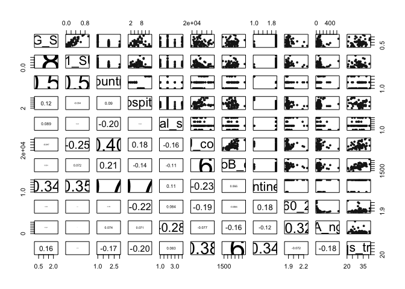<!-- -->

``` r
# Obviously, there is collinearity between continent and country.
# We can continue with onlu country. Similarly we can apply only SSU_counts 
# as they are colloinear with R1_rpoB_counts.

#par(mfrow = c(1, 2))
boxplot(ARG_SUM ~ country, data = df, main = "ARGs")
```

<!-- -->

``` r
boxplot(intI1_SUM ~ country, data = df, main = "intI1")
```

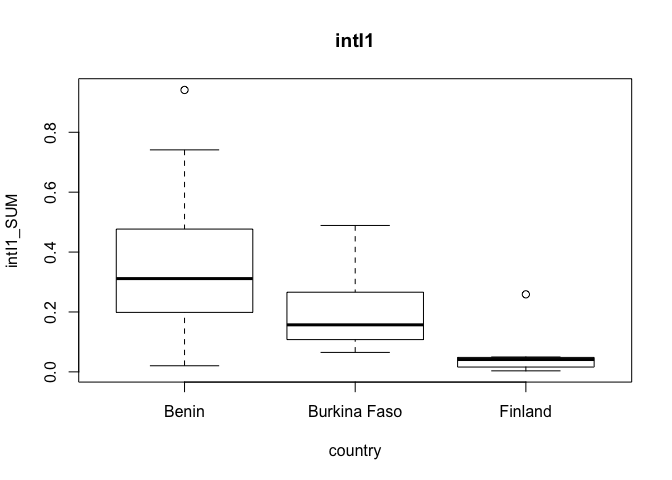<!-- -->

``` r
# Numer of zeros in the response variable
#100 * sum(df$ARG_SUM == 0) / nrow(df)

#number of observations per level of a categorical covariate
table(df$country)
table(df$hospital)
# Unequal number of hospitals. Let's not include that as a covariate.

# Conditional boxplots to study the collinearity of the covariates
par(mfrow = c(2, 2))
boxplot(SSU_counts ~ country, 
        xlab = "country",
        data = df, 
        main = "SSU_counts")
boxplot(R1_rpoB_counts ~ country, 
        xlab = "country",
        data = df, 
        main = "rpoB counts")
boxplot(M_Seqs_trimmed ~ country, 
        xlab = "country",
        data = df, 
        main = "M_Seqs_trimmed")
boxplot(DNA_ng_µl ~ country, 
        xlab = "country",
        data = df, 
        main = "DNA_ng_µl")
```

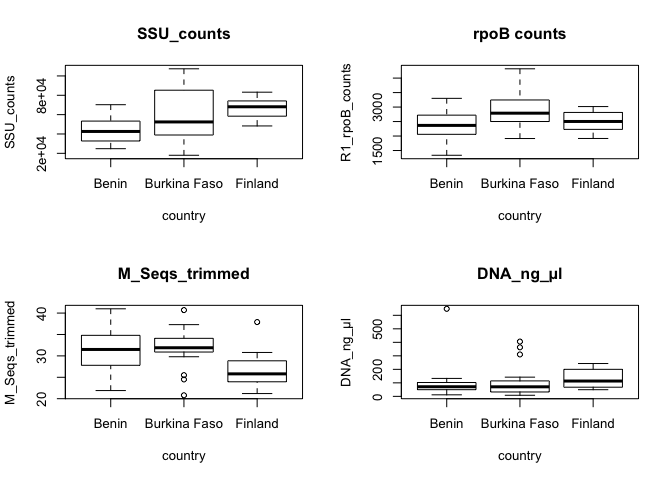<!-- -->

``` r
# There seems to be variation in the SSU_counts
# between hospital WW collected in different countries.
# Although the SSU and rpoB counts seemed to be collinear, 
# it seems that the SSU_counts have a greater variance.
# Let's pick that among these two.

# Interactions
# SSU counts and ARG abundances by country
p <- ggplot(data = df,
            aes(x = SSU_counts, 
                y = ARG_SUM))
p <- p + geom_point()
p <- p + xlab("SSU_counts") + ylab("ARGs")
p <- p + theme(text = element_text(size=15))
p <- p + geom_smooth(method = "glm")
p <- p + facet_grid(~country)
p 
```

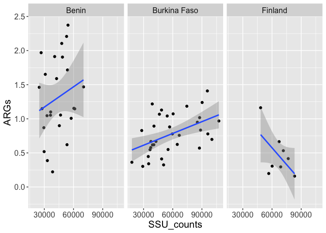<!-- -->

``` r
# There seems to be some kind of interaction defined by country, 
# since the smoothers are poistive/negative/with different slopes
# among different countries.

p <- ggplot(data = df,
            aes(x = SSU_counts, 
                y = intI1_SUM))
p <- p + geom_point()
p <- p + xlab("SSU_counts") + ylab("IntI1")
p <- p + theme(text = element_text(size=15))
p <- p + geom_smooth(method = "glm") #You can also do glm
p <- p + facet_grid(~country)
p
```

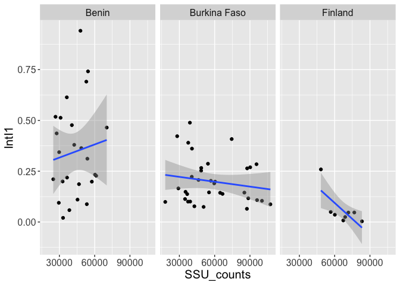<!-- -->

``` r
# There seems to be some kind of interaction defined by country.
# However, the quality of the data (e.g. only few observations in Finland)
# is too low to be able to include this interaction to the model.
# Maybe it is good not to include this interaction to the model due to the low quality data.

# The relationship of class 1 integron to the ARG sum
p <- ggplot()
p <- p + geom_point(data = df, 
                    aes(y = ARG_SUM, 
                        x = intI1_SUM),
                    shape = 1, 
                    size = 2)
p <- p + xlab("intI") + ylab("args")
p <- p + theme(text = element_text(size=15)) 
p <- p + geom_smooth(data = df, 
                     method = glm,
                     aes(x = intI1_SUM, 
                         y = ARG_SUM))
p <- p + facet_grid(. ~ country) 
p
```

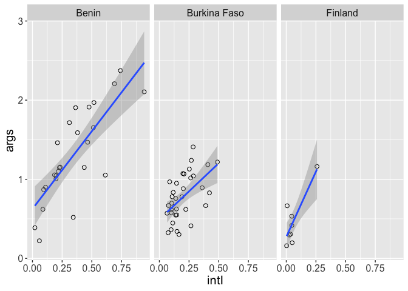<!-- -->

``` r
# In Finland the steeper correlation relies solely on one datapoint
# Thus it is difficult to say whether this is real. 
# Due to the low quality of this data, this interactions should not be included in the model.
# We can however build a model and test whether it is significant.

# Does the hospital section have a role?
par(mfrow = c(1, 2))
boxplot(ARG_SUM ~ hospital_section, 
        xlab = "country",
        data = df, 
        main = "hospital_section")
boxplot(intI1_SUM ~ hospital_section, 
        xlab = "country",
        data = df, 
        main = "hospital_section")
```

<!-- -->

``` r
# No.

# ANALYSIS
# The model:
#Call:  glm(formula = ARG_SUM ~ country + SSU_counts + intI1_SUM + country:intI1_SUM, 
#    family = Gamma(link = "log"), data = df)
# would have been ideal, but was discarded due to the fact that the interactions were not 
# based on high quality data and relied on single influental data points.

# MODEL SELECTION
# Let's fit a model with Gamma distribution with a log link.
Mall <- glm(ARG_SUM ~ country + SSU_counts, + intI1_SUM,
           data = df, family="Gamma"(link="log"))
summary(Mall)

M1 <- glm(ARG_SUM ~ country,
           data = df, family="Gamma"(link="log"))
summary(M1)
step(M1, direction = "both", scope=formula(Mall))

# We are left with:
#Call:  glm(formula = ARG_SUM ~ country + intI1_SUM + SSU_counts, family = Gamma(link = "log"), 
#    data = df)
# Let us build the new selected model
M1 <- glm(ARG_SUM ~ country + intI1_SUM + SSU_counts,
           data = df, family="Gamma"(link="log"))
summary(M1)
#                      Estimate Std. Error t value Pr(>|t|)    
#(Intercept)         -7.639e-01  1.502e-01  -5.085 3.65e-06 ***
#countryBurkina Faso -3.405e-01  1.021e-01  -3.335 0.001443 ** 
#countryFinland      -6.439e-01  1.637e-01  -3.935 0.000213 ***
#intI1_SUM            1.878e+00  2.570e-01   7.308 6.28e-10 ***
#SSU_counts           7.411e-06  2.196e-06   3.375 0.001278 ** 

# Generalized R^2:
(21.8860 - 7.9953) / 21.8860
# R^2 = 0.6346843

# Let's save also the simpliest model
M0 <- glm(ARG_SUM ~ country + SSU_counts, data = df, family= "Gamma"(link="log"))
summary(M0)

# Generalized R^2:
(21.886 - 14.580) / 21.886
# R^2 = 0.3338207

# MODEL VALIDATION

# Homogeneity
# Plot residuals vs fitted values
F1 <- fitted(M1)
E1 <- resid(M1, type = "pearson")
par(mfrow = c(1,1), cex.lab = 1.5, mar = c(5,5,2,2))
plot(x = F1, 
     y = E1,
     xlab = "Fitted values",
     ylab = "Pearson residuals")
abline(h = 0, lty = 2)
```

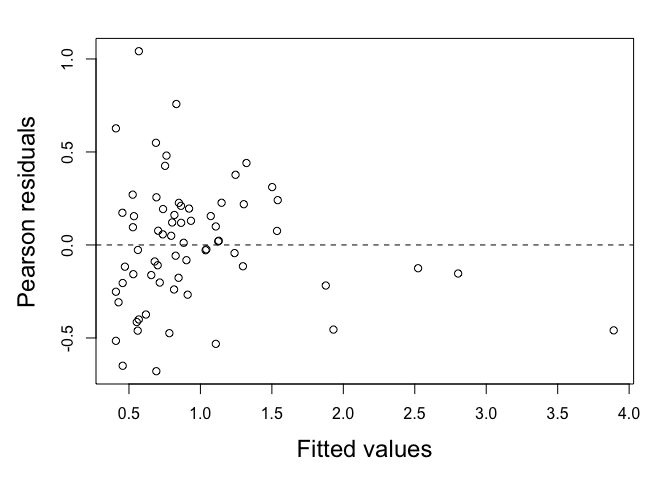<!-- -->

``` r
# No patterns, we are good.

# Influential observations
par(mfrow = c(1, 1))
plot(cooks.distance(M1), type = "h", ylim = c(0, 1))
abline(h = 1)
```

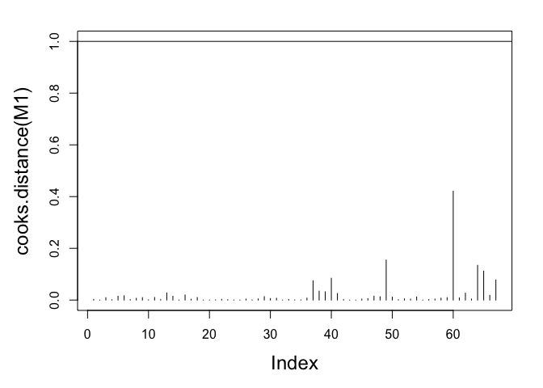<!-- -->

``` r
# There are no influental observations
#cooksd <- data.frame(cooks.distance(M1))
#rownames(cooksd) <- rownames(M1[["data"]])
#cooksd[cooksd$cooks.distance.M1. > 1,]

# Normality
par(cex.lab = 1.5, mar = c(5,5,2,2))
E1 <- resid(M1)
hist(E1, breaks = 15, xlab = "Residuals", main = "")
```

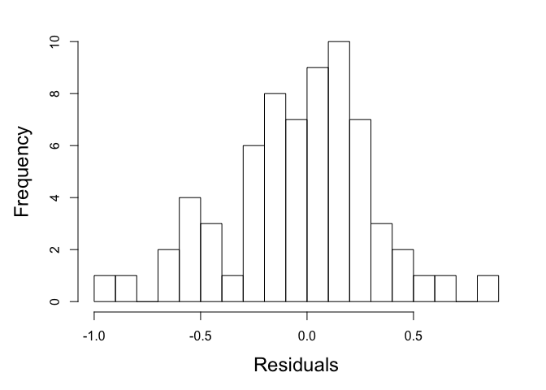<!-- -->

``` r
# Independence due to model misfit
df$E1 <- E1   #Put E1 inside the df
MySel <- c("SSU_counts", "intI1_SUM", "country", "M_Seqs_trimmed")
MyMultipanel.ggp2(Z = df, 
                  varx = MySel, 
                  vary = "E1", 
                  ylab = "Residuals",
                  addSmoother = TRUE,
                  addRegressionLine = FALSE,
                  addHorizontalLine = TRUE) 
```

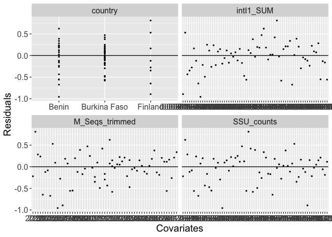<!-- -->

``` r
# Some / No clear non-linear patterns in these graphs.

boxplot(E1 ~ country, 
        data = df,
        ylab = "Residuals")
abline(h = 0)
```

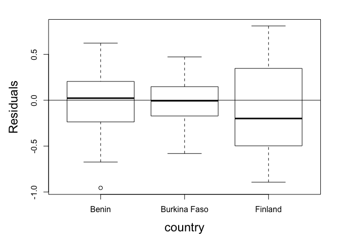<!-- -->

``` r
# Looks good.

# Check for spatial dependency
# Spatial patterns in the residuals?
MyCex <- 3 * abs(E1) / max(E1)
MyCol <- ifelse(E1 > 0, "red", "blue")

xyplot(long ~ lat, data = df, cex = MyCex, col = MyCol)
```

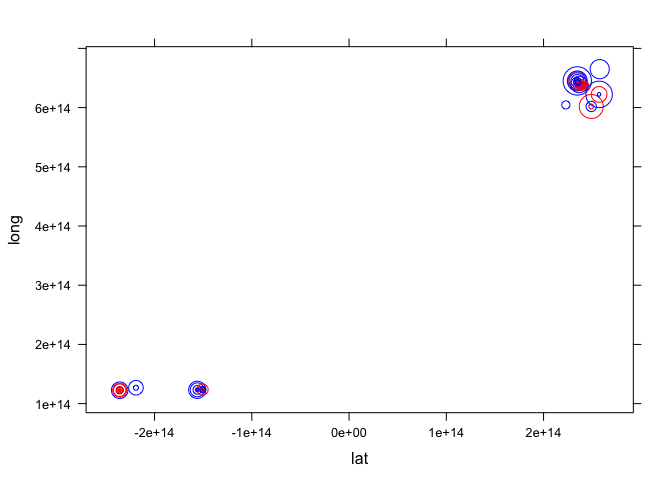<!-- -->

``` r
xyplot(long ~ lat, data = df_Benin, cex = MyCex, col = MyCol)
```

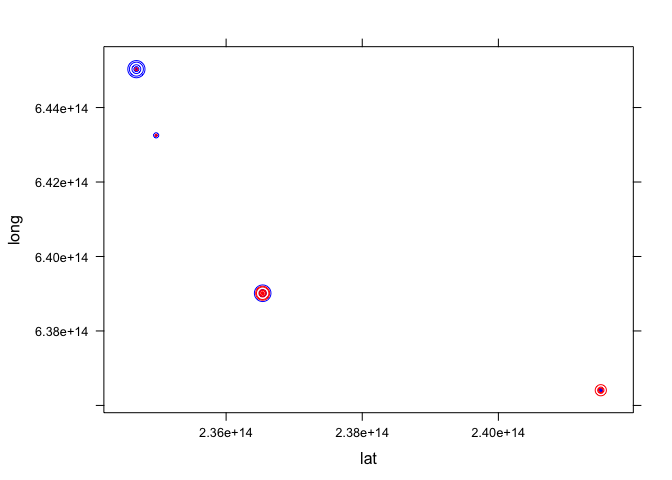<!-- -->

``` r
xyplot(long ~ lat, data = df_BF, cex = MyCex, col = MyCol)
```

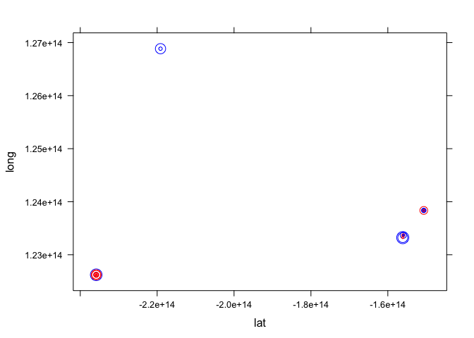<!-- -->

``` r
xyplot(long ~ lat, data = df_Finland, cex = MyCex, col = MyCol)
```

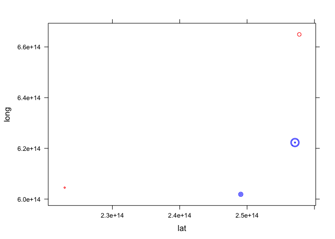<!-- -->

``` r
# In general, some spatial dependency can be detected. 
# However, the number of samples in different locations is quite low.

# MODEL INTERPRETATION
M1 <- glm(ARG_SUM ~ country + SSU_counts + intI1_SUM,
           data = df, family="Gamma"(link="log"))
summary(M1)

M0 <- glm(ARG_SUM ~ country,
           data = df, family="Gamma"(link="log"))
summary(M0)

# Fit model
# Predictions
glht.M1 <- glht(M1, mcp(country = "Tukey"))
summary(glht(glht.M1))

pvalues <- tibble::tribble(
  ~group1, ~group2, ~p,
      "Burkina Faso",     "Finland", 0.07249,
      "Benin",     "Burkina Faso", 0.00214,
      "Benin",     "Finland", 0.001,
  )
pvalues

cols <- get_palette(c("#B2182B", "#44AA99", "#2166AC"), 3)

# Plot
dfA <- cbind(df, Mean = predict(M1, newdata = df, type = "response"), SE = predict(M1, 
    newdata = df, type = "response", se.fit = T)$se.fit)

resfinder_M1 <- ggplot(dfA, aes(x = country, y = Mean)) + scale_color_manual(values=cols) + 
  geom_line() + 
  geom_jitter(data = dfA, aes(x = country, y = ARG_SUM, color = country), size = 12, alpha = 1, width = 0.3) + 
#  geom_errorbar(aes(ymin = Mean - SE, ymax = Mean + SE), width = 0.5, lwd = 0.75) + geom_point(size = 0.9) + 
  theme_linedraw() + 
  theme(axis.text.x = element_text(angle = 0, size = 32, family = "Times", face = "bold"), 
        axis.title.x = element_blank(),
        axis.text.y = element_text(size = 28, family = "Times"),
        axis.title.y = element_text(size = 36, family = "Times"),
        legend.title = element_blank(),
        legend.text = element_text(size = 28, family = "Times"),
        plot.title = element_text(size = 40, family = "Times")) +
  labs(y = "ARGs normalized to 16S rRNA", x = "") + 
  guides(color = FALSE, alpha = FALSE) + 
  labs(title = "Sum relative abundance of ARGs (ResFinder)")
resfinder_M1 + stat_pvalue_manual(pvalues, label = "p", y.position = 4, step.increase = 0.05, tip.length = 0.01, size = 9)
```

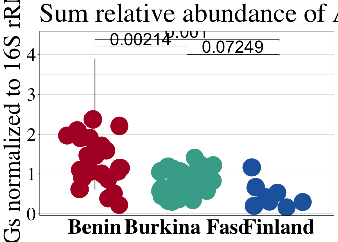<!-- -->

``` r
#ggsave(filename = "resfinder_sum_M1_new.png",
#       width = 16, height = 13, dpi = 300, units = "in", device='png', scale = 1)

# OR
MyData <- ddply(df, 
                .(country), 
                summarise,
                intI1_SUM = seq(min(intI1_SUM), 
                                    max(intI1_SUM), 
                                    length = 25),
                SSU_counts = seq(min(SSU_counts), 
                                   max(SSU_counts), 
                                   length = 25))
head(MyData)

P1 <- predict(M1, newdata = MyData, se = TRUE, type = "response")

MyData$Pred <- P1$fit                    #Predicted values
MyData$selo <- P1$fit - 1.96 * P1$se.fit #lower bound
MyData$seup <- P1$fit + 1.96 * P1$se.fit #lower bound
head(MyData)

# Plot
#cols <- get_palette(c("#B2182B", "#44AA99", "#2166AC"), 3)

#p <- ggplot()
#p <- p + geom_point(data = df, aes(y = ARG_SUM, x = intI1_SUM, col = country), shape = 16, size = 3)
#p <- p + xlab("intI1_SUM") + ylab("ARG_SUM")
#p <- p + theme(text = element_text(size=15)) 
#p <- p + geom_line(data = MyData, aes(x = intI1_SUM, y = Pred, col = country, group = country))
#p <- p + geom_ribbon(data = MyData, aes(x = intI1_SUM, ymax = seup, ymin = selo, group = country,col = country, fill = country),
#                     alpha = 0.5) + scale_color_manual(values=cols) + theme_minimal()
#ggsave(filename = "predict_M1_new.png",
#       width = 16, height = 13, dpi = 300, units = "in", device='png', scale = 1)
```

## Simple model

``` r
glht.M0 <- glht(M0, mcp(country = "Tukey"))
summary(glht(glht.M0))
```

    ## Warning in chkdots(...): Argument(s) 'complete' passed to '...' are ignored

    ## Warning in chkdots(...): Argument(s) 'complete' passed to '...' are ignored

    ## 
    ##   Simultaneous Tests for General Linear Hypotheses
    ## 
    ## Linear Hypotheses:
    ##                             Estimate Std. Error z value Pr(>|z|)    
    ## Burkina Faso - Benin == 0    -0.5189     0.1181  -4.394   <0.001 ***
    ## Finland - Benin == 0         -1.0266     0.1821  -5.639   <0.001 ***
    ## Finland - Burkina Faso == 0  -0.5078     0.1761  -2.883   0.0102 *  
    ## ---
    ## Signif. codes:  0 '***' 0.001 '**' 0.01 '*' 0.05 '.' 0.1 ' ' 1
    ## (Adjusted p values reported -- single-step method)

``` r
pvalues <- tibble::tribble(
  ~group1, ~group2, ~p,
    "Benin",     "Burkina Faso", 0.001,
    "Benin",     "Finland", 0.001,
      "Burkina Faso",     "Finland", 0.0105
  )
pvalues
```

    ## # A tibble: 3 x 3
    ##   group1       group2            p
    ##   <chr>        <chr>         <dbl>
    ## 1 Benin        Burkina Faso 0.001 
    ## 2 Benin        Finland      0.001 
    ## 3 Burkina Faso Finland      0.0105

``` r
dfA <- cbind(df, Mean = predict(M0, newdata = df, type = "response"), SE = predict(M0, 
    newdata = df, type = "response", se.fit = T)$se.fit)

resfinder_M0 <- ggplot(dfA, aes(x = country, y = Mean)) + scale_color_manual(values=cols) + 
  geom_line() + 
  geom_jitter(data = dfA, aes(x = country, y = ARG_SUM, color = country), size = 12, alpha = 1, width = 0.3) + 
  geom_errorbar(aes(ymin = Mean - SE, ymax = Mean + SE), width = 0.5, lwd = 0.75) + geom_point(size = 0.9) + 
  theme_linedraw() + 
  theme(axis.text.x = element_text(angle = 0, size = 40, family = "Times", face = "bold"), 
        axis.title.x = element_blank(),
        axis.text.y = element_text(size = 36, family = "Times"),
        axis.title.y = element_text(size = 36, family = "Times"),
        legend.title = element_blank(),
        legend.text = element_text(size = 28, family = "Times"),
        plot.title = element_text(size = 40, family = "Times")) +
  labs(y = "ARGs normalized to 16S rRNA", x = "") + 
  guides(color = FALSE, alpha = FALSE) + 
  labs(title = "Sum relative abundance of ARGs (ResFinder)")
resfinder_M0 + stat_pvalue_manual(pvalues, label = "p", y.position = 2.3, step.increase = 0.05, tip.length = 0.01, size = 9)
```

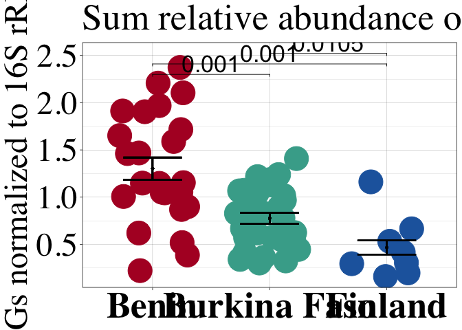<!-- -->

``` r
#ggsave(filename = "resfinder_sum_M0_new.png",
#       width = 16, height = 13, dpi = 300, units = "in", device='png', scale = 1)
```

##### Modelling MGE abundance

``` r
## Data exploration
df<-data.frame(ARG_SUM=sample_sums(resfinder_PHY_stat),
               intI1_SUM=sample_sums(MGE_PHY_int_stat),
               MGE_SUM=sample_sums(MGE_PHY_stat),
               hospital_section=as.factor(sample_data(resfinder_PHY_stat)$hospital_section),
               SSU_counts=as.factor(sample_data(resfinder_PHY_stat)$SSU_counts),
               hospital=as.factor(sample_data(resfinder_PHY_stat)$hospital),
               category=as.factor(sample_data(resfinder_PHY_stat)$category),
               country=as.factor(sample_data(resfinder_PHY_stat)$country),
               continent=as.factor(sample_data(resfinder_PHY_stat)$continent),
               R1_rpoB_counts=as.factor(sample_data(resfinder_PHY_stat)$R1_rpoB_counts),
               no_of_beds=as.factor(sample_data(resfinder_PHY_stat)$no_of_beds),
               daily_patient_visits=as.factor(sample_data(resfinder_PHY_stat)$daily_patient_visits),
               long=as.factor(sample_data(resfinder_PHY_stat)$long),
               lat=as.factor(sample_data(resfinder_PHY_stat)$lat),
               A260_280=as.numeric(sample_data(resfinder_PHY_stat)$A260_280),
               DNA_ng_µl=as.numeric(sample_data(resfinder_PHY_stat)$DNA_ng_µl),
               M_Seqs_trimmed=as.numeric(sample_data(resfinder_PHY_stat)$M_Seqs_trimmed))
              
df$SSU_counts <- as.character(df$SSU_counts)
df$SSU_counts <- as.numeric(df$SSU_counts)
df$R1_rpoB_counts <- as.character(df$R1_rpoB_counts)
df$R1_rpoB_counts <- as.numeric(df$R1_rpoB_counts)
df$daily_patient_visits <- as.character(df$daily_patient_visits)
df$daily_patient_visits <- as.numeric(df$daily_patient_visits)
```

    ## Warning: NAs introduced by coercion

``` r
df$no_of_beds <- as.character(df$no_of_beds)
df$no_of_beds <- as.numeric(df$no_of_beds)
```

    ## Warning: NAs introduced by coercion

``` r
df$long <- as.numeric(gsub(",", ".", gsub("\\.", "", df$long)))
df$lat <- as.numeric(gsub(",", ".", gsub("\\.", "", df$lat)))                   
#str(df)

# Simple model
M0 <- glm(MGE_SUM ~ country,
           data = df, family="Gamma"(link="log"))
summary(M0)
```

    ## 
    ## Call:
    ## glm(formula = MGE_SUM ~ country, family = Gamma(link = "log"), 
    ##     data = df)
    ## 
    ## Deviance Residuals: 
    ##     Min       1Q   Median       3Q      Max  
    ## -1.4294  -0.5305  -0.1611   0.3034   1.1036  
    ## 
    ## Coefficients:
    ##                     Estimate Std. Error t value Pr(>|t|)    
    ## (Intercept)          0.94260    0.11918   7.909 4.66e-11 ***
    ## countryBurkina Faso  0.02026    0.15699   0.129    0.898    
    ## countryFinland       0.11567    0.24205   0.478    0.634    
    ## ---
    ## Signif. codes:  0 '***' 0.001 '**' 0.01 '*' 0.05 '.' 0.1 ' ' 1
    ## 
    ## (Dispersion parameter for Gamma family taken to be 0.3550713)
    ## 
    ##     Null deviance: 24.303  on 66  degrees of freedom
    ## Residual deviance: 24.219  on 64  degrees of freedom
    ## AIC: 239.3
    ## 
    ## Number of Fisher Scoring iterations: 5

``` r
glht.M0 <- glht(M0, mcp(country = "Tukey"))
summary(glht(glht.M0))
```

    ## Warning in chkdots(...): Argument(s) 'complete' passed to '...' are ignored

    ## Warning in chkdots(...): Argument(s) 'complete' passed to '...' are ignored

    ## 
    ##   Simultaneous Tests for General Linear Hypotheses
    ## 
    ## Linear Hypotheses:
    ##                             Estimate Std. Error z value Pr(>|z|)
    ## Burkina Faso - Benin == 0    0.02026    0.15699   0.129    0.991
    ## Finland - Benin == 0         0.11567    0.24205   0.478    0.879
    ## Finland - Burkina Faso == 0  0.09542    0.23415   0.407    0.911
    ## (Adjusted p values reported -- single-step method)

``` r
pvalues <- tibble::tribble(
  ~group1, ~group2, ~p,
    "Benin",     "Burkina Faso", 0.991,
    "Benin",     "Finland", 0.879,
      "Burkina Faso",     "Finland", 0.911
  )
pvalues
```

    ## # A tibble: 3 x 3
    ##   group1       group2           p
    ##   <chr>        <chr>        <dbl>
    ## 1 Benin        Burkina Faso 0.991
    ## 2 Benin        Finland      0.879
    ## 3 Burkina Faso Finland      0.911

``` r
dfA <- cbind(df, Mean = predict(M0, newdata = df, type = "response"), SE = predict(M0, 
    newdata = df, type = "response", se.fit = T)$se.fit)

cols <- get_palette(c("#B2182B", "#44AA99", "#2166AC"), 3)

MGE_M0 <- ggplot(dfA, aes(x = country, y = Mean)) + scale_color_manual(values=cols) + 
  geom_line() + 
  geom_jitter(data = dfA, aes(x = country, y = MGE_SUM, color = country), size = 12, alpha = 1, width = 0.3) + 
  geom_errorbar(aes(ymin = Mean - SE, ymax = Mean + SE), width = 0.5, lwd = 0.75) + geom_point(size = 0.9) + 
  theme_linedraw() + 
  theme(axis.text.x = element_text(angle = 0, size = 40, family = "Times", face = "bold"), 
        axis.title.x = element_blank(),
        axis.text.y = element_text(size = 36, family = "Times"),
        axis.title.y = element_text(size = 36, family = "Times"),
        legend.title = element_blank(),
        legend.text = element_text(size = 28, family = "Times"),
        plot.title = element_text(size = 40, family = "Times")) +
  labs(y = "MGEs normalized to 16S rRNA", x = "") + 
  guides(color = FALSE, alpha = FALSE) + 
  labs(title = "Sum relative abundance of MGEs (MGE database)")
MGE_M0 + stat_pvalue_manual(pvalues, label = "p", y.position = 7, step.increase = 0.05, tip.length = 0.01, size = 9)
```

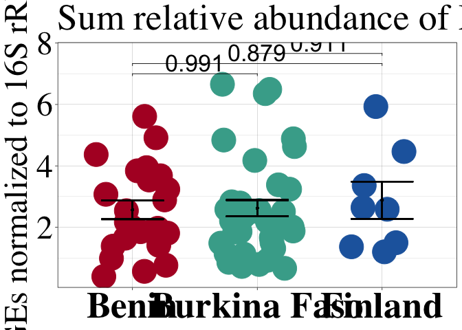<!-- -->

``` r
#ggsave(filename = "MGE_sum_M0_new.png",
#       width = 16, height = 13, dpi = 300, units = "in", device='png', scale = 1)
```

##### Modelling intI1 abundance

``` r
## Data exploration
df<-data.frame(ARG_SUM=sample_sums(resfinder_PHY_stat),
               intI1_SUM=sample_sums(MGE_PHY_int_stat),
               MGE_SUM=sample_sums(MGE_PHY_stat),
               hospital_section=as.factor(sample_data(resfinder_PHY_stat)$hospital_section),
               SSU_counts=as.factor(sample_data(resfinder_PHY_stat)$SSU_counts),
               hospital=as.factor(sample_data(resfinder_PHY_stat)$hospital),
               category=as.factor(sample_data(resfinder_PHY_stat)$category),
               country=as.factor(sample_data(resfinder_PHY_stat)$country),
               continent=as.factor(sample_data(resfinder_PHY_stat)$continent),
               R1_rpoB_counts=as.factor(sample_data(resfinder_PHY_stat)$R1_rpoB_counts),
               no_of_beds=as.factor(sample_data(resfinder_PHY_stat)$no_of_beds),
               daily_patient_visits=as.factor(sample_data(resfinder_PHY_stat)$daily_patient_visits),
               long=as.factor(sample_data(resfinder_PHY_stat)$long),
               lat=as.factor(sample_data(resfinder_PHY_stat)$lat),
               A260_280=as.numeric(sample_data(resfinder_PHY_stat)$A260_280),
               DNA_ng_µl=as.numeric(sample_data(resfinder_PHY_stat)$DNA_ng_µl),
               M_Seqs_trimmed=as.numeric(sample_data(resfinder_PHY_stat)$M_Seqs_trimmed))
              
df$SSU_counts <- as.character(df$SSU_counts)
df$SSU_counts <- as.numeric(df$SSU_counts)
df$R1_rpoB_counts <- as.character(df$R1_rpoB_counts)
df$R1_rpoB_counts <- as.numeric(df$R1_rpoB_counts)
df$daily_patient_visits <- as.character(df$daily_patient_visits)
df$daily_patient_visits <- as.numeric(df$daily_patient_visits)
```

    ## Warning: NAs introduced by coercion

``` r
df$no_of_beds <- as.character(df$no_of_beds)
df$no_of_beds <- as.numeric(df$no_of_beds)
```

    ## Warning: NAs introduced by coercion

``` r
df$long <- as.numeric(gsub(",", ".", gsub("\\.", "", df$long)))
df$lat <- as.numeric(gsub(",", ".", gsub("\\.", "", df$lat)))                   
#str(df)

# Simple model
M0 <- glm(intI1_SUM ~ country,
           data = df, family="Gamma"(link="log"))
summary(M0)
```

    ## 
    ## Call:
    ## glm(formula = intI1_SUM ~ country, family = Gamma(link = "log"), 
    ##     data = df)
    ## 
    ## Deviance Residuals: 
    ##     Min       1Q   Median       3Q      Max  
    ## -1.9566  -0.5599  -0.2306   0.3069   1.9490  
    ## 
    ## Coefficients:
    ##                     Estimate Std. Error t value Pr(>|t|)    
    ## (Intercept)          -1.0625     0.1479  -7.185 8.82e-10 ***
    ## countryBurkina Faso  -0.5493     0.1948  -2.820  0.00639 ** 
    ## countryFinland       -1.7648     0.3004  -5.876 1.65e-07 ***
    ## ---
    ## Signif. codes:  0 '***' 0.001 '**' 0.01 '*' 0.05 '.' 0.1 ' ' 1
    ## 
    ## (Dispersion parameter for Gamma family taken to be 0.5467518)
    ## 
    ##     Null deviance: 50.427  on 66  degrees of freedom
    ## Residual deviance: 35.229  on 64  degrees of freedom
    ## AIC: -82.305
    ## 
    ## Number of Fisher Scoring iterations: 6

``` r
glht.M0 <- glht(M0, mcp(country = "Tukey"))
summary(glht(glht.M0))
```

    ## Warning in chkdots(...): Argument(s) 'complete' passed to '...' are ignored

    ## Warning in chkdots(...): Argument(s) 'complete' passed to '...' are ignored

    ## 
    ##   Simultaneous Tests for General Linear Hypotheses
    ## 
    ## Linear Hypotheses:
    ##                             Estimate Std. Error z value Pr(>|z|)    
    ## Burkina Faso - Benin == 0    -0.5493     0.1948  -2.820   0.0129 *  
    ## Finland - Benin == 0         -1.7648     0.3004  -5.876   <0.001 ***
    ## Finland - Burkina Faso == 0  -1.2155     0.2906  -4.183   <0.001 ***
    ## ---
    ## Signif. codes:  0 '***' 0.001 '**' 0.01 '*' 0.05 '.' 0.1 ' ' 1
    ## (Adjusted p values reported -- single-step method)

``` r
pvalues <- tibble::tribble(
  ~group1, ~group2, ~p,
    "Benin",     "Burkina Faso", 0.013,
    "Benin",     "Finland", 0.001,
      "Burkina Faso",     "Finland", 0.001
  )
pvalues
```

    ## # A tibble: 3 x 3
    ##   group1       group2           p
    ##   <chr>        <chr>        <dbl>
    ## 1 Benin        Burkina Faso 0.013
    ## 2 Benin        Finland      0.001
    ## 3 Burkina Faso Finland      0.001

``` r
dfA <- cbind(df, Mean = predict(M0, newdata = df, type = "response"), SE = predict(M0, 
    newdata = df, type = "response", se.fit = T)$se.fit)

cols <- get_palette(c("#B2182B", "#44AA99", "#2166AC"), 3)

MGE_M0 <- ggplot(dfA, aes(x = country, y = Mean)) + scale_color_manual(values=cols) + 
  geom_line() + 
  geom_jitter(data = dfA, aes(x = country, y = intI1_SUM, color = country), size = 12, alpha = 1, width = 0.3) + 
  geom_errorbar(aes(ymin = Mean - SE, ymax = Mean + SE), width = 0.5, lwd = 0.75) + geom_point(size = 0.9) + 
  theme_linedraw() + 
  theme(axis.text.x = element_text(angle = 0, size = 40, family = "Times", face = "bold"), 
        axis.title.x = element_blank(),
        axis.text.y = element_text(size = 36, family = "Times"),
        axis.title.y = element_text(size = 36, family = "Times"),
        legend.title = element_blank(),
        legend.text = element_text(size = 28, family = "Times"),
        plot.title = element_text(size = 40, family = "Times")) +
  labs(y = "intI1 normalized to 16S rRNA", x = "") + 
  guides(color = FALSE, alpha = FALSE) + 
  labs(title = "Sum relative abundance of Class 1 integrons (MGE database)")
MGE_M0 + stat_pvalue_manual(pvalues, label = "p", y.position = 1.05, step.increase = 0.05, tip.length = 0.01, size = 9)
```

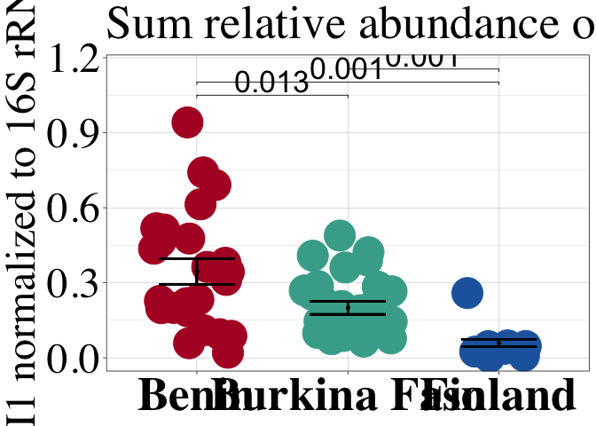<!-- -->

``` r
#ggsave(filename = "intI1_sum_M0_new.png",
#       width = 16, height = 13, dpi = 300, units = "in", device='png', scale = 1)
```

# Relative sums of ARGs with all samples based on category

``` r
# Subset samples which belong to category among >2 other samples
resfinder_PHY_cat_stat <- subset_samples(resfinder_PHY, category != "WA street gutter" &
                                        category != "WA street gutter, sediment" &
                                        category != "WA soil inbetween tanks" &
                                        category != "WA empty hospital septic tank" &
                                        category != "WA treated, receiving municipality channel" &
                                        category != "WA treated, drinking water" &
                                        category != "WA treated, receiving river" &
                                        category != "WA treated, hand washing" &
                                        category != "WA in-patient feces")

MGE_PHY_int_cat_stat <- subset_samples(MGE_PHY_int, category != "WA street gutter" &
                                        category != "WA street gutter, sediment" &
                                        category != "WA soil inbetween tanks" &
                                        category != "WA empty hospital septic tank" &
                                        category != "WA treated, receiving municipality channel" &
                                        category != "WA treated, drinking water" &
                                        category != "WA treated, receiving river" &
                                        category != "WA treated, hand washing" &
                                        category != "WA in-patient feces")

df<-data.frame(ARG_SUM=sample_sums(resfinder_PHY_cat_stat),
               intI1_SUM=sample_sums(MGE_PHY_int_cat_stat),
               hospital_section=as.factor(sample_data(resfinder_PHY_cat_stat)$hospital_section),
               SSU_counts=as.factor(sample_data(resfinder_PHY_cat_stat)$SSU_counts),
               hospital=as.factor(sample_data(resfinder_PHY_cat_stat)$hospital),
               category=as.factor(sample_data(resfinder_PHY_cat_stat)$category),
               country=as.factor(sample_data(resfinder_PHY_cat_stat)$country),
               continent=as.factor(sample_data(resfinder_PHY_cat_stat)$continent),
               R1_rpoB_counts=as.factor(sample_data(resfinder_PHY_cat_stat)$R1_rpoB_counts),
               no_of_beds=as.factor(sample_data(resfinder_PHY_cat_stat)$no_of_beds),
               daily_patient_visits=as.factor(sample_data(resfinder_PHY_cat_stat)$daily_patient_visits),
               sample_material=as.factor(sample_data(resfinder_PHY_cat_stat)$sample_material))
df$SSU_counts <- as.character(df$SSU_counts)
df$SSU_counts <- as.numeric(df$SSU_counts)
df$R1_rpoB_counts <- as.character(df$R1_rpoB_counts)
df$R1_rpoB_counts <- as.numeric(df$R1_rpoB_counts)
df$daily_patient_visits <- as.character(df$daily_patient_visits)
df$daily_patient_visits <- as.numeric(df$daily_patient_visits)
```

    ## Warning: NAs introduced by coercion

``` r
df$no_of_beds <- as.character(df$no_of_beds)
df$no_of_beds <- as.numeric(df$no_of_beds)
```

    ## Warning: NAs introduced by coercion

``` r
#str(df)

# Simple model
M0 <- glm(ARG_SUM ~ category,
           data = df, family="Gamma"(link="log"))
summary(M0)
```

    ## 
    ## Call:
    ## glm(formula = ARG_SUM ~ category, family = Gamma(link = "log"), 
    ##     data = df)
    ## 
    ## Deviance Residuals: 
    ##     Min       1Q   Median       3Q      Max  
    ## -1.2051  -0.4425  -0.0771   0.1681   1.0742  
    ## 
    ## Coefficients:
    ##                                  Estimate Std. Error t value Pr(>|t|)    
    ## (Intercept)                       -0.7616     0.1873  -4.065 0.000129 ***
    ## categoryWA hospital effluent       0.7610     0.1996   3.812 0.000303 ***
    ## categoryWA river, drinking water  -2.6872     0.3587  -7.491 1.99e-10 ***
    ## ---
    ## Signif. codes:  0 '***' 0.001 '**' 0.01 '*' 0.05 '.' 0.1 ' ' 1
    ## 
    ## (Dispersion parameter for Gamma family taken to be 0.2807866)
    ## 
    ##     Null deviance: 36.824  on 69  degrees of freedom
    ## Residual deviance: 19.080  on 67  degrees of freedom
    ## AIC: 66.804
    ## 
    ## Number of Fisher Scoring iterations: 5

``` r
# Predictions
glht.M0 <- glht(M0, mcp(category = "Tukey"))
summary(glht(glht.M0))
```

    ## Warning in chkdots(...): Argument(s) 'complete' passed to '...' are ignored

    ## Warning in chkdots(...): Argument(s) 'complete' passed to '...' are ignored

    ## 
    ##   Simultaneous Tests for General Linear Hypotheses
    ## 
    ## Linear Hypotheses:
    ##                                                            Estimate Std. Error
    ## WA hospital effluent - North Eu hospital effluent == 0       0.7610     0.1996
    ## WA river, drinking water - North Eu hospital effluent == 0  -2.6872     0.3587
    ## WA river, drinking water - WA hospital effluent == 0        -3.4482     0.3136
    ##                                                            z value Pr(>|z|)    
    ## WA hospital effluent - North Eu hospital effluent == 0       3.812 0.000346 ***
    ## WA river, drinking water - North Eu hospital effluent == 0  -7.491  < 1e-04 ***
    ## WA river, drinking water - WA hospital effluent == 0       -10.995  < 1e-04 ***
    ## ---
    ## Signif. codes:  0 '***' 0.001 '**' 0.01 '*' 0.05 '.' 0.1 ' ' 1
    ## (Adjusted p values reported -- single-step method)

``` r
# Plot
dfA <- cbind(df, Mean = predict(M0, newdata = df, type = "response"), SE = predict(M0, 
    newdata = df, type = "response", se.fit = T)$se.fit)

cols <- get_palette(c("#B2182B", "#44AA99", "#2166AC"), 7)

cat_M0 <- ggplot(dfA, aes(x = category, y = Mean)) + scale_color_manual(values=cols) + 
  geom_line() + 
  geom_jitter(data = dfA, aes(x = category, y = ARG_SUM, color = category), size = 12, alpha = 1, width = 0.3) + 
  geom_errorbar(aes(ymin = Mean - SE, ymax = Mean + SE), width = 0.5, lwd = 0.75) + geom_point(size = 0.9) + 
  theme_linedraw() + 
  theme(axis.text.x = element_text(angle = 45, size = 12, family = "Times", face = "bold"), 
        axis.title.x = element_blank(),
        axis.text.y = element_text(size = 28, family = "Times"),
        axis.title.y = element_text(size = 36, family = "Times"),
        legend.title = element_blank(),
        legend.text = element_text(size = 28, family = "Times"),
        plot.title = element_text(size = 40, family = "Times")) +
  labs(y = "IntI1 normalized to 16S rRNA", x = "") + 
  guides(color = FALSE, alpha = FALSE) + 
  labs(title = "Sum relative abundance of ARGs (resfinder)")
cat_M0
```

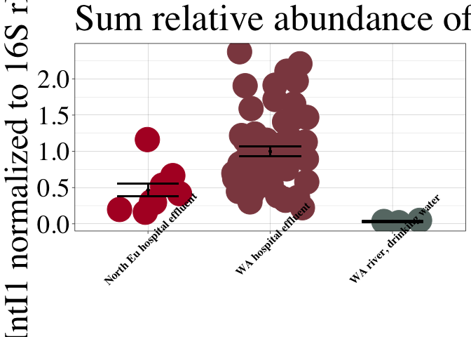<!-- -->

``` r
# Reorder samples
sam_order <- c("WA hospital effluent", 
               "Eu other hospital effluent",
               "North Eu hospital effluent",
               "Eu other wwtp influent", 
               "North Eu wwtp influent", 
               "WA river, drinking water", 
               "North Eu treated")
cat_M0$data$category <- factor(cat_M0$data$category, levels = sam_order)
cat_M0
```

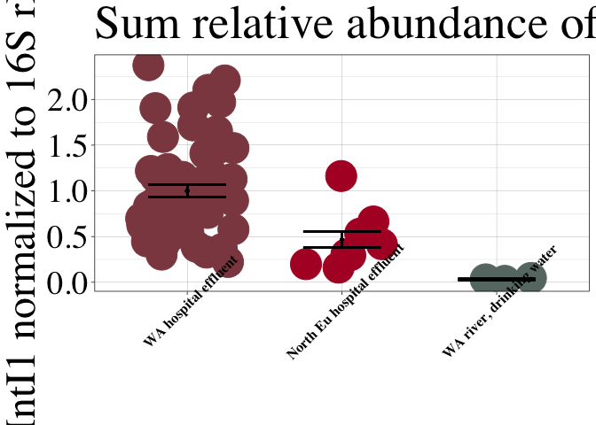<!-- -->

``` r
#ggsave(filename = "resfinder_sum_categories_new.png",
#       width = 16, height = 13, dpi = 300, units = "in", device='png', scale = 1)
```

## Diversity

# ResFinder

``` r
# Create phyloseq object with the count data
OTU_resfinder_counts <-as.matrix(read.table("ARG_genemat.txt", header= T, check.names = F, row.names = 1))

match <- match(rownames(metadata), colnames(OTU_resfinder_counts))
OTU_resfinder_counts <- OTU_resfinder_counts[,match]
all(colnames(OTU_resfinder_counts) == rownames(metadata))
```

    ## [1] TRUE

``` r
# Tax_table (Cluster names created using cd-hit and 90 % identity and added manually to the tax table in excel)
clusters_tax_table_resfinder <- read.csv("~/Documents/Metagenomes_AMRIWA/R/AMRIWA/RFiles/clusters_tax_table.txt", header=FALSE, sep=";")
colnames(clusters_tax_table_resfinder) <- c("Gene",  "Cluster_name", "Class")
# Reorder columns
col_order <- c("Class", "Cluster_name", "Gene")
clusters_tax_table_resfinder <- clusters_tax_table_resfinder[, col_order]

# Reorder tax_table to match OTU_resfinder
match <- match(rownames(OTU_resfinder_counts), clusters_tax_table_resfinder$Gene)
clusters_tax_table_resfinder <- clusters_tax_table_resfinder[match,]
all(rownames(OTU_resfinder_counts) == clusters_tax_table_resfinder$Gene)
```

    ## [1] TRUE

``` r
# Reload to get new row numbers
write.table(OTU_resfinder_counts, "~/Documents/Metagenomes_AMRIWA/R/AMRIWA/RFiles/OTU_resfinder_counts.txt", 
            row.names=T, sep = "\t", col.names = T)
OTU_resfinder_counts <- read.delim("~/Documents/Metagenomes_AMRIWA/R/AMRIWA/RFiles/OTU_resfinder_counts.txt", row.names=NULL)
OTU_resfinder_counts$row.names<-NULL

# Reload to get new row numbers
write.table(clusters_tax_table_resfinder, "~/Documents/Metagenomes_AMRIWA/R/AMRIWA/RFiles/clusters_tax_table_resfinder.txt", row.names=F, sep = "\t", col.names = T)
clusters_tax_table_resfinder <- read.delim("~/Documents/Metagenomes_AMRIWA/R/AMRIWA/RFiles/clusters_tax_table_resfinder.txt", row.names=NULL)

resfinder_PHY_counts <- phyloseq(otu_table(OTU_resfinder_counts, taxa_are_rows = TRUE), sample_data(metadata), 
    tax_table(as.matrix(clusters_tax_table_resfinder)))

# Create phyloseq object with all samples
# Exclude samples with low sequencing quality (BFH24_S142, BH63_S118, FH10_S171)
resfinder_PHY_counts = subset_samples(resfinder_PHY_counts, alias != "BFH24" & alias != "BH63" & alias != "FH10")
# Exclude samples from UK hospital whose sample collection does not match with other samples
resfinder_PHY_counts <- subset_samples(resfinder_PHY_counts, country != "UK")
## Exclude biological / technical replicates
resfinder_PHY_counts_stat <- subset_samples(resfinder_PHY_counts, alias != "BH31" & alias != "BH33" & alias != "BH34B" & alias != "BH10"
                                     & alias != "BFH38B" & alias != "FH8" & alias != "BH45" & alias != "BH59" & alias != "BH62")
# Create phyloseq object with only hospital WW samples sequenced here
resfinder_PHY_counts_stat <- subset_samples(resfinder_PHY_counts_stat, category == "WA hospital effluent" | category == "North Eu hospital effluent")

PHY <- prune_taxa(taxa_sums(resfinder_PHY_counts_stat) > 0, resfinder_PHY_counts_stat)

# Rarefy
#  90% of the minimum sample depth
rarecurve(t(otu_table(PHY)), step=50, cex=0.5)
```

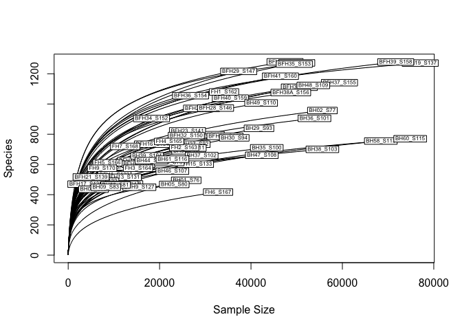<!-- -->

``` r
PHY_rarefied = rarefy_even_depth(PHY, rngseed=1)
```

    ## `set.seed(1)` was used to initialize repeatable random subsampling.

    ## Please record this for your records so others can reproduce.

    ## Try `set.seed(1); .Random.seed` for the full vector

    ## ...

    ## 567OTUs were removed because they are no longer 
    ## present in any sample after random subsampling

    ## ...

``` r
#567OTUs were removed because they are no longer 
#present in any sample after random subsampling
rarecurve(t(otu_table(PHY_rarefied)), step=50, cex=0.5)
```

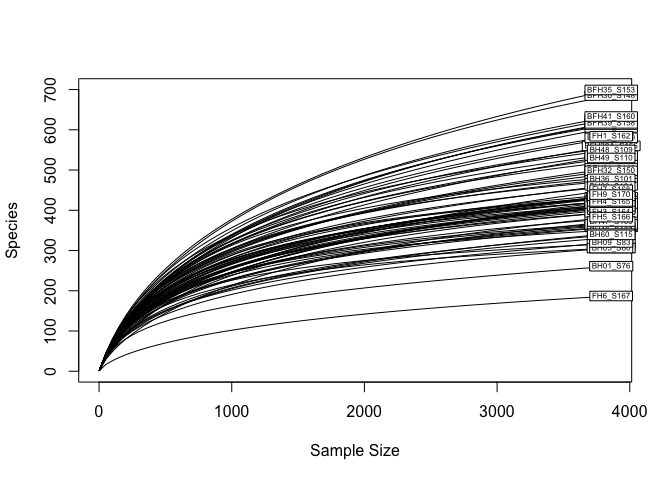<!-- -->

``` r
tab <- microbiome::alpha(PHY_rarefied, index = "all")
```

    ## Observed richness

    ## Other forms of richness

    ## Diversity

    ## Evenness

    ## Dominance

    ## Rarity

``` r
#kable(head(tab))

PHY.meta <- meta(PHY_rarefied)
#kable(head(PHY.meta))

PHY.meta$Shannon <- tab$diversity_shannon 
PHY.meta$Observed <- tab$observed

# make a pairwise list that we want to compare.
vars <- levels(PHY.meta$country)
vars.pairs <- combn(seq_along(vars), 2, simplify = FALSE, FUN = function(i)vars[i])
print(vars.pairs)
```

    ## [[1]]
    ## [1] "Benin"        "Burkina Faso"
    ## 
    ## [[2]]
    ## [1] "Benin"   "Finland"
    ## 
    ## [[3]]
    ## [1] "Burkina Faso" "Finland"

``` r
cols <- get_palette(c("#B2182B", "#44AA99", "#2166AC"), 3)

shannon <- ggboxplot(PHY.meta, x = "country", y = "Shannon", fill = "country", add = "jitter") + 
  scale_fill_manual(values = cols) +
  theme(axis.text.x = element_text(angle = 0, vjust = 0.75, size = 36, hjust = 0.75, family = "Times", face = "bold"), 
        axis.title.x = element_blank(),
        axis.text.y = element_text(size = 36, family = "Times"),
        legend.position = "none",
        legend.title = element_blank(),
        axis.title.y = element_text(size = 36, family = "Times"),
        plot.title = element_text(size = 40, family = "Times", face = "bold")) +
  labs(title = "Alpha diversity, Shannon index (ResFinder)")

a <- shannon + stat_compare_means(comparisons = vars.pairs, 
                             label = "p", 
                             hide.ns = F, ref.group = ".all.",
                             size = 10, fontfamily = "Times")
a
```

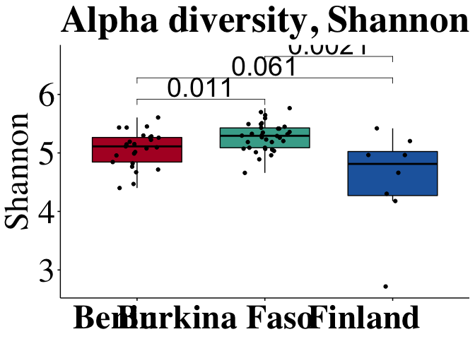<!-- -->

``` r
#ggsave(filename = "resfinder_diversities_new.png",
#       width = 16, height = 13, dpi = 300, units = "in", device='png', scale = 1)
```

## Diversity

# Metaphlan3

``` r
# transform into counts
PHY <- transform_sample_counts(metaphlan_PHY_stat, function(x) 1E6 * x/sum(x))
otu_table(PHY) <- round(otu_table(PHY), digits = 0)

PHY <- prune_taxa(taxa_sums(PHY) > 0, PHY)

# Sequences should be rarefied prior running Metaphlan3!

tab <- microbiome::alpha(PHY, index = "all")
```

    ## Observed richness

    ## Other forms of richness

    ## Diversity

    ## Evenness

    ## Dominance

    ## Rarity

``` r
#kable(head(tab))

PHY.meta <- meta(PHY)
#kable(head(PHY.meta))

PHY.meta$Shannon <- tab$diversity_shannon 

# make a pairwise list that we want to compare.
vars <- levels(PHY.meta$country)
vars.pairs <- combn(seq_along(vars), 2, simplify = FALSE, FUN = function(i)vars[i])
print(vars.pairs)
```

    ## [[1]]
    ## [1] "Benin"        "Burkina Faso"
    ## 
    ## [[2]]
    ## [1] "Benin"   "Finland"
    ## 
    ## [[3]]
    ## [1] "Burkina Faso" "Finland"

``` r
cols <- get_palette(c("#B2182B", "#44AA99", "#2166AC"), 3)

shannon <- ggboxplot(PHY.meta, x = "country", y = "Shannon", fill = "country", add = "jitter") + 
  scale_fill_manual(values = cols) +
  theme(axis.text.x = element_text(angle = 0, vjust = 0.75, size = 36, hjust = 0.75, family = "Times", face = "bold"), 
        axis.title.x = element_blank(),
        axis.text.y = element_text(size = 36, family = "Times"),
        legend.position = "none",
        legend.title = element_blank(),
        axis.title.y = element_text(size = 36, family = "Times"),
        plot.title = element_text(size = 40, family = "Times", face = "bold")) +
  labs(title = "Alpha diversity, Shannon index (Metaphlan3)")

a <- shannon + stat_compare_means(comparisons = vars.pairs, 
                             label = "p", 
                             hide.ns = F, ref.group = ".all.",
                             size = 10, fontfamily = "Times")
a
```

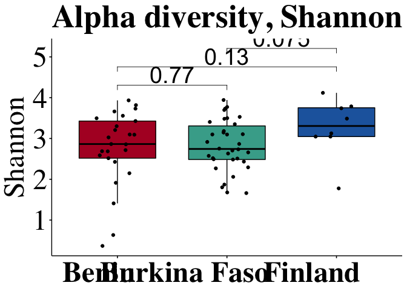<!-- -->

``` r
#ggsave(filename = "metaphlan_diversities_new.png",
#       width = 16, height = 13, dpi = 300, units = "in", device='png', scale = 1)
```

## Diversity

# Mobilome (MGE database)

``` r
# Create phyloseq object with the count data
OTU_MGE_counts <-as.matrix(read.table("cp_MGE_genemat.txt", header= T, check.names = F, row.names = 1))

match <- match(rownames(metadata), colnames(OTU_MGE_counts))
OTU_MGE_counts <- OTU_MGE_counts[,match]
all(colnames(OTU_MGE_counts) == rownames(metadata))
```

    ## [1] TRUE

``` r
# Tax table
MGE_tax_table_trim <- read.delim("~/Documents/Metagenomes_AMRIWA/R/AMRIWA/RFiles/MGE_tax_table_trim.txt", header=FALSE)
colnames(MGE_tax_table_trim) <- c("Gene", "Element", "Class")

# Reorder tax_table to match OTU_MGE
match <- match(rownames(OTU_MGE_counts), MGE_tax_table_trim$Gene)
MGE_tax_table_trim <- MGE_tax_table_trim[match,]
all(rownames(OTU_MGE_counts) == MGE_tax_table_trim$Gene)
```

    ## [1] TRUE

``` r
# Reload to get new row numbers
write.table(OTU_MGE_counts, "~/Documents/Metagenomes_AMRIWA/R/AMRIWA/RFiles/OTU_MGE_counts", 
            row.names=T, sep = "\t", col.names = T)
OTU_MGE_counts <- read.delim("~/Documents/Metagenomes_AMRIWA/R/AMRIWA/RFiles/OTU_MGE_counts", row.names=NULL)
OTU_MGE_counts$row.names<-NULL

# Reload to get new row numbers
write.table(MGE_tax_table_trim, "~/Documents/Metagenomes_AMRIWA/R/AMRIWA/RFiles/MGE_tax_table_trim.txt", row.names=F, sep = "\t", col.names = T)
MGE_tax_table_trim <- read.delim("~/Documents/Metagenomes_AMRIWA/R/AMRIWA/RFiles/MGE_tax_table_trim.txt", row.names=NULL)

MGE_PHY_counts <- phyloseq(otu_table(OTU_MGE_counts, taxa_are_rows = TRUE), sample_data(metadata), 
    tax_table(as.matrix(MGE_tax_table_trim)))

# Create phyloseq object with all samples
# Exclude samples with low sequencing quality (BFH24_S142, BH63_S118, FH10_S171)
MGE_PHY_counts = subset_samples(MGE_PHY_counts, alias != "BFH24" & alias != "BH63" & alias != "FH10")
# Exclude samples from UK hospital whose sample collection does not match with other samples
MGE_PHY_counts <- subset_samples(MGE_PHY_counts, country != "UK")
## Exclude biological / technical replicates
MGE_PHY_counts_stat <- subset_samples(MGE_PHY_counts, alias != "BH31" & alias != "BH33" & alias != "BH34B" & alias != "BH10"
                                     & alias != "BFH38B" & alias != "FH8" & alias != "BH45" & alias != "BH59" & alias != "BH62")
# Create phyloseq object with only hospital WW samples sequenced here
MGE_PHY_counts_stat <- subset_samples(MGE_PHY_counts_stat, category == "WA hospital effluent" | category == "North Eu hospital effluent")

PHY <- prune_taxa(taxa_sums(MGE_PHY_counts_stat) > 0, MGE_PHY_counts_stat)

# Rarefy
#  90% of the minimum sample depth
rarecurve(t(otu_table(PHY)), step=50, cex=0.5)
```

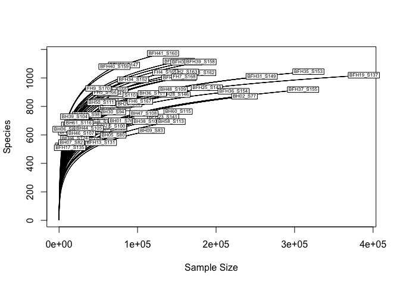<!-- -->

``` r
PHY_rarefied = rarefy_even_depth(PHY, rngseed=1)
```

    ## `set.seed(1)` was used to initialize repeatable random subsampling.

    ## Please record this for your records so others can reproduce.

    ## Try `set.seed(1); .Random.seed` for the full vector

    ## ...

    ## 489OTUs were removed because they are no longer 
    ## present in any sample after random subsampling

    ## ...

``` r
# 489OTUs were removed because they are no longer 
# present in any sample after random subsampling

tab <- microbiome::alpha(PHY_rarefied, index = "all")
```

    ## Observed richness

    ## Other forms of richness

    ## Diversity

    ## Evenness

    ## Dominance

    ## Rarity

``` r
#kable(head(tab))

PHY.meta <- meta(PHY_rarefied)
#kable(head(PHY.meta))

PHY.meta$Shannon <- tab$diversity_shannon 

# make a pairwise list that we want to compare.
vars <- levels(PHY.meta$country)
vars.pairs <- combn(seq_along(vars), 2, simplify = FALSE, FUN = function(i)vars[i])
print(vars.pairs)
```

    ## [[1]]
    ## [1] "Benin"        "Burkina Faso"
    ## 
    ## [[2]]
    ## [1] "Benin"   "Finland"
    ## 
    ## [[3]]
    ## [1] "Burkina Faso" "Finland"

``` r
cols <- get_palette(c("#B2182B", "#44AA99", "#2166AC"), 3)

#"#81A88D", "#B2182B", "#85D4E3", "#F4A582", "#4393C3", "#2166AC", "#D6604D"
shannon <- ggboxplot(PHY.meta, x = "country", y = "Shannon", fill = "country", add = "jitter") + 
  scale_fill_manual(values = cols) +
  theme(axis.text.x = element_text(angle = 0, vjust = 0.75, size = 36, hjust = 0.75, family = "Times", face = "bold"), 
        axis.title.x = element_blank(),
        axis.text.y = element_text(size = 36, family = "Times"),
        legend.position = "none",
        legend.title = element_blank(),
        axis.title.y = element_text(size = 36, family = "Times"),
        plot.title = element_text(size = 40, family = "Times", face = "bold")) +
  labs(title = "Alpha diversity, Shannon index (MGE)")

a <- shannon + stat_compare_means(comparisons = vars.pairs, 
                             label = "p", 
                             hide.ns = F, ref.group = ".all.",
                             size = 10, fontfamily = "Times")
a
```

<!-- -->

``` r
#ggsave(filename = "mge_diversities_new.png",
#       width = 16, height = 13, dpi = 300, units = "in", device='png', scale = 1)
```

## Ordination, ARGs (ResFinder)

``` r
resfinder_PHY_ord <- ordinate(resfinder_PHY_stat, method = "PCoA", distance = "horn")
p_ord <- plot_ordination(resfinder_PHY_stat, resfinder_PHY_ord, color = "country")
resfinder.p_ord <- p_ord + 
  scale_color_manual(values = c("#B2182B", "#44AA99", "#2166AC")) +
  geom_point(size = 5.5) + 
  stat_ellipse(level = 0.90, linetype = 1) +
    geom_text_repel(mapping = aes(label = hospital), size = 6, family = "Times", hjust = 1.2) +
    theme_minimal() + labs(title= "Resistome (ResFinder)", subtitle = "Hospital WWs in Benin, Burkina Faso and Finland") + 
    theme(plot.title = element_text(size = 36, family = "Times", face = "bold"),
          plot.subtitle = element_text(size = 20, family = "Times"),
          legend.text = element_text(size = 36, family = "Times"),
          legend.title = element_blank(),
          axis.title = element_text(size = 36, family = "Times"),
          axis.text = element_text(size = 18, family = "Times")) +
    guides(fill = guide_legend(override.aes = list(linetype = 0)),
         color = guide_legend(override.aes = list(linetype = 0, size=5)))
resfinder.p_ord
```

    ## Warning: ggrepel: 21 unlabeled data points (too many overlaps). Consider
    ## increasing max.overlaps

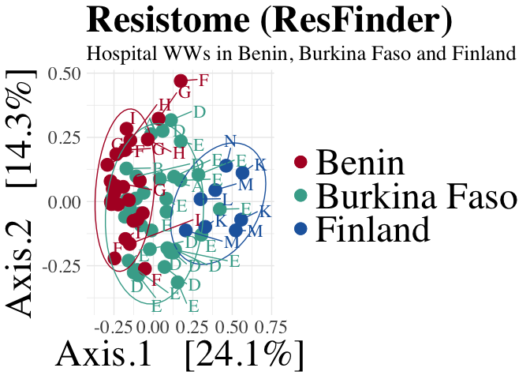<!-- -->

``` r
# Save
#ggsave(filename = "ord_resfinder_new.png",
#       width = 16, height = 13, dpi = 300, units = "in", device='png', scale = 1)

# Test significance using pair-wise adonis
#resfinder_temp <- subset_samples(resfinder_PHY_stat_equal, (country == "Benin" | country == "Finland"))
#resfinder_dist <- vegdist(t(otu_table(resfinder_temp)), dist = "horn")
#adonis(resfinder_dist ~ country, data = data.frame(sample_data(resfinder_temp), permutations = 9999))

#resfinder_temp <- subset_samples(resfinder_PHY_stat_equal, (country == "Benin" | country == "Burkina Faso"))
#resfinder_dist <- vegdist(t(otu_table(resfinder_temp)), dist = "horn")
#adonis(resfinder_dist ~ country, data = data.frame(sample_data(resfinder_temp), permutations = 9999))

#resfinder_temp <- subset_samples(resfinder_PHY_stat_equal, (country == "Burkina Faso" | country == "Finland"))
#resfinder_dist <- vegdist(t(otu_table(resfinder_temp)), dist = "horn")
#adonis(resfinder_dist ~ country, data = data.frame(sample_data(resfinder_temp), permutations = 9999))
```

## Ordination, taxa (Metaphlan3)

``` r
PHY = transform_sample_counts(metaphlan_PHY_stat, function(x) 1E6 * x/sum(x))

metaphlan_PHY_ord <- ordinate(PHY, method = "PCoA", distance = "horn")
p_ord <- plot_ordination(PHY, metaphlan_PHY_ord, color = "country")
metaphlan.p_ord <- p_ord + 
  scale_color_manual(values = c("#B2182B", "#44AA99", "#2166AC")) +
  geom_point(size = 5.5) + 
  stat_ellipse(level = 0.90, linetype = 1) +
    geom_text_repel(mapping = aes(label = hospital), size = 6, family = "Times", hjust = 1.2) +
    theme_minimal() + labs(title= "Taxonomy (Metaphlan3)", subtitle = "Hospital WWs in Benin, Burkina Faso and Finland") + 
    theme(plot.title = element_text(size = 36, family = "Times", face = "bold"),
          plot.subtitle = element_text(size = 20, family = "Times"),
          legend.text = element_text(size = 50, family = "Times"),
          legend.title = element_blank(),
          axis.title = element_text(size = 36, family = "Times"),
          axis.text = element_text(size = 18, family = "Times")) +
    guides(fill = guide_legend(override.aes = list(linetype = 0)),
         color = guide_legend(override.aes = list(linetype = 0, size=5)))
metaphlan.p_ord
```

    ## Warning: ggrepel: 38 unlabeled data points (too many overlaps). Consider
    ## increasing max.overlaps

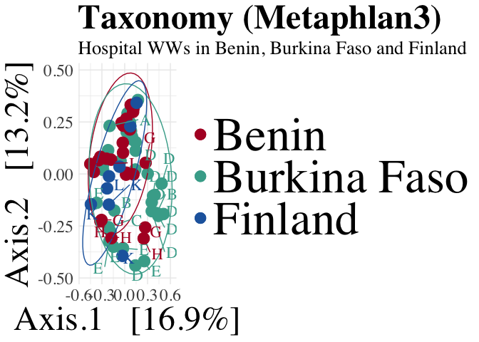<!-- -->

``` r
# Save
#ggsave(filename = "ord_metaphlan_new.png",
#       width = 16, height = 13, dpi = 300, units = "in", device='png', scale = 1)

# Test significance using pair-wise adonis
#metaphlan_temp <- subset_samples(metaphlan_PHY_stat_equal, (country == "Benin" | country == "Finland"))
#metaphlan_dist <- vegdist(t(otu_table(metaphlan_temp)), dist = "horn")
#adonis(metaphlan_dist ~ country, data = data.frame(sample_data(metaphlan_temp), permutations = 9999))

#metaphlan_temp <- subset_samples(metaphlan_PHY_stat_equal, (country == "Benin" | country == "Burkina Faso"))
#metaphlan_dist <- vegdist(t(otu_table(metaphlan_temp)), dist = "horn")
#adonis(metaphlan_dist ~ country, data = data.frame(sample_data(metaphlan_temp), permutations = 9999))

#metaphlan_temp <- subset_samples(metaphlan_PHY_stat_equal, (country == "Burkina Faso" | country == "Finland"))
#metaphlan_dist <- vegdist(t(otu_table(metaphlan_temp)), dist = "horn")
#adonis(metaphlan_dist ~ country, data = data.frame(sample_data(metaphlan_temp), permutations = 9999))
```

## Ordination, MGEs (Mobilome)

``` r
MGE_PHY_ord <- ordinate(MGE_PHY_stat, method = "PCoA", distance = "horn")
p_ord <- plot_ordination(MGE_PHY_stat, MGE_PHY_ord, color = "country")
MGE.p_ord <- p_ord + 
  scale_color_manual(values = c("#B2182B", "#44AA99", "#2166AC")) +
  geom_point(size = 5.5) + 
  stat_ellipse(level = 0.90, linetype = 1) +
  geom_text_repel(mapping = aes(label = hospital), size = 6, family = "Times", hjust = 1.2) +
   theme_minimal() + labs(title= "Mobilome (MGE database)", subtitle = "Hospital WWs in Benin, Burkina Faso and Finland") + 
    theme(plot.title = element_text(size = 36, family = "Times", face = "bold"),
          plot.subtitle = element_text(size = 20, family = "Times"),
          legend.text = element_text(size = 50, family = "Times"),
          legend.title = element_blank(),
          axis.title = element_text(size = 36, family = "Times"),
          axis.text = element_text(size = 18, family = "Times")) +
    guides(fill = guide_legend(override.aes = list(linetype = 0)),
         color = guide_legend(override.aes = list(linetype = 0, size=5)))
MGE.p_ord
```

    ## Warning: ggrepel: 43 unlabeled data points (too many overlaps). Consider
    ## increasing max.overlaps

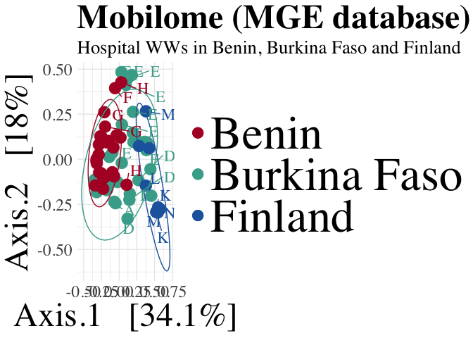<!-- -->

``` r
# Save
#ggsave(filename = "ord_mge_new.png",
#       width = 16, height = 13, dpi = 300, units = "in", device='png', scale = 1)

# Test significance using pair-wise adonis
#MGE_temp <- subset_samples(MGE_PHY_stat_equal, (country == "Benin" | country == "Finland"))
#MGE_dist <- vegdist(t(otu_table(MGE_temp)), dist = "horn")
#adonis(MGE_dist ~ country, data = data.frame(sample_data(MGE_temp), permutations = 9999))

#MGE_temp <- subset_samples(MGE_PHY_stat_equal, (country == "Benin" | country == "Burkina Faso"))
#MGE_dist <- vegdist(t(otu_table(MGE_temp)), dist = "horn")
#adonis(MGE_dist ~ country, data = data.frame(sample_data(MGE_temp), permutations = 9999))

#MGE_temp <- subset_samples(MGE_PHY_stat_equal, (country == "Burkina Faso" | country == "Finland"))
#MGE_dist <- vegdist(t(otu_table(MGE_temp)), dist = "horn")
#adonis(MGE_dist ~ country, data = data.frame(sample_data(MGE_temp), permutations = 9999))
```

## Ordination, intI1 (Mobilome)

``` r
intI1_PHY_ord <- ordinate(MGE_PHY_int_stat, method = "PCoA", distance = "horn")
p_ord <- plot_ordination(MGE_PHY_int_stat, intI1_PHY_ord, color = "country")
intI1.p_ord <- p_ord + 
  scale_color_manual(values = c("#B2182B", "#44AA99", "#2166AC")) +
  geom_point(size = 5.5) + 
  stat_ellipse(level = 0.90, linetype = 1) +
    geom_text_repel(mapping = aes(label = hospital), size = 3, family = "Times", hjust = 1.2) +
    theme_minimal() + labs(title= "Mobilome, IntI1 (MGE Database)", subtitle = "Hospital WWs in Benin, Burkina Faso and Finland") + 
    theme(plot.title = element_text(size = 36, family = "Times", face = "bold"),
          plot.subtitle = element_text(size = 28, family = "Times"),
          legend.text = element_text(size = 28, family = "Times"),
          legend.title = element_blank(),
          axis.title = element_text(size = 28, family = "Times")) +
    guides(fill = guide_legend(override.aes = list(linetype = 0)),
         color = guide_legend(override.aes = list(linetype = 0, size=5)))
intI1.p_ord
```

    ## Warning: ggrepel: 42 unlabeled data points (too many overlaps). Consider
    ## increasing max.overlaps

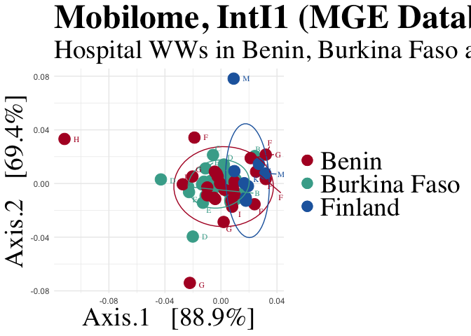<!-- -->

``` r
# Save
#ggsave(filename = "ord_intI1_new.png",
#       width = 16, height = 13, dpi = 300, units = "in", device='png', scale = 1)

# Test significance using pair-wise adonis
#MGE_temp <- subset_samples(MGE_PHY_int_stat_equal, (country == "Benin" | country == "Finland"))
#MGE_dist <- vegdist(t(otu_table(MGE_temp)), dist = "horn")
#adonis(MGE_dist ~ country, data = data.frame(sample_data(MGE_temp), permutations = 9999))

#MGE_temp <- subset_samples(MGE_PHY_int_stat_equal, (country == "Benin" | country == "Burkina Faso"))
#MGE_dist <- vegdist(t(otu_table(MGE_temp)), dist = "horn")
#adonis(MGE_dist ~ country, data = data.frame(sample_data(MGE_temp), permutations = 9999))

#MGE_temp <- subset_samples(MGE_PHY_int_stat_equal, (country == "Burkina Faso" | country == "Finland"))
#MGE_dist <- vegdist(t(otu_table(MGE_temp)), dist = "horn")
#adonis(MGE_dist ~ country, data = data.frame(sample_data(MGE_temp), permutations = 9999))
```

## Ordination, VFDBs (Virulence genes)

``` r
VFDB_PHY_ord <- ordinate(VFDB_PHY_stat, method = "PCoA", distance = "horn")
p_ord <- plot_ordination(VFDB_PHY_stat, VFDB_PHY_ord, color = "country")
VFDB.p_ord <- p_ord + 
  scale_color_manual(values = c("#B2182B", "#44AA99", "#2166AC")) +
  geom_point(size = 5.5) + 
  stat_ellipse(level = 0.90, linetype = 1) +
 #   geom_text_repel(mapping = aes(label = hospital), size = 3, family = "Times", hjust = 1.2) +
    theme_minimal() + labs(title= "Virulence Genes (VFDB)", subtitle = "Hospital WWs in Benin (25), BF (34) and Finland (8)") + 
    theme(plot.title = element_text(size = 36, family = "Times", face = "bold"),
          plot.subtitle = element_text(size = 28, family = "Times"),
          legend.text = element_text(size = 28, family = "Times"),
          legend.title = element_blank(),
          axis.title = element_text(size = 28, family = "Times")) +
    guides(fill = guide_legend(override.aes = list(linetype = 0)),
         color = guide_legend(override.aes = list(linetype = 0, size=5)))
VFDB.p_ord
```

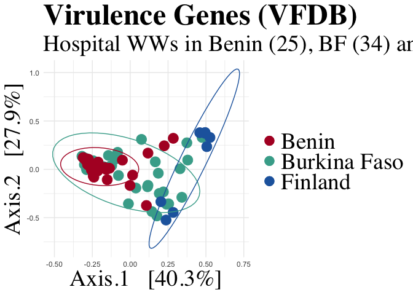<!-- -->

``` r
# Save
#ggsave(filename = "ord_vfdb_new.png",
#       width = 16, height = 13, dpi = 300, units = "in", device='png', scale = 1)

# Test significance using pair-wise adonis
#VFDB_temp <- subset_samples(VFDB_PHY_stat_equal, (country == "Benin" | country == "Finland"))
#VFDB_dist <- vegdist(t(otu_table(VFDB_temp)), dist = "horn")
#adonis(VFDB_dist ~ country, data = data.frame(sample_data(VFDB_temp), permutations = 9999))

#VFDB_temp <- subset_samples(VFDB_PHY_stat_equal, (country == "Benin" | country == "Burkina Faso"))
#VFDB_dist <- vegdist(t(otu_table(VFDB_temp)), dist = "horn")
#adonis(VFDB_dist ~ country, data = data.frame(sample_data(VFDB_temp), permutations = 9999))

#VFDB_temp <- subset_samples(VFDB_PHY_stat_equal, (country == "Burkina Faso" | country == "Finland"))
#VFDB_dist <- vegdist(t(otu_table(VFDB_temp)), dist = "horn")
#adonis(VFDB_dist ~ country, data = data.frame(sample_data(VFDB_temp), permutations = 9999))
```

## Compare hospitals within each country

# Ordination, ARGs (ResFinder)

``` r
resfinder_PHY_WA_WW_stat_Ben <- subset_samples(resfinder_PHY_WA_WW_stat, country == "Benin")

cols <- get_palette(c("#332288", "#44AA99", "#88CCEE", "#B94ED9", "#F22D3D"), 5)

resfinder_PHY_ord <- ordinate(resfinder_PHY_WA_WW_stat_Ben, method = "PCoA", distance = "horn")
p_ord <- plot_ordination(resfinder_PHY_WA_WW_stat_Ben, resfinder_PHY_ord, color = "hospital")
resfinder.p_ord <- p_ord + 
  scale_color_manual(values=cols) + 
  geom_point(size = 7) + 
  stat_ellipse(level = 0.90, linetype = 1) +
    theme_minimal() + labs(title= "Resistome (ResFinder)", subtitle = "Hospital WWs in Benin") + 
    theme(plot.title = element_text(size = 36, family = "Times", face = "bold"),
          plot.subtitle = element_text(size = 28, family = "Times"),
          legend.text = element_text(size = 28, family = "Times"),
          legend.title = element_blank(),
          axis.title = element_text(size = 28, family = "Times")) +
    guides(fill = guide_legend(override.aes = list(linetype = 0)),
         color = guide_legend(override.aes = list(linetype = 0, size=5)))
resfinder.p_ord
```

    ## Too few points to calculate an ellipse

    ## Warning: Removed 1 row(s) containing missing values (geom_path).

<!-- -->

``` r
# Save
#ggsave(filename = "ord_res_Ben_new.png",
#       width = 16, height = 13, dpi = 300, units = "in", device='png', scale = 1)

resfinder_PHY_WA_WW_stat_BF <- subset_samples(resfinder_PHY_WA_WW_stat, country == "Burkina Faso")

resfinder_PHY_ord <- ordinate(resfinder_PHY_WA_WW_stat_BF, method = "PCoA", distance = "horn")
p_ord <- plot_ordination(resfinder_PHY_WA_WW_stat_BF, resfinder_PHY_ord, color = "hospital")
resfinder.p_ord <- p_ord + 
  scale_color_manual(values=cols) + 
  scale_shape_manual(values=c(18, 16)) +
  geom_point(size = 7) + 
  stat_ellipse(level = 0.90, linetype = 1) +
    theme_minimal() + labs(title= "Resistome (ResFinder)", subtitle = "Hospital WWs in Burkina Faso") + 
    theme(plot.title = element_text(size = 36, family = "Times", face = "bold"),
          plot.subtitle = element_text(size = 28, family = "Times"),
          legend.text = element_text(size = 28, family = "Times"),
          legend.title = element_blank(),
          axis.title = element_text(size = 28, family = "Times")) +
    guides(fill = guide_legend(override.aes = list(linetype = 0)),
         color = guide_legend(override.aes = list(linetype = 0, size=5)))
resfinder.p_ord
```

    ## Too few points to calculate an ellipse
    ## Too few points to calculate an ellipse

    ## Warning: Removed 2 row(s) containing missing values (geom_path).

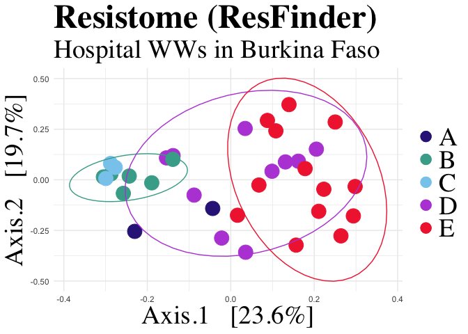<!-- -->

``` r
# Save
#ggsave(filename = "ord_res_BF_new.png",
#       width = 16, height = 13, dpi = 300, units = "in", device='png', scale = 1)

resfinder_PHY_stat_Fin <- subset_samples(resfinder_PHY_stat, category == "North Eu hospital effluent")

resfinder_PHY_ord <- ordinate(resfinder_PHY_stat_Fin, method = "PCoA", distance = "horn")
p_ord <- plot_ordination(resfinder_PHY_stat_Fin, resfinder_PHY_ord, color = "hospital")
resfinder.p_ord <- p_ord + 
  scale_color_manual(values=cols) + 
  scale_shape_manual(values=c(18, 16)) +
  geom_point(size = 7) + 
  stat_ellipse(level = 0.90, linetype = 1) +
    theme_minimal() + labs(title= "Resistome (ResFinder)", subtitle = "Hospital WWs in Finland") + 
    theme(plot.title = element_text(size = 36, family = "Times", face = "bold"),
          plot.subtitle = element_text(size = 28, family = "Times"),
          legend.text = element_text(size = 28, family = "Times"),
          legend.title = element_blank(),
          axis.title = element_text(size = 28, family = "Times")) +
    guides(fill = guide_legend(override.aes = list(linetype = 0)),
         color = guide_legend(override.aes = list(linetype = 0, size=5)))
resfinder.p_ord
```

    ## Too few points to calculate an ellipse
    ## Too few points to calculate an ellipse
    ## Too few points to calculate an ellipse
    ## Too few points to calculate an ellipse

    ## Warning: Removed 4 row(s) containing missing values (geom_path).

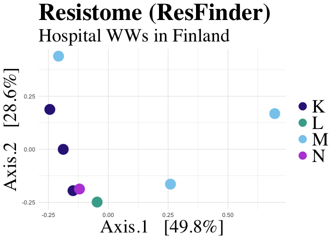<!-- -->

``` r
# Save
#ggsave(filename = "ord_res_Fin_new.png",
#       width = 16, height = 13, dpi = 300, units = "in", device='png', scale = 1)
```

## WA WW samples

## Ordination, taxa (Metaphlan3)

``` r
metaphlan_PHY_WA_WW_stat_Ben <- subset_samples(metaphlan_PHY_WA_WW_stat, country == "Benin")

metaphlan_PHY_ord <- ordinate(metaphlan_PHY_WA_WW_stat_Ben, method = "PCoA", distance = "horn")
p_ord <- plot_ordination(metaphlan_PHY_WA_WW_stat_Ben, metaphlan_PHY_ord, color = "hospital")
metaphlan.p_ord <- p_ord + 
  scale_color_manual(values=cols) + 
  geom_point(size = 7) + 
  stat_ellipse(level = 0.90, linetype = 1) +
    theme_minimal() + labs(title= "Taxonomy (Metaphlan3)", subtitle = "Hospital WWs in Benin") + 
    theme(plot.title = element_text(size = 36, family = "Times", face = "bold"),
          plot.subtitle = element_text(size = 28, family = "Times"),
          legend.text = element_text(size = 28, family = "Times"),
          legend.title = element_blank(),
          axis.title = element_text(size = 28, family = "Times")) +
    guides(fill = guide_legend(override.aes = list(linetype = 0)),
         color = guide_legend(override.aes = list(linetype = 0, size=5)))
metaphlan.p_ord
```

    ## Too few points to calculate an ellipse

    ## Warning: Removed 1 row(s) containing missing values (geom_path).

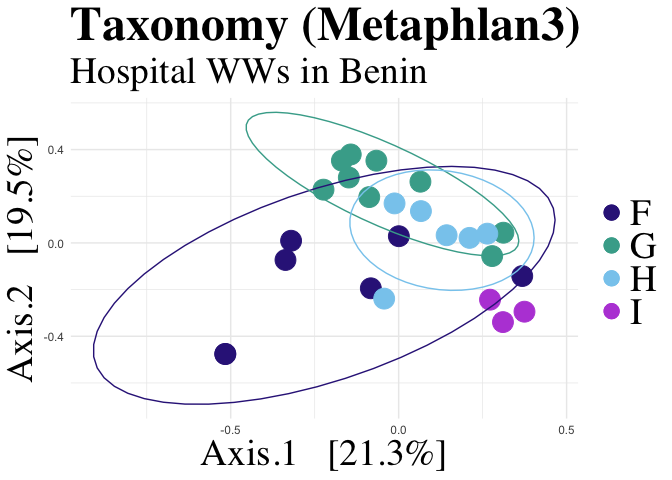<!-- -->

``` r
#ggsave(filename = "ord_Ben_new.png",
#       width = 16, height = 13, dpi = 300, units = "in", device='png', scale = 1)

metaphlan_PHY_WA_WW_stat_BF <- subset_samples(metaphlan_PHY_WA_WW_stat, country == "Burkina Faso")

metaphlan_PHY_ord <- ordinate(metaphlan_PHY_WA_WW_stat_BF, method = "PCoA", distance = "horn")
p_ord <- plot_ordination(metaphlan_PHY_WA_WW_stat_BF, metaphlan_PHY_ord, color = "hospital")
metaphlan.p_ord <- p_ord + 
  scale_color_manual(values=cols) + 
  geom_point(size = 7) + 
  stat_ellipse(level = 0.90, linetype = 1) +
    theme_minimal() + labs(title= "Taxonomy (Metaphlan3)", subtitle = "Hospital WWs in BF") + 
    theme(plot.title = element_text(size = 36, family = "Times", face = "bold"),
          plot.subtitle = element_text(size = 28, family = "Times"),
          legend.text = element_text(size = 28, family = "Times"),
          legend.title = element_blank(),
          axis.title = element_text(size = 28, family = "Times")) +
    guides(fill = guide_legend(override.aes = list(linetype = 0)),
         color = guide_legend(override.aes = list(linetype = 0, size=5)))
metaphlan.p_ord
```

    ## Too few points to calculate an ellipse
    ## Too few points to calculate an ellipse

    ## Warning: Removed 2 row(s) containing missing values (geom_path).

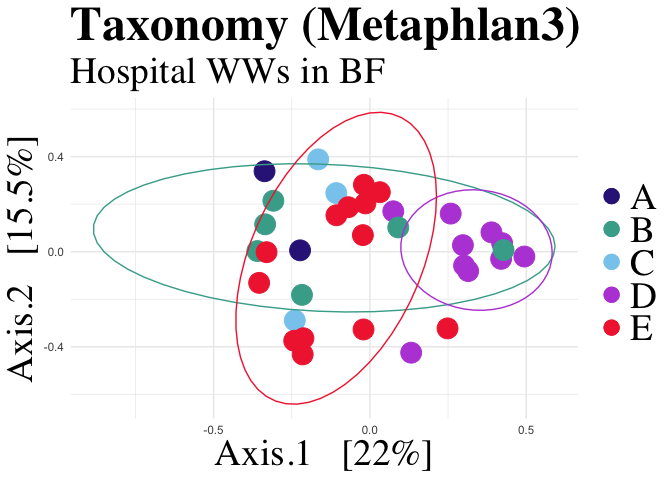<!-- -->

``` r
#ggsave(filename = "ord_BF_new.png",
#       width = 16, height = 13, dpi = 300, units = "in", device='png', scale = 1)

metaphlan_PHY_WA_WW_stat_Fin <- subset_samples(metaphlan_PHY, category == "North Eu hospital effluent")

metaphlan_PHY_ord <- ordinate(metaphlan_PHY_WA_WW_stat_Fin, method = "PCoA", distance = "horn")
p_ord <- plot_ordination(metaphlan_PHY_WA_WW_stat_Fin, metaphlan_PHY_ord, color = "hospital")
metaphlan.p_ord <- p_ord + 
  scale_color_manual(values=cols) + 
  geom_point(size = 7) + 
  stat_ellipse(level = 0.90, linetype = 1) +
    theme_minimal() + labs(title= "Taxonomy (Metaphlan3)", subtitle = "Hospital WWs in Finland") + 
    theme(plot.title = element_text(size = 36, family = "Times", face = "bold"),
          plot.subtitle = element_text(size = 28, family = "Times"),
          legend.text = element_text(size = 28, family = "Times"),
          legend.title = element_blank(),
          axis.title = element_text(size = 28, family = "Times")) +
    guides(fill = guide_legend(override.aes = list(linetype = 0)),
         color = guide_legend(override.aes = list(linetype = 0, size=5)))
metaphlan.p_ord
```

    ## Too few points to calculate an ellipse
    ## Too few points to calculate an ellipse
    ## Too few points to calculate an ellipse
    ## Too few points to calculate an ellipse

    ## Warning: Removed 4 row(s) containing missing values (geom_path).

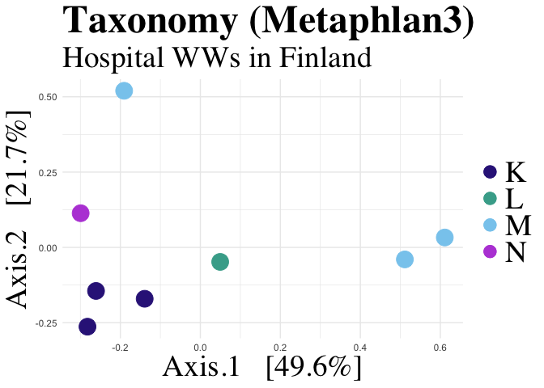<!-- -->

``` r
#ggsave(filename = "ord_Fin_new.png",
#       width = 16, height = 13, dpi = 300, units = "in", device='png', scale = 1)
```

## WA WW samples

## Ordination, mobilome (MGE database)

``` r
MGE_PHY_WA_WW_stat_Ben <- subset_samples(MGE_PHY_WA_WW_stat, country == "Benin")

MGE_PHY_ord <- ordinate(MGE_PHY_WA_WW_stat_Ben, method = "PCoA", distance = "horn")
p_ord <- plot_ordination(MGE_PHY_WA_WW_stat_Ben, MGE_PHY_ord, color = "hospital")
MGE.p_ord <- p_ord + 
  scale_color_manual(values=cols) + 
  geom_point(size = 7) + 
   geom_text(mapping = aes(label = hospital), size = 3, hjust = 1.5, vjust = -0.95) +
  stat_ellipse(level = 0.90, linetype = 1) +
    theme_minimal() + labs(title= "Mobilome (MGE database)", subtitle = "Hospital WWs in Benin") + 
    theme(plot.title = element_text(size = 36, family = "Times", face = "bold"),
          plot.subtitle = element_text(size = 28, family = "Times"),
          legend.text = element_text(size = 28, family = "Times"),
          legend.title = element_blank(),
          axis.title = element_text(size = 28, family = "Times")) +
    guides(fill = guide_legend(override.aes = list(linetype = 0)),
         color = guide_legend(override.aes = list(linetype = 0, size=5)))
MGE.p_ord
```

    ## Too few points to calculate an ellipse

    ## Warning: Removed 1 row(s) containing missing values (geom_path).

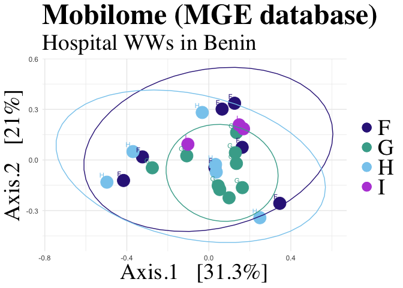<!-- -->

``` r
#ggsave(filename = "ord_mge_Ben_new.png",
#       width = 16, height = 13, dpi = 300, units = "in", device='png', scale = 1)

MGE_PHY_WA_WW_stat_BF <- subset_samples(MGE_PHY_WA_WW_stat, country == "Burkina Faso")

MGE_PHY_ord <- ordinate(MGE_PHY_WA_WW_stat_BF, method = "PCoA", distance = "horn")
p_ord <- plot_ordination(MGE_PHY_WA_WW_stat_BF, MGE_PHY_ord, color = "hospital")
MGE.p_ord <- p_ord + 
  scale_color_manual(values=cols) + 
  geom_point(size = 7) + 
   geom_text(mapping = aes(label = hospital), size = 3, hjust = 1.5, vjust = -0.95) +
  stat_ellipse(level = 0.90, linetype = 1) +
    theme_minimal() + labs(title= "Mobilome (MGE database)", subtitle = "Hospital WWs in BF") + 
    theme(plot.title = element_text(size = 36, family = "Times", face = "bold"),
          plot.subtitle = element_text(size = 28, family = "Times"),
          legend.text = element_text(size = 28, family = "Times"),
          legend.title = element_blank(),
          axis.title = element_text(size = 28, family = "Times")) +
    guides(fill = guide_legend(override.aes = list(linetype = 0)),
         color = guide_legend(override.aes = list(linetype = 0, size=5)))
MGE.p_ord
```

    ## Too few points to calculate an ellipse
    ## Too few points to calculate an ellipse

    ## Warning: Removed 2 row(s) containing missing values (geom_path).

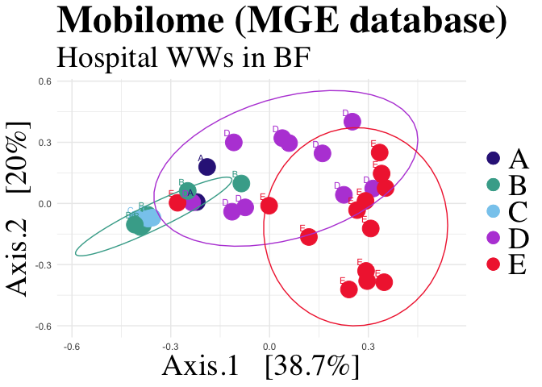<!-- -->

``` r
#ggsave(filename = "ord_mge_BF_new.png",
#       width = 16, height = 13, dpi = 300, units = "in", device='png', scale = 1)

MGE_PHY_WA_WW_stat_Fin <- subset_samples(MGE_PHY, category == "North Eu hospital effluent")

MGE_PHY_ord <- ordinate(MGE_PHY_WA_WW_stat_Fin, method = "PCoA", distance = "horn")
p_ord <- plot_ordination(MGE_PHY_WA_WW_stat_Fin, MGE_PHY_ord, color = "hospital")
MGE.p_ord <- p_ord + 
  scale_color_manual(values=cols) + 
  geom_point(size = 7) + 
   geom_text(mapping = aes(label = hospital), size = 3, hjust = 1.5, vjust = -0.95) +
  stat_ellipse(level = 0.90, linetype = 1) +
    theme_minimal() + labs(title= "Mobilome (MGE database)", subtitle = "Hospital WWs in Finland") + 
    theme(plot.title = element_text(size = 36, family = "Times", face = "bold"),
          plot.subtitle = element_text(size = 28, family = "Times"),
          legend.text = element_text(size = 28, family = "Times"),
          legend.title = element_blank(),
          axis.title = element_text(size = 28, family = "Times")) +
    guides(fill = guide_legend(override.aes = list(linetype = 0)),
         color = guide_legend(override.aes = list(linetype = 0, size=5)))
MGE.p_ord
```

    ## Too few points to calculate an ellipse
    ## Too few points to calculate an ellipse
    ## Too few points to calculate an ellipse
    ## Too few points to calculate an ellipse

    ## Warning: Removed 4 row(s) containing missing values (geom_path).

<!-- -->

``` r
#ggsave(filename = "ord_mge_Fin_new.png",
#       width = 16, height = 13, dpi = 300, units = "in", device='png', scale = 1)
```

## CrAssphage

``` r
# Plot orrelation of crAssphage & ARGs
ARG_relative_sum <- data.frame(sample_sums(resfinder_PHY_stat))
crAssphage_relative_sum <- data.frame(sample_sums(crass_PHY_stat))
all(rownames(ARG_relative_sum) == rownames(crAssphage_relative_sum))
```

    ## [1] TRUE

``` r
# Join data
crass_res <- cbind(ARG_relative_sum, crAssphage_relative_sum)
colnames(crass_res) <- c("ARGs", "crAssphage")

# Plot
cor <- ggplot(crass_res, aes(x=ARGs, y=crAssphage)) +
  geom_point(size=7, shape=19, color = "#3110D2") +
  geom_smooth(method="lm", se=TRUE, fullrange=FALSE, level=0.95, color = "#FB2A38", fill = "#8A91F8") +
    theme_bw() +
  theme(axis.title = element_text(size = 30, family = "Times"),
        axis.text = element_text(size = 28, family = "Times"),
        plot.title = element_text(size = 30, family = "Times")) +
 xlab("ARGs") + ylab("crAssphage") +
  ggtitle("Correlation of relative sums of ARGs and crAssphage")
cor2 <- cor + stat_cor(method = "pearson", label.x = 0.1, label.y = 0)
cor2
```

    ## `geom_smooth()` using formula 'y ~ x'

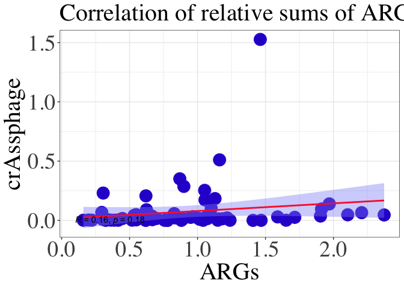<!-- -->
\#\# Correlation between SSU & rpoB counts

``` r
## Use either *_PHY / *_PHY_stat_equal / *_PHY_WA_WW_stat
SSU_counts <- data.frame(sample_data(resfinder_PHY_stat)$SSU_counts)
R1_rpoB_counts <- data.frame(sample_data(resfinder_PHY_stat)$R1_rpoB_counts)
bacterial_counts <- cbind(SSU_counts, R1_rpoB_counts)
colnames(bacterial_counts) <- c("SSU_counts", "R1_rpoB_counts")

p <- ggplot(bacterial_counts, aes(x=SSU_counts, y=R1_rpoB_counts)) +
  geom_point(size=7, shape=19, color = "#3110D2") +
  geom_smooth(method="lm", se=TRUE, fullrange=FALSE, level=0.95, color = "#FB2A38", fill = "#8A91F8") +
    theme_bw() +
  theme(axis.title = element_text(size = 30, family = "Times"),
        axis.text = element_text(size = 32, family = "Times"),
        plot.title = element_text(size = 36, family = "Times"),
        plot.subtitle = element_text(size = 28, family = "Times")) +
 xlab("16s rRNA counts") + ylab("R1 rpoB counts") +
  labs(title= "Correlation of 16s rRNA and rpoB counts", subtitle = "Hospital WWs in Benin (25), BF (34) and Finland (8)")
cor <- p + stat_cor(method = "pearson", label.x = 100000, label.y = 1000, )
cor
```

    ## `geom_smooth()` using formula 'y ~ x'

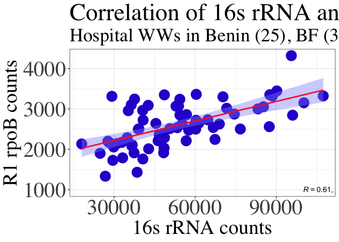<!-- -->

``` r
correl<-corr.test(SSU_counts, R1_rpoB_counts, use="pairwise", method="pearson",
                            adjust="fdr",alpha=.05,ci=TRUE)
r <- data.frame(correl$r)
p <- data.frame(correl$p)
p.ad <- data.frame(correl$p.adj)

#ggsave(filename = "SSU_rpoB_cor_new.png",
#       width = 16, height = 13, dpi = 300, units = "in", device='png', scale = 1)
```

## Correlation of Intl1 & all ARGs

``` r
ARG_relative_sum <- data.frame(sample_sums(resfinder_PHY_stat))
MGE_relative_sum <- data.frame(sample_sums(MGE_PHY_stat))
all(rownames(ARG_relative_sum) == rownames(MGE_relative_sum))
```

    ## [1] TRUE

``` r
# Join data
mge_res <- cbind(ARG_relative_sum, MGE_relative_sum)
colnames(mge_res) <- c("ARGs", "MGEs")

# Plot
cor <- ggplot(mge_res, aes(x=ARGs, y=MGEs)) +
  geom_point(size=7, shape=19, color = "#3110D2") +
  geom_smooth(method="lm", se=TRUE, fullrange=FALSE, level=0.95, color = "#FB2A38", fill = "#8A91F8") +
    theme_bw() +
  theme(axis.title = element_text(size = 30, family = "Times"),
        axis.text = element_text(size = 28, family = "Times"),
        plot.title = element_text(size = 36, family = "Times"),
        plot.subtitle = element_text(size = 28, family = "Times")) +
 xlab("ARG") + ylab("MGEs") +
  labs(title= "Correlation of relative sums of ARGs and MGEs", subtitle = "Hospital WWs in Benin (25), BF (34) and Finland (8)")
cor2 <- cor + stat_cor(method = "pearson", label.x = 2, label.y = 1.5)
cor2
```

    ## `geom_smooth()` using formula 'y ~ x'

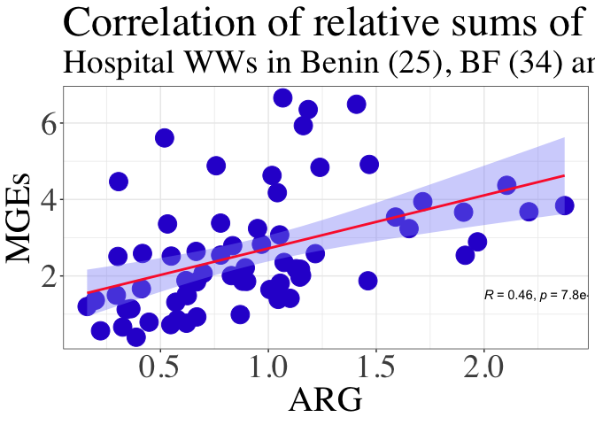<!-- -->

``` r
#ggsave(filename = "ARG_MGE_cor_new.png",
#       width = 16, height = 13, dpi = 300, units = "in", device='png', scale = 1)

## Intl1
ARG_relative_sum <- data.frame(sample_sums(resfinder_PHY_stat))
intI1_relative_sum <- data.frame(sample_sums(MGE_PHY_int_stat))
all(rownames(ARG_relative_sum) == rownames(intI1_relative_sum))
```

    ## [1] TRUE

``` r
# Join data
intl_res <- cbind(ARG_relative_sum, intI1_relative_sum)
colnames(intl_res) <- c("ARGs", "intI1")

# Plot
cor <- ggplot(intl_res, aes(x=ARGs, y=intI1)) +
  geom_point(size=7, shape=19, color = "#3110D2") +
  geom_smooth(method="lm", se=TRUE, fullrange=FALSE, level=0.95, color = "#FB2A38", fill = "#8A91F8") +
    theme_bw() +
  theme(axis.title = element_text(size = 30, family = "Times"),
        axis.text = element_text(size = 28, family = "Times"),
        plot.title = element_text(size = 36, family = "Times"),
        plot.subtitle = element_text(size = 28, family = "Times")) +
 xlab("ARG") + ylab("intI1") +
  labs(title= "Correlation of relative sums of ARGs and Int1", subtitle = "Hospital WWs in Benin, Burkina Faso and Finland")
cor2 <- cor + stat_cor(method = "pearson", label.x = 1, label.y = 1.5)
cor2
```

    ## `geom_smooth()` using formula 'y ~ x'

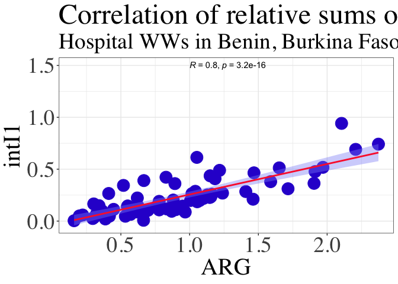<!-- -->

``` r
correl<-corr.test(ARG_relative_sum, intI1_relative_sum, use="pairwise", method="pearson",
                            adjust="fdr",alpha=.05,ci=TRUE)

r <- data.frame(correl$r)
p <- data.frame(correl$p)
p.ad <- data.frame(correl$p.adj)

# Correlation coefficients for each country:
# Benin = 0.79, p = 2.5 x 10-6; BF=R2=0.54, p = 0.00086; Finland = 0.83, p = 0.01 

#ggsave(filename = "ARG_intl1_cor_new.png",
#       width = 16, height = 13, dpi = 300, units = "in", device='png', scale = 1)
```

## DESeq2

# ResFinder

# Fin-Ben

``` r
OTU_resfinder <-as.matrix(read.table("ARG_genemat.txt", header= T, check.names = F, row.names = 1))

# Reorder to match metadata
match <- match(rownames(metadata), colnames(OTU_resfinder))
OTU_resfinder <- OTU_resfinder[,match]
all(colnames(OTU_resfinder) == rownames(metadata))
```

    ## [1] TRUE

``` r
# Tax_table (Cluster names created using cd-hit and 90 % identity and added manually to the tax table in excel)
clusters_tax_table_resfinder <- read.csv("~/Documents/Metagenomes_AMRIWA/R/AMRIWA/RFiles/clusters_tax_table.txt", header=FALSE, sep=";")
colnames(clusters_tax_table_resfinder) <- c("Gene",  "Cluster_name", "Class")
# Reorder columns
col_order <- c("Class", "Cluster_name", "Gene")
clusters_tax_table_resfinder <- clusters_tax_table_resfinder[, col_order]

# Reorder tax_table to match OTU_resfinder
match <- match(rownames(OTU_resfinder), clusters_tax_table_resfinder$Gene)
clusters_tax_table_resfinder <- clusters_tax_table_resfinder[match,]
all(rownames(OTU_resfinder) == clusters_tax_table_resfinder$Gene)
```

    ## [1] TRUE

``` r
# Divide by ARG gene lengths
## Get the lengths in terminal
# seqkit fx2tab --length --name --header-line resfinder.fasta > resfinder_lengths.txt
resfinder_lengths <- read.delim("~/Documents/Metagenomes_AMRIWA/R/AMRIWA/RFiles/resfinder_lengths.txt", header=FALSE, comment.char="#")
all(rownames(clusters_tax_table_resfinder$Gene) == resfinder_lengths$V1)
```

    ## [1] TRUE

``` r
OTU_resfinder_length_norm <- OTU_resfinder/resfinder_lengths[, 2]

# Normalization with Metaxa2 SSU counts
deseq_OTU_resfinder <- t(t(OTU_resfinder_length_norm)/metadata$SSU_counts) * 1540
all(rownames(metadata) == colnames(deseq_OTU_resfinder))
```

    ## [1] TRUE

``` r
identical(OTU_resfinder_length_norm[2025, 5]/metadata$SSU_counts[5], deseq_OTU_resfinder[2025, 5])
```

    ## [1] TRUE

``` r
all(rownames(OTU_resfinder_length_norm) == clusters_tax_table_resfinder$Gene)
```

    ## [1] TRUE

``` r
# Deseq
deseq_OTU <- deseq_OTU_resfinder[, ] * 10^5 + 1

# Reload to get new row numbers
write.table(deseq_OTU, "~/Documents/Metagenomes_AMRIWA/R/AMRIWA/RFiles/deseq_OTU.txt", 
            row.names=T, sep = "\t", col.names = T)
deseq_OTU <- read.delim("~/Documents/Metagenomes_AMRIWA/R/AMRIWA/RFiles/deseq_OTU.txt", row.names=NULL)
deseq_OTU$row.names<-NULL

# Reload to get new row numbers
write.table(clusters_tax_table_resfinder, "~/Documents/Metagenomes_AMRIWA/R/AMRIWA/RFiles/clusters_tax_table_resfinder.txt", row.names=F, sep = "\t", col.names = T)
clusters_tax_table_resfinder <- read.delim("~/Documents/Metagenomes_AMRIWA/R/AMRIWA/RFiles/clusters_tax_table_resfinder.txt", row.names=NULL)

resfinder_deseq <- phyloseq(otu_table(deseq_OTU, taxa_are_rows = T), sample_data(metadata), 
    tax_table(as.matrix(clusters_tax_table_resfinder)))

# Create phyloseq object with all samples
# Exclude samples with low sequencing quality (BFH24_S142, BH63_S118, FH10_S171)
resfinder_deseq = subset_samples(resfinder_deseq, alias != "BFH24" & alias != "BH63" & alias != "FH10")
# Exclude samples from UK hospital whose sample collection does not match with other samples
resfinder_deseq <- subset_samples(resfinder_deseq, country != "UK")

## Exclude biological / technical replicates
resfinder_deseq <- subset_samples(resfinder_deseq, alias != "BH31" & alias != "BH33" & alias != "BH34B" & alias != "BH10"
                                     & alias != "BFH38B" & alias != "FH8" & alias != "BH45" & alias != "BH59" & alias != "BH62")

# Create phyloseq object with only hospital WW samples sequenced here
resfinder_deseq_stat <- subset_samples(resfinder_deseq, category == "WA hospital effluent" | category == "North Eu hospital effluent")

# Take pair wise comparisons
deseq_PHY = subset_samples(resfinder_deseq_stat, country == "Benin" | country == "Finland")

hist(log10(apply(otu_table(deseq_PHY), 1, var)), xlab = "log10(variance)")
```

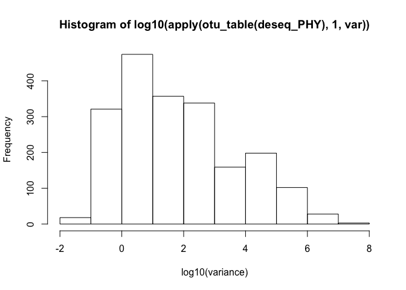<!-- -->

``` r
# Let's set a threashold for the variance
varianceThreshold = 50
keepOTUs = apply(otu_table(deseq_PHY), 1, var) > varianceThreshold
deseq_PHY = prune_taxa(keepOTUs, deseq_PHY)
deseq_PHY
```

    ## phyloseq-class experiment-level object
    ## otu_table()   OTU Table:         [ 936 taxa and 33 samples ]
    ## sample_data() Sample Data:       [ 33 samples by 24 sample variables ]
    ## tax_table()   Taxonomy Table:    [ 936 taxa by 3 taxonomic ranks ]

``` r
dds = phyloseq_to_deseq2(deseq_PHY, ~country)
```

    ## converting counts to integer mode

``` r
dds$category <- relevel(dds$country, "Benin", "Finland")

dds = DESeq(dds, fitType = "mean", test = "Wald", betaPrior = FALSE)
```

    ## estimating size factors

    ## estimating dispersions

    ## gene-wise dispersion estimates

    ## mean-dispersion relationship

    ## final dispersion estimates

    ## fitting model and testing

    ## -- replacing outliers and refitting for 256 genes
    ## -- DESeq argument 'minReplicatesForReplace' = 7 
    ## -- original counts are preserved in counts(dds)

    ## estimating dispersions

    ## fitting model and testing

``` r
res = results(dds, cooksCutoff = FALSE, alpha = 0.05)
resultsNames(dds)
```

    ## [1] "Intercept"                "country_Finland_vs_Benin"

``` r
#plotDispEsts(dds)
#head(res)
#summary(res)

res = res[order(res$padj, na.last=NA), ]

alpha = 0.05
sigtab_resfinder = res[which(res$padj < alpha), ]
sigtab_resfinder = cbind(as(sigtab_resfinder, "data.frame"), as(tax_table(deseq_PHY)[rownames(sigtab_resfinder), 
    ], "matrix"))

otu_table(deseq_PHY)[otu_table(deseq_PHY) == 1] <- 0
otu_table(deseq_PHY)[otu_table(deseq_PHY) > 0] <- 1

n <- rowSums(otu_table(deseq_PHY))

sigtab_resfinder = merge(sigtab_resfinder, as.data.frame(n), by = 0)
#kable(sigtab_resfinder, caption = "Taxonomy")

# Plot
# Class
x = tapply(sigtab_resfinder$log2FoldChange, sigtab_resfinder$Class, function(x) max(x))
x = sort(x, TRUE)
sigtab_resfinder$Class = factor(as.character(sigtab_resfinder$Class), levels = names(x))

# Gene cluster
x = tapply(sigtab_resfinder$log2FoldChange, sigtab_resfinder$Cluster_name, function(x) max(x))
x = sort(x, TRUE)
sigtab_resfinder$Cluster_name = factor(as.character(sigtab_resfinder$Cluster_name), levels = names(x))

# Gene 
x = tapply(sigtab_resfinder$log2FoldChange, sigtab_resfinder$Gene, function(x) max(x))
x = sort(x, TRUE)
sigtab_resfinder$Gene = factor(as.character(sigtab_resfinder$Gene), levels = names(x))

sorted_sigtab <- sigtab_resfinder[order(-sigtab_resfinder$log2FoldChange), ]
#write.table(sorted_sigtab, "~/Documents/Metagenomes_AMRIWA/R/AMRIWA/RFiles/DESeq2_Ben_Fin.txt", 
#            row.names=T, sep = "\t", col.names = T)

Fin_Ben <- subset(sorted_sigtab,log2FoldChange>=0)
Ben_Fin <- subset(sorted_sigtab,log2FoldChange<=0)
Ben_Fin <- Ben_Fin[order(Ben_Fin$log2FoldChange), ]
head(Fin_Ben)
```

    ##     Row.names  baseMean log2FoldChange     lfcSE      stat       pvalue
    ## 6      sp1041 112.95961       8.097550 0.6553558 12.355960 4.523266e-35
    ## 465     sp480  51.72887       7.662155 0.6653165 11.516557 1.088754e-30
    ## 7      sp1042 105.26333       7.399562 0.6909062 10.709937 9.142365e-27
    ## 16     sp1096  73.09887       7.361624 0.7095942 10.374414 3.241945e-25
    ## 25      sp130  59.75044       7.296998 0.7752919  9.411935 4.870848e-21
    ## 362     sp285  42.59734       7.230515 0.5887217 12.281721 1.135570e-34
    ##             padj          Class       Cluster_name                      Gene  n
    ## 6   4.233777e-32     Betalactam blaOXA-280_1_clust     blaOXA-211_1_JN861779 10
    ## 465 2.547685e-28     Betalactam       blaOXA-299_1 blaOXA-299_1_APQD01000016  9
    ## 7   1.222465e-24     Betalactam blaOXA-280_1_clust     blaOXA-212_1_JN861780 14
    ## 16  3.793076e-23     Betalactam blaOXA-280_1_clust     blaOXA-334_1_KF203108 11
    ## 25  3.507011e-19 Aminoglycoside       aac(6')-Ig_1       aac(6')-Ig_1_L09246  7
    ## 362 5.314465e-32     Betalactam blaOXA-280_1_clust     blaOXA-373_1_HG931732  9

``` r
head(Ben_Fin)
```

    ##     Row.names baseMean log2FoldChange     lfcSE      stat       pvalue
    ## 253    sp2513 364.1142      -6.873014 0.6895513 -9.967372 2.117583e-23
    ## 300    sp2758 574.6104      -6.833083 0.6851255 -9.973476 1.991353e-23
    ## 301    sp2759 277.2942      -6.654446 0.7500006 -8.872588 7.146534e-19
    ## 78      sp154 577.0557      -6.015922 0.7130589 -8.436781 3.261972e-17
    ## 192    sp2207 163.2347      -6.001513 0.7831714 -7.663091 1.815109e-14
    ## 498      sp55 800.5257      -5.827984 0.6885997 -8.463529 2.594059e-17
    ##             padj          Class        Cluster_name                    Gene  n
    ## 253 1.651715e-21    Lincosamide      lnu(F)_1_clust       lnu(F)_3_AJ561197 27
    ## 300 1.651715e-21      Quinolone      qnrVC4_1_clust       qnrVC4_1_GQ891757 29
    ## 301 3.344578e-17      Quinolone      qnrVC4_1_clust       qnrVC5_1_JN408080 27
    ## 78  9.252139e-16 Aminoglycoside       aac(6')-IIc_1 aac(6')-IIc_1_NC_012555 27
    ## 192 3.467228e-13     Betalactam  blaCARB-50_1_clust      blaCARB-2_1_M69058 26
    ## 498 8.093465e-16 Aminoglycoside ant(2'')-Ia_2_clust  ant(2'')-Ia_6_AJ871915 29

# Plot

# Benin-Finland

``` r
# Take top 25 from each and combine back to one table
#Fin25 <- Fin_Ben[1:25,]
#Ben25 <- Ben_Fin[1:25,]
#Ben_Fin_top_sigtab <- rbind(Fin25, Ben25)

# Shorten gene names and order again
#Ben_Fin_top_sigtab$Gene <- gsub(pattern = "_[A-Z].*", replacement = "", Ben_Fin_top_sigtab$Gene)

#cols <- get_palette(c("#332288", "#117733", "#44AA99", "#88CCEE", "#DDCC77", "#CC6677", "#F22D3D", "#882255", "#5F5E98", "#E4C960", "#FD8FD9"), 13)
#p <- ggplot(data = Ben_Fin_top_sigtab,aes(x = Gene, y = log2FoldChange)) + 
#  geom_bar(stat = "identity",
#  aes(fill = Class), position = position_dodge(preserve = "single")) + 
#  ylab("Log2 Fold Change\nBenin                     Finland") + 
#  scale_fill_manual(values = cols) +
#  ggtitle("Enriched ARGs in Beninise / Finnish samples (25 with highest log 2 fold change values of each country)") +
#  coord_flip() +
#  theme_minimal() +
#  theme(axis.text.x = element_text(family = "Times", size = 10),
#        axis.text.y = element_text(family = "Times", size = 12, face = "bold.italic"),
#        axis.title.x = element_text(family = "Times",  size = 20, face = "bold"),
#        axis.title.y = element_blank(),
#        legend.text = element_text(family = "Times", size = 20),
#        legend.title = element_blank(),
#        plot.title = element_text(family = "Times", size = 20, face = "bold"))

#ggsave(filename = "BEN_FIN_deseq50_resfinder_genes_new.png",
#       width = 16, height = 13, dpi = 300, units = "in", device='png', scale = 1) 
```

## DESeq2

# ResFinder

# BF-Fin

``` r
OTU_resfinder <-as.matrix(read.table("ARG_genemat.txt", header= T, check.names = F, row.names = 1))

# Reorder to match metadata
match <- match(rownames(metadata), colnames(OTU_resfinder))
OTU_resfinder <- OTU_resfinder[,match]
all(colnames(OTU_resfinder) == rownames(metadata))
```

    ## [1] TRUE

``` r
# Tax_table (Cluster names created using cd-hit and 90 % identity and added manually to the tax table in excel)
clusters_tax_table_resfinder <- read.csv("~/Documents/Metagenomes_AMRIWA/R/AMRIWA/RFiles/clusters_tax_table.txt", header=FALSE, sep=";")
colnames(clusters_tax_table_resfinder) <- c("Gene",  "Cluster_name", "Class")
# Reorder columns
col_order <- c("Class", "Cluster_name", "Gene")
clusters_tax_table_resfinder <- clusters_tax_table_resfinder[, col_order]

# Reorder tax_table to match OTU_resfinder
match <- match(rownames(OTU_resfinder), clusters_tax_table_resfinder$Gene)
clusters_tax_table_resfinder <- clusters_tax_table_resfinder[match,]
all(rownames(OTU_resfinder) == clusters_tax_table_resfinder$Gene)
```

    ## [1] TRUE

``` r
# Divide by ARG gene lengths
## Get the lengths in terminal
# seqkit fx2tab --length --name --header-line resfinder.fasta > resfinder_lengths.txt
resfinder_lengths <- read.delim("~/Documents/Metagenomes_AMRIWA/R/AMRIWA/RFiles/resfinder_lengths.txt", header=FALSE, comment.char="#")
all(rownames(clusters_tax_table_resfinder$Gene) == resfinder_lengths$V1)
```

    ## [1] TRUE

``` r
OTU_resfinder_length_norm <- OTU_resfinder/resfinder_lengths[, 2]

# Normalization with Metaxa2 SSU counts
deseq_OTU_resfinder <- t(t(OTU_resfinder_length_norm)/metadata$SSU_counts) * 1540
all(rownames(metadata) == colnames(deseq_OTU_resfinder))
```

    ## [1] TRUE

``` r
identical(OTU_resfinder_length_norm[2025, 5]/metadata$SSU_counts[5], deseq_OTU_resfinder[2025, 5])
```

    ## [1] TRUE

``` r
all(rownames(OTU_resfinder_length_norm) == clusters_tax_table_resfinder$Gene)
```

    ## [1] TRUE

``` r
# Deseq
deseq_OTU <- deseq_OTU_resfinder[, ] * 10^5 + 1

# Reload to get new row numbers
write.table(deseq_OTU, "~/Documents/Metagenomes_AMRIWA/R/AMRIWA/RFiles/deseq_OTU.txt", 
            row.names=T, sep = "\t", col.names = T)
deseq_OTU <- read.delim("~/Documents/Metagenomes_AMRIWA/R/AMRIWA/RFiles/deseq_OTU.txt", row.names=NULL)
deseq_OTU$row.names<-NULL

# Reload to get new row numbers
write.table(clusters_tax_table_resfinder, "~/Documents/Metagenomes_AMRIWA/R/AMRIWA/RFiles/clusters_tax_table_resfinder.txt", row.names=F, sep = "\t", col.names = T)
clusters_tax_table_resfinder <- read.delim("~/Documents/Metagenomes_AMRIWA/R/AMRIWA/RFiles/clusters_tax_table_resfinder.txt", row.names=NULL)

resfinder_deseq <- phyloseq(otu_table(deseq_OTU, taxa_are_rows = T), sample_data(metadata), 
    tax_table(as.matrix(clusters_tax_table_resfinder)))

# Create phyloseq object with all samples
# Exclude samples with low sequencing quality (BFH24_S142, BH63_S118, FH10_S171)
resfinder_deseq = subset_samples(resfinder_deseq, alias != "BFH24" & alias != "BH63" & alias != "FH10")
# Exclude samples from UK hospital whose sample collection does not match with other samples
resfinder_deseq <- subset_samples(resfinder_deseq, country != "UK")

## Exclude biological / technical replicates
resfinder_deseq <- subset_samples(resfinder_deseq, alias != "BH31" & alias != "BH33" & alias != "BH34B" & alias != "BH10"
                                     & alias != "BFH38B" & alias != "FH8" & alias != "BH45" & alias != "BH59" & alias != "BH62")

# Create phyloseq object with only hospital WW samples sequenced here
resfinder_deseq_stat <- subset_samples(resfinder_deseq, category == "WA hospital effluent" | category == "North Eu hospital effluent")

# Take pair wise comparisons
deseq_PHY = subset_samples(resfinder_deseq_stat, country == "Burkina Faso" | country == "Finland")

hist(log10(apply(otu_table(deseq_PHY), 1, var)), xlab = "log10(variance)")
```

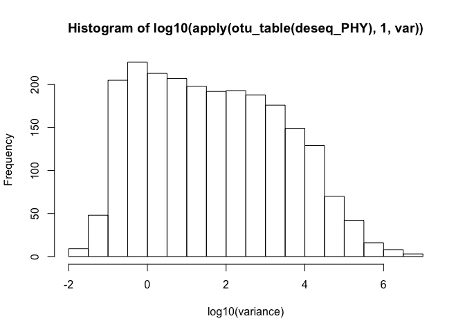<!-- -->

``` r
# Let's set a threashold for the variance
varianceThreshold = 50
keepOTUs = apply(otu_table(deseq_PHY), 1, var) > varianceThreshold
deseq_PHY = prune_taxa(keepOTUs, deseq_PHY)
deseq_PHY
```

    ## phyloseq-class experiment-level object
    ## otu_table()   OTU Table:         [ 1099 taxa and 42 samples ]
    ## sample_data() Sample Data:       [ 42 samples by 24 sample variables ]
    ## tax_table()   Taxonomy Table:    [ 1099 taxa by 3 taxonomic ranks ]

``` r
dds = phyloseq_to_deseq2(deseq_PHY, ~country)
```

    ## converting counts to integer mode

    ##   Note: levels of factors in the design contain characters other than
    ##   letters, numbers, '_' and '.'. It is recommended (but not required) to use
    ##   only letters, numbers, and delimiters '_' or '.', as these are safe characters
    ##   for column names in R. [This is a message, not an warning or error]

``` r
dds$category <- relevel(dds$country, "Burkina Faso", "Finland")

dds = DESeq(dds, fitType = "mean", test = "Wald", betaPrior = FALSE)
```

    ## estimating size factors
    ##   Note: levels of factors in the design contain characters other than
    ##   letters, numbers, '_' and '.'. It is recommended (but not required) to use
    ##   only letters, numbers, and delimiters '_' or '.', as these are safe characters
    ##   for column names in R. [This is a message, not an warning or error]

    ## estimating dispersions

    ## gene-wise dispersion estimates

    ## mean-dispersion relationship

    ##   Note: levels of factors in the design contain characters other than
    ##   letters, numbers, '_' and '.'. It is recommended (but not required) to use
    ##   only letters, numbers, and delimiters '_' or '.', as these are safe characters
    ##   for column names in R. [This is a message, not an warning or error]

    ## final dispersion estimates

    ##   Note: levels of factors in the design contain characters other than
    ##   letters, numbers, '_' and '.'. It is recommended (but not required) to use
    ##   only letters, numbers, and delimiters '_' or '.', as these are safe characters
    ##   for column names in R. [This is a message, not an warning or error]

    ## fitting model and testing

    ##   Note: levels of factors in the design contain characters other than
    ##   letters, numbers, '_' and '.'. It is recommended (but not required) to use
    ##   only letters, numbers, and delimiters '_' or '.', as these are safe characters
    ##   for column names in R. [This is a message, not an warning or error]

    ## -- replacing outliers and refitting for 249 genes
    ## -- DESeq argument 'minReplicatesForReplace' = 7 
    ## -- original counts are preserved in counts(dds)

    ## estimating dispersions

    ##   Note: levels of factors in the design contain characters other than
    ##   letters, numbers, '_' and '.'. It is recommended (but not required) to use
    ##   only letters, numbers, and delimiters '_' or '.', as these are safe characters
    ##   for column names in R. [This is a message, not an warning or error]

    ## fitting model and testing

    ##   Note: levels of factors in the design contain characters other than
    ##   letters, numbers, '_' and '.'. It is recommended (but not required) to use
    ##   only letters, numbers, and delimiters '_' or '.', as these are safe characters
    ##   for column names in R. [This is a message, not an warning or error]

``` r
res = results(dds, cooksCutoff = FALSE, alpha = 0.05)
resultsNames(dds)
```

    ## [1] "Intercept"                       "country_Finland_vs_Burkina.Faso"

``` r
#plotDispEsts(dds)
#head(res)
#summary(res)

res = res[order(res$padj, na.last=NA), ]

alpha = 0.05
sigtab_resfinder = res[which(res$padj < alpha), ]

sigtab_resfinder = cbind(as(sigtab_resfinder, "data.frame"), as(tax_table(deseq_PHY)[rownames(sigtab_resfinder), 
    ], "matrix"))

otu_table(deseq_PHY)[otu_table(deseq_PHY) == 1] <- 0
otu_table(deseq_PHY)[otu_table(deseq_PHY) > 0] <- 1

n <- rowSums(otu_table(deseq_PHY))

sigtab_resfinder = merge(sigtab_resfinder, as.data.frame(n), by = 0)

#kable(sigtab_resfinder, caption = "Taxonomy")

# Plot
# Class
x = tapply(sigtab_resfinder$log2FoldChange, sigtab_resfinder$Class, function(x) max(x))
x = sort(x, TRUE)
sigtab_resfinder$Class = factor(as.character(sigtab_resfinder$Class), levels = names(x))

# Gene cluster
x = tapply(sigtab_resfinder$log2FoldChange, sigtab_resfinder$Cluster_name, function(x) max(x))
x = sort(x, TRUE)
sigtab_resfinder$Cluster_name = factor(as.character(sigtab_resfinder$Cluster_name), levels = names(x))

# Gene 
x = tapply(sigtab_resfinder$log2FoldChange, sigtab_resfinder$Gene, function(x) max(x))
x = sort(x, TRUE)
sigtab_resfinder$Gene = factor(as.character(sigtab_resfinder$Gene), levels = names(x))

sorted_sigtab <- sigtab_resfinder[order(-sigtab_resfinder$log2FoldChange), ]

# Save BF
#write.table(sorted_sigtab, "~/Documents/Metagenomes_AMRIWA/R/AMRIWA/RFiles/DESeq2_BF_Fin.txt", 
#            row.names=T, sep = "\t", col.names = T)

Fin_BF <- subset(sorted_sigtab,log2FoldChange>=0)
BF_Fin <- subset(sorted_sigtab,log2FoldChange<=0)
BF_Fin <- BF_Fin[order(BF_Fin$log2FoldChange), ]
head(Fin_BF)
```

    ##     Row.names baseMean log2FoldChange     lfcSE      stat       pvalue
    ## 405     sp480 40.99270       7.852266 0.6026931 13.028630 8.410383e-39
    ## 15     sp1096 56.79119       7.700764 0.6040253 12.749075 3.154645e-37
    ## 92     sp1648 46.56010       7.387248 0.7266569 10.166075 2.810054e-24
    ## 14     sp1095 31.29971       7.021763 0.5779840 12.148714 5.827481e-34
    ## 8      sp1041 89.93935       6.883085 0.7940390  8.668447 4.380527e-18
    ## 19      sp130 46.71833       6.856940 0.7356964  9.320340 1.159679e-20
    ##             padj          Class       Cluster_name                      Gene  n
    ## 405 9.243010e-36     Betalactam       blaOXA-299_1 blaOXA-299_1_APQD01000016  8
    ## 15  1.733478e-34     Betalactam blaOXA-280_1_clust     blaOXA-334_1_KF203108 13
    ## 92  4.411785e-22     Betalactam       blaOXA-296_1 blaOXA-296_1_APOH01000009 10
    ## 14  1.280880e-31     Betalactam blaOXA-280_1_clust     blaOXA-333_1_KF203107 10
    ## 8   3.008875e-16     Betalactam blaOXA-280_1_clust     blaOXA-211_1_JN861779 10
    ## 19  1.062073e-18 Aminoglycoside       aac(6')-Ig_1       aac(6')-Ig_1_L09246  9

``` r
head(BF_Fin)
```

    ##     Row.names baseMean log2FoldChange     lfcSE      stat       pvalue
    ## 379    sp3033 343.1398      -6.688023 0.8193830 -8.162267 3.287957e-16
    ## 176    sp2103 607.6167      -6.365877 0.6600816 -9.644076 5.207786e-22
    ## 324    sp2850 328.3398      -5.761664 0.9097878 -6.332976 2.404772e-10
    ## 387    sp3068 180.0523      -5.539669 0.6107521 -9.070242 1.187535e-19
    ## 490     sp895 288.7270      -5.504616 0.8099697 -6.796076 1.075069e-11
    ## 496     sp948 801.0270      -5.411751 0.7492859 -7.222544 5.102375e-13
    ##             padj        Class       Cluster_name                    Gene  n
    ## 379 1.901824e-14 Trimethoprim      dfrB1_1_clust        dfrB5_1_AY943084 32
    ## 176 6.359285e-20   Betalactam blaCMY-150_2_clust blaCMY-4_1_LNHZ01000079 41
    ## 324 6.607111e-09 Sulphonamide             sul4_1         sul4_1_MG649393 38
    ## 387 9.322147e-18 Trimethoprim     dfrA15_4_clust       dfrA15_2_AF221900 37
    ## 490 3.692191e-10   Betalactam  blaOXA-46_1_clust    blaOXA-46_1_AF317511 38
    ## 496 2.076856e-11   Betalactam blaOXA-368_1_clust   blaOXA-101_1_AM412777 39

## Plot

# BF-Finland

``` r
# Take top 10 from each and combine back to one table
#Fin25 <- Fin_BF[1:25,]
#BF25 <- BF_Fin[1:25,]
#BF_Fin_top_sigtab <- rbind(Fin25, BF25)

# Shorten gene names and order again
#BF_Fin_top_sigtab$Gene <- gsub(pattern = "_[A-Z].*", replacement = "", BF_Fin_top_sigtab$Gene)

#cols <- get_palette(c("#332288", "#117733", "#44AA99", "#88CCEE", "#DDCC77", "#CC6677", "#F22D3D", "#882255", "#5F5E98", "#E4C960", "#FD8FD9"), 10)
#p <- ggplot(data = BF_Fin_top_sigtab,aes(x = Gene, y = log2FoldChange)) + 
#  geom_bar(stat = "identity",
#    aes(fill = Class), position = position_dodge(preserve = "single")) + ylab("                            Log2 Fold Change\n              Burkina Faso                     Finland") + 
#  scale_fill_manual(values = cols) +
#  ggtitle("Enriched ARGs in Burkinabe / Finnish samples (25 with highest log 2 fold change values of each country)") +
#  coord_flip() +
#  theme_minimal() +
#  theme(axis.text.x = element_text(family = "Times", size = 10),
#        axis.text.y = element_text(family = "Times", size = 12, face = "bold.italic"),
#        axis.title.x = element_text(family = "Times",  size = 20, face = "bold", hjust = -0.01),
#        axis.title.y = element_blank(),
#        legend.text = element_text(family = "Times", size = 20),
#        legend.title = element_blank(),
#        plot.title = element_text(family = "Times", size = 20, face = "bold"))

#ggsave(filename = "BF_FIN_deseq50_resfinder_genes_new.png",
#       width = 16, height = 13, dpi = 300, units = "in", device='png', scale = 1) 
```

## DESeq2

# ResFinder with clusters

``` r
#OTU_resfinder <-as.matrix(read.table("ARG_genemat.txt", header= T, check.names = F, row.names = 1))

# Reorder to match metadata
#match <- match(rownames(metadata), colnames(OTU_resfinder))
#OTU_resfinder <- OTU_resfinder[,match]
#all(colnames(OTU_resfinder) == rownames(metadata))

# Tax_table (Cluster names created using cd-hit and 90 % identity and added manually to the tax table in excel)
#clusters_tax_table_resfinder <- read.csv("~/Documents/Metagenomes_AMRIWA/R/AMRIWA/RFiles/clusters_tax_table.txt", header=FALSE, sep=";")
#colnames(clusters_tax_table_resfinder) <- c("Gene",  "Cluster_name", "Class")
# Reorder columns
#col_order <- c("Class", "Cluster_name", "Gene")
#clusters_tax_table_resfinder <- clusters_tax_table_resfinder[, col_order]

# Reorder tax_table to match OTU_resfinder
#match <- match(rownames(OTU_resfinder), clusters_tax_table_resfinder$Gene)
#clusters_tax_table_resfinder <- clusters_tax_table_resfinder[match,]
#all(rownames(OTU_resfinder) == clusters_tax_table_resfinder$Gene)

# Divide by ARG gene lengths
## Get the lengths in terminal
# seqkit fx2tab --length --name --header-line resfinder.fasta > resfinder_lengths.txt
#resfinder_lengths <- read.delim("~/Documents/Metagenomes_AMRIWA/R/AMRIWA/RFiles/resfinder_lengths.txt", header=FALSE, comment.char="#")
#all(rownames(clusters_tax_table_resfinder$Gene) == resfinder_lengths$V1)
#OTU_resfinder_length_norm <- OTU_resfinder/resfinder_lengths[, 2]

# Normalization with Metaxa2 SSU counts
#deseq_OTU_resfinder <- t(t(OTU_resfinder_length_norm)/metadata$SSU_counts) * 1540
#all(rownames(metadata) == colnames(deseq_OTU_resfinder))
#identical(OTU_resfinder_length_norm[2025, 5]/metadata$SSU_counts[5], deseq_OTU_resfinder[2025, 5])
#all(rownames(OTU_resfinder_length_norm) == clusters_tax_table_resfinder$Gene)

# Deseq
#deseq_OTU <- deseq_OTU_resfinder[, ] * 10^5 + 1

# Merge ARGs so that cluster names instead of gene names can be used
#clusters_tax_table_resfinder <- read.delim("~/Documents/Metagenomes_AMRIWA/R/AMRIWA/RFiles/clusters_tax_table_resfinder.txt")
#all(clusters_tax_table_resfinder$Gene == rownames(deseq_OTU))

#Class <- as.data.frame(clusters_tax_table_resfinder$Class)
#Cluster_name <- as.data.frame(clusters_tax_table_resfinder$Cluster_name)
#Gene <- as.data.frame(clusters_tax_table_resfinder$Gene)

#OTU_DESeq <- cbind(deseq_OTU, Class, Cluster_name, Gene)

#names(OTU_DESeq)[names(OTU_DESeq) == "clusters_tax_table_resfinder$Class"] <- "Class"
#names(OTU_DESeq)[names(OTU_DESeq) == "clusters_tax_table_resfinder$Cluster_name"] <- "Cluster_name"
#names(OTU_DESeq)[names(OTU_DESeq) == "clusters_tax_table_resfinder$Gene"] <- "Gene"

#all(OTU_DESeq$Gene == clusters_tax_table_resfinder$Gene)

# Merge
#merged_deseq <- ddply(OTU_DESeq,"Cluster_name",numcolwise(sum))
# Remove duplicates
#uniq_clust <- clusters_tax_table_resfinder[!duplicated(clusters_tax_table_resfinder[ , c("Cluster_name")]),]
# Reorder to match OTU
#match <- match(uniq_clust$Cluster_name, merged_deseq$Cluster_name)
#merged_deseq <- merged_deseq[match,]
#all(merged_deseq$Cluster_name == uniq_clust$Cluster_name)

# Tax table
#match <- match(merged_deseq$Cluster_name, clusters_tax_table_resfinder$Cluster_name)
#heat_clusters_tax_table_resfinder <- clusters_tax_table_resfinder[match,]
#identical(merged_deseq$Cluster_name, heat_clusters_tax_table_resfinder$Cluster_name)

# Reload to get new row numbers
#write.table(merged_deseq, "~/Documents/Metagenomes_AMRIWA/R/AMRIWA/RFiles/merged_deseq.txt", 
#            row.names=T, sep = "\t", col.names = T)
#merged_deseq <- read.delim("~/Documents/Metagenomes_AMRIWA/R/AMRIWA/RFiles/merged_deseq.txt", row.names=NULL)
#merged_deseq$row.names<-NULL
#merged_deseq$Cluster_name <- NULL

# Reload to get new row numbers
#write.table(heat_clusters_tax_table_resfinder, "~/Documents/Metagenomes_AMRIWA/R/AMRIWA/RFiles/heat_clusters_tax_table_resfinder.txt", row.names=F, sep = "\t", col.names = T)
#heat_clusters_tax_table_resfinder <- read.delim("~/Documents/Metagenomes_AMRIWA/R/AMRIWA/RFiles/heat_clusters_tax_table_resfinder.txt", row.names=NULL)

# Create phyloseq
#merged_deseq_resfinder_PHY <- phyloseq(otu_table(merged_deseq, taxa_are_rows = TRUE), sample_data(metadata), 
#    tax_table(as.matrix(heat_clusters_tax_table_resfinder)))

# Create phyloseq object with all samples
# Exclude samples with low sequencing quality (BFH24_S142, BH63_S118, FH10_S171)
#merged_deseq_resfinder_PHY = subset_samples(merged_deseq_resfinder_PHY, alias != "BFH24" & alias != "BH63" & alias != "FH10")

# Create phyloseq object with all samples
# Exclude samples with low sequencing quality (BFH24_S142, BH63_S118, FH10_S171)
#merged_deseq_resfinder_PHY = subset_samples(merged_deseq_resfinder_PHY, alias != "BFH24" & alias != "BH63" & alias != "FH10")
# Exclude samples from UK hospital whose sample collection does not match with other samples
#merged_deseq_resfinder_PHY <- subset_samples(merged_deseq_resfinder_PHY, country != "UK")

## Exclude biological / technical replicates
#merged_deseq_resfinder_PHY_stat <- subset_samples(merged_deseq_resfinder_PHY, alias != "BH31" & alias != "BH33" & alias != "BH34B" & alias != "BH10"                                     & alias != "BFH38B" & alias != "FH8" & alias != "BH45" & alias != "BH59" & alias != "BH62")

# Create phyloseq object with only hospital WW samples sequenced here
#merged_deseq_resfinder_PHY_stat <- subset_samples(merged_deseq_resfinder_PHY_stat, category == "WA hospital effluent" | category == "North Eu hospital effluent")

# Take pair wise comparisons
#deseq_PHY = subset_samples(merged_deseq_resfinder_PHY_stat, country == "Benin" | country == "Finland")
#deseq_PHY = subset_samples(merged_deseq_resfinder_PHY_stat, country == "Burkina Faso" | country == "Finland")
#deseq_PHY = subset_samples(merged_deseq_resfinder_PHY_stat, country == "Benin" | country == "Burkina Faso")

#hist(log10(apply(otu_table(deseq_PHY), 1, var)), xlab = "log10(variance)")

#varianceThreshold = 50
#keepOTUs = apply(otu_table(deseq_PHY), 1, var) > varianceThreshold
#deseq_PHY = prune_taxa(keepOTUs, deseq_PHY)
#deseq_PHY

#dds = phyloseq_to_deseq2(deseq_PHY, ~country)

#dds$category <- relevel(dds$country, "Benin", "Finland")
#dds$category <- relevel(dds$country, "Burkina Faso", "Finland")
#dds$category <- relevel(dds$country, "Benin", "Burkina Faso")

#dds = DESeq(dds, fitType = "mean", test = "Wald", betaPrior = FALSE)

#res = results(dds, cooksCutoff = FALSE, alpha = 0.05)
#resultsNames(dds)
#plotDispEsts(dds)
#head(res)
#summary(res)

#res = res[order(res$padj, na.last=NA), ]

#alpha = 0.05
#sigtab_resfinder = res[which(res$padj < alpha), ]

#sigtab_resfinder = cbind(as(sigtab_resfinder, "data.frame"), as(tax_table(deseq_PHY)[rownames(sigtab_resfinder),     ], "matrix"))

#otu_table(deseq_PHY)[otu_table(deseq_PHY) == 1] <- 0
#otu_table(deseq_PHY)[otu_table(deseq_PHY) > 0] <- 1

#n <- rowSums(otu_table(deseq_PHY))

#sigtab_resfinder = merge(sigtab_resfinder, as.data.frame(n), by = 0)

#kable(sigtab_resfinder, caption = "Taxonomy")

# Plot
# Class
#x = tapply(sigtab_resfinder$log2FoldChange, sigtab_resfinder$Class, function(x) max(x))
#x = sort(x, TRUE)
#sigtab_resfinder$Class = factor(as.character(sigtab_resfinder$Class), levels = names(x))

# Gene cluster
#x = tapply(sigtab_resfinder$log2FoldChange, sigtab_resfinder$Cluster_name, function(x) max(x))
#x = sort(x, TRUE)
#sigtab_resfinder$Cluster_name = factor(as.character(sigtab_resfinder$Cluster_name), levels = names(x))

# Gene 
#x = tapply(sigtab_resfinder$log2FoldChange, sigtab_resfinder$Gene, function(x) max(x))
#x = sort(x, TRUE)
#sigtab_resfinder$Gene = factor(as.character(sigtab_resfinder$Gene), levels = names(x))

#sorted_sigtab <- sigtab_resfinder[order(-sigtab_resfinder$log2FoldChange), ]
```

## DESeq2

# Taxonomy (Metaxa2), Genus

``` r
metaxa_deseq_PHY <- prune_taxa(taxa_sums(metaxa_PHY_stat) > 0, metaxa_PHY_stat)

metaxa_deseq_PHY <- tax_glom(metaxa_deseq_PHY, taxrank = "Genus")

# Take pair wise comparisons
deseq_PHY = subset_samples(metaxa_deseq_PHY, country == "Benin" | country == "Finland")

# Let's set a threashold for the variance
varianceThreshold = 50
keepOTUs = apply(otu_table(deseq_PHY), 1, var) > varianceThreshold
deseq_PHY = prune_taxa(keepOTUs, deseq_PHY)
deseq_PHY
```

    ## phyloseq-class experiment-level object
    ## otu_table()   OTU Table:         [ 361 taxa and 33 samples ]
    ## sample_data() Sample Data:       [ 33 samples by 21 sample variables ]
    ## tax_table()   Taxonomy Table:    [ 361 taxa by 6 taxonomic ranks ]

``` r
dds = phyloseq_to_deseq2(deseq_PHY, ~country)
```

    ## converting counts to integer mode

``` r
dds$category <- relevel(dds$country, "Benin", "Finland")

dds = DESeq(dds, fitType = "mean", test = "Wald", betaPrior = FALSE)
```

    ## estimating size factors

    ## estimating dispersions

    ## gene-wise dispersion estimates

    ## mean-dispersion relationship

    ## final dispersion estimates

    ## fitting model and testing

    ## -- replacing outliers and refitting for 121 genes
    ## -- DESeq argument 'minReplicatesForReplace' = 7 
    ## -- original counts are preserved in counts(dds)

    ## estimating dispersions

    ## fitting model and testing

``` r
res = results(dds, cooksCutoff = FALSE, alpha = 0.05)
resultsNames(dds)
```

    ## [1] "Intercept"                "country_Finland_vs_Benin"

``` r
#plotDispEsts(dds)
#head(res)
#summary(res)

res = res[order(res$padj, na.last=NA), ]

alpha = 0.05
sigtab_metaxa = res[which(res$padj < alpha), ]

sigtab_metaxa = cbind(as(sigtab_metaxa, "data.frame"), as(tax_table(deseq_PHY)[rownames(sigtab_metaxa), 
    ], "matrix"))

n <- rowSums(otu_table(deseq_PHY))

sigtab_metaxa = merge(sigtab_metaxa, as.data.frame(n), by = 0)

kable(sigtab_metaxa, caption = "Taxonomy")
```

| Row.names |     baseMean | log2FoldChange |     lfcSE |       stat |    pvalue |      padj | Domain   | Phylum          | Class                 | Order                  | Family                     | Genus                                   |      n |
|:----------|-------------:|---------------:|----------:|-----------:|----------:|----------:|:---------|:----------------|:----------------------|:-----------------------|:---------------------------|:----------------------------------------|-------:|
| sp1001    |    5.6367404 |     -5.2712840 | 1.2305631 |  -4.283636 | 0.0000184 | 0.0000581 | Bacteria | Firmicutes      | Bacilli               | Lactobacillales        | Leuconostocaceae           | Weissella                               |    222 |
| sp1002    |  226.4711573 |      7.1474658 | 0.7521390 |   9.502852 | 0.0000000 | 0.0000000 | Bacteria | Firmicutes      | Bacilli               | Lactobacillales        | Streptococcaceae           | Lactococcus                             |   6649 |
| sp1004    |  121.3485273 |      2.5869903 | 0.6157557 |   4.201326 | 0.0000265 | 0.0000789 | Bacteria | Firmicutes      | Bacilli               | Lactobacillales        | Streptococcaceae           | Streptococcus                           |   6203 |
| sp1011    |   23.7862612 |     -3.5573650 | 0.6089308 |  -5.841986 | 0.0000000 | 0.0000000 | Bacteria | Firmicutes      | Clostridia            | Clostridiales          | Christensenellaceae        | Christensenella                         |    785 |
| sp1014    |   19.3952929 |     -5.2836369 | 0.6395652 |  -8.261295 | 0.0000000 | 0.0000000 | Bacteria | Firmicutes      | Clostridia            | Clostridiales          | Clostridiaceae             | Alkaliphilus                            |    685 |
| sp1023    |   88.8120991 |     -1.2414709 | 0.4912095 |  -2.527376 | 0.0114919 | 0.0195145 | Bacteria | Firmicutes      | Clostridia            | Clostridiales          | Clostridiaceae             | Clostridium                             |   3336 |
| sp1033    |   40.5778336 |     -2.6098304 | 0.5042277 |  -5.175896 | 0.0000002 | 0.0000009 | Bacteria | Firmicutes      | Clostridia            | Clostridiales          | Clostridiaceae             | Unclassified Clostridiaceae             |   1387 |
| sp1034    |    6.8806767 |     -3.8388848 | 0.9577443 |  -4.008256 | 0.0000612 | 0.0001694 | Bacteria | Firmicutes      | Clostridia            | Clostridiales          | Eubacteriaceae             | Acetobacterium                          |    252 |
| sp1037    |   54.4844427 |     -5.1298583 | 0.9064410 |  -5.659341 | 0.0000000 | 0.0000001 | Bacteria | Firmicutes      | Clostridia            | Clostridiales          | Eubacteriaceae             | Eubacterium                             |   1926 |
| sp1040    |   47.5004474 |     -5.0241616 | 0.9386956 |  -5.352280 | 0.0000001 | 0.0000004 | Bacteria | Firmicutes      | Clostridia            | Clostridiales          | Eubacteriaceae             | Unclassified Eubacteriaceae             |   1712 |
| sp1051    |    7.7258826 |     -2.7524301 | 0.7561909 |  -3.639861 | 0.0002728 | 0.0006295 | Bacteria | Firmicutes      | Clostridia            | Clostridiales          | Family XI Incertae Sedis   | Sedimentibacter                         |    256 |
| sp1060    |   15.7416882 |     -3.7042979 | 0.6625162 |  -5.591256 | 0.0000000 | 0.0000001 | Bacteria | Firmicutes      | Clostridia            | Clostridiales          | Family XIII Incertae Sedis | Anaerovorax                             |    551 |
| sp1061    |    9.0771710 |     -2.0835115 | 0.5815414 |  -3.582740 | 0.0003400 | 0.0007650 | Bacteria | Firmicutes      | Clostridia            | Clostridiales          | Family XIII Incertae Sedis | Incertae Sedis                          |    335 |
| sp1064    |   66.5116507 |     -3.3134158 | 0.5535368 |  -5.985900 | 0.0000000 | 0.0000000 | Bacteria | Firmicutes      | Clostridia            | Clostridiales          | Family XIII Incertae Sedis | Unclassified Family XIII Incertae Sedis |   2278 |
| sp1085    |   50.6899728 |      4.1404725 | 0.7746020 |   5.345290 | 0.0000001 | 0.0000004 | Bacteria | Firmicutes      | Clostridia            | Clostridiales          | Lachnospiraceae            | Anaerostipes                            |   2820 |
| sp1086    |  173.8037531 |      3.3260076 | 0.7842696 |   4.240898 | 0.0000223 | 0.0000673 | Bacteria | Firmicutes      | Clostridia            | Clostridiales          | Lachnospiraceae            | Blautia                                 |   8902 |
| sp1091    |    8.3321466 |      1.8924213 | 0.7006331 |   2.701016 | 0.0069128 | 0.0123198 | Bacteria | Firmicutes      | Clostridia            | Clostridiales          | Lachnospiraceae            | Coprococcus                             |    396 |
| sp1092    |   11.6389506 |      2.9709961 | 0.8618815 |   3.447105 | 0.0005666 | 0.0011999 | Bacteria | Firmicutes      | Clostridia            | Clostridiales          | Lachnospiraceae            | Dorea                                   |    572 |
| sp1097    |  183.5231152 |      1.9977014 | 0.5446081 |   3.668145 | 0.0002443 | 0.0005764 | Bacteria | Firmicutes      | Clostridia            | Clostridiales          | Lachnospiraceae            | Incertae Sedis                          |   8805 |
| sp1099    |    3.9087134 |      2.9932455 | 0.7773562 |   3.850546 | 0.0001179 | 0.0003074 | Bacteria | Firmicutes      | Clostridia            | Clostridiales          | Lachnospiraceae            | Lachnospira                             |    207 |
| sp1104    |   33.8018059 |      2.3208395 | 0.7667160 |   3.026987 | 0.0024700 | 0.0046556 | Bacteria | Firmicutes      | Clostridia            | Clostridiales          | Lachnospiraceae            | Pseudobutyrivibrio                      |   1668 |
| sp1106    |   61.6616549 |      2.7680705 | 0.8268654 |   3.347668 | 0.0008149 | 0.0016575 | Bacteria | Firmicutes      | Clostridia            | Clostridiales          | Lachnospiraceae            | Roseburia                               |   3194 |
| sp1110    |  598.2247957 |      2.4010220 | 0.6509168 |   3.688677 | 0.0002254 | 0.0005374 | Bacteria | Firmicutes      | Clostridia            | Clostridiales          | Lachnospiraceae            | Unclassified Lachnospiraceae            |  29461 |
| sp1114    |    7.4357280 |     -6.3817156 | 1.2147131 |  -5.253681 | 0.0000001 | 0.0000006 | Bacteria | Firmicutes      | Clostridia            | Clostridiales          | Peptococcaceae             | Dehalobacterium                         |    206 |
| sp1117    |    9.0908661 |     -5.0583684 | 0.8666852 |  -5.836454 | 0.0000000 | 0.0000000 | Bacteria | Firmicutes      | Clostridia            | Clostridiales          | Peptococcaceae             | Desulfitobacterium                      |    258 |
| sp1120    |    9.2927562 |     -2.7520313 | 0.6309079 |  -4.362018 | 0.0000129 | 0.0000426 | Bacteria | Firmicutes      | Clostridia            | Clostridiales          | Peptococcaceae             | Desulfotomaculum                        |    285 |
| sp1128    |   36.7606214 |     -1.8844007 | 0.5138135 |  -3.667480 | 0.0002450 | 0.0005764 | Bacteria | Firmicutes      | Clostridia            | Clostridiales          | Peptococcaceae             | Unclassified Peptococcaceae             |   1209 |
| sp1130    |  110.5787088 |     -1.4183080 | 0.4681166 |  -3.029818 | 0.0024470 | 0.0046364 | Bacteria | Firmicutes      | Clostridia            | Clostridiales          | Peptostreptococcaceae      | Incertae Sedis                          |   4042 |
| sp1132    |   15.3447920 |     -2.3421447 | 1.0662288 |  -2.196662 | 0.0280446 | 0.0429619 | Bacteria | Firmicutes      | Clostridia            | Clostridiales          | Peptostreptococcaceae      | Proteocatella                           |    768 |
| sp1135    |   11.5345084 |     -2.2542023 | 0.5904532 |  -3.817749 | 0.0001347 | 0.0003430 | Bacteria | Firmicutes      | Clostridia            | Clostridiales          | Peptostreptococcaceae      | Unclassified Peptostreptococcaceae      |    428 |
| sp1138    |   14.8027870 |     -3.5455714 | 0.8647704 |  -4.100015 | 0.0000413 | 0.0001162 | Bacteria | Firmicutes      | Clostridia            | Clostridiales          | Ruminococcaceae            | Anaerofilum                             |    494 |
| sp1142    |  258.7057088 |      2.3968763 | 0.6945092 |   3.451180 | 0.0005581 | 0.0011960 | Bacteria | Firmicutes      | Clostridia            | Clostridiales          | Ruminococcaceae            | Faecalibacterium                        |  12558 |
| sp1143    |    8.6276203 |     -2.7776240 | 0.8522525 |  -3.259156 | 0.0011174 | 0.0022103 | Bacteria | Firmicutes      | Clostridia            | Clostridiales          | Ruminococcaceae            | Fastidiosipila                          |    268 |
| sp1147    |   34.1427172 |      1.3399962 | 0.5814816 |   2.304451 | 0.0211973 | 0.0333822 | Bacteria | Firmicutes      | Clostridia            | Clostridiales          | Ruminococcaceae            | Oscillibacter                           |   1492 |
| sp1152    |   34.2119628 |     -5.9933949 | 0.9123862 |  -6.568923 | 0.0000000 | 0.0000000 | Bacteria | Firmicutes      | Clostridia            | Clostridiales          | Ruminococcaceae            | Saccharofermentans                      |   1114 |
| sp1154    |   59.5891723 |      2.9811885 | 0.5157615 |   5.780168 | 0.0000000 | 0.0000000 | Bacteria | Firmicutes      | Clostridia            | Clostridiales          | Ruminococcaceae            | Subdoligranulum                         |   2988 |
| sp1159    |   49.5333151 |     -7.1291543 | 1.1050675 |  -6.451329 | 0.0000000 | 0.0000000 | Bacteria | Firmicutes      | Clostridia            | Clostridiales          | Syntrophomonadaceae        | Syntrophomonas                          |   1632 |
| sp1162    |   22.6739643 |     -7.6235041 | 1.2124788 |  -6.287536 | 0.0000000 | 0.0000000 | Bacteria | Firmicutes      | Clostridia            | Clostridiales          | Syntrophomonadaceae        | Unclassified Syntrophomonadaceae        |    752 |
| sp1168    |   22.9964629 |     -6.9331196 | 1.1779873 |  -5.885564 | 0.0000000 | 0.0000000 | Bacteria | Firmicutes      | Clostridia            | Clostridiales          | Veillonellaceae            | Anaeroarcus                             |    523 |
| sp1170    |   26.3485944 |     -6.8445570 | 1.1939242 |  -5.732824 | 0.0000000 | 0.0000000 | Bacteria | Firmicutes      | Clostridia            | Clostridiales          | Veillonellaceae            | Anaerosinus                             |   1165 |
| sp1175    |   23.6568502 |      2.4640759 | 0.7763764 |   3.173816 | 0.0015045 | 0.0029277 | Bacteria | Firmicutes      | Clostridia            | Clostridiales          | Veillonellaceae            | Dialister                               |   1177 |
| sp1176    |    9.0948215 |     -4.4835111 | 1.1111309 |  -4.035088 | 0.0000546 | 0.0001523 | Bacteria | Firmicutes      | Clostridia            | Clostridiales          | Veillonellaceae            | Megamonas                               |   1052 |
| sp1181    |   23.1423650 |     -5.3257792 | 0.6588084 |  -8.083957 | 0.0000000 | 0.0000000 | Bacteria | Firmicutes      | Clostridia            | Clostridiales          | Veillonellaceae            | Pelosinus                               |    904 |
| sp1188    |   62.4900316 |     -4.6354653 | 0.5891797 |  -7.867659 | 0.0000000 | 0.0000000 | Bacteria | Firmicutes      | Clostridia            | Clostridiales          | Veillonellaceae            | Sporomusa                               |   1650 |
| sp1190    |    5.4027320 |     -5.9344536 | 1.4073563 |  -4.216738 | 0.0000248 | 0.0000744 | Bacteria | Firmicutes      | Clostridia            | Clostridiales          | Veillonellaceae            | Succinispira                            |    208 |
| sp1191    |   11.6432939 |     -5.6788473 | 0.9013412 |  -6.300441 | 0.0000000 | 0.0000000 | Bacteria | Firmicutes      | Clostridia            | Clostridiales          | Veillonellaceae            | Thermosinus                             |    335 |
| sp1192    |  387.9338361 |     -2.0325332 | 0.5646769 |  -3.599462 | 0.0003189 | 0.0007220 | Bacteria | Firmicutes      | Clostridia            | Clostridiales          | Veillonellaceae            | Unclassified Veillonellaceae            |  11739 |
| sp1193    |   10.5434990 |     -1.5096746 | 0.6340157 |  -2.381131 | 0.0172596 | 0.0279885 | Bacteria | Firmicutes      | Clostridia            | Clostridiales          | Veillonellaceae            | Veillonella                             |    525 |
| sp1215    |    9.1870088 |     -2.9896777 | 0.6773683 |  -4.413666 | 0.0000102 | 0.0000339 | Bacteria | Firmicutes      | Clostridia            | Thermoanaerobacterales | Family III Incertae Sedis  | Thermoanaerobacterium                   |    302 |
| sp1242    |   15.6587558 |      2.3827015 | 1.0196990 |   2.336672 | 0.0194563 | 0.0309923 | Bacteria | Firmicutes      | Erysipelotrichi       | Erysipelotrichales     | Erysipelotrichaceae        | Catenibacterium                         |    850 |
| sp1254    |    1.7805128 |     -4.3453883 | 1.2153137 |  -3.575528 | 0.0003495 | 0.0007741 | Bacteria | Fusobacteria    | Fusobacteria          | Fusobacteriales        | Fusobacteriaceae           | Cetobacterium                           |    238 |
| sp1255    |    5.4853700 |     -3.2582528 | 0.9697767 |  -3.359797 | 0.0007800 | 0.0015955 | Bacteria | Fusobacteria    | Fusobacteria          | Fusobacteriales        | Fusobacteriaceae           | Fusobacterium                           |    969 |
| sp1259    |    8.0319761 |     -6.1296162 | 1.0709803 |  -5.723370 | 0.0000000 | 0.0000000 | Bacteria | Fusobacteria    | Fusobacteria          | Fusobacteriales        | Fusobacteriaceae           | Unclassified Fusobacteriaceae           |    877 |
| sp1261    |    2.1270707 |     -3.6184498 | 1.0736812 |  -3.370134 | 0.0007513 | 0.0015605 | Bacteria | Fusobacteria    | Fusobacteria          | Fusobacteriales        | Leptotrichiaceae           | Sebaldella                              |    137 |
| sp1274    |   24.9264841 |     -3.2560298 | 0.7907876 |  -4.117452 | 0.0000383 | 0.0001095 | Bacteria | Lentisphaerae   | Lentisphaeria         | Victivallales          | Victivallaceae             | Victivallis                             |    733 |
| sp1304    |   19.2206239 |     -5.6042506 | 0.7925562 |  -7.071108 | 0.0000000 | 0.0000000 | Bacteria | Planctomycetes  | Planctomycetacia      | Planctomycetales       | Planctomycetaceae          | Unclassified Planctomycetaceae          |    643 |
| sp1311    |    7.7832179 |      1.4332742 | 0.6409647 |   2.236120 | 0.0253439 | 0.0389906 | Bacteria | Proteobacteria  | Alphaproteobacteria   | Caulobacterales        | Caulobacteraceae           | Brevundimonas                           |    376 |
| sp1353    |    3.2161858 |     -4.1164212 | 1.5435609 |  -2.666834 | 0.0076569 | 0.0134145 | Bacteria | Proteobacteria  | Alphaproteobacteria   | Rhizobiales            | Bradyrhizobiaceae          | Rhodopseudomonas                        |    504 |
| sp1354    |    7.9692023 |     -2.0761161 | 0.7027508 |  -2.954271 | 0.0031341 | 0.0058158 | Bacteria | Proteobacteria  | Alphaproteobacteria   | Rhizobiales            | Bradyrhizobiaceae          | Unclassified Bradyrhizobiaceae          |    947 |
| sp1388    |    7.2608632 |     -4.1994518 | 1.3499285 |  -3.110870 | 0.0018654 | 0.0035720 | Bacteria | Proteobacteria  | Alphaproteobacteria   | Rhizobiales            | Methylocystaceae           | Pleomorphomonas                         |    236 |
| sp1389    |    5.4508317 |     -3.9838397 | 1.1925073 |  -3.340726 | 0.0008356 | 0.0016900 | Bacteria | Proteobacteria  | Alphaproteobacteria   | Rhizobiales            | Methylocystaceae           | Unclassified Methylocystaceae           |    147 |
| sp141     |   33.2875347 |     -7.4092762 | 1.2020823 |  -6.163701 | 0.0000000 | 0.0000000 | Bacteria | Acidobacteria   | Holophagae            | Holophagales           | Holophagaceae              | Geothrix                                |    776 |
| sp142     |   10.3184136 |     -6.1153904 | 1.2304022 |  -4.970237 | 0.0000007 | 0.0000024 | Bacteria | Acidobacteria   | Holophagae            | Holophagales           | Holophagaceae              | Holophaga                               |    270 |
| sp1422    |    6.4334199 |     -2.8803648 | 1.2836277 |  -2.243926 | 0.0248372 | 0.0383751 | Bacteria | Proteobacteria  | Alphaproteobacteria   | Rhizobiales            | Xanthobacteraceae          | Xanthobacter                            |    161 |
| sp143     |   16.1507622 |     -6.7641998 | 1.2992501 |  -5.206234 | 0.0000002 | 0.0000008 | Bacteria | Acidobacteria   | Holophagae            | Holophagales           | Holophagaceae              | Unclassified Holophagaceae              |    423 |
| sp1443    |   25.1501535 |      4.1959036 | 0.6214193 |   6.752129 | 0.0000000 | 0.0000000 | Bacteria | Proteobacteria  | Alphaproteobacteria   | Rhodobacterales        | Rhodobacteraceae           | Paracoccus                              |   1315 |
| sp1494    |    6.1679407 |     -1.6434848 | 0.6164621 |  -2.665995 | 0.0076761 | 0.0134145 | Bacteria | Proteobacteria  | Alphaproteobacteria   | Rhodospirillales       | Acetobacteraceae           | Unclassified Acetobacteraceae           |    283 |
| sp1503    |   14.5591082 |     -2.5079297 | 0.9118086 |  -2.750500 | 0.0059504 | 0.0107108 | Bacteria | Proteobacteria  | Alphaproteobacteria   | Rhodospirillales       | Rhodospirillaceae          | Azospirillum                            |    423 |
| sp1511    |  107.9050636 |     -3.1078868 | 1.0786276 |  -2.881334 | 0.0039600 | 0.0073107 | Bacteria | Proteobacteria  | Alphaproteobacteria   | Rhodospirillales       | Rhodospirillaceae          | Magnetospirillum                        |   1634 |
| sp1524    |    2.6147227 |     -4.1092344 | 1.9030420 |  -2.159298 | 0.0308271 | 0.0468259 | Bacteria | Proteobacteria  | Alphaproteobacteria   | Rhodospirillales       | Rhodospirillaceae          | Telmatospirillum                        |    394 |
| sp1529    |  145.6101123 |     -3.2894418 | 0.8908697 |  -3.692394 | 0.0002222 | 0.0005367 | Bacteria | Proteobacteria  | Alphaproteobacteria   | Rhodospirillales       | Rhodospirillaceae          | Unclassified Rhodospirillaceae          |   2031 |
| sp1595    |   21.3772433 |     -2.5214428 | 0.7911840 |  -3.186923 | 0.0014379 | 0.0028134 | Bacteria | Proteobacteria  | Alphaproteobacteria   | Sphingomonadales       | Sphingomonadaceae          | Unclassified Sphingomonadaceae          |    843 |
| sp161     |    2.9103521 |      4.0271922 | 1.3454453 |   2.993204 | 0.0027607 | 0.0051762 | Bacteria | Actinobacteria  | Actinobacteria        | Actinomycetales        | Actinomycetaceae           | Actinobaculum                           |    197 |
| sp1615    |   47.2976209 |     -1.1976978 | 0.5198829 |  -2.303784 | 0.0212348 | 0.0333822 | Bacteria | Proteobacteria  | Betaproteobacteria    | Burkholderiales        | Alcaligenaceae             | Unclassified Alcaligenaceae             |  20639 |
| sp1616    |   49.9523100 |     -2.8837274 | 0.6902914 |  -4.177551 | 0.0000295 | 0.0000862 | Bacteria | Proteobacteria  | Betaproteobacteria    | Burkholderiales        | Burkholderiaceae           | Burkholderia                            |   2317 |
| sp1620    |   42.6927060 |     -2.6048315 | 0.6591266 |  -3.951944 | 0.0000775 | 0.0002083 | Bacteria | Proteobacteria  | Betaproteobacteria    | Burkholderiales        | Burkholderiaceae           | Cupriavidus                             |   2993 |
| sp1621    |    4.7773790 |     -2.9529267 | 1.3495402 |  -2.188098 | 0.0286624 | 0.0437224 | Bacteria | Proteobacteria  | Betaproteobacteria    | Burkholderiales        | Burkholderiaceae           | Limnobacter                             |    961 |
| sp1624    |    9.4760492 |     -3.2055465 | 0.9526088 |  -3.365019 | 0.0007654 | 0.0015745 | Bacteria | Proteobacteria  | Betaproteobacteria    | Burkholderiales        | Burkholderiaceae           | Ralstonia                               |    393 |
| sp1625    |   21.8075771 |     -3.6458660 | 0.7070027 |  -5.156792 | 0.0000003 | 0.0000010 | Bacteria | Proteobacteria  | Betaproteobacteria    | Burkholderiales        | Burkholderiaceae           | Unclassified Burkholderiaceae           |    883 |
| sp1629    |   13.5847529 |     -2.0820992 | 0.6180055 |  -3.369063 | 0.0007542 | 0.0015605 | Bacteria | Proteobacteria  | Betaproteobacteria    | Burkholderiales        | Comamonadaceae             | Aquabacterium                           |    485 |
| sp1632    |   11.2768188 |     -2.0464261 | 0.5346484 |  -3.827611 | 0.0001294 | 0.0003327 | Bacteria | Proteobacteria  | Betaproteobacteria    | Burkholderiales        | Comamonadaceae             | Brachymonas                             |    434 |
| sp1636    |  274.8555174 |      2.8703755 | 0.5066583 |   5.665308 | 0.0000000 | 0.0000001 | Bacteria | Proteobacteria  | Betaproteobacteria    | Burkholderiales        | Comamonadaceae             | Comamonas                               |  13242 |
| sp1639    |    3.9584467 |     -5.1283109 | 1.2952598 |  -3.959291 | 0.0000752 | 0.0002050 | Bacteria | Proteobacteria  | Betaproteobacteria    | Burkholderiales        | Comamonadaceae             | Diaphorobacter                          |    136 |
| sp1641    |   75.5059585 |     -7.0200830 | 1.1839110 |  -5.929570 | 0.0000000 | 0.0000000 | Bacteria | Proteobacteria  | Betaproteobacteria    | Burkholderiales        | Comamonadaceae             | Hydrogenophaga                          |   2580 |
| sp1648    |   48.0902650 |     -8.7040751 | 1.5683988 |  -5.549657 | 0.0000000 | 0.0000001 | Bacteria | Proteobacteria  | Betaproteobacteria    | Burkholderiales        | Comamonadaceae             | Macromonas                              |   1495 |
| sp1649    |    9.9339760 |     -6.7952855 | 1.5943778 |  -4.262030 | 0.0000203 | 0.0000629 | Bacteria | Proteobacteria  | Betaproteobacteria    | Burkholderiales        | Comamonadaceae             | Malikia                                 |    327 |
| sp166     |    2.2473810 |      2.4667878 | 0.9826025 |   2.510464 | 0.0120573 | 0.0201889 | Bacteria | Actinobacteria  | Actinobacteria        | Actinomycetales        | Actinomycetaceae           | Unclassified Actinomycetaceae           |    134 |
| sp1665    |    1.9047948 |      2.5941385 | 0.9908340 |   2.618136 | 0.0088411 | 0.0152288 | Bacteria | Proteobacteria  | Betaproteobacteria    | Burkholderiales        | Comamonadaceae             | Simplicispira                           |     89 |
| sp1666    |    7.1755481 |      5.1085150 | 0.9932698 |   5.143129 | 0.0000003 | 0.0000010 | Bacteria | Proteobacteria  | Betaproteobacteria    | Burkholderiales        | Comamonadaceae             | Sphaerotilus                            |    476 |
| sp1678    |   11.9570083 |     -5.3256539 | 1.0366007 |  -5.137613 | 0.0000003 | 0.0000010 | Bacteria | Proteobacteria  | Betaproteobacteria    | Burkholderiales        | Oxalobacteraceae           | Herbaspirillum                          |    353 |
| sp1685    |   47.5122473 |     -1.3397200 | 0.5492956 |  -2.438978 | 0.0147289 | 0.0241018 | Bacteria | Proteobacteria  | Betaproteobacteria    | Burkholderiales        | Oxalobacteraceae           | Unclassified Oxalobacteraceae           |   5867 |
| sp1686    |    4.1204168 |     -2.8679316 | 0.8591402 |  -3.338141 | 0.0008434 | 0.0016962 | Bacteria | Proteobacteria  | Betaproteobacteria    | Burkholderiales        | Oxalobacteraceae           | Undibacterium                           |    221 |
| sp1692    |  243.0323162 |     -7.5026911 | 1.0708314 |  -7.006417 | 0.0000000 | 0.0000000 | Bacteria | Proteobacteria  | Betaproteobacteria    | Hydrogenophilales      | Hydrogenophilaceae         | Thiobacillus                            |   6401 |
| sp1700    |    8.8916502 |     -3.3592862 | 0.9603825 |  -3.497863 | 0.0004690 | 0.0010233 | Bacteria | Proteobacteria  | Betaproteobacteria    | Methylophilales        | Methylophilaceae           | Unclassified Methylophilaceae           |    242 |
| sp1710    |   22.4371642 |     -2.9900679 | 0.7019983 |  -4.259366 | 0.0000205 | 0.0000631 | Bacteria | Proteobacteria  | Betaproteobacteria    | Neisseriales           | Neisseriaceae              | Chromobacterium                         |   1494 |
| sp1714    |   19.2891809 |     -4.7181739 | 1.2536884 |  -3.763434 | 0.0001676 | 0.0004112 | Bacteria | Proteobacteria  | Betaproteobacteria    | Neisseriales           | Neisseriaceae              | Formivibrio                             |    704 |
| sp1719    |  106.8944273 |     -3.9443575 | 0.9176064 |  -4.298529 | 0.0000172 | 0.0000559 | Bacteria | Proteobacteria  | Betaproteobacteria    | Neisseriales           | Neisseriaceae              | Laribacter                              |   3884 |
| sp1728    |  233.7356886 |     -2.0373357 | 0.5797357 |  -3.514249 | 0.0004410 | 0.0009680 | Bacteria | Proteobacteria  | Betaproteobacteria    | Neisseriales           | Neisseriaceae              | Unclassified Neisseriaceae              |   9236 |
| sp173     |   86.2347517 |      3.1241906 | 0.7308409 |   4.274789 | 0.0000191 | 0.0000599 | Bacteria | Actinobacteria  | Actinobacteria        | Bifidobacteriales      | Bifidobacteriaceae         | Bifidobacterium                         |   4668 |
| sp1739    |    7.2982580 |     -3.5475786 | 1.0742995 |  -3.302225 | 0.0009592 | 0.0019078 | Bacteria | Proteobacteria  | Betaproteobacteria    | Nitrosomonadales       | Nitrosomonadaceae          | Nitrosomonas                            |    222 |
| sp1745    |   46.4032828 |     -4.2192420 | 0.6922577 |  -6.094900 | 0.0000000 | 0.0000000 | Bacteria | Proteobacteria  | Betaproteobacteria    | Rhodocyclales          | Rhodocyclaceae             | 12up                                    |   7066 |
| sp1747    |    3.1461849 |     -2.3983286 | 1.0498202 |  -2.284514 | 0.0223414 | 0.0349691 | Bacteria | Proteobacteria  | Betaproteobacteria    | Rhodocyclales          | Rhodocyclaceae             | Azonexus                                |    105 |
| sp1749    |    1.7506507 |     -3.9715360 | 1.6077685 |  -2.470216 | 0.0135031 | 0.0221969 | Bacteria | Proteobacteria  | Betaproteobacteria    | Rhodocyclales          | Rhodocyclaceae             | Azovibrio                               |    363 |
| sp1750    |  576.5182166 |     -5.3052076 | 0.7591859 |  -6.988022 | 0.0000000 | 0.0000000 | Bacteria | Proteobacteria  | Betaproteobacteria    | Rhodocyclales          | Rhodocyclaceae             | Dechloromonas                           |  29563 |
| sp1754    |  199.8273580 |     -5.3475284 | 0.6726205 |  -7.950291 | 0.0000000 | 0.0000000 | Bacteria | Proteobacteria  | Betaproteobacteria    | Rhodocyclales          | Rhodocyclaceae             | Propionivibrio                          |   6606 |
| sp1756    |   21.1143446 |     -6.6967650 | 1.3319016 |  -5.027973 | 0.0000005 | 0.0000018 | Bacteria | Proteobacteria  | Betaproteobacteria    | Rhodocyclales          | Rhodocyclaceae             | Rhodocyclus                             |    313 |
| sp1758    |   76.4730139 |      1.6109328 | 0.5255192 |   3.065412 | 0.0021737 | 0.0041404 | Bacteria | Proteobacteria  | Betaproteobacteria    | Rhodocyclales          | Rhodocyclaceae             | Thauera                                 |   5384 |
| sp1760    | 1800.5104561 |     -4.0864690 | 0.6246441 |  -6.542076 | 0.0000000 | 0.0000000 | Bacteria | Proteobacteria  | Betaproteobacteria    | Rhodocyclales          | Rhodocyclaceae             | Unclassified Rhodocyclaceae             |  53377 |
| sp1785    |    8.1105559 |     -6.5040529 | 1.1506420 |  -5.652542 | 0.0000000 | 0.0000001 | Bacteria | Proteobacteria  | Deltaproteobacteria   | Desulfobacterales      | Desulfobacteraceae         | Desulfobacterium                        |    226 |
| sp1793    |   26.0367762 |     -6.8036043 | 1.0948757 |  -6.214042 | 0.0000000 | 0.0000000 | Bacteria | Proteobacteria  | Deltaproteobacteria   | Desulfobacterales      | Desulfobacteraceae         | Desulforegula                           |    814 |
| sp1798    |   53.7234230 |     -8.5046035 | 1.1338236 |  -7.500817 | 0.0000000 | 0.0000000 | Bacteria | Proteobacteria  | Deltaproteobacteria   | Desulfobacterales      | Desulfobacteraceae         | Unclassified Desulfobacteraceae         |   1612 |
| sp1799    |  196.3551924 |     -6.0715494 | 0.6294236 |  -9.646206 | 0.0000000 | 0.0000000 | Bacteria | Proteobacteria  | Deltaproteobacteria   | Desulfobacterales      | Desulfobulbaceae           | Desulfobulbus                           |   6250 |
| sp1806    |   26.5804765 |     -6.7554412 | 0.8821625 |  -7.657820 | 0.0000000 | 0.0000000 | Bacteria | Proteobacteria  | Deltaproteobacteria   | Desulfobacterales      | Desulfobulbaceae           | Unclassified Desulfobulbaceae           |    735 |
| sp1819    |  118.4652921 |     -6.5749936 | 1.0107367 |  -6.505150 | 0.0000000 | 0.0000000 | Bacteria | Proteobacteria  | Deltaproteobacteria   | Desulfovibrionales     | Desulfomicrobiaceae        | Desulfomicrobium                        |   8314 |
| sp1825    |  673.9717359 |     -4.4773079 | 0.5975181 |  -7.493176 | 0.0000000 | 0.0000000 | Bacteria | Proteobacteria  | Deltaproteobacteria   | Desulfovibrionales     | Desulfovibrionaceae        | Desulfovibrio                           |  18265 |
| sp1827    |   34.1292569 |     -2.4071728 | 0.6571722 |  -3.662926 | 0.0002494 | 0.0005791 | Bacteria | Proteobacteria  | Deltaproteobacteria   | Desulfovibrionales     | Desulfovibrionaceae        | Unclassified Desulfovibrionaceae        |    988 |
| sp183     |   22.5909245 |     -2.2281659 | 0.7518352 |  -2.963636 | 0.0030403 | 0.0056710 | Bacteria | Actinobacteria  | Actinobacteria        | Corynebacteriales      | Corynebacteriaceae         | Corynebacterium                         |    639 |
| sp1833    |   40.4675358 |     -8.0969201 | 1.4034686 |  -5.769221 | 0.0000000 | 0.0000000 | Bacteria | Proteobacteria  | Deltaproteobacteria   | Desulfuromonadales     | BVA18                      | Geobacter                               |   1644 |
| sp1838    |   29.8828802 |     -7.6638465 | 1.0928674 |  -7.012604 | 0.0000000 | 0.0000000 | Bacteria | Proteobacteria  | Deltaproteobacteria   | Desulfuromonadales     | Desulfuromonadaceae        | Pelobacter                              |   1044 |
| sp1844    |  317.6002835 |     -7.7523446 | 0.7472837 | -10.374031 | 0.0000000 | 0.0000000 | Bacteria | Proteobacteria  | Deltaproteobacteria   | Desulfuromonadales     | Geobacteraceae             | Geobacter                               |  10828 |
| sp1847    |    3.9247673 |     -4.3871763 | 0.9245929 |  -4.744982 | 0.0000021 | 0.0000073 | Bacteria | Proteobacteria  | Deltaproteobacteria   | Desulfuromonadales     | Geobacteraceae             | Unclassified Geobacteraceae             |    211 |
| sp1883    |    6.4184719 |     -6.1463240 | 1.0482095 |  -5.863641 | 0.0000000 | 0.0000000 | Bacteria | Proteobacteria  | Deltaproteobacteria   | Order Incertae Sedis   | Syntrophorhabdaceae        | Syntrophorhabdus                        |    197 |
| sp1887    |    5.4736650 |     -5.5675912 | 1.2997003 |  -4.283750 | 0.0000184 | 0.0000581 | Bacteria | Proteobacteria  | Deltaproteobacteria   | Syntrophobacterales    | Syntrophaceae              | Desulfomonile                           |    335 |
| sp1888    |   15.6575059 |     -7.4473500 | 1.1854232 |  -6.282440 | 0.0000000 | 0.0000000 | Bacteria | Proteobacteria  | Deltaproteobacteria   | Syntrophobacterales    | Syntrophaceae              | Smithella                               |    389 |
| sp189     |   26.5802506 |     -2.6265314 | 0.6975261 |  -3.765496 | 0.0001662 | 0.0004112 | Bacteria | Actinobacteria  | Actinobacteria        | Corynebacteriales      | Mycobacteriaceae           | Mycobacterium                           |    822 |
| sp1890    |   40.0461581 |     -7.7530741 | 1.0843607 |  -7.149903 | 0.0000000 | 0.0000000 | Bacteria | Proteobacteria  | Deltaproteobacteria   | Syntrophobacterales    | Syntrophaceae              | Unclassified Syntrophaceae              |   1029 |
| sp1896    |    3.3336767 |     -4.1079246 | 1.2706087 |  -3.233037 | 0.0012248 | 0.0024095 | Bacteria | Proteobacteria  | Deltaproteobacteria   | Syntrophobacterales    | Syntrophobacteraceae       | Syntrophobacter                         |    359 |
| sp1898    |   10.1322293 |     -5.4640072 | 1.2713186 |  -4.297905 | 0.0000172 | 0.0000559 | Bacteria | Proteobacteria  | Deltaproteobacteria   | Syntrophobacterales    | Syntrophobacteraceae       | Unclassified Syntrophobacteraceae       |   1498 |
| sp1902    |    3.8670638 |     -3.9086696 | 0.9204647 |  -4.246409 | 0.0000217 | 0.0000663 | Bacteria | Proteobacteria  | Epsilonproteobacteria | Campylobacterales      | Campylobacteraceae         | Campylobacter                           |    180 |
| sp1903    | 1676.0288499 |     -7.8675650 | 0.8927338 |  -8.812890 | 0.0000000 | 0.0000000 | Bacteria | Proteobacteria  | Epsilonproteobacteria | Campylobacterales      | Campylobacteraceae         | Sulfurospirillum                        |  48230 |
| sp1904    |   26.0558618 |     -1.4597451 | 0.4231971 |  -3.449327 | 0.0005620 | 0.0011971 | Bacteria | Proteobacteria  | Epsilonproteobacteria | Campylobacterales      | Campylobacteraceae         | Unclassified Campylobacteraceae         |   1351 |
| sp1905    |   12.0287558 |     -3.8436244 | 0.6853013 |  -5.608663 | 0.0000000 | 0.0000001 | Bacteria | Proteobacteria  | Epsilonproteobacteria | Campylobacterales      | Helicobacteraceae          | Helicobacter                            |    355 |
| sp1906    |  117.5084172 |     -7.9623889 | 1.1291554 |  -7.051632 | 0.0000000 | 0.0000000 | Bacteria | Proteobacteria  | Epsilonproteobacteria | Campylobacterales      | Helicobacteraceae          | Sulfuricurvum                           |   2740 |
| sp1907    |   14.0330662 |     -6.2162021 | 1.2174934 |  -5.105738 | 0.0000003 | 0.0000012 | Bacteria | Proteobacteria  | Epsilonproteobacteria | Campylobacterales      | Helicobacteraceae          | Sulfurimonas                            |   1295 |
| sp1909    |   76.7105014 |     -6.5389512 | 0.8972770 |  -7.287551 | 0.0000000 | 0.0000000 | Bacteria | Proteobacteria  | Epsilonproteobacteria | Campylobacterales      | Helicobacteraceae          | Unclassified Helicobacteraceae          |   2008 |
| sp1914    |   18.1241701 |     -2.1393371 | 0.7940981 |  -2.694046 | 0.0070590 | 0.0125185 | Bacteria | Proteobacteria  | Epsilonproteobacteria | Nautiliales            | Nautiliaceae               | Caminibacter                            |    597 |
| sp1928    | 1069.2231454 |      2.6638689 | 0.7441281 |   3.579853 | 0.0003438 | 0.0007687 | Bacteria | Proteobacteria  | Gammaproteobacteria   | Aeromonadales          | Aeromonadaceae             | Aeromonas                               | 102913 |
| sp1931    |  782.2235133 |     -3.8566171 | 0.8675629 |  -4.445346 | 0.0000088 | 0.0000295 | Bacteria | Proteobacteria  | Gammaproteobacteria   | Aeromonadales          | Aeromonadaceae             | Tolumonas                               |  53178 |
| sp1932    |  262.7223942 |     -2.4013432 | 0.7231776 |  -3.320544 | 0.0008984 | 0.0017968 | Bacteria | Proteobacteria  | Gammaproteobacteria   | Aeromonadales          | Aeromonadaceae             | Unclassified Aeromonadaceae             |  20046 |
| sp1933    |    0.9026186 |     -3.3737513 | 1.3636066 |  -2.474138 | 0.0133558 | 0.0220554 | Bacteria | Proteobacteria  | Gammaproteobacteria   | Aeromonadales          | Aeromonadaceae             | Zobellella                              |     69 |
| sp1934    |   10.1898579 |     -4.6832637 | 1.2651844 |  -3.701645 | 0.0002142 | 0.0005210 | Bacteria | Proteobacteria  | Gammaproteobacteria   | Aeromonadales          | Succinivibrionaceae        | Anaerobiospirillum                      |    374 |
| sp1937    |   20.4976080 |     -3.7493642 | 1.0324580 |  -3.631493 | 0.0002818 | 0.0006461 | Bacteria | Proteobacteria  | Gammaproteobacteria   | Aeromonadales          | Succinivibrionaceae        | Unclassified Succinivibrionaceae        |    788 |
| sp1989    |   11.5390076 |      1.8013880 | 0.7212123 |   2.497722 | 0.0124994 | 0.0208005 | Bacteria | Proteobacteria  | Gammaproteobacteria   | Chromatiales           | Chromatiaceae              | Rheinheimera                            |    478 |
| sp2001    |    4.7955592 |     -3.2716757 | 0.9382783 |  -3.486893 | 0.0004887 | 0.0010534 | Bacteria | Proteobacteria  | Gammaproteobacteria   | Chromatiales           | Chromatiaceae              | Unclassified Chromatiaceae              |   1758 |
| sp2012    |    1.9083375 |     -3.4014311 | 1.2706769 |  -2.676865 | 0.0074314 | 0.0131143 | Bacteria | Proteobacteria  | Gammaproteobacteria   | Chromatiales           | Ectothiorhodospiraceae     | Unclassified Ectothiorhodospiraceae     |    136 |
| sp2016    |  276.4250798 |     -8.6317438 | 0.9915256 |  -8.705518 | 0.0000000 | 0.0000000 | Bacteria | Proteobacteria  | Gammaproteobacteria   | Chromatiales           | Halothiobacillaceae        | Thiovirga                               |   7600 |
| sp2017    |    8.3377890 |     -6.5256703 | 1.2673797 |  -5.148947 | 0.0000003 | 0.0000010 | Bacteria | Proteobacteria  | Gammaproteobacteria   | Chromatiales           | Halothiobacillaceae        | Unclassified Halothiobacillaceae        |    210 |
| sp2034    |   21.7125672 |      3.9783187 | 1.1582868 |   3.434658 | 0.0005933 | 0.0012491 | Bacteria | Proteobacteria  | Gammaproteobacteria   | Enterobacteriales      | Enterobacteriaceae         | Citrobacter                             |    692 |
| sp2036    |    4.9031851 |     -2.6509393 | 0.8465626 |  -3.131416 | 0.0017397 | 0.0033491 | Bacteria | Proteobacteria  | Gammaproteobacteria   | Enterobacteriales      | Enterobacteriaceae         | Dickeya                                 |    378 |
| sp2040    |  199.0416181 |      3.2674963 | 0.6821537 |   4.789971 | 0.0000017 | 0.0000059 | Bacteria | Proteobacteria  | Gammaproteobacteria   | Enterobacteriales      | Enterobacteriaceae         | Escherichia-Shigella                    |   6817 |
| sp2043    |   17.5830659 |      2.2288384 | 0.5839779 |   3.816649 | 0.0001353 | 0.0003430 | Bacteria | Proteobacteria  | Gammaproteobacteria   | Enterobacteriales      | Enterobacteriaceae         | Klebsiella                              |   1111 |
| sp2057    |    1.3746613 |      2.4248437 | 1.0654842 |   2.275814 | 0.0228571 | 0.0356215 | Bacteria | Proteobacteria  | Gammaproteobacteria   | Enterobacteriales      | Enterobacteriaceae         | Serratia                                |    178 |
| sp2065    |    4.2909039 |      3.3419034 | 1.2160611 |   2.748138 | 0.0059935 | 0.0107346 | Bacteria | Proteobacteria  | Gammaproteobacteria   | Enterobacteriales      | Enterobacteriaceae         | Yersinia                                |    150 |
| sp2079    |    2.5126988 |     -4.8056208 | 1.2415792 |  -3.870571 | 0.0001086 | 0.0002874 | Bacteria | Proteobacteria  | Gammaproteobacteria   | Methylococcales        | Methylococcaceae           | Methylocaldum                           |    164 |
| sp2083    |    5.0961778 |     -4.7354331 | 1.2255567 |  -3.863904 | 0.0001116 | 0.0002932 | Bacteria | Proteobacteria  | Gammaproteobacteria   | Methylococcales        | Methylococcaceae           | Methylomonas                            |    159 |
| sp2146    |    2.3473753 |     -4.7589714 | 1.8887246 |  -2.519675 | 0.0117463 | 0.0197602 | Bacteria | Proteobacteria  | Gammaproteobacteria   | Pasteurellales         | Pasteurellaceae            | Gallibacterium                          |    235 |
| sp2153    |    6.6644081 |     -2.0844358 | 0.7369736 |  -2.828372 | 0.0046785 | 0.0085496 | Bacteria | Proteobacteria  | Gammaproteobacteria   | Pasteurellales         | Pasteurellaceae            | Unclassified Pasteurellaceae            |    188 |
| sp2155    | 1647.6292223 |      4.0957589 | 0.5507880 |   7.436180 | 0.0000000 | 0.0000000 | Bacteria | Proteobacteria  | Gammaproteobacteria   | Pseudomonadales        | Moraxellaceae              | Acinetobacter                           |  81019 |
| sp2157    |    8.2419352 |      3.1297030 | 0.8317126 |   3.762962 | 0.0001679 | 0.0004112 | Bacteria | Proteobacteria  | Gammaproteobacteria   | Pseudomonadales        | Moraxellaceae              | Enhydrobacter                           |    396 |
| sp2161    |   13.6617519 |      2.2137667 | 0.5528078 |   4.004587 | 0.0000621 | 0.0001707 | Bacteria | Proteobacteria  | Gammaproteobacteria   | Pseudomonadales        | Moraxellaceae              | Unclassified Moraxellaceae              |    686 |
| sp2164    |    4.4339102 |      4.3941874 | 0.7003819 |   6.273988 | 0.0000000 | 0.0000000 | Bacteria | Proteobacteria  | Gammaproteobacteria   | Pseudomonadales        | Pseudomonadaceae           | Cellvibrio                              |    247 |
| sp2182    |    3.7815702 |     -5.4177504 | 1.9334573 |  -2.802105 | 0.0050770 | 0.0092310 | Bacteria | Proteobacteria  | Gammaproteobacteria   | Thiotrichales          | Thiotrichaceae             | Beggiatoa                               |    511 |
| sp2191    |    1.1945246 |     -3.0337791 | 1.1457039 |  -2.647961 | 0.0080979 | 0.0140156 | Bacteria | Proteobacteria  | Gammaproteobacteria   | Thiotrichales          | Thiotrichaceae             | Thiothrix                               |    481 |
| sp2200    |   28.4683370 |      3.7542630 | 0.9056046 |   4.145587 | 0.0000339 | 0.0000976 | Bacteria | Proteobacteria  | Gammaproteobacteria   | Vibrionales            | Vibrionaceae               | Unclassified Vibrionaceae               |    934 |
| sp2226    |   11.7860338 |      2.1825110 | 0.5516185 |   3.956559 | 0.0000760 | 0.0002058 | Bacteria | Proteobacteria  | Gammaproteobacteria   | Xanthomonadales        | Xanthomonadaceae           | Stenotrophomonas                        |    563 |
| sp2241    |    9.6606973 |     -5.4120994 | 0.9976201 |  -5.425010 | 0.0000001 | 0.0000002 | Bacteria | Spirochaetes    | Spirochaetes          | Spirochaetales         | Leptospiraceae             | Leptospira                              |    273 |
| sp2243    |    6.9156927 |     -6.2775973 | 1.0849557 |  -5.786040 | 0.0000000 | 0.0000000 | Bacteria | Spirochaetes    | Spirochaetes          | Spirochaetales         | Leptospiraceae             | Unclassified Leptospiraceae             |    208 |
| sp2245    |   33.5781231 |     -7.8275347 | 1.0872880 |  -7.199136 | 0.0000000 | 0.0000000 | Bacteria | Spirochaetes    | Spirochaetes          | Spirochaetales         | Spirochaetaceae            | Spirochaeta                             |    936 |
| sp2247    |   77.7996331 |     -5.7417449 | 0.8319653 |  -6.901424 | 0.0000000 | 0.0000000 | Bacteria | Spirochaetes    | Spirochaetes          | Spirochaetales         | Spirochaetaceae            | Treponema                               |   2705 |
| sp2248    |   71.1600328 |     -6.6501273 | 0.9150171 |  -7.267763 | 0.0000000 | 0.0000000 | Bacteria | Spirochaetes    | Spirochaetes          | Spirochaetales         | Spirochaetaceae            | Unclassified Spirochaetaceae            |   2277 |
| sp2252    |   14.8090329 |     -7.3669168 | 0.9791738 |  -7.523605 | 0.0000000 | 0.0000000 | Bacteria | Synergistetes   | Synergistia           | Synergistales          | Synergistaceae             | Aminobacterium                          |    380 |
| sp2253    |   39.7866619 |     -7.6758573 | 1.0349175 |  -7.416879 | 0.0000000 | 0.0000000 | Bacteria | Synergistetes   | Synergistia           | Synergistales          | Synergistaceae             | Aminomonas                              |    951 |
| sp2255    |   13.4890182 |     -7.2427213 | 0.9616861 |  -7.531274 | 0.0000000 | 0.0000000 | Bacteria | Synergistetes   | Synergistia           | Synergistales          | Synergistaceae             | Candidatus Tammella                     |    392 |
| sp2256    |   67.7520406 |     -5.2343121 | 0.8662914 |  -6.042207 | 0.0000000 | 0.0000000 | Bacteria | Synergistetes   | Synergistia           | Synergistales          | Synergistaceae             | Cloacibacillus                          |   2118 |
| sp2260    |   13.6050617 |     -6.8868733 | 0.9183209 |  -7.499419 | 0.0000000 | 0.0000000 | Bacteria | Synergistetes   | Synergistia           | Synergistales          | Synergistaceae             | Thermanaerovibrio                       |    381 |
| sp2262    |  565.5248601 |     -7.4127075 | 0.6663890 | -11.123694 | 0.0000000 | 0.0000000 | Bacteria | Synergistetes   | Synergistia           | Synergistales          | Synergistaceae             | Unclassified Synergistaceae             |  16391 |
| sp2277    |    1.2538935 |     -3.5436648 | 1.1289025 |  -3.139035 | 0.0016950 | 0.0032807 | Bacteria | Tenericutes     | Mollicutes            | Entomoplasmatales      | Spiroplasmataceae          | Spiroplasma                             |     92 |
| sp2284    |    3.9518008 |     -3.1193017 | 0.8245148 |  -3.783197 | 0.0001548 | 0.0003871 | Bacteria | Tenericutes     | Mollicutes            | Mycoplasmatales        | Mycoplasmataceae           | Mycoplasma                              |    212 |
| sp2313    |   53.8448408 |     -5.3526868 | 0.8940776 |  -5.986826 | 0.0000000 | 0.0000000 | Bacteria | Verrucomicrobia | Opitutae              | Opitutales             | Opitutaceae                | Opitutus                                |   2139 |
| sp2314    |   11.0414308 |     -6.2479414 | 1.0318267 |  -6.055224 | 0.0000000 | 0.0000000 | Bacteria | Verrucomicrobia | Opitutae              | Opitutales             | Opitutaceae                | Unclassified Opitutaceae                |    448 |
| sp2321    |    4.2900049 |     -3.9163496 | 1.0320974 |  -3.794554 | 0.0001479 | 0.0003724 | Bacteria | Verrucomicrobia | Opitutae              | Puniceicoccales        | Puniceicoccaceae           | Unclassified Puniceicoccaceae           |    156 |
| sp289     |   43.0189522 |      3.3005045 | 0.7899296 |   4.178226 | 0.0000294 | 0.0000862 | Bacteria | Actinobacteria  | Actinobacteria        | Micrococcales          | Microbacteriaceae          | Microbacterium                          |   1782 |
| sp355     |    4.0421918 |      1.6669756 | 0.6676913 |   2.496626 | 0.0125381 | 0.0208005 | Bacteria | Actinobacteria  | Actinobacteria        | Propionibacteriales    | Propionibacteriaceae       | Propionibacterium                       |    193 |
| sp357     |   16.3666367 |     -2.2914041 | 0.9710826 |  -2.359639 | 0.0182927 | 0.0295309 | Bacteria | Actinobacteria  | Actinobacteria        | Propionibacteriales    | Propionibacteriaceae       | Propioniciclava                         |    609 |
| sp360     |    7.1701386 |      3.3509210 | 0.6720612 |   4.986035 | 0.0000006 | 0.0000022 | Bacteria | Actinobacteria  | Actinobacteria        | Propionibacteriales    | Propionibacteriaceae       | Tessaracoccus                           |    383 |
| sp382     |    5.9053697 |     -1.2076194 | 0.5064720 |  -2.384375 | 0.0171081 | 0.0278685 | Bacteria | Actinobacteria  | Actinobacteria        | Streptomycetales       | Streptomycetaceae          | Streptomyces                            |    226 |
| sp410     |   34.0006684 |      2.9901330 | 0.7203662 |   4.150851 | 0.0000331 | 0.0000962 | Bacteria | Actinobacteria  | Coriobacteriia        | Coriobacteriales       | Coriobacteriaceae          | Collinsella                             |   1681 |
| sp420     |   24.7722449 |      1.8890539 | 0.4933146 |   3.829308 | 0.0001285 | 0.0003327 | Bacteria | Actinobacteria  | Coriobacteriia        | Coriobacteriales       | Coriobacteriaceae          | Unclassified Coriobacteriaceae          |   1103 |
| sp466     |  750.0975359 |      0.8691634 | 0.3839159 |   2.263942 | 0.0235777 | 0.0365860 | Bacteria | Bacteroidetes   | Bacteroidia           | Bacteroidales          | Bacteroidaceae             | Bacteroides                             |  31191 |
| sp467     |   10.3346673 |     -3.2471820 | 0.6884622 |  -4.716573 | 0.0000024 | 0.0000083 | Bacteria | Bacteroidetes   | Bacteroidia           | Bacteroidales          | Bacteroidaceae             | Unclassified Bacteroidaceae             |    293 |
| sp470     |   12.3172639 |     -4.4507603 | 0.7101646 |  -6.267223 | 0.0000000 | 0.0000000 | Bacteria | Bacteroidetes   | Bacteroidia           | Bacteroidales          | Marinilabiaceae            | Alkaliflexus                            |    442 |
| sp472     |    3.7255048 |     -4.3783999 | 1.0675483 |  -4.101360 | 0.0000411 | 0.0001162 | Bacteria | Bacteroidetes   | Bacteroidia           | Bacteroidales          | Marinilabiaceae            | Cytophaga                               |    146 |
| sp473     |    9.9482299 |     -5.7391180 | 0.9629606 |  -5.959868 | 0.0000000 | 0.0000000 | Bacteria | Bacteroidetes   | Bacteroidia           | Bacteroidales          | Marinilabiaceae            | Marinifilum                             |    305 |
| sp475     |   16.9502961 |     -4.9810338 | 0.7012686 |  -7.102890 | 0.0000000 | 0.0000000 | Bacteria | Bacteroidetes   | Bacteroidia           | Bacteroidales          | Marinilabiaceae            | Unclassified Marinilabiaceae            |    557 |
| sp480     |    7.2354819 |     -5.9978567 | 1.1398684 |  -5.261885 | 0.0000001 | 0.0000006 | Bacteria | Bacteroidetes   | Bacteroidia           | Bacteroidales          | Porphyromonadaceae         | Candidatus Armantifilum                 |    269 |
| sp483     |   13.0354989 |      1.9079301 | 0.6717795 |   2.840114 | 0.0045097 | 0.0082832 | Bacteria | Bacteroidetes   | Bacteroidia           | Bacteroidales          | Porphyromonadaceae         | Odoribacter                             |    568 |
| sp484     |  156.4649474 |     -3.9589686 | 0.5772266 |  -6.858604 | 0.0000000 | 0.0000000 | Bacteria | Bacteroidetes   | Bacteroidia           | Bacteroidales          | Porphyromonadaceae         | Paludibacter                            |   5308 |
| sp485     |  731.9283190 |     -2.2727140 | 0.6203675 |  -3.663496 | 0.0002488 | 0.0005791 | Bacteria | Bacteroidetes   | Bacteroidia           | Bacteroidales          | Porphyromonadaceae         | Parabacteroides                         |  24997 |
| sp486     |    6.0813348 |     -2.4667944 | 0.9437911 |  -2.613708 | 0.0089566 | 0.0153541 | Bacteria | Bacteroidetes   | Bacteroidia           | Bacteroidales          | Porphyromonadaceae         | Petrimonas                              |    177 |
| sp487     |   21.0115353 |     -4.0961176 | 0.6276076 |  -6.526559 | 0.0000000 | 0.0000000 | Bacteria | Bacteroidetes   | Bacteroidia           | Bacteroidales          | Porphyromonadaceae         | Porphyromonas                           |    647 |
| sp490     |  371.3555332 |     -3.1632297 | 0.5028316 |  -6.290833 | 0.0000000 | 0.0000000 | Bacteria | Bacteroidetes   | Bacteroidia           | Bacteroidales          | Porphyromonadaceae         | Unclassified Porphyromonadaceae         |  12293 |
| sp498     |    9.9795994 |     -6.4535406 | 1.3738451 |  -4.697430 | 0.0000026 | 0.0000090 | Bacteria | Bacteroidetes   | Bacteroidia           | Bacteroidales          | Rikenellaceae              | Blvii28 wastewater-sludge group         |    764 |
| sp499     |   31.8068716 |     -2.5689347 | 0.7101965 |  -3.617217 | 0.0002978 | 0.0006785 | Bacteria | Bacteroidetes   | Bacteroidia           | Bacteroidales          | Rikenellaceae              | RC9 gut group                           |   1054 |
| sp501     |  125.6584147 |     -4.6197504 | 0.6234720 |  -7.409715 | 0.0000000 | 0.0000000 | Bacteria | Bacteroidetes   | Bacteroidia           | Bacteroidales          | Rikenellaceae              | Unclassified Rikenellaceae              |   4289 |
| sp506     |   13.7786985 |     -4.8154924 | 0.7516860 |  -6.406256 | 0.0000000 | 0.0000000 | Bacteria | Bacteroidetes   | Class Incertae Sedis  | Order Incertae Sedis   | Family Incertae Sedis      | Prolixibacter                           |    433 |
| sp516     |   18.7973547 |     -6.6515369 | 0.9678025 |  -6.872825 | 0.0000000 | 0.0000000 | Bacteria | Bacteroidetes   | Cytophagia            | Cytophagales           | Cyclobacteriaceae          | Unclassified Cyclobacteriaceae          |    566 |
| sp528     |   40.4263161 |     -8.4599877 | 0.9412466 |  -8.988067 | 0.0000000 | 0.0000000 | Bacteria | Bacteroidetes   | Cytophagia            | Cytophagales           | Cytophagaceae              | Meniscus                                |   1283 |
| sp531     |    6.3339721 |     -5.7778325 | 1.3468706 |  -4.289820 | 0.0000179 | 0.0000575 | Bacteria | Bacteroidetes   | Cytophagia            | Cytophagales           | Cytophagaceae              | Pontibacter                             |    322 |
| sp536     |   11.7716589 |     -7.0383217 | 1.1816636 |  -5.956282 | 0.0000000 | 0.0000000 | Bacteria | Bacteroidetes   | Cytophagia            | Cytophagales           | Cytophagaceae              | Sporocytophaga                          |    313 |
| sp537     |   23.3403766 |     -4.2290026 | 0.7029461 |  -6.016112 | 0.0000000 | 0.0000000 | Bacteria | Bacteroidetes   | Cytophagia            | Cytophagales           | Cytophagaceae              | Unclassified Cytophagaceae              |    581 |
| sp583     |    6.1113018 |     -5.7420258 | 1.1004836 |  -5.217730 | 0.0000002 | 0.0000007 | Bacteria | Bacteroidetes   | Flavobacteria         | Flavobacteriales       | Cryomorphaceae             | NS7 marine group                        |    209 |
| sp585     |    9.8300527 |     -2.2521462 | 0.9637371 |  -2.336889 | 0.0194450 | 0.0309923 | Bacteria | Bacteroidetes   | Flavobacteria         | Flavobacteriales       | Cryomorphaceae             | Unclassified Cryomorphaceae             |    313 |
| sp595     |   23.4713522 |     -5.9928971 | 0.8840498 |  -6.778914 | 0.0000000 | 0.0000000 | Bacteria | Bacteroidetes   | Flavobacteria         | Flavobacteriales       | Flavobacteriaceae          | Capnocytophaga                          |    769 |
| sp597     |   46.8710224 |      1.2725668 | 0.5043307 |   2.523278 | 0.0116266 | 0.0196506 | Bacteria | Bacteroidetes   | Flavobacteria         | Flavobacteriales       | Flavobacteriaceae          | Chryseobacterium                        |   2013 |
| sp607     |  165.6320428 |      3.3389239 | 0.4225088 |   7.902613 | 0.0000000 | 0.0000000 | Bacteria | Bacteroidetes   | Flavobacteria         | Flavobacteriales       | Flavobacteriaceae          | Flavobacterium                          |   8142 |
| sp629     |   11.3974097 |     -5.2499455 | 0.8564924 |  -6.129588 | 0.0000000 | 0.0000000 | Bacteria | Bacteroidetes   | Flavobacteria         | Flavobacteriales       | Flavobacteriaceae          | Ornithobacterium                        |    344 |
| sp631     |   19.2564121 |     -7.0339038 | 0.9274219 |  -7.584362 | 0.0000000 | 0.0000000 | Bacteria | Bacteroidetes   | Flavobacteria         | Flavobacteriales       | Flavobacteriaceae          | Polaribacter                            |    639 |
| sp644     |  282.6908383 |     -0.9449575 | 0.3565166 |  -2.650529 | 0.0080366 | 0.0139767 | Bacteria | Bacteroidetes   | Flavobacteria         | Flavobacteriales       | Flavobacteriaceae          | Unclassified Flavobacteriaceae          |  10425 |
| sp677     |   22.2242683 |     -4.5649976 | 0.6392086 |  -7.141640 | 0.0000000 | 0.0000000 | Bacteria | Bacteroidetes   | Sphingobacteriia      | Sphingobacteriales     | Sphingobacteriaceae        | Mucilaginibacter                        |    697 |
| sp681     |   22.6285544 |     -1.6371412 | 0.5917693 |  -2.766519 | 0.0056658 | 0.0102497 | Bacteria | Bacteroidetes   | Sphingobacteriia      | Sphingobacteriales     | Sphingobacteriaceae        | Pedobacter                              |    739 |
| sp684     |   16.3224356 |     -1.1034331 | 0.4749619 |  -2.323203 | 0.0201682 | 0.0319849 | Bacteria | Bacteroidetes   | Sphingobacteriia      | Sphingobacteriales     | Sphingobacteriaceae        | Sphingobacterium                        |    601 |
| sp685     |   64.6554916 |     -2.8609085 | 0.5112077 |  -5.596372 | 0.0000000 | 0.0000001 | Bacteria | Bacteroidetes   | Sphingobacteriia      | Sphingobacteriales     | Sphingobacteriaceae        | Unclassified Sphingobacteriaceae        |   2174 |
| sp715     |    1.1158274 |     -2.6818752 | 1.0531095 |  -2.546625 | 0.0108770 | 0.0185579 | Bacteria | Chlorobi        | Chlorobia             | Chlorobiales           | Chlorobiaceae              | Unclassified Chlorobiaceae              |    117 |
| sp716     |    4.0478543 |     -5.1743511 | 0.9619788 |  -5.378862 | 0.0000001 | 0.0000003 | Bacteria | Chlorobi        | Chlorobia             | Chlorobiales           | OPB56                      | Chlorobi                                |    150 |
| sp726     |    3.4245305 |     -4.5668720 | 1.2775150 |  -3.574809 | 0.0003505 | 0.0007741 | Bacteria | Chloroflexi     | Anaerolineae          | Anaerolineales         | Anaerolineaceae            | Leptolinea                              |    130 |
| sp728     |    2.5692738 |     -4.9085094 | 1.4040111 |  -3.496062 | 0.0004722 | 0.0010240 | Bacteria | Chloroflexi     | Anaerolineae          | Anaerolineales         | Anaerolineaceae            | Longilinea                              |    116 |
| sp729     |   53.5090982 |     -6.2975387 | 0.9025149 |  -6.977767 | 0.0000000 | 0.0000000 | Bacteria | Chloroflexi     | Anaerolineae          | Anaerolineales         | Anaerolineaceae            | Unclassified Anaerolineaceae            |   1817 |
| sp823     |    7.6258543 |     -4.1697887 | 0.7283677 |  -5.724841 | 0.0000000 | 0.0000000 | Bacteria | Cyanobacteria   | Cyanobacteria         | SubsectionIII          | FamilyI                    | Unclassified FamilyI                    |    271 |
| sp870     |    4.5969889 |     -3.5885230 | 0.9129094 |  -3.930864 | 0.0000846 | 0.0002257 | Bacteria | Elusimicrobia   | Elusimicrobia         | Elusimicrobiales       | Elusimicrobiaceae          | Elusimicrobium                          |    142 |
| sp873     |    8.9486702 |     -4.0455212 | 1.1873620 |  -3.407151 | 0.0006564 | 0.0013740 | Bacteria | Fibrobacteres   | Fibrobacteria         | Fibrobacterales        | Fibrobacteraceae           | Fibrobacter                             |    320 |
| sp927     |    6.4447652 |     -1.6363732 | 0.6982061 |  -2.343682 | 0.0190944 | 0.0306875 | Bacteria | Firmicutes      | Bacilli               | Bacillales             | Paenibacillaceae           | Unclassified Paenibacillaceae           |    202 |
| sp951     |    5.8593773 |     -4.2025190 | 0.9113628 |  -4.611247 | 0.0000040 | 0.0000136 | Bacteria | Firmicutes      | Bacilli               | Bacillales             | Staphylococcaceae          | Staphylococcus                          |    362 |
| sp985     |  117.7002799 |      7.5106437 | 0.7653132 |   9.813816 | 0.0000000 | 0.0000000 | Bacteria | Firmicutes      | Bacilli               | Lactobacillales        | Carnobacteriaceae          | Trichococcus                            |   4784 |
| sp986     |    2.4732092 |      4.8578046 | 0.9204929 |   5.277395 | 0.0000001 | 0.0000005 | Bacteria | Firmicutes      | Bacilli               | Lactobacillales        | Carnobacteriaceae          | Unclassified Carnobacteriaceae          |    105 |
| sp987     |  295.7420589 |      6.5181385 | 0.5483404 |  11.887029 | 0.0000000 | 0.0000000 | Bacteria | Firmicutes      | Bacilli               | Lactobacillales        | Enterococcaceae            | Enterococcus                            |  13622 |
| sp991     |   28.3998164 |      4.5575296 | 0.5802559 |   7.854344 | 0.0000000 | 0.0000000 | Bacteria | Firmicutes      | Bacilli               | Lactobacillales        | Enterococcaceae            | Unclassified Enterococcaceae            |   3361 |
| sp996     |    6.0683408 |     -2.8749654 | 0.7792238 |  -3.689525 | 0.0002247 | 0.0005374 | Bacteria | Firmicutes      | Bacilli               | Lactobacillales        | Lactobacillaceae           | Unclassified Lactobacillaceae           |    213 |

Taxonomy

``` r
# Phylum
x = tapply(sigtab_metaxa$log2FoldChange, sigtab_metaxa$Phylum, function(x) max(x))
x = sort(x, TRUE)
sigtab_metaxa$Phylum = factor(as.character(sigtab_metaxa$Phylum), levels = names(x))

# Class
x = tapply(sigtab_metaxa$log2FoldChange, sigtab_metaxa$Class, function(x) max(x))
x = sort(x, TRUE)
sigtab_metaxa$Class = factor(as.character(sigtab_metaxa$Class), levels = names(x))

# Genus
x = tapply(sigtab_metaxa$log2FoldChange, sigtab_metaxa$Genus, function(x) max(x))
x = sort(x, TRUE)
sigtab_metaxa$Genus = factor(as.character(sigtab_metaxa$Genus), levels = names(x))

sorted_sigtab <- sigtab_metaxa[order(-sigtab_metaxa$log2FoldChange), ]

# Save Ben
#write.table(sorted_sigtab, "~/Documents/Metagenomes_AMRIWA/R/AMRIWA/RFiles/metaxa2_DESeq2_Ben_Fin.txt", 
#            row.names=T, sep = "\t", col.names = T)

metaxa_Fin <- subset(sorted_sigtab,log2FoldChange>=0)
metaxa_Ben <- subset(sorted_sigtab,log2FoldChange<=0)
metaxa_Ben <- metaxa_Ben[order(metaxa_Ben$log2FoldChange), ]
head(metaxa_Fin)
```

    ##     Row.names   baseMean log2FoldChange     lfcSE      stat       pvalue
    ## 233     sp985 117.700280       7.510644 0.7653132  9.813816 9.818344e-23
    ## 2      sp1002 226.471157       7.147466 0.7521390  9.502852 2.042194e-21
    ## 235     sp987 295.742059       6.518138 0.5483404 11.887029 1.382369e-32
    ## 89     sp1666   7.175548       5.108515 0.9932698  5.143129 2.701994e-07
    ## 234     sp986   2.473209       4.857805 0.9204929  5.277395 1.310334e-07
    ## 236     sp991  28.399816       4.557530 0.5802559  7.854344 4.018686e-15
    ##             padj   Domain         Phylum              Class           Order
    ## 233 8.836510e-21 Bacteria     Firmicutes            Bacilli Lactobacillales
    ## 2   1.225316e-19 Bacteria     Firmicutes            Bacilli Lactobacillales
    ## 235 4.976527e-30 Bacteria     Firmicutes            Bacilli Lactobacillales
    ## 89  1.013248e-06 Bacteria Proteobacteria Betaproteobacteria Burkholderiales
    ## 234 5.360458e-07 Bacteria     Firmicutes            Bacilli Lactobacillales
    ## 236 9.644845e-14 Bacteria     Firmicutes            Bacilli Lactobacillales
    ##                Family                          Genus     n
    ## 233 Carnobacteriaceae                   Trichococcus  4784
    ## 2    Streptococcaceae                    Lactococcus  6649
    ## 235   Enterococcaceae                   Enterococcus 13622
    ## 89     Comamonadaceae                   Sphaerotilus   476
    ## 234 Carnobacteriaceae Unclassified Carnobacteriaceae   105
    ## 236   Enterococcaceae   Unclassified Enterococcaceae  3361

``` r
head(metaxa_Ben)
```

    ##     Row.names  baseMean log2FoldChange     lfcSE      stat       pvalue
    ## 85     sp1648  48.09027      -8.704075 1.5683988 -5.549657 2.862311e-08
    ## 146    sp2016 276.42508      -8.631744 0.9915256 -8.705518 3.161283e-18
    ## 111    sp1798  53.72342      -8.504604 1.1338236 -7.500817 6.342129e-14
    ## 207     sp528  40.42632      -8.459988 0.9412466 -8.988067 2.516168e-19
    ## 118    sp1833  40.46754      -8.096920 1.4034686 -5.769221 7.963890e-09
    ## 133    sp1906 117.50842      -7.962389 1.1291554 -7.051632 1.768311e-12
    ##             padj   Domain         Phylum                 Class
    ## 85  1.241484e-07 Bacteria Proteobacteria    Betaproteobacteria
    ## 146 1.264513e-16 Bacteria Proteobacteria   Gammaproteobacteria
    ## 111 1.098879e-12 Bacteria Proteobacteria   Deltaproteobacteria
    ## 207 1.294029e-17 Bacteria  Bacteroidetes            Cytophagia
    ## 118 3.927398e-08 Bacteria Proteobacteria   Deltaproteobacteria
    ## 133 1.929066e-11 Bacteria Proteobacteria Epsilonproteobacteria
    ##                  Order              Family                           Genus    n
    ## 85     Burkholderiales      Comamonadaceae                      Macromonas 1495
    ## 146       Chromatiales Halothiobacillaceae                       Thiovirga 7600
    ## 111  Desulfobacterales  Desulfobacteraceae Unclassified Desulfobacteraceae 1612
    ## 207       Cytophagales       Cytophagaceae                        Meniscus 1283
    ## 118 Desulfuromonadales               BVA18                       Geobacter 1644
    ## 133  Campylobacterales   Helicobacteraceae                   Sulfuricurvum 2740

## Plot

# Benin-Finland

``` r
# Genus
#metaxa_Fin20 <- metaxa_Fin[1:20,]
#metaxa_Ben20 <- metaxa_Ben[1:20,]
#metaxa_top_sigtab <- rbind(metaxa_Fin20, metaxa_Ben20)

#cols <- get_palette(c("#332288", "#117733", "#44AA99", "#88CCEE", "#DDCC77", "#CC6677", "#F22D3D", "#882255", "#5F5E98", "#E4C960", "#FD8FD9"), 15)

#p <- ggplot(data = metaxa_top_sigtab,aes(x = Genus, y = log2FoldChange)) + 
#  geom_bar(stat = "identity",
#   aes(fill = Class), position = position_dodge(preserve = "single")) + ylab("Log2 Fold Change\nBenin                 Finland") + 
#  scale_fill_manual(values = cols) +
#  ggtitle("Enriched taxa in Finnish / Beninise samples (20 taxa with highest log-2-fold change for each country)") +
#  coord_flip() +
#  theme_minimal() +
#  theme(axis.text.x = element_text(family = "Times", size = 14),
#        axis.text.y = element_text(family = "Times", size = 16, face = "bold.italic"),
#        axis.title.x = element_text(family = "Times",  size = 20, face = "bold"),
#        axis.title.y = element_blank(),
#        legend.text = element_text(family = "Times", size = 20, face = "italic"),
#        legend.title = element_blank(),
#        plot.title = element_text(family = "Times", size = 20, face = "bold"))
#p

#ggsave(filename = "FIN_BEN_deseq40_metaxa.png",
#       width = 16, height = 13, dpi = 300, units = "in", device='png', scale = 1)

# ESKAPE etc
#metaxa_selected_sigtable <- subset(sigtab_metaxa, Genus =="Staphylococcus" | Genus == "Escherichia-Shigella" | Genus == "Enterococcus" | Genus == "Acinetobacter" | Genus == "Enterobacter" | Genus == "Pseudomonas" | Genus == "Clostridium" | Genus == "Citrobacter" | Genus == "Streptococcus" | Genus == "Aeromonas" | Genus == "Stenotrophomonas" | Genus == "Campylobacter" | Genus == "Corynebacterium" | Genus == "Mycobacterium" | Genus == "Neisseria" | Genus == "Salmonella" | Genus == "Vibrio" | Genus == "Klebsiella" | Genus =="Unclassified Staphylococcaceae" | Genus == "Unclassified Enterobacteriaceae" | Genus == "Unclassified Enterococcaceae" | Genus == "Unclassified Pseudomonadaceae" | Genus =="Unclassified Clostridiaceae"| Genus == "Unclassified Streptococcaceae" | Genus == "Unclassified Aeromonadaceae"| Genus == "Unclassified Campylobacteraceae" | Genus == "Unclassified Corynebacteriaceae" | Genus == "Unclassified Mycobacteriaceae" | Genus == "Unclassified Moraxellaceae" | Genus == "Unclassified Vibrionaceae"| Genus == "Unclassified Xanthomonadaceae" | Genus == "Unclassified Neisseriaceae")

#sorted_metaxa_selected_sigtable <- metaxa_selected_sigtable[order(-metaxa_selected_sigtable$log2FoldChange), ]

#selected_metaxa_Fin <- subset(sorted_metaxa_selected_sigtable,log2FoldChange>=0)
#selected_metaxa_Ben <- subset(sorted_metaxa_selected_sigtable,log2FoldChange<=0)
#selected_metaxa_Ben <- selected_metaxa_Ben[order(selected_metaxa_Ben$log2FoldChange), ]

#Fin11 <- selected_metaxa_Fin[1:11,]
#Ben9 <- selected_metaxa_Ben[1:9,]
#top_sigtab <- rbind(Fin11, Ben9)

#cols <- get_palette(c("#332288", "#117733", "#44AA99", "#88CCEE", "#DDCC77", "#CC6677", "#F22D3D", "#882255", "#5F5E98", "#E4C960", "#FD8FD9"), 8)
#p <- ggplot(data = top_sigtab,aes(x = Genus, y = log2FoldChange)) + 
#  geom_bar(stat = "identity",
#    aes(fill = Class), position = position_dodge(preserve = "single")) + ylab("Log2 Fold Change\nBenin                  Finland") + 
#  scale_fill_manual(values = cols) +
#  ggtitle("Differentially abundant clinically relevant taxa in\n Finnish / Beninise hospital WW") +
#  coord_flip() +
#  theme_minimal() +
#  theme(axis.text.x = element_text(family = "Times", size = 14),
#        axis.text.y = element_text(family = "Times", size = 24, face = "bold.italic"),
#        axis.title.x = element_text(family = "Times",  size = 20, face = "bold"),
#        axis.title.y = element_blank(),
#        legend.text = element_text(family = "Times", size = 26, face = "italic"),
#        legend.title = element_blank(),
#        plot.title = element_text(family = "Times", size = 28, face = "bold"))
#p

#ggsave(filename = "FIN_BEN_deseq_selected_metaxa.png",
#       width = 16, height = 13, dpi = 300, units = "in", device='png', scale = 1)
```

## DESeq2

# Taxonomy (Metaxa2), Genus

``` r
#metaxa_deseq_PHY <- prune_taxa(taxa_sums(metaxa_PHY_stat) > 0, metaxa_PHY_stat)

#metaxa_deseq_PHY <- tax_glom(metaxa_deseq_PHY, taxrank = "Genus")

# Take pair wise comparisons
#deseq_PHY = subset_samples(metaxa_deseq_PHY, country == "Burkina Faso" | country == "Finland")

#varianceThreshold = 50
#keepOTUs = apply(otu_table(deseq_PHY), 1, var) > varianceThreshold
#deseq_PHY = prune_taxa(keepOTUs, deseq_PHY)
#deseq_PHY

#dds = phyloseq_to_deseq2(deseq_PHY, ~country)

#ds$category <- relevel(dds$country, "Burkina Faso", "Finland")

#dds = DESeq(dds, fitType = "mean", test = "Wald", betaPrior = FALSE)

#res = results(dds, cooksCutoff = FALSE, alpha = 0.05)
#resultsNames(dds)
#plotDispEsts(dds)
#head(res)
#summary(res)

#res = res[order(res$padj, na.last=NA), ]

#alpha = 0.05
#sigtab_metaxa = res[which(res$padj < alpha), ]

#sigtab_metaxa = cbind(as(sigtab_metaxa, "data.frame"), as(tax_table(deseq_PHY)[rownames(sigtab_metaxa),     ], "matrix"))

#n <- rowSums(otu_table(deseq_PHY))

#sigtab_metaxa = merge(sigtab_metaxa, as.data.frame(n), by = 0)

#kable(sigtab_metaxa, caption = "Taxonomy")

# Phylum
#x = tapply(sigtab_metaxa$log2FoldChange, sigtab_metaxa$Phylum, function(x) max(x))
#x = sort(x, TRUE)
#sigtab_metaxa$Phylum = factor(as.character(sigtab_metaxa$Phylum), levels = names(x))

# Class
#x = tapply(sigtab_metaxa$log2FoldChange, sigtab_metaxa$Class, function(x) max(x))
#x = sort(x, TRUE)
#sigtab_metaxa$Class = factor(as.character(sigtab_metaxa$Class), levels = names(x))

# Genus
#x = tapply(sigtab_metaxa$log2FoldChange, sigtab_metaxa$Genus, function(x) max(x))
#x = sort(x, TRUE)
#sigtab_metaxa$Genus = factor(as.character(sigtab_metaxa$Genus), levels = names(x))

#sorted_sigtab <- sigtab_metaxa[order(-sigtab_metaxa$log2FoldChange), ]

#write.table(sorted_sigtab, "~/Documents/Metagenomes_AMRIWA/R/AMRIWA/RFiles/metaxa2_DESeq2_BF_Fin.txt", 
#            row.names=T, sep = "\t", col.names = T)
```

## Plot

# BF-Finland

``` r
#metaxa_Fin <- subset(sorted_sigtab,log2FoldChange>=0)
#metaxa_BF <- subset(sorted_sigtab,log2FoldChange<=0)
#metaxa_BF <- metaxa_BF[order(metaxa_BF$log2FoldChange), ]

# Genus
#metaxa_Fin20 <- metaxa_Fin[1:20,]
#metaxa_BF20 <- metaxa_BF[1:20,]
#metaxa_top_sigtab <- rbind(metaxa_Fin20, metaxa_BF20)

#cols <- get_palette(c("#332288", "#117733", "#44AA99", "#88CCEE", "#DDCC77", "#CC6677", "#F22D3D", "#882255", "#5F5E98", "#E4C960", "#FD8FD9"), 15)

#p <- ggplot(data = metaxa_top_sigtab,aes(x = Genus, y = log2FoldChange)) + 
#  geom_bar(stat = "identity",
#    aes(fill = Class), position = position_dodge(preserve = "single")) + ylab("Log2 Fold Change\nBurkina Faso                 Finland") + 
#  scale_fill_manual(values = cols) +
#  ggtitle("Enriched taxa in Finnish / Burkinabe samples (20 taxa with highest log-2-fold change for each country)") +
#  coord_flip() +
#  theme_minimal() +
#  theme(axis.text.x = element_text(family = "Times", size = 14),
#        axis.text.y = element_text(family = "Times", size = 16, face = "bold.italic"),
#        axis.title.x = element_text(family = "Times",  size = 20, face = "bold"),
#        axis.title.y = element_blank(),
#        legend.text = element_text(family = "Times", size = 20, face = "italic"),
#        legend.title = element_blank(),
#        plot.title = element_text(family = "Times", size = 20, face = "bold"))
#p

#ggsave(filename = "FIN_BF_deseq40_metaxa.png",
#       width = 16, height = 13, dpi = 300, units = "in", device='png', scale = 1)

# ESKAPE etc
#metaxa_selected_sigtable <- subset(sigtab_metaxa, Genus =="Staphylococcus" | Genus == "Escherichia-Shigella" | Genus == "Enterococcus" | Genus == "Acinetobacter" | Genus == "Enterobacter" | Genus == "Pseudomonas" | Genus == "Clostridium" | Genus == "Citrobacter" | Genus == "Streptococcus" | Genus == "Aeromonas" | Genus == "Stenotrophomonas" | Genus == "Campylobacter" | Genus == "Corynebacterium" | Genus == "Mycobacterium" | Genus == "Neisseria" | Genus == "Salmonella" | Genus == "Vibrio" | Genus == "Klebsiella" | Genus =="Unclassified Staphylococcaceae" | Genus == "Unclassified Enterobacteriaceae" | Genus == "Unclassified Enterococcaceae" | Genus == "Unclassified Pseudomonadaceae" | Genus =="Unclassified Clostridiaceae"| Genus == "Unclassified Streptococcaceae" | Genus == "Unclassified Aeromonadaceae"| Genus == "Unclassified Campylobacteraceae" | Genus == "Unclassified Corynebacteriaceae" | Genus == "Unclassified Mycobacteriaceae" | Genus == "Unclassified Moraxellaceae" | Genus == "Unclassified Vibrionaceae"| Genus == "Unclassified Xanthomonadaceae" | Genus == "Unclassified Neisseriaceae")

#sorted_metaxa_selected_sigtable <- metaxa_selected_sigtable[order(-metaxa_selected_sigtable$log2FoldChange), ]

#metaxa_Fin <- subset(sorted_metaxa_selected_sigtable,log2FoldChange>=0)
#metaxa_BF <- subset(sorted_metaxa_selected_sigtable,log2FoldChange<=0)
#metaxa_BF <- metaxa_BF[order(metaxa_BF$log2FoldChange), ]

#Fin5 <- metaxa_Fin[1:5,]
#BF9 <- metaxa_BF[1:9,]
#top_sigtab <- rbind(Fin5, BF9)

#cols <- get_palette(c("#332288", "#117733", "#44AA99", "#88CCEE", "#DDCC77", "#CC6677", "#F22D3D", "#882255", "#5F5E98", "#E4C960", "#FD8FD9"), 8)
#p <- ggplot(data = top_sigtab,aes(x = Genus, y = log2FoldChange)) + 
#  geom_bar(stat = "identity",
#    aes(fill = Class), position = position_dodge(preserve = "single")) + ylab("Log2 Fold Change\nBurkina Faso                  Finland") + 
#  scale_fill_manual(values = cols) +
#  ggtitle("Differentially abundant clinically relevant taxa in \nFinnish / Burkinabe hospital WW") +
#  coord_flip() +
#  theme_minimal() +
#  theme(axis.text.x = element_text(family = "Times", size = 14),
#        axis.text.y = element_text(family = "Times", size = 24, face = "bold.italic"),
#        axis.title.x = element_text(family = "Times",  size = 20, face = "bold"),
#        axis.title.y = element_blank(),
#        legend.text = element_text(family = "Times", size = 26, face = "italic"),
#        legend.title = element_blank(),
#        plot.title = element_text(family = "Times", size = 28, face = "bold"))
#p

#ggsave(filename = "FIN_BF_deseq_selected_metaxa.png",
#       width = 16, height = 13, dpi = 300, units = "in", device='png', scale = 1)
```

## DESeq2

# Taxonomy (Metaphlan3), Genus/Species

# Benin-Finland

``` r
# Load data
OTU_metaphlan <- read.delim("~/Documents/Metagenomes_AMRIWA/R/AMRIWA/RFiles/mod_merged_abundance_table_species.txt", header=T)

# Make sure tax tabe is in order
#tax_table_metaphlan <- read.table("~/Documents/Metagenomes_AMRIWA/R/AMRIWA/RFiles/tax_table_metaphlan", quote="\"", comment.char="")
#identical(tax_table_metaphlan$V1, OTU_metaphlan$clade_name)

tax_table_metaphlan <- read.csv("~/Documents/Metagenomes_AMRIWA/R/AMRIWA/RFiles/tax_table_metaphlan", header=FALSE, sep=";")
colnames(tax_table_metaphlan) <- c("Kingdom", "Phylum", "Class", "Order", "Family", "Genus", "Species")
# Remove "__"
tax_table_metaphlan <- apply(tax_table_metaphlan, 2, function(y) (gsub(".__", "", y)))

match <- match(rownames(metadata), colnames(OTU_metaphlan))
OTU_metaphlan  <- OTU_metaphlan[,match]
all(rownames(metadata) == colnames(OTU_metaphlan))
```

    ## [1] TRUE

``` r
OTU_metaphlan_deseq = OTU_metaphlan

vec <- as.vector(metadata$SSU_counts)
deseq_OTU <- mapply(FUN = `*`, as.data.frame(OTU_metaphlan_deseq), vec)

metaphlan_deseq <- phyloseq(otu_table(deseq_OTU, taxa_are_rows = T), sample_data(metadata), 
    tax_table(as.matrix(tax_table_metaphlan)))

# OLD WAY
#deseq_OTU <- OTU_metaphlan[, ] * 10^5 + 1

#metaphlan_deseq <- phyloseq(otu_table(deseq_OTU, taxa_are_rows = T), sample_data(metadata), 
#    tax_table(as.matrix(tax_table_metaphlan)))

# Create phyloseq object with all samples
# Exclude samples with low sequencing quality (BFH24_S142, BH63_S118, FH10_S171)
metaphlan_deseq = subset_samples(metaphlan_deseq, alias != "BFH24" & alias != "BH63" & alias != "FH10")
# Exclude samples from UK hospital whose sample collection does not match with other samples
metaphlan_deseq <- subset_samples(metaphlan_deseq, country != "UK")

## Exclude biological / technical replicates
metaphlan_deseq_stat <- subset_samples(metaphlan_deseq, alias != "BH31" & alias != "BH33" & alias != "BH34B" & alias != "BH10"
                                     & alias != "BFH38B" & alias != "FH8" & alias != "BH45" & alias != "BH59" & alias != "BH62")

# Create phyloseq object with only hospital WW samples sequenced here
metaphlan_deseq_stat <- subset_samples(metaphlan_deseq_stat, category == "WA hospital effluent" | category == "North Eu hospital effluent")

metaphlan_deseq_stat <- prune_taxa(taxa_sums(metaphlan_deseq_stat) > 0, metaphlan_deseq_stat)

# Take pair wise comparisons
deseq_PHY = subset_samples(metaphlan_deseq_stat, country == "Benin" | country == "Finland")

varianceThreshold = 50
keepOTUs = apply(otu_table(deseq_PHY), 1, var) > varianceThreshold
deseq_PHY = prune_taxa(keepOTUs, deseq_PHY)
deseq_PHY
```

    ## phyloseq-class experiment-level object
    ## otu_table()   OTU Table:         [ 677 taxa and 33 samples ]
    ## sample_data() Sample Data:       [ 33 samples by 24 sample variables ]
    ## tax_table()   Taxonomy Table:    [ 677 taxa by 7 taxonomic ranks ]

``` r
dds = phyloseq_to_deseq2(deseq_PHY, ~country)
```

    ## converting counts to integer mode

``` r
dds$category <- relevel(dds$country, "Benin", "Finland")

dds = DESeq(dds, fitType = "mean", test = "Wald", betaPrior = FALSE)
```

    ## estimating size factors

    ## estimating dispersions

    ## gene-wise dispersion estimates

    ## mean-dispersion relationship

    ## final dispersion estimates

    ## fitting model and testing

    ## -- replacing outliers and refitting for 537 genes
    ## -- DESeq argument 'minReplicatesForReplace' = 7 
    ## -- original counts are preserved in counts(dds)

    ## estimating dispersions

    ## fitting model and testing

``` r
res = results(dds, cooksCutoff = FALSE, alpha = 0.05)
resultsNames(dds)
```

    ## [1] "Intercept"                "country_Finland_vs_Benin"

``` r
#plotDispEsts(dds)
#head(res)
#summary(res)

res = res[order(res$padj, na.last=NA), ]

alpha = 0.05
sigtab_metaphlan = res[which(res$padj < alpha), ]

sigtab_metaphlan = cbind(as(sigtab_metaphlan, "data.frame"), as(tax_table(deseq_PHY)[rownames(sigtab_metaphlan), 
    ], "matrix"))

otu_table(deseq_PHY)[otu_table(deseq_PHY) == 1] <- 0
otu_table(deseq_PHY)[otu_table(deseq_PHY) > 0] <- 1

n <- rowSums(otu_table(deseq_PHY))

sigtab_metaphlan = merge(sigtab_metaphlan, as.data.frame(n), by = 0)

#kable(sigtab_metaphlan, caption = "Taxonomy")

x = tapply(sigtab_metaphlan$log2FoldChange, sigtab_metaphlan$Class, function(x) max(x))
x = sort(x, TRUE)
sigtab_metaphlan$Class = factor(as.character(sigtab_metaphlan$Class), levels = names(x))

x = tapply(sigtab_metaphlan$log2FoldChange, sigtab_metaphlan$Phylum, function(x) max(x))
x = sort(x, TRUE)
sigtab_metaphlan$Phylum = factor(as.character(sigtab_metaphlan$Phylum), levels = names(x))

x = tapply(sigtab_metaphlan$log2FoldChange, sigtab_metaphlan$Genus, function(x) max(x))
x = sort(x, TRUE)
sigtab_metaphlan$Genus = factor(as.character(sigtab_metaphlan$Genus), levels = names(x))
```

## Save (Species)

# Benin-Finland

``` r
sorted_sigtab <- sigtab_metaphlan[order(-sigtab_metaphlan$log2FoldChange), ]

#write.table(sorted_sigtab, "~/Documents/Metagenomes_AMRIWA/R/AMRIWA/RFiles/metaphlan3_DESeq2_Ben_Fin_s.txt", 
#            row.names=T, sep = "\t", col.names = T)
head(sorted_sigtab)
```

    ##     Row.names  baseMean log2FoldChange    lfcSE      stat       pvalue
    ## 48     sp1237 1082.7292       30.00000 2.801522 10.708466 9.288845e-27
    ## 50     sp1245  569.9077       30.00000 3.391066  8.846776 9.008396e-19
    ## 149     sp511 1860.6666       30.00000 3.391061  8.846788 9.007418e-19
    ## 152     sp516  438.1770       30.00000 3.391068  8.846771 9.008820e-19
    ## 38     sp1179  269.3041       29.51292 3.391073  8.703119 3.228843e-18
    ## 93      sp225  391.1714       29.37676 3.021778  9.721681 2.437240e-22
    ##             padj  Kingdom         Phylum               Class            Order
    ## 48  2.949147e-25 Bacteria Proteobacteria Gammaproteobacteria  Pseudomonadales
    ## 50  1.680145e-17 Bacteria Proteobacteria Gammaproteobacteria  Pseudomonadales
    ## 149 1.680145e-17 Bacteria     Firmicutes             Bacilli  Lactobacillales
    ## 152 1.680145e-17 Bacteria     Firmicutes             Bacilli  Lactobacillales
    ## 38  2.676352e-17 Bacteria Proteobacteria Gammaproteobacteria Enterobacterales
    ## 93  6.993005e-21 Bacteria  Bacteroidetes         Bacteroidia    Bacteroidales
    ##                 Family         Genus                    Species n
    ## 48       Moraxellaceae Acinetobacter   Acinetobacter_guillouiae 6
    ## 50       Moraxellaceae Acinetobacter      Acinetobacter_lwoffii 4
    ## 149   Streptococcaceae   Lactococcus  Lactococcus_chungangensis 3
    ## 152   Streptococcaceae   Lactococcus  Lactococcus_raffinolactis 4
    ## 38  Enterobacteriaceae    Raoultella Raoultella_ornithinolytica 5
    ## 93      Bacteroidaceae   Bacteroides         Bacteroides_faecis 5

## DESeq2

# Taxonomy (Metaphlan3), Genus/Species

# Benin-Finland

``` r
# Load data
OTU_metaphlan <- read.delim("~/Documents/Metagenomes_AMRIWA/R/AMRIWA/RFiles/mod_merged_abundance_table_species.txt", header=T)

# Make sure tax tabe is in order
#tax_table_metaphlan <- read.table("~/Documents/Metagenomes_AMRIWA/R/AMRIWA/RFiles/tax_table_metaphlan", quote="\"", comment.char="")
#identical(tax_table_metaphlan$V1, OTU_metaphlan$clade_name)

tax_table_metaphlan <- read.csv("~/Documents/Metagenomes_AMRIWA/R/AMRIWA/RFiles/tax_table_metaphlan", header=FALSE, sep=";")
colnames(tax_table_metaphlan) <- c("Kingdom", "Phylum", "Class", "Order", "Family", "Genus", "Species")
# Remove "__"
tax_table_metaphlan <- apply(tax_table_metaphlan, 2, function(y) (gsub(".__", "", y)))

match <- match(rownames(metadata), colnames(OTU_metaphlan))
OTU_metaphlan  <- OTU_metaphlan[,match]
all(rownames(metadata) == colnames(OTU_metaphlan))
```

    ## [1] TRUE

``` r
OTU_metaphlan_deseq = OTU_metaphlan

vec <- as.vector(metadata$SSU_counts)
deseq_OTU <- mapply(FUN = `*`, as.data.frame(OTU_metaphlan_deseq), vec)

metaphlan_deseq <- phyloseq(otu_table(deseq_OTU, taxa_are_rows = T), sample_data(metadata), 
    tax_table(as.matrix(tax_table_metaphlan)))

# OLD WAY
#deseq_OTU <- OTU_metaphlan[, ] * 10^5 + 1

#metaphlan_deseq <- phyloseq(otu_table(deseq_OTU, taxa_are_rows = T), sample_data(metadata), 
#    tax_table(as.matrix(tax_table_metaphlan)))

# Create phyloseq object with all samples
# Exclude samples with low sequencing quality (BFH24_S142, BH63_S118, FH10_S171)
metaphlan_deseq = subset_samples(metaphlan_deseq, alias != "BFH24" & alias != "BH63" & alias != "FH10")
# Exclude samples from UK hospital whose sample collection does not match with other samples
metaphlan_deseq <- subset_samples(metaphlan_deseq, country != "UK")

## Exclude biological / technical replicates
metaphlan_deseq_stat <- subset_samples(metaphlan_deseq, alias != "BH31" & alias != "BH33" & alias != "BH34B" & alias != "BH10"
                                     & alias != "BFH38B" & alias != "FH8" & alias != "BH45" & alias != "BH59" & alias != "BH62")

# Create phyloseq object with only hospital WW samples sequenced here
metaphlan_deseq_stat <- subset_samples(metaphlan_deseq_stat, category == "WA hospital effluent" | category == "North Eu hospital effluent")

metaphlan_deseq_stat <- prune_taxa(taxa_sums(metaphlan_deseq_stat) > 0, metaphlan_deseq_stat)

# Take pair wise comparisons
deseq_PHY = subset_samples(metaphlan_deseq_stat, country == "Benin" | country == "Finland")

# Get genus
deseq_PHY <- tax_glom(deseq_PHY, taxrank = "Genus")

varianceThreshold = 50
keepOTUs = apply(otu_table(deseq_PHY), 1, var) > varianceThreshold
deseq_PHY = prune_taxa(keepOTUs, deseq_PHY)
deseq_PHY
```

    ## phyloseq-class experiment-level object
    ## otu_table()   OTU Table:         [ 284 taxa and 33 samples ]
    ## sample_data() Sample Data:       [ 33 samples by 24 sample variables ]
    ## tax_table()   Taxonomy Table:    [ 284 taxa by 7 taxonomic ranks ]

``` r
dds = phyloseq_to_deseq2(deseq_PHY, ~country)
```

    ## converting counts to integer mode

``` r
dds$category <- relevel(dds$country, "Benin", "Finland")

dds = DESeq(dds, fitType = "mean", test = "Wald", betaPrior = FALSE)
```

    ## estimating size factors

    ## estimating dispersions

    ## gene-wise dispersion estimates

    ## mean-dispersion relationship

    ## final dispersion estimates

    ## fitting model and testing

    ## -- replacing outliers and refitting for 212 genes
    ## -- DESeq argument 'minReplicatesForReplace' = 7 
    ## -- original counts are preserved in counts(dds)

    ## estimating dispersions

    ## fitting model and testing

``` r
res = results(dds, cooksCutoff = FALSE, alpha = 0.05)
resultsNames(dds)
```

    ## [1] "Intercept"                "country_Finland_vs_Benin"

``` r
#plotDispEsts(dds)
#head(res)
#summary(res)

res = res[order(res$padj, na.last=NA), ]

alpha = 0.05
sigtab_metaphlan = res[which(res$padj < alpha), ]

sigtab_metaphlan = cbind(as(sigtab_metaphlan, "data.frame"), as(tax_table(deseq_PHY)[rownames(sigtab_metaphlan), 
    ], "matrix"))

otu_table(deseq_PHY)[otu_table(deseq_PHY) == 1] <- 0
otu_table(deseq_PHY)[otu_table(deseq_PHY) > 0] <- 1

n <- rowSums(otu_table(deseq_PHY))

sigtab_metaphlan = merge(sigtab_metaphlan, as.data.frame(n), by = 0)

#kable(sigtab_metaphlan, caption = "Taxonomy")

x = tapply(sigtab_metaphlan$log2FoldChange, sigtab_metaphlan$Class, function(x) max(x))
x = sort(x, TRUE)
sigtab_metaphlan$Class = factor(as.character(sigtab_metaphlan$Class), levels = names(x))

x = tapply(sigtab_metaphlan$log2FoldChange, sigtab_metaphlan$Phylum, function(x) max(x))
x = sort(x, TRUE)
sigtab_metaphlan$Phylum = factor(as.character(sigtab_metaphlan$Phylum), levels = names(x))

x = tapply(sigtab_metaphlan$log2FoldChange, sigtab_metaphlan$Genus, function(x) max(x))
x = sort(x, TRUE)
sigtab_metaphlan$Genus = factor(as.character(sigtab_metaphlan$Genus), levels = names(x))
```

## Save and plot (Genus)

# Fin\_Benin

``` r
sorted_metaphlan_sigtable <- sigtab_metaphlan[order(-sigtab_metaphlan$log2FoldChange), ]

#write.table(sorted_metaphlan_sigtable, "~/Documents/Metagenomes_AMRIWA/R/AMRIWA/RFiles/metaphlan3_DESeq2_Ben_Fin_g.txt", 
#            row.names=T, sep = "\t", col.names = T)

head(sorted_metaphlan_sigtable)
```

    ##    Row.names  baseMean log2FoldChange    lfcSE     stat       pvalue
    ## 25    sp1200 210.33648       28.78040 3.391092 8.487059 2.119320e-17
    ## 88     sp960 185.38452       28.60806 3.385660 8.449773 2.918688e-17
    ## 20    sp1173  81.11827       27.45000 3.391145 8.094612 5.744739e-16
    ## 49     sp258  76.64687       27.36962 3.391150 8.070896 6.978429e-16
    ## 78     sp779  73.85810       27.31714 3.391154 8.055411 7.921187e-16
    ## 21    sp1179  65.92663       27.15971 3.316690 8.188800 2.638430e-16
    ##            padj  Kingdom         Phylum               Class            Order
    ## 25 2.007777e-16 Bacteria Proteobacteria Gammaproteobacteria Enterobacterales
    ## 88 2.501732e-16 Bacteria Proteobacteria  Betaproteobacteria  Burkholderiales
    ## 20 4.136212e-15 Bacteria Proteobacteria Gammaproteobacteria Enterobacterales
    ## 49 4.652286e-15 Bacteria  Bacteroidetes         Bacteroidia    Bacteroidales
    ## 78 5.092192e-15 Bacteria Proteobacteria Alphaproteobacteria  Caulobacterales
    ## 21 1.978822e-15 Bacteria Proteobacteria Gammaproteobacteria Enterobacterales
    ##                          Family         Genus Species n
    ## 25                 Yersiniaceae      Serratia    <NA> 4
    ## 88 Burkholderiales_unclassified  Sphaerotilus    <NA> 4
    ## 20           Enterobacteriaceae      Kluyvera    <NA> 3
    ## 49              Barnesiellaceae   Coprobacter    <NA> 3
    ## 78             Caulobacteraceae Brevundimonas    <NA> 4
    ## 21           Enterobacteriaceae    Raoultella    <NA> 6

## DESeq2

# Taxonomy (Metaphlan3), Genus/Species

# BF-Finland

``` r
# Load data
OTU_metaphlan <- read.delim("~/Documents/Metagenomes_AMRIWA/R/AMRIWA/RFiles/mod_merged_abundance_table_species.txt", header=T)

# Make sure tax tabe is in order
#tax_table_metaphlan <- read.table("~/Documents/Metagenomes_AMRIWA/R/AMRIWA/RFiles/tax_table_metaphlan", quote="\"", comment.char="")
#identical(tax_table_metaphlan$V1, OTU_metaphlan$clade_name)

tax_table_metaphlan <- read.csv("~/Documents/Metagenomes_AMRIWA/R/AMRIWA/RFiles/tax_table_metaphlan", header=FALSE, sep=";")
colnames(tax_table_metaphlan) <- c("Kingdom", "Phylum", "Class", "Order", "Family", "Genus", "Species")
# Remove "__"
tax_table_metaphlan <- apply(tax_table_metaphlan, 2, function(y) (gsub(".__", "", y)))

match <- match(rownames(metadata), colnames(OTU_metaphlan))
OTU_metaphlan  <- OTU_metaphlan[,match]
all(rownames(metadata) == colnames(OTU_metaphlan))
```

    ## [1] TRUE

``` r
OTU_metaphlan_deseq = OTU_metaphlan

vec <- as.vector(metadata$SSU_counts)
deseq_OTU <- mapply(FUN = `*`, as.data.frame(OTU_metaphlan_deseq), vec)

metaphlan_deseq <- phyloseq(otu_table(deseq_OTU, taxa_are_rows = T), sample_data(metadata), 
    tax_table(as.matrix(tax_table_metaphlan)))

# Create phyloseq object with all samples
# Exclude samples with low sequencing quality (BFH24_S142, BH63_S118, FH10_S171)
metaphlan_deseq = subset_samples(metaphlan_deseq, alias != "BFH24" & alias != "BH63" & alias != "FH10")
# Exclude samples from UK hospital whose sample collection does not match with other samples
metaphlan_deseq <- subset_samples(metaphlan_deseq, country != "UK")

## Exclude biological / technical replicates
metaphlan_deseq_stat <- subset_samples(metaphlan_deseq, alias != "BH31" & alias != "BH33" & alias != "BH34B" & alias != "BH10"
                                     & alias != "BFH38B" & alias != "FH8" & alias != "BH45" & alias != "BH59" & alias != "BH62")

# Create phyloseq object with only hospital WW samples sequenced here
metaphlan_deseq_stat <- subset_samples(metaphlan_deseq_stat, category == "WA hospital effluent" | category == "North Eu hospital effluent")

metaphlan_deseq_stat <- prune_taxa(taxa_sums(metaphlan_deseq_stat) > 0, metaphlan_deseq_stat)

# Take pair wise comparisons
deseq_PHY = subset_samples(metaphlan_deseq_stat, country == "Burkina Faso" | country == "Finland")

varianceThreshold = 50
keepOTUs = apply(otu_table(deseq_PHY), 1, var) > varianceThreshold
deseq_PHY = prune_taxa(keepOTUs, deseq_PHY)
deseq_PHY
```

    ## phyloseq-class experiment-level object
    ## otu_table()   OTU Table:         [ 818 taxa and 42 samples ]
    ## sample_data() Sample Data:       [ 42 samples by 24 sample variables ]
    ## tax_table()   Taxonomy Table:    [ 818 taxa by 7 taxonomic ranks ]

``` r
dds = phyloseq_to_deseq2(deseq_PHY, ~country)
```

    ## converting counts to integer mode

    ##   Note: levels of factors in the design contain characters other than
    ##   letters, numbers, '_' and '.'. It is recommended (but not required) to use
    ##   only letters, numbers, and delimiters '_' or '.', as these are safe characters
    ##   for column names in R. [This is a message, not an warning or error]

``` r
dds$category <- relevel(dds$country, "Burkina Faso", "Finland")

dds = DESeq(dds, fitType = "mean", test = "Wald", betaPrior = FALSE)
```

    ## estimating size factors
    ##   Note: levels of factors in the design contain characters other than
    ##   letters, numbers, '_' and '.'. It is recommended (but not required) to use
    ##   only letters, numbers, and delimiters '_' or '.', as these are safe characters
    ##   for column names in R. [This is a message, not an warning or error]

    ## estimating dispersions

    ## gene-wise dispersion estimates

    ## mean-dispersion relationship

    ##   Note: levels of factors in the design contain characters other than
    ##   letters, numbers, '_' and '.'. It is recommended (but not required) to use
    ##   only letters, numbers, and delimiters '_' or '.', as these are safe characters
    ##   for column names in R. [This is a message, not an warning or error]

    ## final dispersion estimates

    ##   Note: levels of factors in the design contain characters other than
    ##   letters, numbers, '_' and '.'. It is recommended (but not required) to use
    ##   only letters, numbers, and delimiters '_' or '.', as these are safe characters
    ##   for column names in R. [This is a message, not an warning or error]

    ## fitting model and testing

    ##   Note: levels of factors in the design contain characters other than
    ##   letters, numbers, '_' and '.'. It is recommended (but not required) to use
    ##   only letters, numbers, and delimiters '_' or '.', as these are safe characters
    ##   for column names in R. [This is a message, not an warning or error]

    ## -- replacing outliers and refitting for 711 genes
    ## -- DESeq argument 'minReplicatesForReplace' = 7 
    ## -- original counts are preserved in counts(dds)

    ## estimating dispersions

    ##   Note: levels of factors in the design contain characters other than
    ##   letters, numbers, '_' and '.'. It is recommended (but not required) to use
    ##   only letters, numbers, and delimiters '_' or '.', as these are safe characters
    ##   for column names in R. [This is a message, not an warning or error]

    ## fitting model and testing

    ##   Note: levels of factors in the design contain characters other than
    ##   letters, numbers, '_' and '.'. It is recommended (but not required) to use
    ##   only letters, numbers, and delimiters '_' or '.', as these are safe characters
    ##   for column names in R. [This is a message, not an warning or error]

``` r
res = results(dds, cooksCutoff = FALSE, alpha = 0.05)
resultsNames(dds)
```

    ## [1] "Intercept"                       "country_Finland_vs_Burkina.Faso"

``` r
#plotDispEsts(dds)
#head(res)
#summary(res)

res = res[order(res$padj, na.last=NA), ]

alpha = 0.05
sigtab_metaphlan = res[which(res$padj < alpha), ]

sigtab_metaphlan = cbind(as(sigtab_metaphlan, "data.frame"), as(tax_table(deseq_PHY)[rownames(sigtab_metaphlan), 
    ], "matrix"))

otu_table(deseq_PHY)[otu_table(deseq_PHY) == 1] <- 0
otu_table(deseq_PHY)[otu_table(deseq_PHY) > 0] <- 1

n <- rowSums(otu_table(deseq_PHY))

sigtab_metaphlan = merge(sigtab_metaphlan, as.data.frame(n), by = 0)

#kable(sigtab_metaphlan, caption = "Taxonomy")

x = tapply(sigtab_metaphlan$log2FoldChange, sigtab_metaphlan$Class, function(x) max(x))
x = sort(x, TRUE)
sigtab_metaphlan$Class = factor(as.character(sigtab_metaphlan$Class), levels = names(x))

x = tapply(sigtab_metaphlan$log2FoldChange, sigtab_metaphlan$Phylum, function(x) max(x))
x = sort(x, TRUE)
sigtab_metaphlan$Phylum = factor(as.character(sigtab_metaphlan$Phylum), levels = names(x))

x = tapply(sigtab_metaphlan$log2FoldChange, sigtab_metaphlan$Genus, function(x) max(x))
x = sort(x, TRUE)
sigtab_metaphlan$Genus = factor(as.character(sigtab_metaphlan$Genus), levels = names(x))
```

## Save (Species)

# BF-Finland

``` r
sorted_sigtab <- sigtab_metaphlan[order(-sigtab_metaphlan$log2FoldChange), ]

#write.table(sorted_sigtab, "~/Documents/Metagenomes_AMRIWA/R/AMRIWA/RFiles/metaphlan3_DESeq2_BF_Fin_s.txt", 
#            row.names=T, sep = "\t", col.names = T)

head(sorted_sigtab)
```

    ##    Row.names  baseMean log2FoldChange    lfcSE     stat       pvalue
    ## 31    sp1110  268.4197             30 3.690596 8.128769 4.336735e-16
    ## 47    sp1179  447.1906             30 3.690587 8.128788 4.336052e-16
    ## 58    sp1229  527.0725             30 3.690585 8.128792 4.335896e-16
    ## 63    sp1237 1797.9167             30 3.020567 9.931911 3.024042e-23
    ## 69    sp1245  946.3554             30 3.690580 8.128803 4.335510e-16
    ## 82    sp1295  269.4503             30 3.690596 8.128769 4.336729e-16
    ##            padj  Kingdom         Phylum               Class            Order
    ## 31 6.709394e-15 Bacteria Proteobacteria Gammaproteobacteria    Aeromonadales
    ## 47 6.709394e-15 Bacteria Proteobacteria Gammaproteobacteria Enterobacterales
    ## 58 6.709394e-15 Bacteria Proteobacteria Gammaproteobacteria  Pseudomonadales
    ## 63 1.247417e-21 Bacteria Proteobacteria Gammaproteobacteria  Pseudomonadales
    ## 69 6.709394e-15 Bacteria Proteobacteria Gammaproteobacteria  Pseudomonadales
    ## 82 6.709394e-15 Bacteria Proteobacteria Gammaproteobacteria  Pseudomonadales
    ##                Family         Genus                       Species n
    ## 31     Aeromonadaceae     Aeromonas         Aeromonas_salmonicida 3
    ## 47 Enterobacteriaceae    Raoultella    Raoultella_ornithinolytica 5
    ## 58      Moraxellaceae Acinetobacter      Acinetobacter_bereziniae 4
    ## 63      Moraxellaceae Acinetobacter      Acinetobacter_guillouiae 6
    ## 69      Moraxellaceae Acinetobacter         Acinetobacter_lwoffii 4
    ## 82   Pseudomonadaceae   Pseudomonas Pseudomonas_fluorescens_group 3

## DESeq2

# Taxonomy (Metaphlan3), Genus/Species

# BF-Finland

``` r
# Load data
OTU_metaphlan <- read.delim("~/Documents/Metagenomes_AMRIWA/R/AMRIWA/RFiles/mod_merged_abundance_table_species.txt", header=T)

# Make sure tax tabe is in order
#tax_table_metaphlan <- read.table("~/Documents/Metagenomes_AMRIWA/R/AMRIWA/RFiles/tax_table_metaphlan", quote="\"", comment.char="")
#identical(tax_table_metaphlan$V1, OTU_metaphlan$clade_name)

tax_table_metaphlan <- read.csv("~/Documents/Metagenomes_AMRIWA/R/AMRIWA/RFiles/tax_table_metaphlan", header=FALSE, sep=";")
colnames(tax_table_metaphlan) <- c("Kingdom", "Phylum", "Class", "Order", "Family", "Genus", "Species")
# Remove "__"
tax_table_metaphlan <- apply(tax_table_metaphlan, 2, function(y) (gsub(".__", "", y)))

match <- match(rownames(metadata), colnames(OTU_metaphlan))
OTU_metaphlan  <- OTU_metaphlan[,match]
all(rownames(metadata) == colnames(OTU_metaphlan))
```

    ## [1] TRUE

``` r
OTU_metaphlan_deseq = OTU_metaphlan

vec <- as.vector(metadata$SSU_counts)
deseq_OTU <- mapply(FUN = `*`, as.data.frame(OTU_metaphlan_deseq), vec)

metaphlan_deseq <- phyloseq(otu_table(deseq_OTU, taxa_are_rows = T), sample_data(metadata), 
    tax_table(as.matrix(tax_table_metaphlan)))

# Create phyloseq object with all samples
# Exclude samples with low sequencing quality (BFH24_S142, BH63_S118, FH10_S171)
metaphlan_deseq = subset_samples(metaphlan_deseq, alias != "BFH24" & alias != "BH63" & alias != "FH10")
# Exclude samples from UK hospital whose sample collection does not match with other samples
metaphlan_deseq <- subset_samples(metaphlan_deseq, country != "UK")

## Exclude biological / technical replicates
metaphlan_deseq_stat <- subset_samples(metaphlan_deseq, alias != "BH31" & alias != "BH33" & alias != "BH34B" & alias != "BH10"
                                     & alias != "BFH38B" & alias != "FH8" & alias != "BH45" & alias != "BH59" & alias != "BH62")

# Create phyloseq object with only hospital WW samples sequenced here
metaphlan_deseq_stat <- subset_samples(metaphlan_deseq_stat, category == "WA hospital effluent" | category == "North Eu hospital effluent")

metaphlan_deseq_stat <- prune_taxa(taxa_sums(metaphlan_deseq_stat) > 0, metaphlan_deseq_stat)

# Take pair wise comparisons
deseq_PHY = subset_samples(metaphlan_deseq_stat, country == "Burkina Faso" | country == "Finland")

# Get genus
deseq_PHY <- tax_glom(deseq_PHY, taxrank = "Genus")

varianceThreshold = 50
keepOTUs = apply(otu_table(deseq_PHY), 1, var) > varianceThreshold
deseq_PHY = prune_taxa(keepOTUs, deseq_PHY)
deseq_PHY
```

    ## phyloseq-class experiment-level object
    ## otu_table()   OTU Table:         [ 332 taxa and 42 samples ]
    ## sample_data() Sample Data:       [ 42 samples by 24 sample variables ]
    ## tax_table()   Taxonomy Table:    [ 332 taxa by 7 taxonomic ranks ]

``` r
dds = phyloseq_to_deseq2(deseq_PHY, ~country)
```

    ## converting counts to integer mode

    ##   Note: levels of factors in the design contain characters other than
    ##   letters, numbers, '_' and '.'. It is recommended (but not required) to use
    ##   only letters, numbers, and delimiters '_' or '.', as these are safe characters
    ##   for column names in R. [This is a message, not an warning or error]

``` r
dds$category <- relevel(dds$country, "Burkina Faso", "Finland")

dds = DESeq(dds, fitType = "mean", test = "Wald", betaPrior = FALSE)
```

    ## estimating size factors
    ##   Note: levels of factors in the design contain characters other than
    ##   letters, numbers, '_' and '.'. It is recommended (but not required) to use
    ##   only letters, numbers, and delimiters '_' or '.', as these are safe characters
    ##   for column names in R. [This is a message, not an warning or error]

    ## estimating dispersions

    ## gene-wise dispersion estimates

    ## mean-dispersion relationship

    ##   Note: levels of factors in the design contain characters other than
    ##   letters, numbers, '_' and '.'. It is recommended (but not required) to use
    ##   only letters, numbers, and delimiters '_' or '.', as these are safe characters
    ##   for column names in R. [This is a message, not an warning or error]

    ## final dispersion estimates

    ##   Note: levels of factors in the design contain characters other than
    ##   letters, numbers, '_' and '.'. It is recommended (but not required) to use
    ##   only letters, numbers, and delimiters '_' or '.', as these are safe characters
    ##   for column names in R. [This is a message, not an warning or error]

    ## fitting model and testing

    ##   Note: levels of factors in the design contain characters other than
    ##   letters, numbers, '_' and '.'. It is recommended (but not required) to use
    ##   only letters, numbers, and delimiters '_' or '.', as these are safe characters
    ##   for column names in R. [This is a message, not an warning or error]

    ## -- replacing outliers and refitting for 285 genes
    ## -- DESeq argument 'minReplicatesForReplace' = 7 
    ## -- original counts are preserved in counts(dds)

    ## estimating dispersions

    ##   Note: levels of factors in the design contain characters other than
    ##   letters, numbers, '_' and '.'. It is recommended (but not required) to use
    ##   only letters, numbers, and delimiters '_' or '.', as these are safe characters
    ##   for column names in R. [This is a message, not an warning or error]

    ## fitting model and testing

    ##   Note: levels of factors in the design contain characters other than
    ##   letters, numbers, '_' and '.'. It is recommended (but not required) to use
    ##   only letters, numbers, and delimiters '_' or '.', as these are safe characters
    ##   for column names in R. [This is a message, not an warning or error]

``` r
res = results(dds, cooksCutoff = FALSE, alpha = 0.05)
resultsNames(dds)
```

    ## [1] "Intercept"                       "country_Finland_vs_Burkina.Faso"

``` r
#plotDispEsts(dds)
#head(res)
#summary(res)

res = res[order(res$padj, na.last=NA), ]

alpha = 0.05
sigtab_metaphlan = res[which(res$padj < alpha), ]

sigtab_metaphlan = cbind(as(sigtab_metaphlan, "data.frame"), as(tax_table(deseq_PHY)[rownames(sigtab_metaphlan), 
    ], "matrix"))

otu_table(deseq_PHY)[otu_table(deseq_PHY) == 1] <- 0
otu_table(deseq_PHY)[otu_table(deseq_PHY) > 0] <- 1

n <- rowSums(otu_table(deseq_PHY))

sigtab_metaphlan = merge(sigtab_metaphlan, as.data.frame(n), by = 0)

#kable(sigtab_metaphlan, caption = "Taxonomy")

x = tapply(sigtab_metaphlan$log2FoldChange, sigtab_metaphlan$Class, function(x) max(x))
x = sort(x, TRUE)
sigtab_metaphlan$Class = factor(as.character(sigtab_metaphlan$Class), levels = names(x))

x = tapply(sigtab_metaphlan$log2FoldChange, sigtab_metaphlan$Phylum, function(x) max(x))
x = sort(x, TRUE)
sigtab_metaphlan$Phylum = factor(as.character(sigtab_metaphlan$Phylum), levels = names(x))

x = tapply(sigtab_metaphlan$log2FoldChange, sigtab_metaphlan$Genus, function(x) max(x))
x = sort(x, TRUE)
sigtab_metaphlan$Genus = factor(as.character(sigtab_metaphlan$Genus), levels = names(x))
```

## Save and plot (Genus)

## Fin\_BF

``` r
sorted_metaphlan_sigtable <- sigtab_metaphlan[order(-sigtab_metaphlan$log2FoldChange), ]

#write.table(sorted_metaphlan_sigtable, "~/Documents/Metagenomes_AMRIWA/R/AMRIWA/RFiles/metaphlan3_Genus_DESeq2_BF_Fin_g.txt", 
#            row.names=T, sep = "\t", col.names = T)
head(sorted_metaphlan_sigtable)
```

    ##    Row.names  baseMean log2FoldChange    lfcSE     stat       pvalue
    ## 23    sp1179 895.36387       30.00000 3.256619 9.212009 3.200781e-20
    ## 42     sp187 155.47478       29.11599 3.690607 7.889215 3.040936e-15
    ## 3     sp1004  80.67191       28.12205 3.162094 8.893489 5.921947e-19
    ## 2     sp1003  49.07225       27.49675 3.619882 7.596033 3.053472e-14
    ## 41     sp179  31.80415       26.89334 3.690736 7.286717 3.176000e-13
    ## 76     sp755  24.67132       26.53262 3.690782 7.188889 6.532059e-13
    ##            padj  Kingdom         Phylum               Class               Order
    ## 23 8.762139e-19 Bacteria Proteobacteria Gammaproteobacteria    Enterobacterales
    ## 42 3.027114e-14 Bacteria Actinobacteria      Actinobacteria Propionibacteriales
    ## 3  1.296906e-17 Bacteria Proteobacteria  Betaproteobacteria     Burkholderiales
    ## 2  2.157130e-13 Bacteria Proteobacteria  Betaproteobacteria     Burkholderiales
    ## 41 1.987268e-12 Bacteria Actinobacteria      Actinobacteria      Nakamurellales
    ## 76 3.778950e-12 Bacteria     Firmicutes        Tissierellia      Tissierellales
    ##                  Family             Genus Species n
    ## 23   Enterobacteriaceae        Raoultella    <NA> 6
    ## 42 Propionibacteriaceae Propionibacterium    <NA> 3
    ## 3        Comamonadaceae           Ottowia    <NA> 5
    ## 2        Comamonadaceae      Melaminivora    <NA> 4
    ## 41      Nakamurellaceae       Nakamurella    <NA> 3
    ## 76      Tissierellaceae       Tissierella    <NA> 4

## DESeq2

# MGE (Mobilome)

# Benin-Finland / BF-Finland

``` r
# Deseq
deseq_OTU <- OTU_MGE_length_SSU_norm[, ] * 10^5 + 1

MGE_deseq <- phyloseq(otu_table(deseq_OTU, taxa_are_rows = T), sample_data(metadata), 
    tax_table(as.matrix(MGE_tax_table_trim)))

# Create phyloseq object with all samples
# Exclude samples with low sequencing quality (BFH24_S142, BH63_S118, FH10_S171)
MGE_deseq = subset_samples(MGE_deseq, alias != "BFH24" & alias != "BH63" & alias != "FH10")
# Exclude samples from UK hospital whose sample collection does not match with other samples
MGE_deseq <- subset_samples(MGE_deseq, country != "UK")

## Exclude biological / technical replicates
MGE_deseq_stat <- subset_samples(MGE_deseq, alias != "BH31" & alias != "BH33" & alias != "BH34B" & alias != "BH10"
                                     & alias != "BFH38B" & alias != "FH8" & alias != "BH45" & alias != "BH59" & alias != "BH62")

# Create phyloseq object with only hospital WW samples sequenced here
MGE_deseq_stat <- subset_samples(MGE_deseq_stat, category == "WA hospital effluent" | category == "North Eu hospital effluent")


MGE_deseq_stat <- prune_taxa(taxa_sums(MGE_deseq_stat) > 0, MGE_deseq_stat)

# Take pair wise comparisons
deseq_PHY = subset_samples(MGE_deseq_stat, country == "Benin" | country == "Finland")
#deseq_PHY = subset_samples(MGE_deseq_stat, country == "Burkina Faso" | country == "Finland")

varianceThreshold = 50
keepOTUs = apply(otu_table(deseq_PHY), 1, var) > varianceThreshold
deseq_PHY = prune_taxa(keepOTUs, deseq_PHY)
deseq_PHY
```

    ## phyloseq-class experiment-level object
    ## otu_table()   OTU Table:         [ 1122 taxa and 33 samples ]
    ## sample_data() Sample Data:       [ 33 samples by 24 sample variables ]
    ## tax_table()   Taxonomy Table:    [ 1122 taxa by 3 taxonomic ranks ]

``` r
dds = phyloseq_to_deseq2(deseq_PHY, ~country)
```

    ## converting counts to integer mode

``` r
dds$category <- relevel(dds$country, "Benin", "Finland")
#dds$category <- relevel(dds$country, "Burkina Faso", "Finland")

dds = DESeq(dds, fitType = "mean", test = "Wald", betaPrior = FALSE)
```

    ## estimating size factors

    ## estimating dispersions

    ## gene-wise dispersion estimates

    ## mean-dispersion relationship

    ## final dispersion estimates

    ## fitting model and testing

    ## -- replacing outliers and refitting for 394 genes
    ## -- DESeq argument 'minReplicatesForReplace' = 7 
    ## -- original counts are preserved in counts(dds)

    ## estimating dispersions

    ## fitting model and testing

``` r
res = results(dds, cooksCutoff = FALSE, alpha = 0.05)
resultsNames(dds)
```

    ## [1] "Intercept"                "country_Finland_vs_Benin"

``` r
#plotDispEsts(dds)
#head(res)
#summary(res)

res = res[order(res$padj, na.last=NA), ]

alpha = 0.05
sigtab_MGE = res[which(res$padj < alpha), ]

sigtab_MGE = cbind(as(sigtab_MGE, "data.frame"), as(tax_table(deseq_PHY)[rownames(sigtab_MGE), 
    ], "matrix"))

otu_table(deseq_PHY)[otu_table(deseq_PHY) == 1] <- 0
otu_table(deseq_PHY)[otu_table(deseq_PHY) > 0] <- 1

n <- rowSums(otu_table(deseq_PHY))

sigtab_MGE = merge(sigtab_MGE, as.data.frame(n), by = 0)

#kable(sigtab_MGE, caption = "Taxonomy")

x = tapply(sigtab_MGE$log2FoldChange, sigtab_MGE$Class, function(x) max(x))
x = sort(x, TRUE)
sigtab_MGE$Class = factor(as.character(sigtab_MGE$Class), levels = names(x))

x = tapply(sigtab_MGE$log2FoldChange, sigtab_MGE$Element, function(x) max(x))
x = sort(x, TRUE)
sigtab_MGE$Element = factor(as.character(sigtab_MGE$Element), levels = names(x))

# Sort
sorted_sigtab <- sigtab_MGE[order(-sigtab_MGE$log2FoldChange), ]
```

## Heatmap, ResFinder

``` r
## Load data as above
OTU_resfinder <-as.matrix(read.table("ARG_genemat.txt", header= T, check.names = F, row.names = 1))

# Reorder to match metadata
match <- match(rownames(metadata), colnames(OTU_resfinder))
OTU_resfinder <- OTU_resfinder[,match]
all(colnames(OTU_resfinder) == rownames(metadata))
```

    ## [1] TRUE

``` r
# Tax_table (Cluster names created using cd-hit and 90 % identity and added manually to the tax table in excel)
clusters_tax_table_resfinder <- read.csv("~/Documents/Metagenomes_AMRIWA/R/AMRIWA/RFiles/clusters_tax_table.txt", header=FALSE, sep=";")
colnames(clusters_tax_table_resfinder) <- c("Gene",  "Cluster_name", "Class")
# Reorder columns
col_order <- c("Class", "Cluster_name", "Gene")
clusters_tax_table_resfinder <- clusters_tax_table_resfinder[, col_order]

# Reorder tax_table to match OTU_resfinder
match <- match(rownames(OTU_resfinder), clusters_tax_table_resfinder$Gene)
clusters_tax_table_resfinder <- clusters_tax_table_resfinder[match,]
all(rownames(OTU_resfinder) == clusters_tax_table_resfinder$Gene)
```

    ## [1] TRUE

``` r
# Divide by ARG gene lengths
## Get the lengths in terminal
# seqkit fx2tab --length --name --header-line resfinder.fasta > resfinder_lengths.txt
resfinder_lengths <- read.delim("~/Documents/Metagenomes_AMRIWA/R/AMRIWA/RFiles/resfinder_lengths.txt", header=FALSE, comment.char="#")
all(rownames(clusters_tax_table_resfinder$Gene) == resfinder_lengths$V1)
```

    ## [1] TRUE

``` r
OTU_resfinder_length_norm <- OTU_resfinder/resfinder_lengths[, 2]

# Normalization with Metaxa2 SSU counts
OTU_resfinder_length_SSU_norm <- t(t(OTU_resfinder_length_norm)/metadata$SSU_counts) * 1540
all(rownames(metadata) == colnames(OTU_resfinder_length_SSU_norm))
```

    ## [1] TRUE

``` r
identical(OTU_resfinder_length_norm[2025, 5]/metadata$SSU_counts[5], OTU_resfinder_length_SSU_norm[2025, 5])
```

    ## [1] TRUE

``` r
all(rownames(OTU_resfinder_length_norm) == clusters_tax_table_resfinder$Gene)
```

    ## [1] TRUE

``` r
# Merge ARGs so that cluster names instead of gene names can be used
clusters_tax_table_resfinder <- read.delim("~/Documents/Metagenomes_AMRIWA/R/AMRIWA/RFiles/clusters_tax_table_resfinder.txt")
all(clusters_tax_table_resfinder$Gene == rownames(OTU_resfinder_length_SSU_norm))
```

    ## [1] TRUE

``` r
Class <- as.data.frame(clusters_tax_table_resfinder$Class)
Cluster_name <- as.data.frame(clusters_tax_table_resfinder$Cluster_name)
Gene <- as.data.frame(clusters_tax_table_resfinder$Gene)

heat_length_SSU_norm <- cbind(OTU_resfinder_length_SSU_norm, Class, Cluster_name, Gene)

names(heat_length_SSU_norm)[names(heat_length_SSU_norm) == "clusters_tax_table_resfinder$Class"] <- "Class"
names(heat_length_SSU_norm)[names(heat_length_SSU_norm) == "clusters_tax_table_resfinder$Cluster_name"] <- "Cluster_name"
names(heat_length_SSU_norm)[names(heat_length_SSU_norm) == "clusters_tax_table_resfinder$Gene"] <- "Gene"

all(heat_length_SSU_norm$Gene == clusters_tax_table_resfinder$Gene)
```

    ## [1] TRUE

``` r
# Merge
merged <- ddply(heat_length_SSU_norm,"Cluster_name",numcolwise(sum))
# Remove duplicates
uniq_clust <- clusters_tax_table_resfinder[!duplicated(clusters_tax_table_resfinder[ , c("Cluster_name")]),]
# Reorder to match OTU
match <- match(uniq_clust$Cluster_name, merged$Cluster_name)
merged <- merged[match,]
all(merged$Cluster_name == uniq_clust$Cluster_name)
```

    ## [1] TRUE

``` r
# Tax table
match <- match(merged$Cluster_name, clusters_tax_table_resfinder$Cluster_name)
heat_clusters_tax_table_resfinder <- clusters_tax_table_resfinder[match,]
identical(merged$Cluster_name, heat_clusters_tax_table_resfinder$Cluster_name)
```

    ## [1] TRUE

``` r
# Reload to get new row numbers
write.table(merged, "~/Documents/Metagenomes_AMRIWA/R/AMRIWA/RFiles/heat_OTU_resfinder.txt", 
            row.names=T, sep = "\t", col.names = T)
heat_OTU_resfinder <- read.delim("~/Documents/Metagenomes_AMRIWA/R/AMRIWA/RFiles/heat_OTU_resfinder.txt", row.names=NULL)
heat_OTU_resfinder$row.names<-NULL
heat_OTU_resfinder$Cluster_name <- NULL

# Reload to get new row numbers
write.table(heat_clusters_tax_table_resfinder, "~/Documents/Metagenomes_AMRIWA/R/AMRIWA/RFiles/heat_clusters_tax_table_resfinder.txt", row.names=F, sep = "\t", col.names = T)
heat_clusters_tax_table_resfinder <- read.delim("~/Documents/Metagenomes_AMRIWA/R/AMRIWA/RFiles/heat_clusters_tax_table_resfinder.txt", row.names=NULL)

# Create phyloseq
heat_resfinder_PHY <- phyloseq(otu_table(heat_OTU_resfinder, taxa_are_rows = TRUE), sample_data(metadata), 
    tax_table(as.matrix(heat_clusters_tax_table_resfinder)))

# Create phyloseq object with all samples
# Exclude samples with low sequencing quality (BFH24_S142, BH63_S118, FH10_S171)
heat_resfinder_PHY = subset_samples(heat_resfinder_PHY, alias != "BFH24" & alias != "BH63" & alias != "FH10")

# Subset samples
heat_resfinder_PHY <- subset_samples(heat_resfinder_PHY, category == "WA hospital effluent" | 
                                       category ==  "WA treated, receiving municipality channel" | 
                                       category == "WA treated, receiving river" |
                                       category == "WA empty hospital septic tank" | category == "WA treated, drinking water" | 
                                       category == "WA street gutter" | category == "WA street gutter, sediment" | 
                                       category == "WA in-patient feces" | category == "WA treated, hand washing" | 
                                       category == "WA treated, hand washing" | category == "WA river, drinking water" | 
                                       category == "North Eu hospital effluent")
```

## Plot Heatmap

``` r
# Exctract ARGs
heat_resfinder_PHY_Clusters <- tax_glom(heat_resfinder_PHY, taxrank = "Cluster_name")

selected <- subset_taxa(heat_resfinder_PHY_Clusters, 
                        Cluster_name == "blaOXA-370_1_clust" | Cluster_name == "blaIMP-58_1_clust" |
                        Cluster_name == "blaNDM-18_1_clust" | Cluster_name == "blaCTX-M-211_1_clust" | 
                        Cluster_name == "blaCTX-M-4_1_clust" | Cluster_name == "blaCTX-M-110_1_clust" |
                        Cluster_name == "blaKPC-34_1_clust" | Cluster_name == "catB3_2_clust" |     
                        Cluster_name == "blaGES-1_1_clust" | Cluster_name == "blaVEB-1_1_clust" |
                        Cluster_name == "cfxA_1_clust" | Cluster_name == "blaCMY-150_2_clust" |       
                        Cluster_name == "aph(6)-Id_1_clust" | Cluster_name == "aadA2_1_clust" |
                        Cluster_name == "cmlA1_1_clust" | Cluster_name == "mcr-3.1_1_clust" | 
                        Cluster_name == "mph(E)_1_clust" | Cluster_name == "erm(B)_18_clust" |
                        Cluster_name == "mcr-1.11_1_clust" | Cluster_name == "qnrA1_1_clust" |
                        Cluster_name == "nimA_1" | Cluster_name == "nimE_1_clust" |
                        Cluster_name == "sul1_11_clust" | Cluster_name == "mcr-5.1_1_clust" |
                        Cluster_name == "tet(A)_6_clust" | 
                        Cluster_name == "dfrA1_1_clust" | Cluster_name == "erm(33)_1" |
                        Cluster_name == "mph(E)_1_clust" | Cluster_name == "blaOXA-368_1_clust" | 
                        Cluster_name == "blaVIM-48_1_clust" | Cluster_name == "blaOXA-392_1_clust")  

# OTU matrix
heat_OTU = as(otu_table(selected), "matrix")
# Coerce to data.frame
heat.df = as.data.frame(heat_OTU)

# Tax table matrix
heat_tax = as(tax_table(selected), "matrix")

# Save to get it back without the current first header row
write.table(heat_tax, "~/Documents/Metagenomes_AMRIWA/R/AMRIWA/RFiles/heat_tax", row.names=T, sep = "\t", col.names = F)
heat_tax <- read.delim("~/Documents/Metagenomes_AMRIWA/R/AMRIWA/RFiles/heat_tax", row.names=1, header = F)
# Into dataframe
heat_tax.df = as.data.frame(heat_tax)
# Swap colnames
match <- match(rownames(heat.df), rownames(heat_tax.df))
temp <- heat_tax.df[match,]
rownames(heat.df) <- temp$V3
#metadata_row <- data.frame(temp$V2, row.names=rownames(heat.df))

# Col annotation
category <- as.matrix(sample_data(selected)[["category"]])
category <- as.factor(category)
category <- data.frame(category)
colnames(category) <- c("category")
rownames(category) <- as.matrix(colnames(otu_table(selected)))

ann_colors <- list(category = c("WA hospital effluent" = "#F04744", 
                                    "WA treated, receiving municipality channel" = "#AF32D9", 
                                    "WA treated, receiving river" = "black",
                                    "WA empty hospital septic tank" = "#B1B6FC",
                                    "WA treated, drinking water" = "#FCF0C0", 
                                    "WA street gutter" = "#ffe433", 
                                    "WA street gutter, sediment" = "#A03DBD",
                                    "WA in-patient feces" = "#588c7e", 
                                    "WA treated, hand washing" = "#f4a688",
                                    "WA river, drinking water" = "#00ced1", 
                                    "North Eu hospital effluent" = "#A1BD14"))

rownames(heat.df) <- c("aadA2_1_clust__(aadA)", "aph(6)-Id_1_clust__(aph(6)-Id)", "blaNDM-18_1_clust__(blaNDM-1)", 
                     "blaOXA-368_1_clust__(blaOXA-10)", "blaOXA-370_1_clust__(blaOXA-48)", "blaOXA-392_1_clust__(blaOXA-1)",
                     "blaIMP-58_1_clust__(blaIMP)", "blaCMY-150_2_clust__(blaCMY-2)", "blaCTX-M-211_1_clust__(Group I blaCTX-M)",
                     "blaCTX-M-4_1_clust__(Group II blaCTX-M)", "blaCTX-M-110_1_clust__(Group III blaCTX-M)", 
                     "blaKPC-34_1_clust__(blaKPC-2)", "blaVEB-1_1_clust__(blaVEB-1)", "cfxA_1_clust__(cfxA)", 
                     "blaVIM-48_1_clust__(blaVIM-7)", "blaGES-1_1_clust__(blaGES-5)", "mcr-1.11_1_clust__(mcr-1)", 
                     "mcr-3.1_1_clust__(mcr-3)", "mcr-5.1_1_clust__(mcr-5)", "erm(B)_18_clust__(ermB)", "mph(E)_1_clust__(mphE)", 
                     "erm(33)_1__(ermA)", "nimA_1__(nimA)", "nimE_1_clust__(nimE)", 
                     "catB3_2_clust__(catB3)", "cmlA1_1_clust__(cmlA)", "qnrA1_1_clust__(qnrA)", 
                     "sul1_11_clust__(sul1)", "tet(A)_6_clust__(tetA)", "dfrA1_1_clust__(dfrA)")

# Row annotation
metadata_row <- data.frame(temp$V2, row.names=rownames(heat.df))
colnames(metadata_row) <- c("AB class")

## Plot log
newnames <- lapply(
  rownames(heat.df),
  function(x) bquote(italic(.(x))))

heat <- pheatmap(log10(heat.df + 0.000001), cluster_rows = F, cluster_cols = T, 
                        cellwidth = 9, cellheight = 17, 
                        border_color = "white",
                        fontsize=10,
                        colorRampPalette(brewer.pal(9, "Blues"))(100), main = "", 
                        angle_col = 90, legend = TRUE, fontsize_row = 12, fontsize_col = 9, 
                        labels_row = as.expression(newnames),
                       # filename = "selected_all_heat.png",
                        annotation_row = metadata_row,
                        annotation_col = category,
                        annotation_colors = ann_colors,
                        clustering_distance_cols = "euclidean",
                        treeheight_col = 18,
                        cutree_cols = 4, gaps_row = c(2, 16, 19, 22, 24, 26, 27, 28, 29)
                        )
heat
```

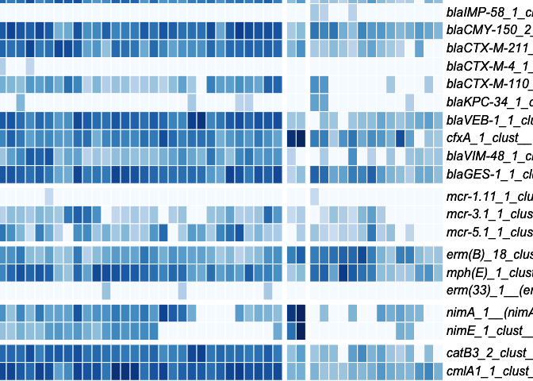<!-- -->
\#\# Heatmap for taxa

``` r
metaphlan_PHY_Species <- tax_glom(metaphlan_PHY_stat, taxrank = "Species")
# ESKAPE and other relevant taxa
selected <- subset_taxa(metaphlan_PHY_Species,  Species == "Acinetobacter_baumannii" | Species == "Acinetobacter_nosocomialis" | Species == "Acinetobacter_towneri" | Species == "Acinetobacter_bohemicus" | Species == "Acinetobacter_parvus" | Species == "Acinetobacter_johnsonii" | Species == "Enterobacter_cloacae_complex" | Species == "Enterococcus_faecium" | Species == "Klebsiella_pneumoniae" | Species == "Staphylococcus_aureus" | Species == "Stenotrophomonas_maltophilia" | Species == "Pseudomonas_aeruginosa_group")

# OTU matrix
heat_OTU = as(otu_table(selected), "matrix")
# Coerce to data.frame
heat.df = as.data.frame(heat_OTU)

# Tax table matrix
heat_tax = as(tax_table(selected), "matrix")

# Swap colnames
match <- match(rownames(heat.df), rownames(heat_tax))
temp <- heat_tax[match,]
all(rownames(temp) == rownames(heat_OTU))
```

    ## [1] TRUE

``` r
all(rownames(temp) == rownames(heat_tax))
```

    ## [1] TRUE

``` r
rownames(heat.df) <- temp[, 7]

new_df <- heat.df[ order(row.names(heat.df)), ]
new_tax = heat_tax
rownames(new_tax) <- paste(selected@tax_table[,7])
new_tax[ order(row.names(new_tax)), ]
```

    ##                              Kingdom    Phylum           Class                
    ## Acinetobacter_baumannii      "Bacteria" "Proteobacteria" "Gammaproteobacteria"
    ## Acinetobacter_bohemicus      "Bacteria" "Proteobacteria" "Gammaproteobacteria"
    ## Acinetobacter_johnsonii      "Bacteria" "Proteobacteria" "Gammaproteobacteria"
    ## Acinetobacter_nosocomialis   "Bacteria" "Proteobacteria" "Gammaproteobacteria"
    ## Acinetobacter_parvus         "Bacteria" "Proteobacteria" "Gammaproteobacteria"
    ## Acinetobacter_towneri        "Bacteria" "Proteobacteria" "Gammaproteobacteria"
    ## Enterobacter_cloacae_complex "Bacteria" "Proteobacteria" "Gammaproteobacteria"
    ## Enterococcus_faecium         "Bacteria" "Firmicutes"     "Bacilli"            
    ## Klebsiella_pneumoniae        "Bacteria" "Proteobacteria" "Gammaproteobacteria"
    ## Pseudomonas_aeruginosa_group "Bacteria" "Proteobacteria" "Gammaproteobacteria"
    ## Staphylococcus_aureus        "Bacteria" "Firmicutes"     "Bacilli"            
    ## Stenotrophomonas_maltophilia "Bacteria" "Proteobacteria" "Gammaproteobacteria"
    ##                              Order              Family              
    ## Acinetobacter_baumannii      "Pseudomonadales"  "Moraxellaceae"     
    ## Acinetobacter_bohemicus      "Pseudomonadales"  "Moraxellaceae"     
    ## Acinetobacter_johnsonii      "Pseudomonadales"  "Moraxellaceae"     
    ## Acinetobacter_nosocomialis   "Pseudomonadales"  "Moraxellaceae"     
    ## Acinetobacter_parvus         "Pseudomonadales"  "Moraxellaceae"     
    ## Acinetobacter_towneri        "Pseudomonadales"  "Moraxellaceae"     
    ## Enterobacter_cloacae_complex "Enterobacterales" "Enterobacteriaceae"
    ## Enterococcus_faecium         "Lactobacillales"  "Enterococcaceae"   
    ## Klebsiella_pneumoniae        "Enterobacterales" "Enterobacteriaceae"
    ## Pseudomonas_aeruginosa_group "Pseudomonadales"  "Pseudomonadaceae"  
    ## Staphylococcus_aureus        "Bacillales"       "Staphylococcaceae" 
    ## Stenotrophomonas_maltophilia "Xanthomonadales"  "Xanthomonadaceae"  
    ##                              Genus              Species                       
    ## Acinetobacter_baumannii      "Acinetobacter"    "Acinetobacter_baumannii"     
    ## Acinetobacter_bohemicus      "Acinetobacter"    "Acinetobacter_bohemicus"     
    ## Acinetobacter_johnsonii      "Acinetobacter"    "Acinetobacter_johnsonii"     
    ## Acinetobacter_nosocomialis   "Acinetobacter"    "Acinetobacter_nosocomialis"  
    ## Acinetobacter_parvus         "Acinetobacter"    "Acinetobacter_parvus"        
    ## Acinetobacter_towneri        "Acinetobacter"    "Acinetobacter_towneri"       
    ## Enterobacter_cloacae_complex "Enterobacter"     "Enterobacter_cloacae_complex"
    ## Enterococcus_faecium         "Enterococcus"     "Enterococcus_faecium"        
    ## Klebsiella_pneumoniae        "Klebsiella"       "Klebsiella_pneumoniae"       
    ## Pseudomonas_aeruginosa_group "Pseudomonas"      "Pseudomonas_aeruginosa_group"
    ## Staphylococcus_aureus        "Staphylococcus"   "Staphylococcus_aureus"       
    ## Stenotrophomonas_maltophilia "Stenotrophomonas" "Stenotrophomonas_maltophilia"

``` r
# Col annotation
country <- as.matrix(sample_data(selected)[["country"]])
country <- as.factor(country)
country <- data.frame(country)
colnames(country) <- c("country")
rownames(country) <- as.matrix(colnames(otu_table(selected)))
country$country <- gsub(" ", "_", country$country)

ann_colors <- list(country = c("Benin" = "#B2182B", 
                                    "Burkina_Faso" = "#44AA99", 
                                    "Finland" = "#2166AC"))

colnames(new_df) <- gsub(pattern = "_[A-Z].*", replacement = "", colnames(new_df))

## Plot log
newnames <- lapply(
  rownames(new_df),
  function(x) bquote(italic(.(x))))

heat <- pheatmap(sqrt(new_df), cluster_rows = F, cluster_cols = T, 
                        border_color = "grey",
                        colorRampPalette(brewer.pal(9, "Blues"))(100), 
                        main = "Relative abundance of clinically relevant species,\n (Metaphlan3, square root transormed)", 
                        angle_col = 90, legend = TRUE, fontsize_row = 11,
                        labels_row = as.expression(newnames),
                        filename = "eskape_heat.png",
                        annotation_col = country,
                        clustering_distance_cols = "euclidean",
                        show_colnames = T,
                 cellwidth = 13,
                 cellheight = 26,
                 gaps_row = rep(c(1, 6, 7, 8, 9, 10, 11)),
                 annotation_colors = ann_colors
                        )
heat
```

## 15 most abundant ARGs / country

``` r
# Benin
resfinder_PHY_stat_Ben <- subset_samples(resfinder_PHY_stat, country == "Benin")

resfinder_PHY_stat_Ben_abun <- tax_glom(resfinder_PHY_stat_Ben, taxrank = "Gene")

# Take 15 most abundant
resfinder_PHY_stat_Ben_abun <- prune_taxa(names(sort(taxa_sums(resfinder_PHY_stat_Ben_abun), TRUE)[1:15]), 
    resfinder_PHY_stat_Ben_abun)

cols <- get_palette(c("#332288", "#117733", "#44AA99", "#88CCEE", "#DDCC77", "#CC6677", "#AA4499", "#882255", "#5F5E98"), 18)
rfc <- plot_bar(resfinder_PHY_stat_Ben_abun, fill = "Gene") 
rfc_plot_Ben <- rfc +
  geom_bar(stat="identity", color = NA, size = 0) +
  scale_fill_manual(values = cols) +
  labs(y = expression(bold("Relative abundance of ARGs (ResFinder)"))) +
  ggtitle("ARG Abundance normalized to 16s rRNA") +
  theme_minimal() +
  theme(axis.text.x = element_text(size = 12, family = "Times", face = "bold", angle = 45, hjust = 1),
        axis.text.y = element_text(size = 28, family = "Times", face = "bold"),
        axis.title.y = element_text(size = 30, family = "Times"),
        axis.title.x = element_blank(),
        legend.text = element_text(size = 18, family = "Times"),
        legend.title = element_blank(),
        legend.key = element_rect(size = 2, color = "white"),
        legend.key.size = unit(1, "cm"),
        legend.spacing.y = unit(2.2, "char"),
        panel.background = element_rect(fill = "#FFFCF3"),
        panel.grid.minor = element_blank(),
        panel.grid.major = element_blank(),
        plot.title = element_text(size = 30, family = "Times", face = "bold")) +
  facet_grid(~country, scales = "free", space = "free", labeller = label_wrap_gen(width = 20, multi_line = TRUE)) +
  theme(strip.text.x= element_text(size = 24, family = "Times", hjust = 0.5, vjust = 0.5, angle = 0),
        strip.background = element_rect(colour = "white"))

# BF
resfinder_PHY_stat_BF <- subset_samples(resfinder_PHY_stat, country == "Burkina Faso")

resfinder_PHY_stat_BF_abun <- tax_glom(resfinder_PHY_stat_BF, taxrank = "Gene")

# Take 15 most abundant
resfinder_PHY_stat_BF_abun <- prune_taxa(names(sort(taxa_sums(resfinder_PHY_stat_BF_abun), TRUE)[1:15]), 
    resfinder_PHY_stat_BF_abun)

cols <- get_palette(c("#332288", "#117733", "#44AA99", "#88CCEE", "#DDCC77", "#CC6677", "#AA4499", "#882255", "#5F5E98"), 18)
rfc <- plot_bar(resfinder_PHY_stat_BF_abun, fill = "Gene") 
rfc_plot_BF <- rfc +
  geom_bar(stat="identity", color = NA, size = 0) +
  scale_fill_manual(values = cols) +
  labs(y = expression(bold("Relative abundance of ARGs (ResFinder)"))) +
  ggtitle("ARG Abundance normalized to 16s rRNA") +
  theme_minimal() +
  theme(axis.text.x = element_text(size = 12, family = "Times", face = "bold", angle = 45, hjust = 1),
        axis.text.y = element_text(size = 28, family = "Times", face = "bold"),
        axis.title.y = element_text(size = 30, family = "Times"),
        axis.title.x = element_blank(),
        legend.text = element_text(size = 18, family = "Times"),
        legend.title = element_blank(),
        legend.key = element_rect(size = 2, color = "white"),
        legend.key.size = unit(1, "cm"),
        legend.spacing.y = unit(2.2, "char"),
        panel.background = element_rect(fill = "#FFFCF3"),
        panel.grid.minor = element_blank(),
        panel.grid.major = element_blank(),
        plot.title = element_text(size = 30, family = "Times", face = "bold")) +
  facet_grid(~country, scales = "free", space = "free", labeller = label_wrap_gen(width = 20, multi_line = TRUE)) +
  theme(strip.text.x= element_text(size = 24, family = "Times", hjust = 0.5, vjust = 0.5, angle = 0),
        strip.background = element_rect(colour = "white"))

# Finland
resfinder_PHY_stat_Fin <- subset_samples(resfinder_PHY_stat, country == "Finland")

resfinder_PHY_stat_Fin_abun <- tax_glom(resfinder_PHY_stat_Fin, taxrank = "Gene")

# Take 15 most abundant
resfinder_PHY_stat_Fin_abun <- prune_taxa(names(sort(taxa_sums(resfinder_PHY_stat_Fin_abun), TRUE)[1:15]), 
    resfinder_PHY_stat_Fin_abun)

cols <- get_palette(c("#332288", "#117733", "#44AA99", "#88CCEE", "#DDCC77", "#CC6677", "#AA4499", "#882255", "#5F5E98"), 18)
rfc <- plot_bar(resfinder_PHY_stat_Fin_abun, fill = "Gene") 
rfc_plot_Fin <- rfc +
  geom_bar(stat="identity", color = NA, size = 0) +
  scale_fill_manual(values = cols) +
  labs(y = expression(bold("Relative abundance of ARGs (ResFinder)"))) +
  ggtitle("ARG Abundance normalized to 16s rRNA") +
  theme_minimal() +
  theme(axis.text.x = element_text(size = 12, family = "Times", face = "bold", angle = 45, hjust = 1),
        axis.text.y = element_text(size = 28, family = "Times", face = "bold"),
        axis.title.y = element_text(size = 30, family = "Times"),
        axis.title.x = element_blank(),
        legend.text = element_text(size = 18, family = "Times"),
        legend.title = element_blank(),
        legend.key = element_rect(size = 2, color = "white"),
        legend.key.size = unit(1, "cm"),
        legend.spacing.y = unit(2.2, "char"),
        panel.background = element_rect(fill = "#FFFCF3"),
        panel.grid.minor = element_blank(),
        panel.grid.major = element_blank(),
        plot.title = element_text(size = 30, family = "Times", face = "bold")) +
  facet_grid(~country, scales = "free", space = "free", labeller = label_wrap_gen(width = 20, multi_line = TRUE)) +
  theme(strip.text.x= element_text(size = 24, family = "Times", hjust = 0.5, vjust = 0.5, angle = 0),
        strip.background = element_rect(colour = "white"))

# Create dataframe
Benin <- data.frame(resfinder_PHY_stat_Ben_abun@tax_table)$Gene
BF <- data.frame(resfinder_PHY_stat_BF_abun@tax_table)$Gene
Finland <- data.frame(resfinder_PHY_stat_Fin_abun@tax_table)$Gene

top_ARGs <- data.frame(Benin, BF, Finland)

## Pristine samples
resfinder_PHY_selected <- subset_samples(resfinder_PHY, alias == "BSE74" | alias == "BSE79" | alias == "BSE93" | alias == "BSE100")

resfinder_PHY_selected_abun <- tax_glom(resfinder_PHY_selected, taxrank = "Gene")

# Take 15 most abundant
resfinder_PHY_selected_abun <- prune_taxa(names(sort(taxa_sums(resfinder_PHY_selected_abun), TRUE)[1:15]), 
    resfinder_PHY_selected_abun)

pristine <- data.frame(resfinder_PHY_selected_abun@tax_table)$Gene
```

## Interesting samples

# “clean water”

``` r
resfinder_PHY_selected <- subset_samples(resfinder_PHY, alias == "BFH27" | alias ==  "BFH42" | alias ==  "BH11" | alias ==  "BH13" | alias == "BH14" | alias == "BH32" | alias == "BH52" | alias == "BSE100" | alias == "BSE74" | alias == "BSE79" | alias == "BSE93" | alias == "BSE100")

cols <- get_palette(c("#332288", "#117733", "#44AA99", "#88CCEE", "#DDCC77", "#CC6677", "#AA4499", "#882255", "#5F5E98"), 18)
rfc <- plot_bar(resfinder_PHY_selected, fill = "Class") 
rfc_plot <- rfc +
  geom_bar(stat="identity", color = NA, size = 0) +
  scale_fill_manual(values = cols) +
  labs(y = expression(bold("Relative abundance of ARGs (ResFinder)"))) +
  ggtitle("ARG Abundance normalized to 16s rRNA") +
  theme_minimal() +
  theme(axis.text.x = element_text(size = 12, family = "Times", face = "bold", angle = 45, hjust = 1),
        axis.text.y = element_text(size = 28, family = "Times", face = "bold"),
        axis.title.y = element_text(size = 30, family = "Times"),
        axis.title.x = element_blank(),
        legend.text = element_text(size = 18, family = "Times"),
        legend.title = element_blank(),
        legend.key = element_rect(size = 2, color = "white"),
        legend.key.size = unit(1, "cm"),
        legend.spacing.y = unit(2.2, "char"),
        panel.background = element_rect(fill = "#FFFCF3"),
        panel.grid.minor = element_blank(),
        panel.grid.major = element_blank(),
        plot.title = element_text(size = 30, family = "Times", face = "bold")) +
  facet_grid(~category, scales = "free", space = "free", labeller = label_wrap_gen(width = 15, multi_line = TRUE)) +
  theme(strip.text.x= element_text(size = 18, family = "Times", hjust = 0.5, vjust = 0.5, angle = 0),
        strip.background = element_rect(colour = "white"))

# Taxonomy
metaphlan_PHY_selected <- subset_samples(metaphlan_PHY, alias == "BFH27" | alias ==  "BFH42" | alias ==  "BH11" | alias ==  "BH13" | alias == "BH14" | alias == "BH32" | alias == "BH52" | alias == "BSE100" | alias == "BSE74" | alias == "BSE79" | alias == "BSE93" | alias == "BSE100")

metaphlan_PHY_Genus <- tax_glom(metaphlan_PHY_selected, taxrank = "Genus")
metaphlan_PHY_Genus_abund <- prune_taxa(names(sort(taxa_sums(metaphlan_PHY_Genus), TRUE)[1:15]), metaphlan_PHY_Genus)

cols <- get_palette(c("#332288", "#117733", "#44AA99", "#88CCEE", "#DDCC77", "#CC6677", "#AA4499", "#882255", "#5F5E98", "#331225"), 15)
mp <- plot_bar(metaphlan_PHY_Genus_abund, fill = "Genus") 
mp_plot <- mp +
  geom_bar(stat="identity", color = NA, size = 0) +
  scale_fill_manual(values = cols) +
  labs(y = expression(bold("Relative abundance of genera"))) +
  ggtitle("15 Most abundant genera (Metaphlan3)") +
  theme_minimal() +
  theme(axis.text.x = element_text(size = 12, family = "Times", face = "bold", angle = 45, hjust = 1),
        axis.text.y = element_text(size = 28, family = "Times", face = "bold", angle = 90),
        axis.title.y = element_text(size = 30, family = "Times"),
        axis.title.x = element_blank(),
        legend.text = element_text(size = 18, family = "Times"),
        legend.title = element_blank(),
        legend.key = element_rect(size = 2, color = "white"),
        legend.key.size = unit(1, "cm"),
        legend.spacing.y = unit(2.2, "char"),
        panel.background = element_rect(fill = "#FFFCF3"),
        panel.grid.minor = element_blank(),
        panel.grid.major = element_blank(),
        plot.title = element_text(size = 30, family = "Times", face = "bold")) +
  facet_grid(~category, scales = "free", space = "free", labeller = label_wrap_gen(width = 15, multi_line = TRUE)) +
  theme(strip.text.x= element_text(size = 18, family = "Times", hjust = 0.5, vjust = 0.5, angle = 0),
        strip.background = element_rect(colour = "white"))
```

## Interesting ARGs

# MCR

``` r
cols <- get_palette(c("#332288", "#117733", "#52BFAD", "#88CCEE", "#DDCC77", "#F22D3D", "#FDA4B3", "#882255"), 8)

resfinder_PHY_mcr <- subset_taxa(resfinder_PHY_stat, Class == "Polymyxin")

# Other samples
#resfinder_PHY_mcr_other <- subset_samples(resfinder_PHY, alias == "BFH26" | alias == "BFH27" | alias == "BFH42" | alias == "BH11" | alias == "BH13" | alias == "BH14" | alias == "BH32" | alias == "BH52" | alias == "BSE100" | alias == "BSE74" | alias == "BSE93" | alias == "BSE79")

# save sums
resfinder_PHY_mcr_pruned <- tax_glom(resfinder_PHY_mcr, taxrank = "Cluster_name")
resfinder_PHY_mcr_pruned <- subset_taxa(resfinder_PHY_mcr_pruned, Cluster_name == "mcr-3.1_1_clust")
df <- data.frame(sample_sums(resfinder_PHY_mcr_pruned))

# plot
resfinder_PHY_mcr <- subset_samples(resfinder_PHY_mcr, sample_sums(resfinder_PHY_mcr) >= 0.0005)
resfinder_PHY_mcr <- subset_taxa(resfinder_PHY_mcr, taxa_sums(resfinder_PHY_mcr) != 0)

alias <- paste(resfinder_PHY_mcr@sam_data$alias)
hospital <- paste(resfinder_PHY_mcr@sam_data$hospital)

rfc <- plot_bar(resfinder_PHY_mcr, fill = "Cluster_name")
rfc_plot <- rfc +
  geom_bar(stat="identity", color = NA, size = 0) +
  scale_fill_manual(values = cols, labels = c("mcr-1", "mcr-10", "mcr-3", "mcr-3.17", "mcr-4", "mcr-5", "mcr-7", "mcr-9")) +
  labs(y = expression(atop(bold("ARGs to 16s rRNA"), atop("ResFinder")))) +
  ggtitle("Relative abundance of ARGs") +
  scale_x_discrete(breaks=levels(factor(rownames(sample_data(resfinder_PHY_mcr)))), labels=hospital, expression(bar("x"))) +
  theme_minimal() +
  theme(axis.text.x = element_text(size = 12, family = "Times", angle = 90, face = "bold"),
        axis.text.y = element_text(size = 28, family = "Times", face = "bold", angle = 90),
        axis.title.y = element_text(size = 30, family = "Times"),
        axis.title.x = element_blank(),
        legend.text = element_text(size = 28, family = "Times", face = "italic"),
        legend.title = element_blank(),
        legend.key = element_rect(size = 2, color = "white"),
        legend.key.size = unit(1, "cm"),
        legend.spacing.y = unit(5, "char"),
        panel.background = element_rect(fill = "#FFFDF9"),
        panel.grid.minor = element_blank(),
        panel.grid.major = element_blank(),
        plot.title = element_text(size = 30, family = "Times", face = "bold")) +
  facet_grid(~country, scales = "free", space = "free", labeller = label_wrap_gen(width = 30, multi_line = TRUE)) +
  theme(strip.text.x= element_text(size = 30, family = "Times", hjust = 0, vjust = 0.5, angle = 0, face = "bold"),
        strip.background = element_rect(colour = "white")) + guides(fill=guide_legend(ncol=1))
rfc_plot
```

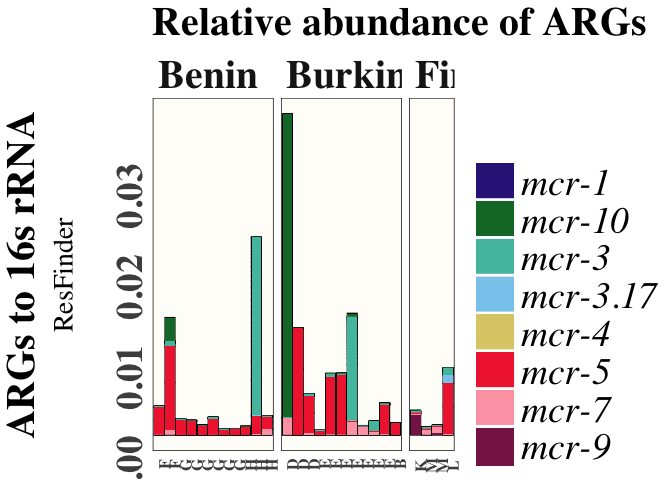<!-- -->

``` r
#ggsave(filename = "mcr_bar_plot.png",
#       width = 16, height = 13, dpi = 300, units = "in", device='png', scale = 1)

# Visualization using heatmap
#resfinder_PHY_mcr <- subset_taxa(resfinder_PHY_selected, Cluster_name == "mcr-5.1_1_clust" | Cluster_name == "mcr-1.11_1_clust" | Cluster_name == "mcr-3.17_1" | Cluster_name == "mcr-4.1_1_clust" | Cluster_name == "mcr-7.1_1" | Cluster_name == "mcr-9_1" | Cluster_name == "mcr-10_1" | Cluster_name == "mcr-8_1" | Cluster_name == "mcr-6.1_1" | Cluster_name == "mcr-2.1_1_clust")

#otu_table(resfinder_PHY_mcr)[otu_table(resfinder_PHY_mcr) < 0] <- 0
#otu_table(resfinder_PHY_mcr)[otu_table(resfinder_PHY_mcr) > 0] <- 1

#heat_df_mcr = otu_table(resfinder_PHY_mcr)

#rownames(heat_df_mcr) <- c("mcr-1.1",  "mcr-1.2",  "mcr-1.3",  "mcr-1.4",  "mcr-1.5",  "mcr-1.6",  "mcr-1.7",  "mcr-1.8",  "mcr-1.9",  "mcr-1.10", "mcr-1.11", "mcr-1.12", "mcr-1.13", "mcr-1.14", "mcr-2.1",  "mcr-2.2",  "mcr-3.17", "mcr-4.1",  "mcr-4.2",  "mcr-4.3",  "mcr-4.6",  "mcr-4.4",  "mcr-4.5",  "mcr-5.1",  "mcr-5.2",  "mcr-6.1",  "mcr-7.1",  "mcr-8",    "mcr-9",    "mcr-10")

#colnames(heat_df_mcr) <- sample_data(resfinder_PHY_mcr)$alias

#pheatmap(heat_df_mcr, cluster_cols = F, cluster_rows = T)
```

## Interesting ARGs

# MRSA & VRE & tigecycline ARGs

``` r
# mec variants
resfinder_PHY_Cluster <- subset_taxa(resfinder_PHY_stat, Cluster_name == "mecA_1_clust" | Cluster_name == "mecB_1" | Cluster_name == "mecC2_1_clust" | Cluster_name == "mecD_1")

# van variants
resfinder_PHY_Cluster <- subset_taxa(resfinder_PHY_stat, Cluster_name == "VanHAX_1_clust" | Cluster_name == "VanHAX_PA" | Cluster_name == "VanHBX_1_clust" | Cluster_name == "VanC1XY_1_clust"  | Cluster_name == "VanC3XY_1_clust" | Cluster_name == "VanHDX_6" | Cluster_name == "VanHDX_7_clust" | Cluster_name == "VanHDX_3_clust" | Cluster_name == "VanHFX_1" | Cluster_name == "VanE_1_clust" | Cluster_name == "VanGXY_1" | Cluster_name == "VanG2XY_1" | Cluster_name == "VanLXY_1" | Cluster_name == "VanHMX_1" | Cluster_name == "VanNXY_1" | Cluster_name == "VanHOX_1" | Cluster_name == "vanXmurFvanWI_1" | Cluster_name == "vanXmurFvanKWI_1" | Cluster_name == "vanXmurFvanKWI_2")

# tigecycline
resfinder_PHY_Cluster <- subset_taxa(resfinder_PHY_stat, Cluster_name == "tet(X)_1_clust" | Cluster_name == "tet(X3)_1" |
                                           Cluster_name == "tet(X)_3_clust" | Cluster_name == "tet(37)_1" |
                                           Cluster_name == "tet(47)_1" | Cluster_name == "tet(48)_1" |
                                           Cluster_name == "tet(49)_1" | Cluster_name == "tet(50)_1" |
                                           Cluster_name == "tet(51)_1" | Cluster_name == "tet(52)_1" |
                                           Cluster_name == "tet(53)_1" | Cluster_name == "tet(54)_1" |
                                           Cluster_name == "tet(55)_1")

resfinder_PHY_Cluster <- subset_samples(resfinder_PHY_Cluster, sample_sums(resfinder_PHY_Cluster) != 0)

cols <- get_palette(c("#332288", "#117733", "#44AA99", "#88CCEE", "#DDCC77", "#CC6677", "#AA4499", "#882255", "#5F5E98", "#331225"), 43)
rfc <- plot_bar(resfinder_PHY_Cluster, fill = "Gene") 
rfc_plot <- rfc +
  geom_bar(stat="identity", color = NA, size = 0) +
  scale_fill_manual(values = cols) +
  labs(y = expression(atop(bold("ARGs to 16s rRNA"), atop("ResFinder")))) +
  ggtitle("Relative abundance of ARGs") +
  theme_minimal() +
  theme(axis.text.x = element_text(size = 9, family = "Times", angle = 45, hjust = 1),
        axis.text.y = element_text(size = 28, family = "Times", face = "bold", angle = 90),
        axis.title.y = element_text(size = 30, family = "Times"),
        axis.title.x = element_blank(),
        legend.text = element_text(size = 18, family = "Times"),
        legend.title = element_blank(),
        legend.key = element_rect(size = 2, color = "white"),
        legend.key.size = unit(1, "cm"),
        legend.spacing.y = unit(2.2, "char"),
        panel.background = element_rect(fill = "#FFFCF3"),
        panel.grid.minor = element_blank(),
        panel.grid.major = element_blank(),
        plot.title = element_text(size = 30, family = "Times", face = "bold")) +
  facet_grid(~country, scales = "free", space = "free", labeller = label_wrap_gen(width = 30, multi_line = TRUE)) +
  theme(strip.text.x= element_text(size = 20, family = "Times", hjust = 0, vjust = 0.5, angle = 0, face = "bold"),
        strip.background = element_rect(colour = "white"))

# Check out also with the CARD data
CARD_PHY_Cluster <- subset_taxa(CARD_PHY_stat, Class == "glycylcycline")
CARD_PHY_Cluster <- subset_taxa(CARD_PHY_Cluster, Gene == "tetX" |
                                      Gene == "Tet(X4)" | Gene == "Tet(X3)" |
                                      Gene == "Tet(47)" | Gene == "tet(48)" |
                                      Gene == "tet(49)" | Gene == "tet(51)" |
                                      Gene == "tet(56)")

CARD_PHY_Cluster <- subset_samples(CARD_PHY_Cluster, sample_sums(CARD_PHY_Cluster) != 0)

cols <- get_palette(c("#332288", "#117733", "#44AA99", "#88CCEE", "#DDCC77", "#CC6677", "#AA4499", "#882255", "#5F5E98", "#331225"), 24)
card <- plot_bar(CARD_PHY_Cluster, fill = "Gene") 
card_plot <- card +
  geom_bar(stat="identity", color = NA, size = 0) +
  scale_fill_manual(values = cols) +
  labs(y = expression(atop(bold("ARGs to 16s rRNA"), atop("CARD")))) +
  ggtitle("Relative abundance of ARGs") +
  theme_minimal() +
  theme(axis.text.x = element_text(size = 9, family = "Times", angle = 45, hjust = 1),
        axis.text.y = element_text(size = 28, family = "Times", face = "bold", angle = 90),
        axis.title.y = element_text(size = 30, family = "Times"),
        axis.title.x = element_blank(),
        legend.text = element_text(size = 18, family = "Times"),
        legend.title = element_blank(),
        legend.key = element_rect(size = 2, color = "white"),
        legend.key.size = unit(1, "cm"),
        legend.spacing.y = unit(2.2, "char"),
        panel.background = element_rect(fill = "#FFFCF3"),
        panel.grid.minor = element_blank(),
        panel.grid.major = element_blank(),
        plot.title = element_text(size = 30, family = "Times", face = "bold")) +
  facet_grid(~country, scales = "free", space = "free", labeller = label_wrap_gen(width = 30, multi_line = TRUE)) +
  theme(strip.text.x= element_text(size = 20, family = "Times", hjust = 0, vjust = 0.5, angle = 0, face = "bold"),
        strip.background = element_rect(colour = "white"))
```

## Interesting ARGs

# Carbapenemases

``` r
resfinder_PHY_Cluster_1 <- subset_taxa(resfinder_PHY_stat, Cluster_name == "blaKPC-34_1_clust"| Cluster_name == "blaNDM-18_1_clust" | Cluster_name == "blaVIM-48_1_clust" | Cluster_name == "blaIMP-1_1_clust" | Cluster_name == "blaOXA-397_1_clust")

resfinder_PHY_Cluster_2 <- subset_taxa(resfinder_PHY_stat, Gene == "blaGES-2_1_AF326355" | Gene == "blaGES-4_1_AB116723" | Gene == "blaGES-5_1_DQ236171" 
                                       | Gene == "blaGES-6_1_AY494718" | Gene == "blaGES-14_1_GU207844" | Gene == "blaGES-16_1_HM173356" 
                                       | Gene == "blaGES-18_1_JQ028729" | Gene == "blaGES-20_1_JN596280" # carbapenemase blaGES
                                       
                                       | Gene == "blaOXA-48_1_AY236073" | Gene == "blaOXA-162_1_GU197550" | Gene == "blaOXA-181_1_CM004561" 
                                       | Gene == "blaOXA-199_1_JN704570" | Gene == "blaOXA-204_1_KP027885" | Gene == "blaOXA-232_1_JX423831" 
                                       | Gene == "blaOXA-244_1_KP659189" | Gene == "blaOXA-245_1_JX438001" | Gene == "blaOXA-247_1_JX893517" 
                                       | Gene == "blaOXA-247_1_JX893517" | Gene == "blaOXA-514_1_KU866382" | Gene == "blaOXA-515_1_KU866383" 
                                       | Gene == "blaOXA-517_1_KU878974") # blaOXA-48-like

resfinder_PHY_Cluster <- merge_phyloseq(resfinder_PHY_Cluster_1, resfinder_PHY_Cluster_2)

#resfinder_PHY_Cluster <- subset_samples(resfinder_PHY_Cluster, sample_sums(resfinder_PHY_Cluster) != 0)

cols <- get_palette(c("#332288", "#117733", "#52BFAD", "#88CCEE", "#DDCC77", "#FDA4B3", "#F22D3D", "#882255", "#5F5E98", "#E4C960", "#FD8FD9"), 11)
names <- paste(resfinder_PHY_Cluster@sam_data$hospital)

rfc <- plot_bar(resfinder_PHY_Cluster, fill = "Cluster_name") 
rfc_plot <- rfc +
  geom_bar(stat="identity", color = NA, size = 0) +
  scale_fill_manual(values = cols, labels = c("blaGES", "blaIMP", "blaKPC", "blaNDM", "blaOXA-48", "blaOXA-58", "blaVIM")) +
  labs(y = expression(atop(bold("ARGs/16s rRNA"), atop("ResFinder")))) +
  ggtitle("Relative abundance of ARGs in hospital WW samples") +
  scale_x_discrete(breaks=levels(factor(rownames(sample_data(resfinder_PHY_Cluster)))), labels=names, expression(bar("x"))) +
  theme_minimal() +
  theme(axis.text.x = element_text(size = 12, family = "Times", angle = 0, face = "bold"),
        axis.text.y = element_text(size = 28, family = "Times", face = "bold", angle = 90),
        axis.title.y = element_text(size = 30, family = "Times"),
        axis.title.x = element_blank(),
        legend.text = element_text(size = 28, family = "Times", face = "italic"),
        legend.title = element_blank(),
        legend.key = element_rect(size = 2, color = "white"),
        legend.key.size = unit(1, "cm"),
        legend.spacing.y = unit(5, "char"),
        panel.background = element_rect(fill = "#FFFDF9"),
        panel.grid.minor = element_blank(),
        panel.grid.major = element_blank(),
        plot.title = element_text(size = 30, family = "Times", face = "bold")) +
  facet_grid(~country, scales = "free", space = "free", labeller = label_wrap_gen(width = 30, multi_line = TRUE)) +
  theme(strip.text.x= element_text(size = 30, family = "Times", hjust = 0, vjust = 0.5, angle = 0, face = "bold"),
        strip.background = element_rect(colour = "white")) + guides(fill=guide_legend(ncol=1))

#ggsave(filename = "carbapenemases.png",
#       width = 16, height = 13, dpi = 300, units = "in", device='png', scale = 1) 

# Check out also with the CARD data
CARD_PHY_Cluster <- subset_taxa(CARD_PHY_stat, Class == "carbapenem")
CARD_PHY_Cluster <- subset_taxa(CARD_PHY_stat, Gene == "KPC-4" | Gene == "KPC-8" | Gene == "KPC-10" | Gene == "KPC-12" | Gene == "NDM-10" | Gene == "NDM-6" | Gene == "NDM-24" | Gene == "NDM-13" | Gene == "GES-14" | Gene == "GES-15" | Gene == "GES-18" | Gene == "GES-20" | Gene == "GES-21" | Gene == "VIM-5" | Gene == "VIM-6" | Gene == "VIM-7" | Gene == "VIM-8" | Gene == "VIM-12" | Gene == "VIM-17" | Gene == "VIM-30" | Gene == "VIM-35" | Gene == "VIM-37" | Gene == "VIM-38" | Gene == "IMP-1" | Gene == "IMP-2" | Gene == "IMP-4" | Gene == "IMP-11" | Gene == "IMP-14" | Gene == "IMP-15" | Gene == "IMP-28" | Gene == "IMP-29"| Gene == "IMP-31" | Gene == "IMP-33" | Gene == "IMP-26" | Gene == "IMP-42" | Gene == "IMP-48" | Gene == "IMP-51" | Gene == "OXA-2")

CARD_PHY_Cluster <- subset_samples(CARD_PHY_Cluster, sample_sums(CARD_PHY_Cluster) != 0)

cols <- get_palette(c("#332288", "#117733", "#44AA99", "#88CCEE", "#DDCC77", "#CC6677", "#AA4499", "#882255", "#5F5E98", "#331225"), 38)
card <- plot_bar(CARD_PHY_Cluster, fill = "Gene") 
card_plot <- card +
  geom_bar(stat="identity", color = NA, size = 0) +
  scale_fill_manual(values = cols) +
  labs(y = expression(atop(bold("ARGs to 16s rRNA"), atop("CARD")))) +
  ggtitle("Relative abundance of ARGs") +
  theme_minimal() +
  theme(axis.text.x = element_text(size = 9, family = "Times", angle = 45, hjust = 1),
        axis.text.y = element_text(size = 28, family = "Times", face = "bold", angle = 90),
        axis.title.y = element_text(size = 30, family = "Times"),
        axis.title.x = element_blank(),
        legend.text = element_text(size = 18, family = "Times"),
        legend.title = element_blank(),
        legend.key = element_rect(size = 2, color = "white"),
        legend.key.size = unit(1, "cm"),
        legend.spacing.y = unit(2.2, "char"),
        panel.background = element_rect(fill = "#FFFCF3"),
        panel.grid.minor = element_blank(),
        panel.grid.major = element_blank(),
        plot.title = element_text(size = 30, family = "Times", face = "bold")) +
  facet_grid(~country, scales = "free", space = "free", labeller = label_wrap_gen(width = 30, multi_line = TRUE)) +
  theme(strip.text.x= element_text(size = 20, family = "Times", hjust = 0, vjust = 0.5, angle = 0, face = "bold"),
        strip.background = element_rect(colour = "white"))
```

# Taxonomy

``` r
# 15 most abundant taxa in hospital WW in each country
metaphlan_PHY_Ben <- subset_samples(metaphlan_PHY_stat, country == "Benin")
metaphlan_PHY_BF <- subset_samples(metaphlan_PHY_stat, country == "Burkina Faso")
metaphlan_PHY_Fin <- subset_samples(metaphlan_PHY_stat, country == "Finland")

# At genus level
metaphlan_PHY_Genus <- tax_glom(metaphlan_PHY_Ben, taxrank = "Genus")
metaphlan_PHY_Genus_abund <- prune_taxa(names(sort(taxa_sums(metaphlan_PHY_Genus), TRUE)[1:15]), metaphlan_PHY_Genus)
#tax_table(metaphlan_PHY_Genus_abund)
# At species level
metaphlan_PHY_Species <- tax_glom(metaphlan_PHY_Ben, taxrank = "Species")
metaphlan_PHY_Species_abund <- prune_taxa(names(sort(taxa_sums(metaphlan_PHY_Species), TRUE)[1:15]), metaphlan_PHY_Species)
#tax_table(metaphlan_PHY_Species_abund)

# Check out the prevalence for some clinically relevant taxa
# Stenotrophomonas_maltophilia & Acinetobacter spp. & Enterococcus & Staphylococcus
metaphlan_PHY_Species <- tax_glom(metaphlan_PHY_stat, taxrank = "Species")
metaphlan_PHY_selected <- subset_taxa(metaphlan_PHY_Species, Species == "Stenotrophomonas_maltophilia")
metaphlan_PHY_selected <- subset_samples(metaphlan_PHY_selected, sample_sums(metaphlan_PHY_selected) != 0)

metaphlan_PHY_Genus <- tax_glom(metaphlan_PHY_stat, taxrank = "Genus")
metaphlan_PHY_selected <- subset_taxa(metaphlan_PHY_Species, Genus == "Enterococcus")
metaphlan_PHY_selected <- subset_samples(metaphlan_PHY_selected, sample_sums(metaphlan_PHY_selected) != 0)

metaphlan_PHY_Genus <- tax_glom(metaphlan_PHY_stat, taxrank = "Genus")
metaphlan_PHY_selected <- subset_taxa(metaphlan_PHY_Genus, Genus == "Staphylococcus")
metaphlan_PHY_selected <- subset_samples(metaphlan_PHY_selected, sample_sums(metaphlan_PHY_selected) != 0)

cols <- get_palette(c("#332288", "#117733", "#44AA99", "#88CCEE", "#DDCC77", "#CC6677", "#AA4499", "#882255", "#5F5E98", "#331225"), 15)
mp <- plot_bar(metaphlan_PHY_selected, fill = "Genus") 
mp_plot <- mp +
  geom_bar(stat="identity", color = NA, size = 0) +
  scale_fill_manual(values = cols) +
  labs(y = expression(bold("Relative abundance of genera"))) +
  ggtitle("Species possibly showing intrinsic resistance to carbapenems (Metaphlan3)") +
  theme_minimal() +
  theme(
    #axis.text.x = element_blank(),
    axis.text.x = element_text(size = 9, family = "Times", angle = 90, hjust = 1),
        axis.text.y = element_text(size = 28, family = "Times", face = "bold", angle = 90),
        axis.title.y = element_text(size = 30, family = "Times"),
        axis.title.x = element_blank(),
        legend.text = element_text(size = 19, family = "Times"),
        legend.title = element_blank(),
        legend.key = element_rect(size = 2, color = "white"),
        legend.key.size = unit(1, "cm"),
        legend.spacing.y = unit(2.2, "char"),
        panel.background = element_rect(fill = "#FFFDF9"),
        panel.grid.minor = element_blank(),
        panel.grid.major = element_blank(),
        plot.title = element_text(size = 30, family = "Times", face = "bold")) +
  facet_grid(~country, scales = "free", space = "free", labeller = label_wrap_gen(width = 30, multi_line = TRUE)) +
  theme(strip.text.x= element_text(size = 26, family = "Times", hjust = 0, vjust = 0.5, angle = 0, face = "bold"),
        strip.background = element_rect(colour = "white")) + guides(fill=guide_legend(ncol=2))
```

# Global sewage, mcr (Hendriksen et al.)

``` r
#GlobalSewage_ResFinder <- readRDS("GlobalSewage_ResFinder.rds")
#tax_table_GlobalSewage <- data.frame(tax_table(GlobalSewage_ResFinder))
#OTU_table_GlobalSewage <- data.frame(t(otu_table(GlobalSewage_ResFinder)))
#GlobalSewage_metadata <- data.frame(GlobalSewage_ResFinder@sam_data)

# Add country as column to metadata (GlobalSewage_metadata)
#GlobalSewage_metadata$country <- rownames(GlobalSewage_metadata)
#rownames(GlobalSewage_metadata)[rownames(GlobalSewage_metadata) == "Viet Nam"] <- "Viet.Nam"
#rownames(GlobalSewage_metadata)[rownames(GlobalSewage_metadata) == "Sri Lanka"] <- "Sri.Lanka"
#rownames(GlobalSewage_metadata)[rownames(GlobalSewage_metadata) == "South Africa"] <- "South.Africa"
#rownames(GlobalSewage_metadata)[rownames(GlobalSewage_metadata) == "New Zealand"] <- "New.Zealand"
#rownames(GlobalSewage_metadata)[rownames(GlobalSewage_metadata) == "Czech Republic"] <- "Czech.Republic"
#rownames(GlobalSewage_metadata)[rownames(GlobalSewage_metadata) == "Cote d'Ivoire"] <- "Cote.d.Ivoire"

#GlobalSewage_metadata$continent <- c("Europe", "Oceania", "Europe", "Africa", "South America", "Europe", "Africa", "North America", "Africa", "Asia", "South America", "Africa", "Europe", "Europe", "Europe", "South America", "Africa", "Europe", "Africa", "Europe", "Europe", "Africa", "Europe", "Europe", "Asia", "Middle East", "Europe", "Middle East", "Europe", "Asia", "Africa", "Europe", "Europe", "Europe", "Europe", "Asia", "Europe", "Europe", "Asia", "Europe", "Oceania", "Africa", "Europe", "Asia", "South America", "Europe", "Africa", "Europe", "Asia", "Europe", "Europe", "Africa", "Europe", "Asia", "Europe", "Europe", "Africa", "Africa", "Middle East", "North America", "Asia", "Africa")

# Check
#identical(rownames(OTU_table_GlobalSewage), rownames(tax_table_GlobalSewage))
#all(colnames(OTU_table_GlobalSewage) == rownames(GlobalSewage_metadata))

#GlobalSewage_ResFinder <- phyloseq(otu_table(OTU_table_GlobalSewage, taxa_are_rows=TRUE), 
#                       tax_table(as.matrix(tax_table_GlobalSewage)), sample_data(GlobalSewage_metadata))

# All
#GlobalSewage_ResFinder_mcr <- subset_taxa(GlobalSewage_ResFinder, Gene == "mcr-3.20" | Gene == "mcr-3.4" | Gene == "mcr-1.3" | Gene == "mcr-3.8" | Gene == "mcr-1.14" | Gene == "mcr-4.3" | Gene == "mcr-3.24" | Gene == "mcr-1.13" | Gene == "mcr-3.19" | Gene == "mcr-3.15" | Gene == "mcr-8" | Gene == "mcr-3.17" | Gene == "mcr-3.11" | Gene == "mcr-3.16" | Gene == "mcr-1.2" | Gene == "mcr-1.1" | Gene == "mcr-3.6" | Gene == "mcr-4.6" | Gene == "mcr-3.21" | Gene == "mcr-3.9" | Gene == "mcr-3.25" | Gene == "mcr-2.2" | Gene == "mcr-3.2" | Gene == "mcr-3.1" | Gene == "mcr-4.4" | Gene == "mcr-3.13" | Gene == "mcr-4.2" | Gene == "mcr-1.5" | Gene == "mcr-3.12" | Gene == "mcr-3.10" | Gene == "mcr-3.23" | Gene == "mcr-4.5" | Gene == "mcr-3.3" | Gene == "mcr-3.18" | Gene == "mcr-3.5" | Gene == "mcr-4.1" | Gene == "mcr-7.1" | Gene == "mcr-3.7" | Gene == "mcr-3.14" | Gene == "mcr-5.2" | Gene == "mcr-5.1")

# Variants
#GlobalSewage_ResFinder_mcr <- subset_taxa(GlobalSewage_ResFinder, Gene == "mcr-5.1" | Gene == "mcr-5.2")

#cols <- get_palette(c("#332288", "#117733", "#44AA99", "#88CCEE", "#DDCC77", "#CC6677", "#AA4499", "#882255", "#5F5E98"), 41)
#rfc <- plot_bar(GlobalSewage_ResFinder_mcr, fill = "Gene") 
#rfc_plot <- rfc +
#  geom_bar(stat="identity", color = NA, size = 0) +
#  scale_fill_manual(values = cols) +
#  labs(y = expression(bold("Relative abundance (ResFinder)"))) +
#  ggtitle("ARG Abundance normalized to 16s rRNA") +
#  theme_minimal() +
#  theme(axis.text.x = element_text(size = 10, family = "Times", face = "bold", angle = 90),
#        axis.text.y = element_text(size = 28, family = "Times", face = "bold", angle = 90),
#        axis.title.y = element_text(size = 30, family = "Times"),
#        axis.title.x = element_blank(),
#        legend.text = element_text(size = 18, family = "Times"),
#        legend.title = element_blank(),
#        legend.key = element_rect(size = 2, color = "white"),
#        legend.key.size = unit(1, "cm"),
#        legend.spacing.y = unit(2.2, "char"),
#        panel.background = element_rect(fill = "#FFFCF3"),
#        panel.grid.minor = element_blank(),
#        panel.grid.major = element_blank(),
#        plot.title = element_text(size = 30, family = "Times", face = "bold")) +
#  facet_grid(~continent, scales = "free", space = "free", labeller = label_wrap_gen(width = 15, multi_line = TRUE)) +
#  theme(strip.text.x= element_text(size = 24, family = "Times", hjust = 0.5, vjust = 0.5, angle = 0),
#        strip.background = element_rect(colour = "white"))
```

## Mantel tests

``` r
# horn-morisita
ARG_dist <- vegdist(t(as.matrix(otu_table(resfinder_PHY_stat))), method = "horn")

MGE_dist <- vegdist(t(as.matrix(otu_table(MGE_PHY_stat))), method = "horn")

intI1_dist <- vegdist(t(as.matrix(otu_table(MGE_PHY_int_stat))), method = "horn")

PHY_bacteria <- subset_taxa(metaphlan_PHY_stat, Kingdom %in% c("Bacteria"))
PHY_bacteria <- subset_samples(PHY_bacteria, sample_sums(PHY_bacteria) != 0)

BACT_dist <- vegdist(t(as.matrix(otu_table(PHY_bacteria))), method = "horn")

mantel(ARG_dist, MGE_dist, method = "spearman", permutations = 9999, na.rm = TRUE)
```

    ## 
    ## Mantel statistic based on Spearman's rank correlation rho 
    ## 
    ## Call:
    ## mantel(xdis = ARG_dist, ydis = MGE_dist, method = "spearman",      permutations = 9999, na.rm = TRUE) 
    ## 
    ## Mantel statistic r: 0.575 
    ##       Significance: 1e-04 
    ## 
    ## Upper quantiles of permutations (null model):
    ##    90%    95%  97.5%    99% 
    ## 0.0848 0.1105 0.1303 0.1556 
    ## Permutation: free
    ## Number of permutations: 9999

``` r
#Mantel statistic r: 0.575 
#      Significance: 1e-04 
#Upper quantiles of permutations (null model):
#   90%    95%  97.5%    99% 
#0.0834 0.1095 0.1315 0.1585 
#Permutation: free
#Number of permutations: 9999

mantel(ARG_dist, BACT_dist, method = "spearman", permutations = 9999, na.rm = TRUE)
```

    ## 
    ## Mantel statistic based on Spearman's rank correlation rho 
    ## 
    ## Call:
    ## mantel(xdis = ARG_dist, ydis = BACT_dist, method = "spearman",      permutations = 9999, na.rm = TRUE) 
    ## 
    ## Mantel statistic r: 0.4672 
    ##       Significance: 1e-04 
    ## 
    ## Upper quantiles of permutations (null model):
    ##    90%    95%  97.5%    99% 
    ## 0.0931 0.1225 0.1463 0.1722 
    ## Permutation: free
    ## Number of permutations: 9999

``` r
#Mantel statistic r: 0.4672 
#      Significance: 1e-04 
#Upper quantiles of permutations (null model):
#   90%    95%  97.5%    99% 
#0.0927 0.1193 0.1440 0.1758 
#Permutation: free
#Number of permutations: 9999

mantel(MGE_dist, BACT_dist, method = "spearman", permutations = 9999, na.rm = TRUE)
```

    ## 
    ## Mantel statistic based on Spearman's rank correlation rho 
    ## 
    ## Call:
    ## mantel(xdis = MGE_dist, ydis = BACT_dist, method = "spearman",      permutations = 9999, na.rm = TRUE) 
    ## 
    ## Mantel statistic r: 0.2811 
    ##       Significance: 1e-04 
    ## 
    ## Upper quantiles of permutations (null model):
    ##    90%    95%  97.5%    99% 
    ## 0.0789 0.1012 0.1242 0.1470 
    ## Permutation: free
    ## Number of permutations: 9999

``` r
#Mantel statistic r: 0.2811 
#      Significance: 1e-04 
#Upper quantiles of permutations (null model):
#   90%    95%  97.5%    99% 
#0.0816 0.1048 0.1256 0.1483 
#Permutation: free
#Number of permutations: 9999
```

## Mantel tests

# For each country

``` r
# For each country
resfinder_PHY_stat_Ben <- subset_samples(resfinder_PHY_stat, country == "Benin")
resfinder_PHY_stat_BF <- subset_samples(resfinder_PHY_stat, country == "Burkina Faso")
resfinder_PHY_stat_Fin <- subset_samples(resfinder_PHY_stat, country == "Finland")

MGE_PHY_stat_Ben <- subset_samples(MGE_PHY_stat, country == "Benin")
MGE_PHY_stat_BF <- subset_samples(MGE_PHY_stat, country == "Burkina Faso")
MGE_PHY_stat_Fin <- subset_samples(MGE_PHY_stat, country == "Finland")

metaphlan_PHY_stat_Ben <- subset_samples(metaphlan_PHY_stat, country == "Benin")
metaphlan_PHY_stat_BF <- subset_samples(metaphlan_PHY_stat, country == "Burkina Faso")
metaphlan_PHY_stat_Fin <- subset_samples(metaphlan_PHY_stat, country == "Finland")

# Distance matrices
ARG_dist_Ben <- vegdist(t(as.matrix(otu_table(resfinder_PHY_stat_Ben))), method = "horn")
ARG_dist_BF <- vegdist(t(as.matrix(otu_table(resfinder_PHY_stat_BF))), method = "horn")
ARG_dist_Fin <- vegdist(t(as.matrix(otu_table(resfinder_PHY_stat_Fin))), method = "horn")

MGE_dist_Ben <- vegdist(t(as.matrix(otu_table(MGE_PHY_stat_Ben))), method = "horn")
MGE_dist_BF <- vegdist(t(as.matrix(otu_table(MGE_PHY_stat_BF))), method = "horn")
MGE_dist_Fin <- vegdist(t(as.matrix(otu_table(MGE_PHY_stat_Fin))), method = "horn")

PHY_bacteria_Ben <- subset_taxa(metaphlan_PHY_stat_Ben, Kingdom %in% c("Bacteria"))
PHY_bacteria_Ben <- subset_samples(PHY_bacteria_Ben, sample_sums(PHY_bacteria_Ben) != 0)

PHY_bacteria_BF <- subset_taxa(metaphlan_PHY_stat_BF, Kingdom %in% c("Bacteria"))
PHY_bacteria_BF <- subset_samples(PHY_bacteria_BF, sample_sums(PHY_bacteria_BF) != 0)

PHY_bacteria_Fin <- subset_taxa(metaphlan_PHY_stat_Fin, Kingdom %in% c("Bacteria"))
PHY_bacteria_Fin <- subset_samples(PHY_bacteria_Fin, sample_sums(PHY_bacteria_Fin) != 0)

BACT_dist_Ben <- vegdist(t(as.matrix(otu_table(PHY_bacteria_Ben))), method = "horn")
BACT_dist_BF <- vegdist(t(as.matrix(otu_table(PHY_bacteria_BF))), method = "horn")
BACT_dist_Fin <- vegdist(t(as.matrix(otu_table(PHY_bacteria_Fin))), method = "horn")

# ARG-MGE
mantel(ARG_dist_Ben, MGE_dist_Ben, method = "spearman", permutations = 9999, na.rm = TRUE)
mantel(ARG_dist_BF, MGE_dist_BF, method = "spearman", permutations = 9999, na.rm = TRUE)
mantel(ARG_dist_Fin, MGE_dist_Fin, method = "spearman", permutations = 9999, na.rm = TRUE)

# ARG-bacteria
mantel(ARG_dist_Ben, BACT_dist_Ben, method = "spearman", permutations = 9999, na.rm = TRUE)
mantel(ARG_dist_BF, BACT_dist_BF, method = "spearman", permutations = 9999, na.rm = TRUE)
mantel(ARG_dist_Fin, BACT_dist_Fin, method = "spearman", permutations = 9999, na.rm = TRUE)

# MGE-bacteria
mantel(MGE_dist_Ben, BACT_dist_Ben, method = "spearman", permutations = 9999, na.rm = TRUE)
mantel(MGE_dist_BF, BACT_dist_BF, method = "spearman", permutations = 9999, na.rm = TRUE)
mantel(MGE_dist_Fin, BACT_dist_Fin, method = "spearman", permutations = 9999, na.rm = TRUE)
```

## Mantel tests

# For each country, equal sample sizes

``` r
ARG_dist <- vegdist(t(as.matrix(otu_table(resfinder_PHY_stat_equal))), method = "horn")
MGE_dist <- vegdist(t(as.matrix(otu_table(MGE_PHY_stat_equal))), method = "horn")

PHY_bacteria <- subset_taxa(metaphlan_PHY_stat_equal, Kingdom %in% c("Bacteria"))
PHY_bacteria <- subset_samples(PHY_bacteria, sample_sums(PHY_bacteria) != 0)

BACT_dist <- vegdist(t(as.matrix(otu_table(PHY_bacteria))), method = "horn")

mantel(ARG_dist, MGE_dist, method = "spearman", permutations = 9999, na.rm = TRUE)
mantel(ARG_dist, BACT_dist, method = "spearman", permutations = 9999, na.rm = TRUE)
mantel(MGE_dist, BACT_dist, method = "spearman", permutations = 9999, na.rm = TRUE)

# For each country
resfinder_PHY_stat_Ben <- subset_samples(resfinder_PHY_stat_equal, country == "Benin")
resfinder_PHY_stat_BF <- subset_samples(resfinder_PHY_stat_equal, country == "Burkina Faso")
resfinder_PHY_stat_Fin <- subset_samples(resfinder_PHY_stat_equal, country == "Finland")

MGE_PHY_stat_Ben <- subset_samples(MGE_PHY_stat_equal, country == "Benin")
MGE_PHY_stat_BF <- subset_samples(MGE_PHY_stat_equal, country == "Burkina Faso")
MGE_PHY_stat_Fin <- subset_samples(MGE_PHY_stat_equal, country == "Finland")

MGE_PHY_int_stat_Ben <- subset_samples(MGE_PHY_int_stat_equal, country == "Benin")
MGE_PHY_int_stat_BF <- subset_samples(MGE_PHY_int_stat_equal, country == "Burkina Faso")
MGE_PHY_int_stat_Fin <- subset_samples(MGE_PHY_int_stat_equal, country == "Finland")

metaphlan_PHY_stat_Ben <- subset_samples(metaphlan_PHY_stat_equal, country == "Benin")
metaphlan_PHY_stat_BF <- subset_samples(metaphlan_PHY_stat_equal, country == "Burkina Faso")
metaphlan_PHY_stat_Fin <- subset_samples(metaphlan_PHY_stat_equal, country == "Finland")

# Distance matrices
ARG_dist_Ben <- vegdist(t(as.matrix(otu_table(resfinder_PHY_stat_Ben))), method = "horn")
ARG_dist_BF <- vegdist(t(as.matrix(otu_table(resfinder_PHY_stat_BF))), method = "horn")
ARG_dist_Fin <- vegdist(t(as.matrix(otu_table(resfinder_PHY_stat_Fin))), method = "horn")

MGE_dist_Ben <- vegdist(t(as.matrix(otu_table(MGE_PHY_stat_Ben))), method = "horn")
MGE_dist_BF <- vegdist(t(as.matrix(otu_table(MGE_PHY_stat_BF))), method = "horn")
MGE_dist_Fin <- vegdist(t(as.matrix(otu_table(MGE_PHY_stat_Fin))), method = "horn")

PHY_bacteria_Ben <- subset_taxa(metaphlan_PHY_stat_Ben, Kingdom %in% c("Bacteria"))
PHY_bacteria_Ben <- subset_samples(PHY_bacteria_Ben, sample_sums(PHY_bacteria_Ben) != 0)

PHY_bacteria_BF <- subset_taxa(metaphlan_PHY_stat_BF, Kingdom %in% c("Bacteria"))
PHY_bacteria_BF <- subset_samples(PHY_bacteria_BF, sample_sums(PHY_bacteria_BF) != 0)

PHY_bacteria_Fin <- subset_taxa(metaphlan_PHY_stat_Fin, Kingdom %in% c("Bacteria"))
PHY_bacteria_Fin <- subset_samples(PHY_bacteria_Fin, sample_sums(PHY_bacteria_Fin) != 0)

BACT_dist_Ben <- vegdist(t(as.matrix(otu_table(PHY_bacteria_Ben))), method = "horn")
BACT_dist_BF <- vegdist(t(as.matrix(otu_table(PHY_bacteria_BF))), method = "horn")
BACT_dist_Fin <- vegdist(t(as.matrix(otu_table(PHY_bacteria_Fin))), method = "horn")

# ARG-MGE
mantel(ARG_dist_Ben, MGE_dist_Ben, method = "spearman", permutations = 9999, na.rm = TRUE)
mantel(ARG_dist_BF, MGE_dist_BF, method = "spearman", permutations = 9999, na.rm = TRUE)
mantel(ARG_dist_Fin, MGE_dist_Fin, method = "spearman", permutations = 9999, na.rm = TRUE)

# ARG-bacteria
mantel(ARG_dist_Ben, BACT_dist_Ben, method = "spearman", permutations = 9999, na.rm = TRUE)
mantel(ARG_dist_BF, BACT_dist_BF, method = "spearman", permutations = 9999, na.rm = TRUE)
mantel(ARG_dist_Fin, BACT_dist_Fin, method = "spearman", permutations = 9999, na.rm = TRUE)

# MGE-bacteria
mantel(MGE_dist_Ben, BACT_dist_Ben, method = "spearman", permutations = 9999, na.rm = TRUE)
mantel(MGE_dist_BF, BACT_dist_BF, method = "spearman", permutations = 9999, na.rm = TRUE)
mantel(MGE_dist_Fin, BACT_dist_Fin, method = "spearman", permutations = 9999, na.rm = TRUE)
```

## Correlation of intI and all ARGs?

``` r
## Benin
# ARG names
tax <- data.frame(clusters_tax_table_resfinder)
tax$sp <- rep("sp", times = 3104)
tax$n <- rep(1:3104, each=1)
colnames(tax) <- c("Class", "Cluster_name", "Gene", "sp", "n")
rownames(tax) <- paste(tax$sp, tax$n, sep="")
tax <- tax[c(-4, -5)]

args <- subset_samples(resfinder_PHY_stat, country %in% c("Benin"))
int <- subset_samples(MGE_PHY_int_stat, country %in% c("Benin"))

arg_matrix <- otu_table(args)
arg_matrix = arg_matrix[ rowSums(arg_matrix)!=0, ]

match <- match(rownames(arg_matrix), rownames(tax))
arg_tax <- tax[match,]

rownames(arg_matrix) <- arg_tax$Gene

int_matrix <- data.frame(sample_sums(otu_table(int)))
arg_matrix <- t(arg_matrix)

Benin_correl<-corr.test(arg_matrix, int_matrix, use="pairwise", method="pearson",
                            adjust="fdr",alpha=.05,ci=TRUE)

r <- data.frame(Benin_correl$r)
p <- data.frame(Benin_correl$p)
p.ad <- data.frame(Benin_correl$p.adj)

Benin_cor_data <- data.frame(r, p, p.ad)
Benin_cor_data$Gene <- rownames(Benin_cor_data)
colnames(Benin_cor_data) <- c("r", "p", "p.ad", "Gene")

Benin_cor_data_filt <- Benin_cor_data[which(Benin_cor_data$p.ad < 0.05), ]

Benin_pos <- Benin_cor_data_filt[which(Benin_cor_data_filt$r > 0), ]
Benin_neg <- Benin_cor_data_filt[which(Benin_cor_data_filt$r < 0), ]

## Burkina Faso
# ARG names
tax <- data.frame(clusters_tax_table_resfinder)
tax$sp <- rep("sp", times = 3104)
tax$n <- rep(1:3104, each=1)
colnames(tax) <- c("Class", "Cluster_name", "Gene", "sp", "n")
rownames(tax) <- paste(tax$sp, tax$n, sep="")
tax <- tax[c(-4, -5)]

args <- subset_samples(resfinder_PHY_stat, country %in% c("Burkina Faso"))
int <- subset_samples(MGE_PHY_int_stat, country %in% c("Burkina Faso"))

arg_matrix <- otu_table(args)
arg_matrix = arg_matrix[ rowSums(arg_matrix)!=0, ]

match <- match(rownames(arg_matrix), rownames(tax))
arg_tax <- tax[match,]

rownames(arg_matrix) <- arg_tax$Gene

int_matrix <- data.frame(sample_sums(otu_table(int)))
arg_matrix <- t(arg_matrix)

BF_correl<-corr.test(arg_matrix, int_matrix, use="pairwise", method="pearson",
                            adjust="fdr",alpha=.05,ci=TRUE)

r <- data.frame(BF_correl$r)
p <- data.frame(BF_correl$p)
p.ad <- data.frame(BF_correl$p.adj)

BF_cor_data <- data.frame(r, p, p.ad)
BF_cor_data$Gene <- rownames(BF_cor_data)
colnames(BF_cor_data) <- c("r", "p", "p.ad", "Gene")

BF_cor_data_filt <- BF_cor_data[which(BF_cor_data$p.ad < 0.05), ]

BF_pos <- BF_cor_data_filt[which(BF_cor_data_filt$r > 0), ]
BF_neg <- BF_cor_data_filt[which(BF_cor_data_filt$r < 0), ]

## Finland
# ARG names
tax <- data.frame(clusters_tax_table_resfinder)
tax$sp <- rep("sp", times = 3104)
tax$n <- rep(1:3104, each=1)
colnames(tax) <- c("Class", "Cluster_name", "Gene", "sp", "n")
rownames(tax) <- paste(tax$sp, tax$n, sep="")
tax <- tax[c(-4, -5)]

args <- subset_samples(resfinder_PHY_stat, country %in% c("Finland"))
int <- subset_samples(MGE_PHY_int_stat, country %in% c("Finland"))

arg_matrix <- otu_table(args)
arg_matrix = arg_matrix[ rowSums(arg_matrix)!=0, ]

match <- match(rownames(arg_matrix), rownames(tax))
arg_tax <- tax[match,]

rownames(arg_matrix) <- arg_tax$Gene

int_matrix <- data.frame(sample_sums(otu_table(int)))
arg_matrix <- t(arg_matrix)

Finland_correl<-corr.test(arg_matrix, int_matrix, use="pairwise", method="pearson",
                            adjust="fdr",alpha=.05,ci=TRUE)

r <- data.frame(Finland_correl$r)
p <- data.frame(Finland_correl$p)
p.ad <- data.frame(Finland_correl$p.adj)

Finland_cor_data <- data.frame(r, p, p.ad)
Finland_cor_data$Gene <- rownames(Finland_cor_data)
colnames(Finland_cor_data) <- c("r", "p", "p.ad", "Gene")

Finland_cor_data_filt <- Finland_cor_data[which(Finland_cor_data$p.ad < 0.05), ]

Finland_pos <- Finland_cor_data_filt[which(Finland_cor_data_filt$r > 0), ]
Finland_neg <- Finland_cor_data_filt[which(Finland_cor_data_filt$r < 0), ]

## All
# intI1
# ARG names
tax <- data.frame(clusters_tax_table_resfinder)
tax$sp <- rep("sp", times = 3104)
tax$n <- rep(1:3104, each=1)
colnames(tax) <- c("Class", "Cluster_name", "Gene", "sp", "n")
rownames(tax) <- paste(tax$sp, tax$n, sep="")
tax <- tax[c(-4, -5)]

args = resfinder_PHY_stat
int = MGE_PHY_int_stat

arg_matrix <- otu_table(args)
arg_matrix = arg_matrix[ rowSums(arg_matrix)!=0, ]

match <- match(rownames(arg_matrix), rownames(tax))
arg_tax <- tax[match,]

rownames(arg_matrix) <- arg_tax$Gene

int_matrix <- data.frame(sample_sums(otu_table(int)))
arg_matrix <- t(arg_matrix)

correl<-corr.test(arg_matrix, int_matrix, use="pairwise", method="pearson",
                            adjust="fdr",alpha=.05,ci=TRUE)
r <- data.frame(correl$r)
p <- data.frame(correl$p)
p.ad <- data.frame(correl$p.adj)

cor_data <- data.frame(r, p, p.ad)
cor_data$Gene <- rownames(cor_data)
colnames(cor_data) <- c("r", "p", "p.ad", "Gene")

cor_data_filt <- cor_data[which(cor_data$p.ad < 0.05), ]

pos <- cor_data_filt[which(cor_data_filt$r > 0), ]
neg <- cor_data_filt[which(cor_data_filt$r < 0), ]

#write.table(neg, "~/Documents/Metagenomes_AMRIWA/R/AMRIWA/RFiles/neg.txt", 
#            row.names=F, sep = "\t", col.names = T)

## All
# qacEdelta
# ARG names
tax <- data.frame(clusters_tax_table_resfinder)
tax$sp <- rep("sp", times = 3104)
tax$n <- rep(1:3104, each=1)
colnames(tax) <- c("Class", "Cluster_name", "Gene", "sp", "n")
rownames(tax) <- paste(tax$sp, tax$n, sep="")
tax <- tax[c(-4, -5)]

args = resfinder_PHY_stat
qacEdelta <- tax_glom(MGE_PHY_stat, taxrank = "Class")
qacEdelta <- subset_taxa(qacEdelta, Class == "qacEdelta")

arg_matrix <- otu_table(args)
arg_matrix = arg_matrix[ rowSums(arg_matrix)!=0, ]


match <- match(rownames(arg_matrix), rownames(tax))
arg_tax <- tax[match,]

rownames(arg_matrix) <- arg_tax$Gene

qacEdelta_matrix <- data.frame(sample_sums(otu_table(qacEdelta)))
arg_matrix <- t(arg_matrix)

correl<-corr.test(arg_matrix, qacEdelta_matrix, use="pairwise", method="pearson",
                            adjust="fdr",alpha=.05,ci=TRUE)
r <- data.frame(correl$r)
p <- data.frame(correl$p)
p.ad <- data.frame(correl$p.adj)

cor_data <- data.frame(r, p, p.ad)
cor_data$Gene <- rownames(cor_data)
colnames(cor_data) <- c("r", "p", "p.ad", "Gene")

cor_data_filt <- cor_data[which(cor_data$p.ad < 0.05), ]

pos <- cor_data_filt[which(cor_data_filt$r > 0), ]
neg <- cor_data_filt[which(cor_data_filt$r < 0), ]

#write.table(pos, "~/Documents/Metagenomes_AMRIWA/R/AMRIWA/RFiles/pos.txt", 
#            row.names=F, sep = "\t", col.names = T)
```

## Which taxa correlate with ARG sum (draft, takes forever to run)

``` r
# Benin
#args <- subset_samples(resfinder_PHY_stat, country %in% c("Benin"))
#mp <- subset_samples(metaphlan_PHY_stat, country %in% c("Benin"))
#mp_genus <- tax_glom(mp, taxrank = "Genus")
#mp <- prune_taxa(names(sort(taxa_sums(mp_genus), TRUE)[1:12]), mp_genus)
#mp_genus
#arg_matrix <- otu_table(args)
#arg_matrix = arg_matrix[ rowSums(arg_matrix)!=0, ]

# ARG names
#tax <- data.frame(clusters_tax_table_resfinder)
#tax$sp <- rep("sp", times = 3104)
#tax$n <- rep(1:3104, each=1)
#colnames(tax) <- c("Class", "Cluster_name", "Gene", "sp", "n")
#rownames(tax) <- paste(tax$sp, tax$n, sep="")
#tax <- tax[c(-4, -5)]

#match <- match(rownames(arg_matrix), rownames(tax))
#arg_tax <- tax[match,]
#rownames(arg_matrix) <- arg_tax$Gene
#arg_matrix <- t(arg_matrix)

#metaphlan_PHY_stat_Genus_Ben <- tax_glom(mp, taxrank = "Genus")
#otu_matrix <- as.matrix(otu_table(mp_genus))
#otu_matrix = otu_matrix[ rowSums(otu_matrix)!=0, ]
#otu_matrix <- t(otu_matrix)

#Benin_correl_mp<-corr.test(arg_matrix, otu_matrix, use="pairwise", method="spearman", adjust="fdr",alpha=.05,ci=F)

#r <- data.frame(Benin_correl$r)
#p <- data.frame(Benin_correl$p)
#p.ad <- data.frame(Benin_correl$p.adj)

#Benin_cor_data <- data.frame(r, p, p.ad)
#Benin_cor_data$Gene <- rownames(Benin_cor_data)
#colnames(Benin_cor_data) <- c("r", "p", "p.ad", "Gene")

#Benin_cor_data_filt <- Benin_cor_data[which(Benin_cor_data$p.ad < 0.05), ]

#Benin_pos <- Benin_cor_data_filt[which(Benin_cor_data_filt$r > 0), ]
#Benin_neg <- Benin_cor_data_filt[which(Benin_cor_data_filt$r < 0), ]
```

## Figures for correlation matrix for ARGs & intI1

``` r
intI1 <- data.frame(sample_sums(MGE_PHY_int_stat))
colnames(intI1) <- c("intI1")
qacEdelta <- data.frame(sample_sums(MGE_PHY_qac))
colnames(qacEdelta) <- c("qacEdelta")

# DESeq2: Fin-Ben
# Benin
BenFin20 <- Ben_Fin[1:20,]

pattern_Ben_Fin <- as.matrix(BenFin20$Row.names)

args <- data.frame(otu_table(resfinder_PHY_stat))
arg_data <- args[pattern_Ben_Fin, ]
all(rownames(arg_data) == BenFin20$Row.names)
```

    ## [1] TRUE

``` r
rownames(arg_data) <- BenFin20$Gene
# shorten gene names
rownames(arg_data) <- gsub(pattern = "_[A-Z].*", replacement = "", rownames(arg_data))
arg_data = t(arg_data)

df <- data.frame(arg_data, intI1, qacEdelta)

par(family="Times New Roman", cex=1.5)
cor <- rcorr(as.matrix(df))
M <- cor$r
p_mat <- cor$P
M1 <- M[ , -c(1:20)]
p_mat1 <- p_mat[ , -c(1:20)]

# Finland
FinBen20 <- Fin_Ben[1:20,]
pattern_Fin_Ben <- as.matrix(FinBen20$Row.names)

args <- data.frame(otu_table(resfinder_PHY_stat))
arg_data <- args[pattern_Fin_Ben, ]
all(rownames(arg_data) == FinBen20$Row.names)
```

    ## [1] TRUE

``` r
rownames(arg_data) <- FinBen20$Gene
# shorten gene names
rownames(arg_data) <- gsub(pattern = "_[A-Z].*", replacement = "", rownames(arg_data))
arg_data = t(arg_data)

df <- data.frame(arg_data, intI1, qacEdelta)

par(family="Times New Roman", cex=1.5)
cor <- rcorr(as.matrix(df))
M <- cor$r
p_mat <- cor$P
M2 <- M[ , -c(1:20)]
p_mat2 <- p_mat[ , -c(1:20)]

# DESeq2: Fin-BF
# BF
BFFin20 <- BF_Fin[1:20,]

pattern_BF_Fin <- as.matrix(BFFin20$Row.names)

args <- data.frame(otu_table(resfinder_PHY_stat))
arg_data <- args[pattern_BF_Fin, ]
all(rownames(arg_data) == BFFin20$Row.names)
```

    ## [1] TRUE

``` r
rownames(arg_data) <- BFFin20$Gene
# shorten gene names
rownames(arg_data) <- gsub(pattern = "_[A-Z].*", replacement = "", rownames(arg_data))
arg_data = t(arg_data)

df <- data.frame(arg_data, intI1, qacEdelta)

cor <- rcorr(as.matrix(df))
M <- cor$r
p_mat <- cor$P
M3 <- M[ , -c(1:20)]
p_mat3 <- p_mat[ , -c(1:20)]

# Finland
FinBF20 <- Fin_BF[1:20,]
pattern_Fin_BF <- as.matrix(FinBF20$Row.names)

args <- data.frame(otu_table(resfinder_PHY_stat))
arg_data <- args[pattern_Fin_BF, ]
all(rownames(arg_data) == FinBF20$Row.names)
```

    ## [1] TRUE

``` r
rownames(arg_data) <- FinBF20$Gene
# shorten gene names
rownames(arg_data) <- gsub(pattern = "_[A-Z].*", replacement = "", rownames(arg_data))
arg_data = t(arg_data)

df <- data.frame(arg_data, intI1, qacEdelta)

cor <- rcorr(as.matrix(df))
M <- cor$r
p_mat <- cor$P
M4<- M[ , -c(1:20)]
p_mat4 <- p_mat[ , -c(1:20)]

# Plot with ggcorrplot
# For the legend
p_mat1[is.na(p_mat1)] = 0
p_mat2[is.na(p_mat2)] = 0
p_mat3[is.na(p_mat3)] = 0
p_mat4[is.na(p_mat4)] = 0

m0 <- ggcorrplot(M1, p.mat = p_mat1, type = "full", insig = "blank", method = "square",
                         ggtheme = ggplot2::theme_classic() +
                         theme(axis.text = element_text(face = "italic", family = "Times", size = 9, angle = 20),
                         plot.title = element_text(size=9, face="bold", family = "Times"),
                         legend.title = element_blank(),
                         legend.text = element_text(family = "Times", size = 20),
                         legend.key.size = unit(1.4, "cm")))

title1 <- ggdraw() + draw_label("ARGs enriched in comparison Benin-Finland",
    fontface = 'bold', x = 0.32, hjust = 0.1, y = 0.35, fontfamily = "Times", size = 26)
title2 <- ggdraw() + draw_label("ARGs enriched in comparison BF-Finland",
    fontface = 'bold', x = 0.35, hjust = 0.1, y = 0.35, fontfamily = "Times", size = 26)

m1 <- ggcorrplot(M1, p.mat = p_mat1, type = "full", insig = "blank", method = "square",
                 ggtheme = ggplot2::theme_classic() +
                   theme(axis.text = element_text(face = "italic", family = "Times"),
                         legend.position = "none", plot.margin = unit(c(0, 0, 0, 0), "cm"),
                         axis.text.y.left = element_text(angle = 0, face = "bold.italic", size = 20),
                         axis.text.x.bottom = element_text(size = 16, angle = 35, face = "italic"),
                         plot.title = element_text(size=26, face="bold", family = "Times"))) + ggtitle("Benin")

m2 <- ggcorrplot(M2, p.mat = p_mat2, type = "full", insig = "blank", method = "square",
                 ggtheme = ggplot2::theme_classic() +
                   theme(axis.text = element_text(face = "italic", family = "Times"),
                         legend.position = "none", plot.margin = unit(c(0, 0, 0, 0), "cm"),
                         axis.text.y.left = element_text(angle = 0, face = "bold.italic", size = 20),
                         axis.text.x.bottom = element_text(size = 16, angle = 35, face = "italic"),
                         plot.title = element_text(size=26, face="bold", family = "Times"))) + ggtitle("Finland")

m3 <- ggcorrplot(M3, p.mat = p_mat3, type = "full", insig = "blank", method = "square",
                 ggtheme = ggplot2::theme_classic() +
                   theme(axis.text = element_text(face = "italic", family = "Times"),
                         legend.position = "none", plot.margin = unit(c(0, 0, 0, 0), "cm"),
                         axis.text.y.left = element_text(angle = 0, face = "bold.italic", size = 20),
                         axis.text.x.bottom = element_text(size = 16, angle = 35, face = "italic"),
                         plot.title = element_text(size=26, face="bold", family = "Times"))) + ggtitle("Burkina Faso")

m4 <- ggcorrplot(M4, p.mat = p_mat4, type = "full", insig = "blank", method = "square",
                 ggtheme = ggplot2::theme_classic() +
                   theme(axis.text = element_text(face = "italic", family = "Times"),
                          legend.position = "none", plot.margin = unit(c(0, 0, 0, 0), "cm"),
                         axis.text.y.left = element_text(angle = 0, face = "bold.italic", size = 20),
                         axis.text.x.bottom = element_text(size = 16, angle = 35, face = "italic"),
                         plot.title = element_text(size=26, face="bold", family = "Times"))) + ggtitle("Finland")

# Extract the legend from one of the plots
legend <- get_legend(m0)

# Some inception with cowplot...
A <- plot_grid(title1, m1,m2, NULL, ncol = 1, rel_heights = c(0.5, 1, 1, 0.1))
B <- plot_grid(NULL, title2, m3,m4, ncol = 1,  rel_heights = c(0.1, 0.5, 1, 1))
AB <- plot_grid(A, B, ncol = 1)

#plot_grid(AB, legend, ncols = 2, rel_widths = c(2, 1))
AB
```

<!-- -->

``` r
#ggsave(filename = "ARGs_corr_deseq.png",
#       width = 16, height = 13, dpi = 300, units = "in", device='png', scale = 1)
```

## Same but for 15 most abundant ARGs

``` r
#top_ARGs
MGE_PHY_qac <- tax_glom(MGE_PHY_stat, taxrank = "Class")
MGE_PHY_qac <- subset_taxa(MGE_PHY_qac, Class == "qacEdelta")

intI1 <- data.frame(sample_sums(MGE_PHY_int_stat))
colnames(intI1) <- c("intI1")
qacEdelta <- data.frame(sample_sums(MGE_PHY_qac))
colnames(qacEdelta) <- c("qacEdelta")

# Benin
tax <- data.frame(clusters_tax_table_resfinder)
tax$sp <- rep("sp", times = 3104)
tax$n <- rep(1:3104, each=1)
colnames(tax) <- c("Class", "Cluster_name", "Gene", "sp", "n")
tax$Row.names <- paste(tax$sp, tax$n, sep="")

pattern_Ben <- data.frame(dplyr::filter(tax,
                                  grepl("aph\\(6\\)-Id_1_M28829|aph\\(6\\)-Id_4_CP000971|aph\\(3''\\)-Ib_3_AF321550|ant\\(3''\\)-Ia_1_X02340|aph\\(3''\\)-Ib_2_AF024602|aph\\(3''\\)-Ib_5_AF321551|aph\\(6\\)-Id_2_AF024602|blaOXA-347_1_ACWG01000053|blaOXA-129_1_FJWZ01000025|blaOXA-256_1_HE616889|cmlA1_1_M64556|sul1_5_EU780013|tet\\(A\\)_6_AF534183|tet\\(C\\)_2_AY046276|tet\\(C\\)_3_AF055345", 
                                        Gene)))
pattern_Benin <- as.matrix(pattern_Ben[,6])

args <- data.frame(otu_table(resfinder_PHY_stat))
arg_data <- args[pattern_Benin, ]
all(rownames(arg_data) == pattern_Benin)
```

    ## [1] TRUE

``` r
rownames(arg_data) <- pattern_Ben$Gene
rownames(arg_data)
```

    ##  [1] "aph(6)-Id_1_M28829"        "aph(6)-Id_4_CP000971"     
    ##  [3] "aph(3'')-Ib_3_AF321550"    "ant(3'')-Ia_1_X02340"     
    ##  [5] "aph(3'')-Ib_2_AF024602"    "aph(3'')-Ib_5_AF321551"   
    ##  [7] "aph(6)-Id_2_AF024602"      "blaOXA-347_1_ACWG01000053"
    ##  [9] "blaOXA-129_1_FJWZ01000025" "blaOXA-256_1_HE616889"    
    ## [11] "cmlA1_1_M64556"            "sul1_5_EU780013"          
    ## [13] "tet(A)_6_AF534183"         "tet(C)_2_AY046276"        
    ## [15] "tet(C)_3_AF055345"

``` r
# shorten gene names
#rownames(arg_data) <- gsub(pattern = "_[A-Z].*", replacement = "", rownames(arg_data))
rownames(arg_data) = c("aph(6)-Id_1", "aph(6)-Id_4", "aph(3'')-Ib_3", "ant(3'')-Ia_1", "aph(3'')-Ib_2", "aph(3'')-Ib_5", "aph(6)-Id_2", "blaOXA-347", "blaOXA-129", "blaOXA-256", "cmlA1", "sul1", "tet(A)_6", "tet(C)_2", "tet(C)_3")

arg_data = t(arg_data)

df <- data.frame(arg_data, intI1, qacEdelta)

cor <- rcorr(as.matrix(df))
M <- cor$r
p_mat <- cor$P
M1 <- M[ , -c(1:15)]
p_mat1 <- p_mat[ , -c(1:15)]

# BF
tax <- data.frame(clusters_tax_table_resfinder)
tax$sp <- rep("sp", times = 3104)
tax$n <- rep(1:3104, each=1)
colnames(tax) <- c("Class", "Cluster_name", "Gene", "sp", "n")
tax$Row.names <- paste(tax$sp, tax$n, sep="")

pattern_BF <- data.frame(dplyr::filter(tax,
                                  grepl("aph\\(6\\)-Id_1_M28829|ant\\(3''\\)-Ia_1_X02340|aph\\(3''\\)-Ib_2_AF024602|aph\\(3''\\)-Ib_5_AF321551|blaOXA-101_1_AM412777|blaCMY-4_1_LNHZ01000079|msr\\(E\\)_1_FR751518|nimA_1_X71444|cmlA1_1_M64556|cmlA1_2_AB212941|qnrS2_1_DQ485530|sul1_5_EU780013|tet\\(39\\)_1_KT346360|tet\\(C\\)_2_AY046276|tet\\(C\\)_3_AF055345", 
                                        Gene)))
pattern_BurkinaFaso <- as.matrix(pattern_BF[,6])

args <- data.frame(otu_table(resfinder_PHY_stat))
arg_data <- args[pattern_BurkinaFaso, ]
all(rownames(arg_data) == pattern_BurkinaFaso)
```

    ## [1] TRUE

``` r
rownames(arg_data) <- pattern_BF$Gene
rownames(arg_data)
```

    ##  [1] "aph(6)-Id_1_M28829"      "ant(3'')-Ia_1_X02340"   
    ##  [3] "aph(3'')-Ib_2_AF024602"  "aph(3'')-Ib_5_AF321551" 
    ##  [5] "blaOXA-101_1_AM412777"   "blaCMY-4_1_LNHZ01000079"
    ##  [7] "msr(E)_1_FR751518"       "nimA_1_X71444"          
    ##  [9] "cmlA1_1_M64556"          "cmlA1_2_AB212941"       
    ## [11] "qnrS2_1_DQ485530"        "sul1_5_EU780013"        
    ## [13] "tet(39)_1_KT346360"      "tet(C)_2_AY046276"      
    ## [15] "tet(C)_3_AF055345"

``` r
# shorten gene names
#rownames(arg_data) <- gsub(pattern = "_[A-Z].*", replacement = "", rownames(arg_data))
rownames(arg_data) = c("aph(6)-Id_1", "ant(3'')-Ia_1", "aph(3'')-Ib_2", "aph(3'')-Ib_5", "blaOXA-101", "blaCMY-4", "msr(E)", "nimA", "cmlA1_1", "cmlA1_2", "qnrS2", "sul1", "tet(39)", "tet(C)_2", "tet(C)_3")

arg_data = t(arg_data)

df <- data.frame(arg_data, intI1, qacEdelta)

cor <- rcorr(as.matrix(df))
M <- cor$r
p_mat <- cor$P
M2 <- M[ , -c(1:15)]
p_mat2 <- p_mat[ , -c(1:15)]

# Finland
tax <- data.frame(clusters_tax_table_resfinder)
tax$sp <- rep("sp", times = 3104)
tax$n <- rep(1:3104, each=1)
colnames(tax) <- c("Class", "Cluster_name", "Gene", "sp", "n")
tax$Row.names <- paste(tax$sp, tax$n, sep="")

pattern_Fin <- data.frame(dplyr::filter(tax,
                                  grepl("aac\\(6'\\)-Ib-Hangzhou_1_FJ503047|aph\\(6\\)-Id_1_M28829|aac\\(6'\\)-IIa_1_M29695|ant\\(3''\\)-Ia_1_X02340|aadA1b_1_M95287|blaOXA-427_1_KX827604|blaMOX-6_1_GQ152601|cfxA6_1_GQ342996|blaOXA-296_1_APOH01000009|erm\\(B\\)_18_X66468|msr\\(E\\)_1_FR751518|mph\\(E\\)_1_DQ839391|mph\\(E\\)_2_JF769133|tet\\(39\\)_1_KT346360|tet\\(Q\\)_1_L33696", 
                                        Gene)))
pattern_Finland <- as.matrix(pattern_Fin[,6])

args <- data.frame(otu_table(resfinder_PHY_stat))
arg_data <- args[pattern_Finland, ]
all(rownames(arg_data) == pattern_Finland)
```

    ## [1] TRUE

``` r
rownames(arg_data) <- pattern_Fin$Gene
rownames(arg_data)
```

    ##  [1] "aac(6')-Ib-Hangzhou_1_FJ503047" "aph(6)-Id_1_M28829"            
    ##  [3] "aac(6')-IIa_1_M29695"           "ant(3'')-Ia_1_X02340"          
    ##  [5] "aadA1b_1_M95287"                "blaOXA-427_1_KX827604"         
    ##  [7] "blaMOX-6_1_GQ152601"            "cfxA6_1_GQ342996"              
    ##  [9] "blaOXA-296_1_APOH01000009"      "erm(B)_18_X66468"              
    ## [11] "msr(E)_1_FR751518"              "mph(E)_1_DQ839391"             
    ## [13] "mph(E)_2_JF769133"              "tet(39)_1_KT346360"            
    ## [15] "tet(Q)_1_L33696"

``` r
# shorten gene names
#rownames(arg_data) <- gsub(pattern = "_[A-Z].*", replacement = "", rownames(arg_data))
rownames(arg_data) = c("aac(6')-Ib-Hangzhou", "aph(6)-Id_1", "aac(6')-IIa_1", "ant(3'')-Ia_1", "aadA1b", "blaOXA-427", "blaMOX-6", "cfxA6", "blaOXA-296", "erm(B)", "msr(E)", "mph(E)_1", "mph(E)_2", "tet(39)", "tet(Q)")

arg_data = t(arg_data)

df <- data.frame(arg_data, intI1, qacEdelta)

cor <- rcorr(as.matrix(df))
M <- cor$r
p_mat <- cor$P
M3 <- M[ , -c(1:15)]
p_mat3 <- p_mat[ , -c(1:15)]

# Plot with ggcorrplot
# For the legend
p_mat1[is.na(p_mat1)] = 0
p_mat2[is.na(p_mat2)] = 0
p_mat3[is.na(p_mat3)] = 0

m0 <- ggcorrplot(M1, p.mat = p_mat1, type = "lower", insig = "blank", method = "square",
                         ggtheme = ggplot2::theme_classic() +
                         theme(axis.text = element_text(face = "italic", family = "Times", size = 30, angle = 20),
                         plot.title = element_text(size=14, face="bold", family = "Times"),
                         legend.title = element_blank(),
                         legend.text = element_text(family = "Times", size = 20),
                         legend.key.size = unit(1.4, "cm")))

m1 <- ggcorrplot(M1, p.mat = p_mat1, type = "full", insig = "blank", method = "square",
                 ggtheme = ggplot2::theme_classic() +
                   theme(axis.text = element_text(face = "italic", family = "Times"),
                         legend.position = "none",
                         axis.text.y.left = element_text(angle = 0, face = "bold.italic", size = 18),
                         axis.text.x.bottom = element_text(size = 18, angle = 35, face = "italic"),
                         plot.title = element_text(size=22, face="bold", family = "Times"))) +
  ggtitle("15 most abundant ARGs in Benin")
m2 <- ggcorrplot(M2, p.mat = p_mat2, type = "full", insig = "blank", method = "square",
                         ggtheme = ggplot2::theme_classic() +
                   theme(axis.text = element_text(face = "italic", family = "Times"),
                         legend.position = "none",
                         axis.text.y.left = element_text(angle = 0, face = "bold.italic", size = 18),
                         axis.text.x.bottom = element_text(size = 18, angle = 35, face = "italic"),
                         plot.title = element_text(size=22, face="bold", family = "Times"))) +
  ggtitle("15 most abundant ARGs in Burkina Faso")
m3 <- ggcorrplot(M3, p.mat = p_mat3, type = "full", insig = "blank", method = "square",
                 ggtheme = ggplot2::theme_classic() +
                   theme(axis.text = element_text(face = "italic", family = "Times"),
                         legend.position = "none",
                         axis.text.y.left = element_text(angle = 0, face = "bold.italic", size = 18),
                         axis.text.x.bottom = element_text(size = 18, angle = 35, face = "italic"),
                         plot.title = element_text(size=22, face="bold", family = "Times"))) +
  ggtitle("15 most abundant ARGs in Finland")

# Extract the legend from one of the plots
legend <- get_legend(m0)

# Plot
A <- plot_grid(m1,m2, m3, ncol = 1)
plot_grid(A, legend, ncol = 2, rel_widths = c(1, 0.25))
```

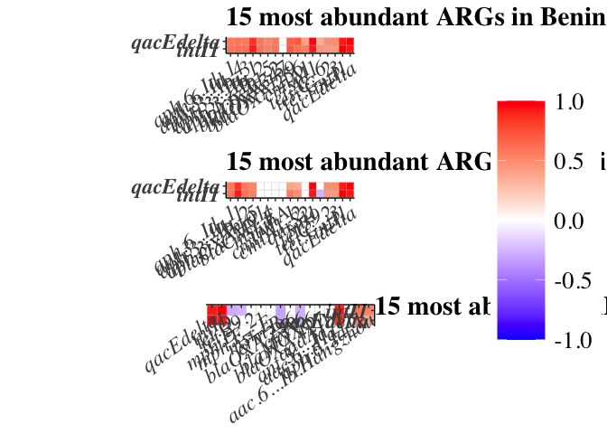<!-- -->

``` r
#ggsave(filename = "top15_ARGs_corr_deseq.png",
#       width = 16, height = 13, dpi = 300, units = "in", device='png', scale = 1)
```

## Same but for non-wastewater samples in West Africa

``` r
intI1 <- data.frame(sample_sums(MGE_PHY_int_stat))
colnames(intI1) <- c("intI1")
qacEdelta <- data.frame(sample_sums(MGE_PHY_qac))
colnames(qacEdelta) <- c("qacEdelta")

# Pristine
intI1 <- data.frame(sample_sums(MGE_PHY_int_stat))
colnames(intI1) <- c("intI1")
qacEdelta <- data.frame(sample_sums(MGE_PHY_qac))
colnames(qacEdelta) <- c("qacEdelta")

tax <- data.frame(clusters_tax_table_resfinder)
tax$sp <- rep("sp", times = 3104)
tax$n <- rep(1:3104, each=1)
colnames(tax) <- c("Class", "Cluster_name", "Gene", "sp", "n")
tax$Row.names <- paste(tax$sp, tax$n, sep="")

pattern_prist <- data.frame(dplyr::filter(tax,
                                  grepl("aadA2_1_NC_010870|aph\\(6\\)-Id_1_M28829|ant\\(2''\\)-Ia_6_AJ871915|ant\\(2''\\)-Ia_9_HM367610|ant\\(2''\\)-Ia_10_HM367617|ant\\(3''\\)-Ia_1_X02340|blaOXA-129_1_FJWZ01000025|blaOXA-256_1_HE616889|blaADC-25_1_EF016355|blaPAU-1_1_MH053445|msr\\(E\\)_1_FR751518|mph\\(E\\)_1_DQ839391|mph\\(E\\)_2_JF769133|sul1_5_EU780013|tet\\(39\\)_1_KT346360", 
                                        Gene)))
pattern_pristine <- as.matrix(pattern_prist[,6])

args <- data.frame(otu_table(resfinder_PHY_stat))
arg_data <- args[pattern_pristine, ]
all(rownames(arg_data) == pattern_pristine)
```

    ## [1] TRUE

``` r
rownames(arg_data) <- pattern_prist$Gene
rownames(arg_data)
```

    ##  [1] "aadA2_1_NC_010870"         "aph(6)-Id_1_M28829"       
    ##  [3] "ant(2'')-Ia_6_AJ871915"    "ant(2'')-Ia_9_HM367610"   
    ##  [5] "ant(2'')-Ia_10_HM367617"   "ant(3'')-Ia_1_X02340"     
    ##  [7] "blaOXA-129_1_FJWZ01000025" "blaOXA-256_1_HE616889"    
    ##  [9] "blaADC-25_1_EF016355"      "blaPAU-1_1_MH053445"      
    ## [11] "msr(E)_1_FR751518"         "mph(E)_1_DQ839391"        
    ## [13] "mph(E)_2_JF769133"         "sul1_5_EU780013"          
    ## [15] "tet(39)_1_KT346360"

``` r
arg_data = t(arg_data)

df <- data.frame(arg_data, intI1, qacEdelta)

cor <- rcorr(as.matrix(df))
M <- cor$r
p_mat <- cor$P
M5 <- M[ , -c(1:15)]
p_mat5 <- p_mat[ , -c(1:15)]

p_mat5[is.na(p_mat5)] = 0

m5 <- ggcorrplot(M5, p.mat = p_mat5, type = "full", insig = "blank", method = "square",
                 ggtheme = ggplot2::theme_classic() +
                   theme(axis.text = element_text(face = "italic", family = "Times"),
                         legend.position = "none",
                         axis.text.y.left = element_text(angle = 0, face = "bold.italic", size = 18),
                         axis.text.x.bottom = element_text(size = 18, angle = 35, face = "italic"),
                         plot.title = element_text(size=22, face="bold", family = "Times"))) +
  ggtitle("15 most abundant ARGs in pristine samples")
```

# “Core” resistome and unique ARGs

``` r
Ben_temp <- otu_table(subset_samples(resfinder_PHY_stat, country %in%  c("Benin")))[rowSums(otu_table(subset_samples(resfinder_PHY_stat, country %in% c("Benin")))) > 0]
nrow(Ben_temp) # 1738
```

    ## [1] 1738

``` r
BF_temp <- otu_table(subset_samples(resfinder_PHY_stat, country %in%  c("Burkina Faso")))[rowSums(otu_table(subset_samples(resfinder_PHY_stat, country %in% c("Burkina Faso")))) > 0]
nrow(BF_temp) # 2131
```

    ## [1] 2131

``` r
Fin_temp <- otu_table(subset_samples(resfinder_PHY_stat, country %in%  c("Finland")))[rowSums(otu_table(subset_samples(resfinder_PHY_stat, country %in% c("Finland")))) > 0]
nrow(Fin_temp) # 1555
```

    ## [1] 1555

``` r
length(intersect(row.names(Ben_temp), (row.names(BF_temp)))) # 1664
```

    ## [1] 1664

``` r
length(intersect(row.names(BF_temp), (row.names(Fin_temp)))) # 1414
```

    ## [1] 1414

``` r
length(intersect(row.names(Ben_temp), (row.names(Fin_temp)))) # 1295
```

    ## [1] 1295

``` r
grid.newpage()
ven.p <- draw.triple.venn(area1 = nrow(Ben_temp), area2 = nrow(BF_temp), area3 = nrow(Fin_temp), 
                 n12 = length(intersect(row.names(Ben_temp), (row.names(BF_temp)))), 
                 n23 = length(intersect(row.names(BF_temp), (row.names(Fin_temp)))), 
                 n13 = length(intersect(row.names(Ben_temp), (row.names(Fin_temp)))), 
                 n123 = length(intersect(intersect(row.names(Ben_temp), (row.names(BF_temp))), row.names(Fin_temp))), 
    fontfamily = "Times", category = c("Benin", "Burkina Faso", "Finland"),
    lty = "blank", fill = c("#B2182B", "#44AA99", "#2166AC"),
    alpha = 0.75,  cex = 4.5, cat.cex = 6, rotation.degree = 0, label.col = "white", cat.dist = 0.05,
    filename = "Venn_diagram.png", output=TRUE, imagetype="png", margin = 0.08)
grid.draw(ven.p)
```

<!-- -->

``` r
# Pairwise
grid.newpage()
p1 <- draw.pairwise.venn(area1 = nrow(Ben_temp), area2 = nrow(BF_temp), 
                            cross.area = length(intersect(row.names(Ben_temp), (row.names(BF_temp)))),
    fontfamily = "Times", category = c("Benin", "Burkina Faso"),
    lty = "blank", fill = c("#B2182B", "#44AA99"),
    alpha = 0.75,  cex = 5, cat.cex = 6, rotation.degree = 0, label.col = "white", 
    cat.pos = c(300, 105), cat.dist = c(-0.07, -0.06),
                                ext.pos = 10,
                                ext.dist = -0.05,
                                ext.length = 0.75,
                                ext.line.lwd = 2,
                                ext.line.lty = "dashed")
grid.draw(p1)
```

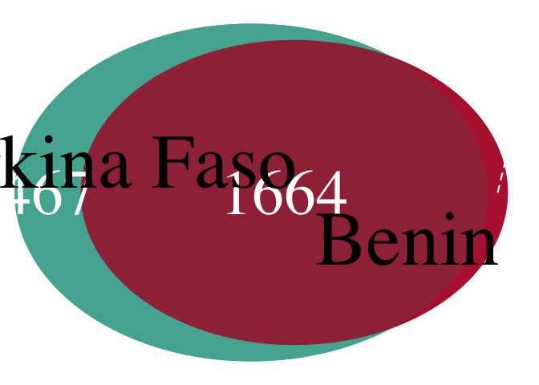<!-- -->

``` r
grid.newpage()
p2 <- draw.pairwise.venn(area1 = nrow(Fin_temp), area2 = nrow(BF_temp), 
                            cross.area = length(intersect(row.names(Fin_temp), (row.names(BF_temp)))),
    fontfamily = "Times", category = c("Finland", "Burkina Faso"),
    lty = "blank", fill = c("#2166AC", "#44AA99"),
    alpha = 0.65,  cex = 4, cat.cex = 4, rotation.degree = 0, label.col = "white", cat.dist = 0.02,
    filename = "Venn_diagram.png", output=TRUE, imagetype="png", margin = 0.08)
grid.draw(p2)
```

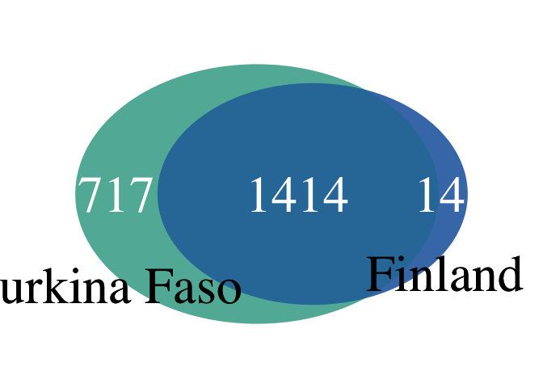<!-- -->

``` r
grid.newpage()
p3 <- draw.pairwise.venn(area1 = nrow(Ben_temp), area2 = nrow(Fin_temp), 
                            cross.area = length(intersect(row.names(Ben_temp), (row.names(Fin_temp)))),
    fontfamily = "Times", category = c("Benin", "Finland"),
    lty = "blank", fill = c("#B2182B", "#2166AC"),
    alpha = 0.75,  cex = 6, cat.cex = 4, rotation.degree = 0, label.col = "white", cat.dist = 0.03,
    filename = "Venn_diagram.png", output=TRUE, imagetype="png", margin = 0.08, euler.d = TRUE, scaled = TRUE)
grid.draw(p3)
```

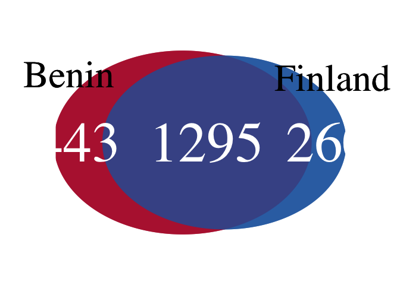<!-- -->

``` r
# And which ARGs are those?
tax <- data.frame(clusters_tax_table_resfinder)
tax$sp <- rep("sp", times = 3104)
tax$n <- rep(1:3104, each=1)
colnames(tax) <- c("Class", "Cluster_name", "Gene", "sp", "n")
rownames(tax) <- paste(tax$sp, tax$n, sep="")
tax <- tax[c(-4, -5)]

match <- match(rownames(Ben_temp), rownames(tax))
Ben_names <- tax[match,]

match <- match(rownames(BF_temp), rownames(tax))
BF_names <- tax[match,]

match <- match(rownames(Fin_temp), rownames(tax))
Fin_names <- tax[match,]

#write.table(Ben_names, "~/Documents/Metagenomes_AMRIWA/R/AMRIWA/RFiles/counts_Ben.txt", row.names=F, sep = "\t", col.names = T)

#write.table(BF_names, "~/Documents/Metagenomes_AMRIWA/R/AMRIWA/RFiles/counts_BF.txt", row.names=F, sep = "\t", col.names = T)

#write.table(Fin_names, "~/Documents/Metagenomes_AMRIWA/R/AMRIWA/RFiles/counts_Fin.txt", row.names=F, sep = "\t", col.names = T)

# What about the unique ARGs?
# Core
counts <- data.frame(otu_table(resfinder_PHY_stat))
counts[counts > 0] <- 1
core <- counts[rowSums(counts)==67,]

tax <- data.frame(clusters_tax_table_resfinder)
tax$sp <- rep("sp", times = 3104)
tax$n <- rep(1:3104, each=1)
colnames(tax) <- c("Class", "Cluster_name", "Gene", "sp", "n")
rownames(tax) <- paste(tax$sp, tax$n, sep="")
tax <- tax[c(-4, -5)]

match <- match(rownames(core), rownames(tax))
core_names <- tax[match,]

#write.table(core_names, "~/Documents/Metagenomes_AMRIWA/R/AMRIWA/RFiles/core_names.txt", row.names=F, sep = "\t", col.names = T)

# Unique for Benin
temp1 <- intersect(row.names(Ben_temp), row.names(Fin_temp))
temp2 <- intersect(row.names(Ben_temp), row.names(BF_temp))
temp <- c(temp1, temp2)
temp <- data.frame(temp)
temp <- data.frame(unique(temp))
rownames(temp) <- temp$temp

unique_Ben <- data.frame(names = outersect(rownames(temp), rownames(Ben_temp)))
rownames(unique_Ben) <- unique_Ben$names

match <- match(rownames(unique_Ben), rownames(tax))
unique_Ben <- tax[match,]

#write.table(unique_Ben, "~/Documents/Metagenomes_AMRIWA/R/AMRIWA/RFiles/unique_Ben.txt",  row.names=F, sep = "\t", col.names = T)

# BF
temp1 <- intersect(row.names(BF_temp), row.names(Fin_temp))
temp2 <- intersect(row.names(BF_temp), row.names(Ben_temp))
temp <- c(temp1, temp2)
temp <- data.frame(temp)
temp <- data.frame(unique(temp))
rownames(temp) <- temp$temp

unique_BF <- data.frame(names = outersect(rownames(temp), rownames(BF_temp)))
rownames(unique_BF) <- unique_BF$names

match <- match(rownames(unique_BF), rownames(tax))
unique_BF <- tax[match,]

#write.table(unique_BF, "~/Documents/Metagenomes_AMRIWA/R/AMRIWA/RFiles/unique_BF.txt", row.names=F, sep = "\t", col.names = T)

# Finland
temp1 <- intersect(row.names(Fin_temp), row.names(BF_temp))
temp2 <- intersect(row.names(Fin_temp), row.names(Ben_temp))
temp <- c(temp1, temp2)
temp <- data.frame(temp)
temp <- data.frame(unique(temp))
rownames(temp) <- temp$temp

unique_Fin <- data.frame(names = outersect(rownames(temp), rownames(Fin_temp)))
rownames(unique_Fin) <- unique_Fin$names

match <- match(rownames(unique_Fin), rownames(tax))
unique_Fin <- tax[match,]

#write.table(unique_Fin, "~/Documents/Metagenomes_AMRIWA/R/AMRIWA/RFiles/unique_Fin.txt", row.names=F, sep = "\t", col.names = T)
```
